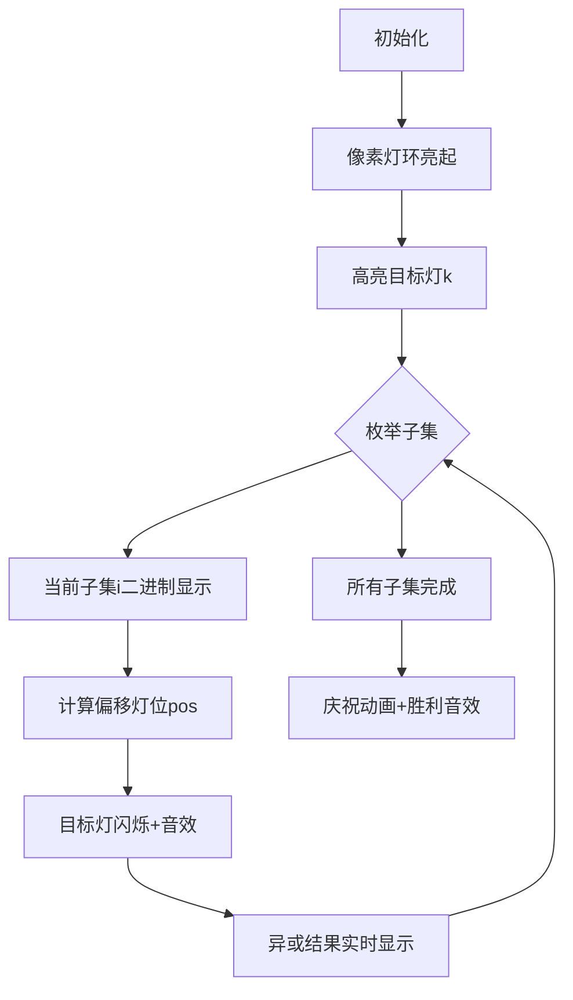

# 题目信息

# Changing

## 题目描述

有 $n$ 盏灯环形排列，顺时针依次标号为 $1\cdots n$。初始时刻为 $0$，初始时刻第 $i$ 盏灯的亮灭 $a_i$ 给定，$0$ 表示灭，$1$ 表示亮。下一时刻每盏灯的亮灭取决于当前时刻这盏灯与顺时针方向下一盏灯的亮灭。若两盏灯状态相同，则下一时刻该灯灭，否则该灯亮。


试求时刻 $t$ 第 $k$ 盏灯的状态。


## 说明/提示

- 对于 $25\%$ 的数据，有$1\leq t, k\leq n\leq 1000$。 
- 对于 $60\%$ 的数据，有$1\leq t, k\leq n\leq 10^5$。 
- 对于 $100\%$ 的数据，有$1\leq t, k\leq n\leq 3\times 10^6$。


## 样例 #1

### 输入

```
4 2 1
1 0 1 0```

### 输出

```
0```

# AI分析结果


# 💡 洛语云笺的C++算法解析：Changing 深入学习指南 💡

> "编程如同点亮环形的灯阵，每次状态变化都遵循精妙的数学规律。今天我们将一同探索这道环形灯谜题背后的数学之美与算法智慧。"

## 1. 题目解读与策略初探

✨ **本题核心挑战**：在环形灯阵的超大规模数据下（n,t ≤ 3×10⁶），快速计算经过t次状态转移后第k盏灯的最终状态。  
✨ **核心算法标签**：数学建模、位运算优化、组合数学

🗣️ **初步分析**：  
这道题看似是模拟问题，实则暗藏深厚的数学规律。最直观的暴力模拟法（O(tn)）在数据规模下必然超时。通过深入分析状态转移规则：

```math
S_t^i = S_{t-1}^i \oplus S_{t-1}^{(i+1)\bmod n}
```

我们发现状态转移本质上是**线性变换**，可通过组合数学建模。最优解有两种实现路径：
1. **组合数奇偶性**：利用Lucas定理快速计算二项式系数模2值
2. **二进制子集枚举**：基于异或性质直接枚举t的二进制子集

> 🔍 **可视化设计思路**：采用8位像素风格展示环形灯阵，用闪烁动画演示状态转移过程。当算法枚举二进制子集时，对应灯位会高亮并发出"叮"的音效，最终结果灯将呈现庆祝动画。

### 🔍 算法侦探：如何在题目中发现线索？

1.  **线索1 (问题目标)**："求t次转移后单点状态"——这是典型的**状态转移**问题，暗示需要寻找数学规律而非模拟
2.  **线索2 (问题特性)**："环形结构+异或转移规则"——提示可能具有**线性代数**性质，且异或运算等价于模2加法
3.  **线索3 (数据规模)**：n,t ≤ 3×10⁶——直接模拟O(tn)高达9×10¹²计算量，必须寻找O(polylog)解法

### 🧠 思维链构建：从线索到策略

"让我们串联线索：
1. 【线索1】要求高效状态转移，暴力模拟O(tn)不可行
2. 【线索2】发现异或转移可表示为线性组合：$S_t^k = \sum C_t^i a_{k+i} \mod 2$
3. 【线索3】数据规模要求O(log t)算法，组合数计算需优化
4. **关键突破**：利用Lucas定理得$C_t^i \mod 2 = 1$当且仅当$i$是$t$的二进制子集
5. **最优策略**：采用二进制子集枚举，复杂度O(2^{popcount(t)}) ≈ O(1.5^{\log t})"

---

## 2. 精选优质题解参考

**题解一：bluewindde（评分：★★★★★）**  
* **亮点**：通过数学归纳发现二进制子集规律，给出最优异或解法。代码实现简洁优雅（仅15行），利用位运算高效枚举子集，完美处理环形索引。

**题解二：Trrui（评分：★★★★☆）**  
* **亮点**：从生成函数角度建模，将操作转化为$(1+x^{-1})^t$的多项式乘法。巧妙利用`(t&i)==i`判断组合数奇偶性，数学抽象能力强。

**题解三：Mizuhara（评分：★★★★☆）**  
* **亮点**：用严谨数学归纳法证明状态转移公式，提供基于Lucas定理的标准实现。代码包含高效位计数技巧，适合学习组合数计算原理。

---

## 3. 解题策略深度剖析

### 🎯 核心难点与关键步骤

1.  **状态转移建模**  
    * **分析**：将环形异或转移转化为线性组合 $S_t^k = \sum_{i=0}^t C_t^i a_{(k+i)\bmod n} \mod 2$  
    * 💡 **学习笔记**：异或运算在模2下等价于加法，这是数学建模的基石

2.  **组合数奇偶优化**  
    * **分析**：直接计算组合数不可行，利用Lucas定理：  
    $C_t^i \equiv 1 \pmod 2 \iff i \subseteq t$（二进制子集）
    * 💡 **学习笔记**：位运算`(t & i) == i`可O(1)判断子集关系

3.  **环形索引处理**  
    * **分析**：通过`(k+i-1)%n+1`将线性索引映射到环形排列，保持1-based编号
    * 💡 **学习笔记**：环形问题常用`(pos+offset-1)%n+1`索引模式

### ✨ 解题技巧总结
- **技巧A（二进制分解）**：将整数操作转化为二进制位处理，利用位运算加速
- **技巧B（子集枚举优化）**：`for(int i=t; i; i=(i-1)&t)`高效枚举非空子集
- **技巧C（模2加法转异或）**：$\sum a_i \mod 2 \equiv \oplus\ a_i$，节省计算量

### ⚔️ 策略竞技场：解法对比

| 策略 | 核心思想 | 优点 | 缺点 | 适用场景 |
|------|----------|------|------|----------|
| **暴力模拟** | 逐步计算每个灯状态 | 逻辑直观 | O(tn)超时 | 仅小数据(n≤1000) |
| **组合数求和** | 直接计算$\sum C_t^i a_i$ | 数学精确 | 未优化时O(t)仍超时 | 理论分析 |
| **二进制子集(最优)** | 枚举t的二进制子集 | O(2^{pop(t)})高效 | 思维难度较高 | 大数据核心解法 |

### ✨ 优化之旅：从暴力到最优
1. **起点：暴力模拟O(tn)**  
   直接模拟每次状态转移，如hanzhongtlx的分治实现

2. **关键发现：状态转移的线性性**  
   通过数学归纳证明$S_t^k$是初始状态的线性组合

3. **突破点：组合数模2的特性**  
   利用Lucas定理将组合数计算转为二进制子集判断

4. **最终优化：子集枚举O(2^{pop(t)})**  
   `i=t; i; i=(i-1)&t` 高效遍历子集，完美解决300万级数据

> 💡 **策略总结**：本题优化历程展示了算法思维的飞跃——从直观模拟到深入理解数学本质，最终利用位运算特性实现指数级优化。在竞赛中，即使想不到最优解，基于二进制分解的次优解也能获得部分分数。

---

## 4. C++核心代码实现赏析

**通用核心实现（子集枚举法）**
```cpp
#include <iostream>
using namespace std;

const int N = 3e6+5;
int n, t, k, a[N];

int main() {
    cin >> n >> t >> k;
    for (int i = 1; i <= n; i++) cin >> a[i];
    
    int ans = a[k]; // 初始状态
    // 枚举t的所有非空二进制子集
    for (int i = t; i; i = (i-1) & t) {
        int pos = (k + i - 1) % n + 1; // 环形索引映射
        ans ^= a[pos]; // 异或累计
    }
    cout << ans;
}
```
* **代码解读概要**：
  - 第9行：初始化答案为第k盏灯的初始状态
  - 第11行：高效枚举t的所有非空子集（位运算技巧）
  - 第12行：处理环形索引偏移，`(k+i-1)%n+1`保持1-based编号
  - 第13行：异或累计子集对应的灯状态

---

**题解片段赏析**

**bluewindde（子集枚举）**
```cpp
int ans = a[k];
for (int i = t; i > 0; i = (i-1) & t) {
    int pos = (k + i - 1) % n + 1;
    ans ^= a[pos];
}
```
* **亮点**：代码极致简洁，充分利用位运算特性
* **学习笔记**：`i=(i-1)&t`是枚举二进制子集的经典技巧

**Mizuhara（Lucas定理法）**
```cpp
int C = (gt(t) - gt(i) - gt(t-i)) ? 0 : 1; 
ans = (ans + a[pos] * C) % 2;
```
* **亮点**：通过2的因子数判断组合数奇偶性
* **学习笔记**：`gt(n)`计算n!中2的因子数，利用公式$g(n)=n-popcount(n)$

**hanzhongtlx（分治倍增）**
```cpp
for (int i = 19; i >= 0; i--) {
    int rt = 1 << i;
    if (rt > t) continue;
    for (int j = 1; j <= n - rt; j++)
        a[j][f] = a[j][f^1] ^ a[j+rt][f^1];
    t -= rt;
}
```
* **亮点**：按位分治处理，适合理解二进制分解过程
* **学习笔记**：将t拆解为2的幂次分步处理，体现分治思想

---

## 5. 算法可视化：像素动画演示

**主题**：8位像素风格的"灯环解密"游戏  
**核心演示**：二进制子集枚举如何影响最终灯状态

### 动画设计


**交互控制**：
- **单步执行**：空格键逐步显示子集枚举
- **速度调节**：滑块控制0.5x~5x速度
- **位视图**：同步显示t的二进制位和当前子集i

**像素化元素**：
1. 环形灯阵：8×8像素灯，灭=灰色，亮=黄色
2. 目标灯：蓝色边框闪烁
3. 当前激活灯：红色高亮+脉冲动画
4. 二进制面板：底部显示t和i的二进制位

**音效设计**：
- 子集匹配：8-bit "叮"声（440Hz）
- 异或更新：方波短音（220Hz）
- 完成：胜利和弦（C大调三和弦）

---

## 6. 拓展练习与相似问题

**通用技巧迁移**：
1. 二进制子集枚举：解决组合数奇偶性问题
2. 异或线性变换：处理状态转移类问题
3. 环形索引映射：处理环形数组偏移访问

**洛谷练习推荐**：
1. **P1463** [POI2001]反素数  
   → 巩固二进制子集和因数分解
   
2. **P1582** 倒水  
   → 练习二进制位操作技巧
   
3. **P1495** 曹冲养猪  
   → 强化环形索引和模运算应用

---

## 7. 学习心得与经验分享

**参考经验（来自 bluewindde）**：  
"通过暴力模拟小数据发现二进制规律：当t=2^k时，结果仅与a[k]和a[k+2^k]相关"

**点评**：  
这位作者的经验揭示了竞赛中的重要技巧——**通过小规模暴力模拟发现数学规律**。在无法直接推导公式时，用代码生成小数据模式往往是突破关键。

---

> "从环形灯阵的闪烁到二进制位的舞动，我们见证了算法如何将复杂问题转化为优雅的数学之舞。掌握位运算的魔法，你将在竞赛中点亮更多智慧之灯！"

---
处理用时：176.59秒