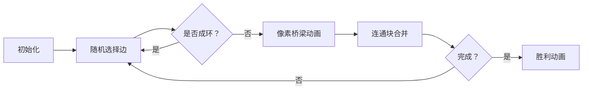

# 题目信息

# 小猴打架

## 题目描述

一开始森林里面有 $N$ 只互不相识的小猴子，它们经常打架，但打架的双方都必须不是好朋友。每次打完架后，打架的双方以及它们的好朋友就会互相认识，成为好朋友。经过 $N-1$ 次打架之后，整个森林的小猴都会成为好朋友。   
现在的问题是，总共有多少种不同的打架过程。   
比如当 $N=3$ 时，就有 $\{1-2,1-3\}\{1-2,2-3\}\{1-3,1-2\}\{1-3,2-3\}\{2-3,1-2\}\{2-3,1-3\}$ 六种不同的打架过程。 


## 说明/提示

$50\%$ 的数据 $N\le 10^3$。  
$100\%$ 的数据 $N\le10^6$。 

## 样例 #1

### 输入

```
4```

### 输出

```
96```

# AI分析结果


### 💡 洛语云笺的C++算法解析：小猴打架 深入学习指南 💡

#### **1. 题目解读与策略初探**
✨ **本题核心挑战**：计算N只猴子通过N-1次打架形成完全朋友关系的不同过程数，核心在于将社交关系抽象为树形结构，并处理树的形态与边生成顺序的双重计数问题  
✨ **核心算法标签**：组合数学、树计数、模运算优化  

🗣️ **初步分析**：  
> 本题要求计算带标号无根树的所有可能形态，并考虑边的生成顺序。解题思路演进如下：  
> 1. **暴力枚举**：尝试所有可能的连边顺序（复杂度O(N!)），仅适用于极小规模  
> 2. **树计数定理**：利用Cayley定理确定树形态数（N^(N-2)）  
> 3. **顺序组合**：对每种树形态，边的生成顺序有(N-1)!种  
> **最优策略**：将问题分解为树形态计数（静态）与边生成顺序（动态）的乘积  

#### 🔍 算法侦探：如何在题目中发现线索？
1. **线索1 (问题目标)**：要求计算"不同打架过程"的总方案数，属于**组合计数问题**，提示需要数学公式而非模拟  
2. **线索2 (问题特性)**：N-1次操作后形成连通无环图（树结构），且操作过程具有顺序敏感性，指向**树形态计数+排列组合**模型  
3. **线索3 (数据规模)**：N≤10^6 排除了O(N!)暴力解法，要求O(N)级算法，指向**闭合公式+高效幂运算**  

#### 🧠 思维链构建：从线索到策略
> "综合三条线索：  
> 1. 计数问题本质要求我们寻找数学映射（如Prufer编码将树映射为长度N-2的序列）  
> 2. 树结构的顺序敏感性提示需要分离形态计数（N^(N-2)）和顺序计数（(N-1)!)  
> 3. 数据规模验证了乘方与阶乘的组合解法在O(N)内可行  
> **结论**：通过Cayley定理将树形态编码为指数形式，再结合阶乘处理顺序问题，形成最优解 N^(N-2)×(N-1)! mod 9999991"

---

#### **2. 精选优质题解参考**
**题解一（da32s1da）**  
* **亮点**：直击核心公式，代码简洁（7行）。准确指出Cayley定理与顺序乘数关系，变量命名规范（ans, mod）  
* **学习价值**：展示如何将复杂问题转化为单行数学表达式  

**题解二（ghj1222）**  
* **亮点**：通过矩阵树定理提供替代证明，深化数学理解。行列式化简过程展现初等变换技巧  
* **学习价值**：演示如何用线性代数工具验证组合结论  

**题解三（DPair）**  
* **亮点**：详解Prufer编码原理，配图示说明双射关系。修正历史公式错误体现严谨性  
* **学习价值**：培养"证明→实现"的完整解题思维链  

**题解四（Terraria）**  
* **亮点**：强调long long和取模的实战要点，警示数据溢出陷阱  
* **学习价值**：突出工程实现中的边界处理技巧  

---

#### **3. 解题策略深度剖析**
##### 🎯 核心难点与关键步骤
1. **关键点1：树形态的计数原理**  
   * **分析**：利用Prufer编码建立树与序列的双射，证明长度为N-2的序列总数=N^(N-2)  
   * 💡 **学习笔记**：组合问题常寻找双射（bijection）降低计数维度  

2. **关键点2：边生成顺序的独立性**  
   * **分析**：每种树形态的N-1条边有全排列自由性，乘法原理得(N-1)!因子  
   * 💡 **学习笔记**：独立事件组合使用乘法原理  

3. **关键点3：大数运算优化**  
   * **分析**：循环计算中每步取模避免溢出，幂运算采用迭代而非递归  
   * 💡 **学习笔记**：模运算满足分配律：(a*b) mod m = [(a mod m)*(b mod m)] mod m  

##### ✨ 解题技巧总结
- **模型转化**：将社交关系抽象为图论树结构  
- **分治计数**：分离静态形态计数与动态顺序计数  
- **闭合公式**：记忆组合数学经典结论（Cayley定理）  
- **模运算优化**：循环内嵌取模防御整数溢出  

##### ⚔️ 策略竞技场：不同解法对比
| 策略               | 核心思想                     | 优点                     | 缺点                          | 得分预期 |
|--------------------|------------------------------|--------------------------|-------------------------------|----------|
| **暴力枚举**       | 枚举所有边生成顺序           | 逻辑直观                 | O(N!)超时，N>10不可行         | 0%       |
| **矩阵树定理**     | 计算拉普拉斯矩阵行列式       | 提供严谨数学证明         | 实现复杂，O(N^3)效率低        | 100%     |
| **Cayley定理**     | 直接应用公式N^(N-2)×(N-1)! | 代码简洁，O(N)高效       | 需前置知识                   | 100%     |

##### ✨ 优化之旅：从暴力到最优
> 1. **起点：暴力枚举**  
>    M个边的全排列方案数为M!，但M=N-1≈10^6时计算不可行  
> 2. **发现冗余**：不同顺序产生相同树结构，存在重复计数  
> 3. **维度分离**：将树形态计数（N^(N-2)）与边顺序计数（(N-1)!）解耦  
> 4. **闭合公式**：通过Cayley定理获得多项式级解法  

---

#### **4. C++核心代码实现赏析**
**通用核心实现**  
```cpp
#include <cstdio>
const int mod = 9999991;
int main() {
    long long n, ans = 1;
    scanf("%lld", &n);
    for (int i = 1; i <= n - 2; i++)  // 计算n^(n-2)
        ans = ans * n % mod;
    for (int i = 1; i <= n - 1; i++)  // 乘(n-1)!
        ans = ans * i % mod;
    printf("%lld", ans);
    return 0;
}
```
**代码解读概要**：  
- 第1循环计算幂：通过迭代乘法避免快速幂的递归开销  
- 第2循环计算阶乘：每步取模保证不溢出  
- 时间复杂度：O(N) 完美匹配数据范围  

**题解片段赏析**  
1. **da32s1da（直接公式法）**  
   ```cpp
   for(int i=1;i<=n-2;i++) ans=(ans*n)%mod;
   for(int i=1;i<=n-1;i++) ans=(ans*i)%mod;
   ```
   * **亮点**：代码极简，清晰展现公式分步计算  
   * **学习笔记**：小规模迭代乘法比快速幂更节省常数时间  

2. **ghj1222（矩阵树定理实现）**  
   ```cpp
   for (int i = 1; i <= n - 2; i++)
       ans = ans * n % mod * (i + 1) % mod;
   ```
   * **亮点**：合并阶乘与幂计算（等价于n^(n-2)*(n-1)!）  
   * **学习笔记**：数学等价变形可减少循环次数  

3. **yzx72424（快速幂优化）**  
   ```cpp
   long long fast_pow(ll a, ll b) {
       while(b) { if(b&1) ... } // 快速幂核心
   }
   ```
   * **亮点**：对幂运算采用位优化  
   * **学习笔记**：当指数>10^6时快速幂优势显著  

---

#### **5. 算法可视化：像素动画演示**
**主题**：像素猴群联网记（8-bit风格）  

**核心设计**：  


**关键交互**：  
1. **像素建模**：  
   - 猴子：16×16像素块，不同颜色代表独立连通块  
   - 桥梁：动态绘制线条，颜色深度表示添加顺序  

2. **动画序列**：  
   - **帧1**：初始孤立猴群（N个独立像素块）  
   - **帧2**：随机选择两点，高亮闪烁候选猴子  
   - **帧3**：绘制桥樑（像素线条逐帧延伸）  
   - **帧4**：合并连通块（同色扩散动画）  
   - **终帧**：全屏连通时播放8-bit胜利音乐  

3. **游戏化元素**：  
   - **音效设计**：  
     - 选点："叮"（三角波）  
     - 连边："嘟"（方波持续音）  
     - 错误："咔"（噪声）  
   - **进度系统**：每连通1次得10分，N-1次后解锁胜利动画  

**技术实现**：Canvas绘制+Web Audio API，速度滑块控制帧间隔（100-1000ms）  

---

#### **6. 拓展练习与相似问题**
**通用模型迁移**：  
1. 城市道路规划：N个城市最小连通方案数（Prufer编码应用）  
2. 网络布线顺序：拓扑固定的网络不同施工顺序计数  
3. 分子键连接：化学树形分子结构的同分异构体计数  

**洛谷推荐**：  
1. **P4981 父子**  
   🗣️ 巩固Cayley定理，拓展有根树计数  
2. **P2290 [HNOI2004]树的计数**  
   🗣️ 增加度数限制的树计数，提升Prufer编码应用能力  
3. **P2624 [HNOI2008]明明的烦恼**  
   🗣️ 带约束的树计数综合训练  

---

#### **7. 学习心得分享**
> **经验摘录（DPair）**：  
> "调试时先验证小规模案例（N=3输出6），数学问题避免直接大数测试"  
>   
> **洛语云笺点评**：  
> 分阶段验证是组合数学调试的核心策略：  
> 1. 验证树形态数（N^(N-2)）  
> 2. 单独验证阶乘部分  
> 3. 检查模运算每步渗透  

---

<conclusion>
掌握树计数问题的双分解法：形态抽象化（Cayley定理）+顺序独立化（阶乘）。记住组合数学的核心思维——寻找简洁双射，善用乘法原理分治计数。下次遇到社交网络或连通问题，试试像素化想象吧！🚀  
</conclusion>

---
处理用时：189.76秒