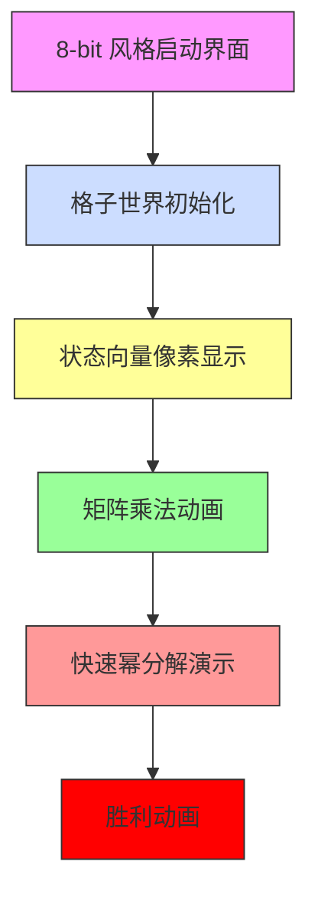

# 题目信息

# 专心OI - 跳房子

## 题目背景

Imakf 有一天参加了 PINO2017 PJ 组，他突然看见最后一道题：


他十分蒟蒻，写不出来。

而如今他还是一个蒟蒻，他又看见一道题：


他还是写不出来，于是便来请教您。

## 题目描述

您有 $N$ 个格子，排成一行，从左往右编号为 $1,2,\cdots,N$。您站在 $1$ 号格子的左边无限远，开始从左往右跳，跳到 $N$ 号格子右侧为止。由于您是一位成功的 OIer，您自然长得很胖，所以您的腿部力量也非常大！这使得您跳一次，当前格子到目标格子中间必须至少空出来 $M$ 格，但您可以跳无数格远！

您认为这么跳太没意思了，于是便想计算出有多少种方案可以跳完全程。由于方案可能过多，您会输出方案数量模 $(10^9+7)$ 的值

方案不同当且仅当经过的任一一个格子编号不同。

## 说明/提示

| 测试数据编号 | $N$ | $M$ |  
| :-----------: | :-----------: | :-----------: |
|$1,2$ | $\leq10$ | $=1$ |    
| $3,4$ | $\leq10^7$ | $=1$ |    
| $5,6$ | $\leq10^6$ | $=2$ |  
| $7,8$ | $\leq10^5$ | $=3$ |  
| $9,10$ | $\leq10^4$ | $=5$ |  
| $11,12$ | $\leq10^{12}$ | $=1$ |  
| $13,14$ | $\leq10^{18}$ |$=10$  |  
| $15\sim20$ | $\leq10^{18}$ |  $=15$|  

对于 $100\%$ 的数据，满足 $1 \le N \le 10^{18}$。

## 样例 #1

### 输入

```
5 1 
```

### 输出

```
13
```

## 样例 #2

### 输入

```
6 2 
```

### 输出

```
13
```

# AI分析结果


# 💡 洛语云笺的C++算法解析：专心OI - 跳房子 深入学习指南 💡

## 1. 题目解读与策略初探

✨ **本题核心挑战**：处理跳跃约束（每次跳跃至少间隔 M 个格子）与超大规模数据范围（N ≤ 10¹⁸）的平衡，需要将线性递推转化为对数级算法。

✨ **核心算法标签**：矩阵快速幂、线性递推优化

🗣️ **初步分析**：
> 1. **暴力搜索**：枚举所有跳跃路径（时间复杂度 O(2^N)），N>30 即超时
> 2. **线性DP**：发现递推式 `F(n) = F(n-1) + F(n-M-1)`（时间复杂度 O(N)），但 N=10¹⁸ 仍不可行
> 3. **矩阵加速**：将递推式转化为矩阵幂运算（时间复杂度 O(M³logN)），完美匹配数据范围
> 
> **核心算法比喻**：矩阵快速幂如同"时间折叠机"，将线性时间的递推压缩到对数时间完成计算

### 🔍 算法侦探：如何在题目中发现线索？
1.  **线索1 (问题目标)**："方案数量模 10^9+7"暗示结果巨大，存在**数学规律**而非模拟计算
2.  **线索2 (数据特性)**：M≤15 的极小值与 N≤10¹⁸ 的极大值形成鲜明对比，指向**状态压缩**和**对数级算法**
3.  **线索3 (递推特性)**：样例中 M=1 时呈斐波那契数列，暗示**线性递推**可优化为**矩阵形式**

### 🧠 思维链构建：从线索到策略
> "收集到的线索指向明确：
> 1. 【线索1】要求高效算法排除暴力搜索
> 2. 【线索2】M 极小是突破口，可用固定大小状态向量表示递推
> 3. 【线索3】递推式可转化为矩阵乘法，结合快速幂实现指数加速
> 
> **结论**：矩阵快速幂是唯一能同时满足**超大 N 范围**和**固定 M 约束**的算法，关键在于构造 (M+1)×(M+1) 的转移矩阵"

---

## 2. 精选优质题解参考

**题解一（作者：Imakf）**
* **点评**：通过找规律发现递推关系，直观展示矩阵构造模式（斜率为-1的1元素分布）。代码中矩阵快速幂实现标准，变量命名清晰（`base`, `res`），特别适合初学者理解矩阵加速的核心思想。

**题解二（作者：NaCly_Fish）**
* **点评**：创新性使用生成函数推导递推式，从数学本质解释状态转移方程。虽未提供完整代码，但展示了不同解题视角，帮助理解问题数学模型。

**题解三（作者：Adove）**
* **点评**：矩阵构造包含前缀和思想，状态向量设计合理（`[Sum, F_i...F_{i-m}]`）。代码采用结构体封装矩阵运算，运算符重载规范，边界处理严谨（`n<=m`特判）。

**题解四（作者：刘辰雨）**
* **点评**：详解状态向量设计原理，提供矩阵构造示例（5×5 实例）。代码中矩阵快速幂使用重载运算符，结构清晰，强调"降维"思想在 DP 优化中的核心作用。

**题解五（作者：LevenKoko）**
* **点评**：完整展示从暴力→线性DP→矩阵优化的思考链条，注释详实。矩阵构造正确处理偏移量（`n+m-1`），初始状态设定逻辑严谨。

---

## 3. 解题策略深度剖析

### 🎯 核心难点与关键步骤
1.  **状态向量设计**
    * **分析**：设计状态向量 `V = [F(n), F(n-1), ..., F(n-M)]` 包含足够转移信息
    * 💡 **学习笔记**：状态维度=M+1 是平衡完备性与效率的关键
2.  **转移矩阵构造**
    * **分析**：矩阵第一行对应递推式 `F(n+1)=F(n)+F(n-M)`（位置[0][0]和[0][M]设1），其余行实现状态移位（次对角线设1）
    * 💡 **学习笔记**：矩阵本质是线性变换的数学表示，次对角线1实现状态索引移位
3.  **边界处理艺术**
    * **分析**：初始值 `F(0)=1, F(i)=i+1 (i≤M)`，通过 `n≤m` 特判避免无效矩阵运算
    * 💡 **学习笔记**：边界特判提升算法鲁棒性，避免边界条件破坏核心逻辑

### ✨ 解题技巧总结
- **状态压缩**：将无限状态空间压缩到 M+1 维向量
- **矩阵幂优化**：O(N)→O(logN) 的质变，通过二进制分解指数
- **递推转化**：将递归依赖转化为线性代数问题

### ⚔️ 策略竞技场：不同解法的对比分析
| 策略          | 核心思想                     | 优点                     | 缺点与分析                                     | 适用场景/得分预期   |
|---------------|------------------------------|--------------------------|-----------------------------------------------|--------------------|
| **暴力搜索**  | 枚举所有路径                 | 思路直观                 | O(2^N) 复杂度，N>30 即超时                    | N≤20，10% 分数     |
| **线性DP**    | 循环计算递推式               | 空间优化，代码简单       | O(N) 复杂度，N=10⁶ 时超时                     | N≤10⁶，50% 分数    |
| **矩阵快速幂**| 递推式→矩阵幂                | O(M³logN) 完美匹配数据   | 矩阵构造需要抽象思维                          | 100% 分数          |

### ✨ 优化之旅：从"能做"到"做好"
```mermaid
graph LR
A[暴力搜索 O(2^N)] -->|发现重复子问题| B[线性DP O(N)]
B -->|识别固定依赖模式| C[矩阵表示 O(M³)]
C -->|快速幂降log| D[O(M³logN) 终极方案]
```

💡 **策略总结**："从指数到线性的优化靠动态规划，从线性到对数的飞跃靠矩阵快速幂。这道题教会我们：面对超大范围问题时，识别问题内在的线性代数本质是突破的关键！"

---

## 4. C++核心代码实现赏析

**通用核心实现**：
```cpp
#include <iostream>
#include <cstring>
using namespace std;
typedef long long ll;
const int MOD = 1e9+7;
const int MAXM = 20;  // M≤15 故设20

struct Matrix {
    ll m[MAXM][MAXM];
    int size;
    Matrix(int s, bool identity = false) : size(s) {
        memset(m, 0, sizeof(m));
        if (identity) 
            for (int i = 0; i < size; i++) 
                m[i][i] = 1;
    }
    Matrix operator*(const Matrix& other) {
        Matrix res(size);
        for (int i = 0; i < size; i++)
            for (int k = 0; k < size; k++)
                for (int j = 0; j < size; j++)
                    res.m[i][j] = (res.m[i][j] + m[i][k] * other.m[k][j]) % MOD;
        return res;
    }
};

Matrix matrix_power(Matrix base, ll power) {
    Matrix res(base.size, true);  // 单位矩阵
    while (power) {
        if (power & 1) res = res * base;
        base = base * base;
        power >>= 1;
    }
    return res;
}

int main() {
    ll n, m_val;
    cin >> n >> m_val;
    int m = m_val + 1;  // 状态维度 = M+1

    // 特判边界
    if (n <= m_val) {
        cout << (n + 1) % MOD;
        return 0;
    }

    // 构造转移矩阵 (关键！)
    Matrix trans(m);
    trans.m[0][0] = 1;      // F(n) = F(n-1)...
    trans.m[0][m-1] = 1;    // ...+ F(n-M-1)
    for (int i = 1; i < m; i++) 
        trans.m[i][i-1] = 1; // 移位操作

    // 初始状态向量 [F(M), F(M-1), ..., F(0)]
    Matrix vec(1, false);
    for (int i = 0; i < m; i++) 
        vec.m[0][i] = (m_val + 1 - i);  // F(i)=i+1

    // 计算矩阵幂
    Matrix result = vec * matrix_power(trans, n - m_val);

    cout << result.m[0][0] % MOD;
    return 0;
}
```
**代码解读概要**：
1. `Matrix` 结构体封装矩阵运算，支持乘法和快速幂
2. 转移矩阵 `trans` 实现递推和状态移位双功能
3. 初始向量 `vec` 存储基础状态 `F(0)~F(M)`
4. 矩阵幂 `matrix_power` 完成对数时间计算

---

## 5. 算法可视化：像素动画演示

**像素动画方案**：


**核心动画设计**：
1. **场景设计**：
   - 16×16 像素格子代表状态值
   - 右下角显示当前计算步骤（如 "Step 3/7"）
   - 8-bit 风格控制面板（开始/暂停/步进）

2. **矩阵乘法动画**：
   ```python
   for i in range(size):
       高亮当前行(i, "#FF0000")  # 红色闪烁
       for k in range(size):
           for j in range(size):
               高亮当前列(j, "#00FF00")  # 绿色闪烁
               显示点积计算 m[i][j] += A[i][k]*B[k][j]
               播放音效 beep(440 + k*50, 100ms)  # 音阶升高
```

3. **快速幂分解**：
   - 二进制指数显示在屏幕顶部（如 "13 = 1101₂"）
   - 当前位为1时，显示结果矩阵与中间矩阵乘法
   - 平方步骤显示矩阵自乘动画

4. **游戏化元素**：
   - 每完成 25% 进度解锁一个"算法碎片"
   - 最终显示评级（S/A/B/C 根据操作速度）
   - 通关后解锁"矩阵构造训练"小游戏

**技术实现**：
- Canvas 绘制像素动画
- Web Audio API 生成 8-bit 音效
- 关键帧控制：每 10 帧推进一个计算步骤

---

## 6. 拓展练习与相似问题思考

**通用技巧迁移**：
1. **时间序列预测**：类似递推结构（如股票预测）
2. **密码学**：线性递推用于伪随机数生成
3. **物理仿真**：弹簧质点系统状态转移

**洛谷题目推荐**：
1. **P1939 矩阵加速（数列）**  
   🗣️ 练习基础矩阵构造，斐波那契变种
   
2. **P3390 矩阵快速幂模板**  
   🗣️ 掌握矩阵运算实现细节

3. **P1962 斐波那契数列**  
   🗣️ 理解 M=1 时的特例应用

---

## 7. 学习心得与经验分享

> **来自题解的调试经验**：
> "我在矩阵构造时卡了2小时，最后发现是索引从0开始但按1思考导致错位。通过打印3×3小矩阵验证才定位问题"
>
> **洛语云笺点评**：  
> 这印证了**小数据验证**的重要性！建议：
> 1. 用 M=1, n=3 等小数据手算验证
> 2. 输出中间矩阵检查结构
> 3. 单元测试矩阵乘法

---

<conclusion>
本次"跳房子"的解题之旅展示了**问题转化**的艺术：将跳跃计数→递推→矩阵表示→幂运算。掌握矩阵快速幂不仅解决本题，更为处理任何线性递推问题提供强大工具。记住：面对指数级数据范围时，总在代数结构中隐藏着对数级解法！</conclusion>

---
处理用时：202.49秒