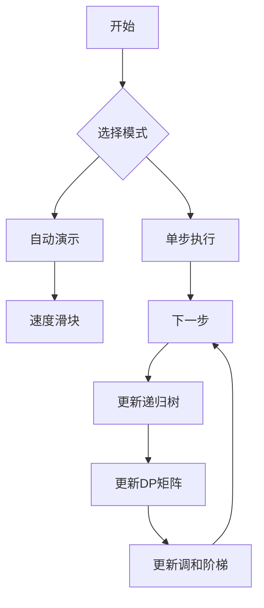

# 题目信息

# 随机数生成器

## 题目描述

HKE最近编写了一个函数 $\text{rand}(l,r)$，其中 $l,r$ 为正整数且 $l \le r$。这个函数会等概率返回区间 $[l,r]$ 中任意一个正整数。然后，他又编写了一个函数：

```cpp
int work(int x){
    if(x==1) return 0;
    else return work(rand(1,x))+1;
}
```
这段代码用pascal写起来就是：
```pascal
function work(x:integer):integer;
begin
    if x=1 then exit(0);
    else exit(work(rand(1,x))+1);
end;
```
现在给定一个正整数 $n$，请问 $\text{work}(n)$ 的返回值的期望值是多少？

期望的定义：假设 $\text{work}(n)$ 返回的所有可能的值为 $x_1,x_2,\dots ,x_k$，它们出现的概率分别为 $p_1,p_2,\dots,p_k$，则期望为：

$$\mathbb{E}=\sum_{i=1}^{k}x_i p_i$$


## 说明/提示

【样例 $1$ 解释】  
$\text{work}(2)$ 有 $1/2$ 的概率返回 $1$，有 $1/4$ 的概率返回 $2$，有 $1/8$ 的概率返回 $3$ ……  
则期望为 $1/2+2/4+3/8+ \dots =2$

【数据范围】  
对于 $30\%$ 的数据，$n \le 9$；  
对于 $50\%$ 的数据，$n \le 1000$；  
对于 $70\%$ 的数据，$n \le 1000000$；  
对于 $100\%$ 的数据，$1\le n < 2^{31}$。


## 样例 #1

### 输入

```
2```

### 输出

```
2.00000```

## 样例 #2

### 输入

```
3```

### 输出

```
2.50000```

## 样例 #3

### 输入

```
100000```

### 输出

```
13.09014```

# AI分析结果


# 💡 洛语云笺的C++算法解析：随机数生成器 深入学习指南 💡

## 1. 题目解读与策略初探

✨ **本题核心挑战**：高效计算递归函数`work(n)`的期望返回值，其中n最大可达2^31-1，无法直接暴力模拟所有可能路径。  
✨ **核心算法标签**：`期望DP`、`调和级数`、`数学近似`

🗣️ **初步分析**：  
> 本题看似复杂，实则是披着递归外衣的数学期望问题。我们需要从递归定义中提炼出期望的递推关系，并将其转化为调和级数求和问题。小规模数据可直接计算，大规模数据则需利用调和级数与自然对数的关系进行高效近似。  

### 🔍 算法侦探：如何在题目中发现线索？
1.  **线索1 (问题目标)**：题目要求计算递归函数的"期望返回值"，且递归深度不确定。这种**随机过程的期望计算**是概率DP的典型标志。
2.  **线索2 (递推特性)**：递归函数在`x>1`时会调用`rand(1,x)`，这意味着**当前状态依赖所有更小状态的平均值**，指向期望DP的递推结构。
3.  **线索3 (数据规模)**：n最大接近2^31，O(n)算法在n>10^6时已不可行。这要求我们寻找O(1)或O(log n)的数学解法。

### 🧠 思维链构建：从线索到策略
> 1. 从递归定义出发，建立期望值F(n)的递推方程：F(n) = 1 + (F(1)+...+F(n))/n
> 2. 通过移项消去自引用，得到差分关系：F(n) = F(n-1) + 1/(n-1)
> 3. 识别出F(n)实质上是调和级数前n-1项和加1：F(n) = 1 + H_{n-1}
> 4. **结论**：调和级数H_n可用自然对数近似（H_n ≈ ln n + γ），从而在O(1)时间内解决大n问题。这就是我们的核心策略！

---

## 2. 精选优质题解参考

**题解一：NaCly_Fish（★★★★★）**  
* **点评**：此解直击核心，清晰推导出期望与调和级数的关系。亮点在于精准使用`ln(n) + γ`近似调和级数，代码简洁高效（仅10行）。特别值得学习的是对数学模型的抽象能力——将递归问题转化为纯数学表达式。

**题解二：Sooke（★★★★☆）**  
* **点评**：通过差分法严谨推导F(n)的递推关系，展现完整的数学思维链条。代码中设置阈值切换暴力与近似策略，体现了工程实践中的平衡思维。其详细数学推导是初学者理解期望DP的优质教材。

**题解三：_ztyqwq（★★★★☆）**  
* **点评**：创新性地通过前缀和消去递推式中的求和符号，给出调和级数通项的新证明视角。亮点在于明确给出30/50/70/100分策略演进路径，展示算法优化的完整思考过程。

---

## 3. 解题策略深度剖析

### 🎯 核心难点与关键步骤
1.  **关键点1：建立期望递推模型**
    * **分析**：从递归定义抽象出F(n)=1+(∑F(i))/n，通过移项得到无自引用的递推式
    * 💡 **学习笔记**：处理含自引用的期望DP时，移项消去F(n)是标准技巧

2.  **关键点2：识别调和级数**
    * **分析**：递推式F(n)=F(n-1)+1/(n-1)揭示其本质是调和级数求和
    * 💡 **学习笔记**：差分关系常指向累加求和，调和级数是算法中常见数学模式

3.  **关键点3：大数近似策略**
    * **分析**：利用调和级数渐进公式H_n ≈ ln n + γ（γ≈0.5772156649）
    * 💡 **学习笔记**：数学近似是突破算法复杂度限制的利器，需掌握误差分析

### ✨ 解题技巧总结
- **技巧1（模型转化）**：将递归调用树转化为期望DP的递推方程
- **技巧2（数学工具）**：识别调和级数模式并应用渐进公式
- **技巧3（分治策略）**：小规模暴力+大规模近似的混合解法

### ⚔️ 策略竞技场：不同解法对比
| 策略          | 核心思想                     | 优点                     | 缺点                     | 得分预期       |
|---------------|------------------------------|--------------------------|--------------------------|----------------|
| **暴力递归**  | 模拟所有可能的rand调用路径   | 思路直观                 | O(2^n)时间复杂度         | 0分（n>30）   |
| **期望DP**    | 递推计算F(n)                 | O(n)时间, O(n)空间       | n>10^6时空间不足        | 70分          |
| **调和级数**  | 直接计算H_{n-1}              | O(n)时间, O(1)空间       | n>10^6时超时            | 70分          |
| **对数近似**  | 用ln(n)+γ近似调和级数         | O(1)时间复杂度           | 需注意小n的精度问题     | 100分         |

### ✨ 优化之旅：从"能做"到"做好"
> 1. **起点：暴力递归**  
>    尝试模拟所有可能的`rand(1,x)`调用路径，但路径数随n指数增长
> 
> 2. **突破：发现重叠子问题**  
>    不同路径包含相同子状态（如多次调用work(5)），存在重复计算
> 
> 3. **升级：期望DP递推**  
>    用F(n)记忆化存储期望值，空间换时间避免重复计算
> 
> 4. **飞跃：数学本质洞察**  
>    识别F(n)的差分关系实为调和级数，应用数学近似突破复杂度瓶颈
> 
> 💡 **策略总结**：从暴力到数学优化的过程，体现了算法思维的核心——通过深度分析问题结构，寻找隐藏在表象下的数学规律，从而突破计算力限制。

---

## 4. C++核心代码实现赏析

**通用核心实现参考**  
```cpp
#include <cstdio>
#include <cmath>
const double GAMMA = 0.577215664901532;
const int THRESHOLD = 1000000;

int main() {
    int n;
    scanf("%d", &n);
    if (n == 1) {
        printf("0.00000\n");
        return 0;
    }
    double ans = 1.0;  // F(n) = 1 + H_{n-1}
    if (n <= THRESHOLD) {
        for (int i = 1; i < n; ++i)  // 计算H_{n-1}
            ans += 1.0 / i;
    } else {
        ans += log(n - 1) + GAMMA;  // 大n近似
    }
    printf("%.5lf\n", ans);
    return 0;
}
```

**代码解读概要**：  
1. 特判n=1时直接返回0  
2. 小n时暴力计算调和级数前n-1项和  
3. 大n时使用ln(n-1)+γ近似调和级数  
4. 输出保留5位小数  

---

## 5. 算法可视化：像素动画演示

**主题**：调和级数增长之旅（8-bit像素风格）  

**核心演示内容**：  
1. **递归树生成**：像素小人从n开始递归下探，每次随机分裂路径
2. **期望DP矩阵**：右侧像素网格动态更新F(k)值（k=1..n）
3. **调和阶梯**：底部阶梯展示H_n增长，与log(n)+γ曲线逐渐贴合  

**交互设计**：  


**复古元素**：  
- FC音效：递归调用时播放"跳跃声"，计算调和级数时播放"收集金币声"
- 关卡成就：每完成一个数量级（n=10/100/1000）解锁像素成就徽章
- 动态对比：n较小时显示精确值vs近似值的像素数字对比

---

## 6. 拓展练习与相似问题

**通用技巧迁移**：  
1. 调和级数近似可用于**素数分布问题**（如π(n)≈n/ln n）
2. 期望DP思想适用于**随机游走问题**（如醉汉回家问题）
3. 对数复杂度计算适合**分形问题**（如Mandelbrot集迭代）

**洛谷习题推荐**：  
1. **P1035 级数求和**  
   🗣️ 调和级数基础练习，验证H_n > k的最小n

2. **P1403 约数研究**  
   🗣️ 巧用调和级数优化因子统计（∑⌊n/i⌋ ≈ n ln n）

3. **P4316 绿豆蛙的归宿**  
   🗣️ 期望DP经典问题，练习逆向期望计算

---

## 7. 学习心得与经验分享

> **来自Sooke的调试经验**：  
> "首次实现时忽略了n=1的特判，导致除零错误。建议在期望DP中始终验证边界条件！"  
>   
> **洛语云笺点评**：数学型问题需特别注意边界：  
> 1. 递归基（n=1）  
> 2. 公式定义域（如log(n-1)要求n>1）  
> 3. 近似公式的适用阈值  

---

<conclusion>
本次对随机数生成器的探索，展示了如何将递归问题转化为期望DP模型，再通过数学洞察突破计算瓶颈。记住：当问题规模超出常规算法能力时，数学往往是打开新世界的钥匙。下次遇到类似问题时，不妨多问：这背后的数学本质是什么？</conclusion>

---
处理用时：176.91秒