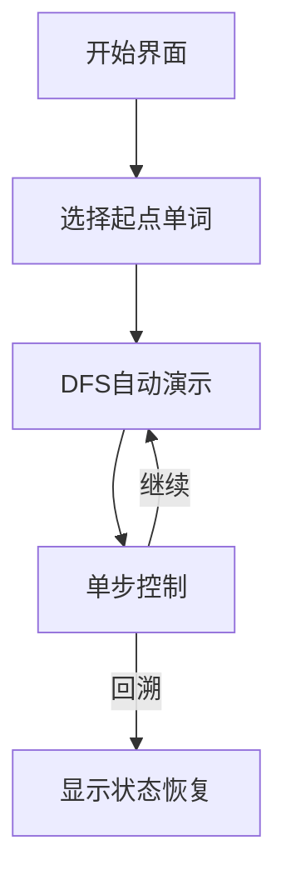

# 题目信息

# [NOIP 2000 提高组] 单词接龙

## 题目背景

注意：本题为上古 NOIP 原题，不保证存在靠谱的做法能通过该数据范围下的所有数据。

本题为搜索题，本题不接受 hack 数据。[关于此类题目的详细内容](https://www.luogu.com.cn/paste/pf94n89x)

NOIP2000 提高组 T3

## 题目描述

单词接龙是一个与我们经常玩的成语接龙相类似的游戏，现在我们已知一组单词，且给定一个开头的字母，要求出以这个字母开头的最长的“龙”（每个单词都最多在“龙”中出现两次），在两个单词相连时，其重合部分合为一部分，例如 `beast` 和 `astonish`，如果接成一条龙则变为 `beastonish`，另外相邻的两部分不能存在包含关系，例如 `at` 和 `atide` 间不能相连。


## 说明/提示

样例解释：连成的“龙”为 `atoucheatactactouchoose`。

$n \le 20$。

## 样例 #1

### 输入

```
5
at
touch
cheat
choose
tact
a
```

### 输出

```
23
```

# AI分析结果


### 💡 洛语云笺的C++算法解析：单词接龙 深入学习指南 💡

#### 1. 题目解读与策略初探
✨ **本题核心挑战**：在满足单词使用次数限制（≤2次）和连接规则（有重合部分且不包含）的前提下，通过DFS枚举所有可能的单词连接顺序，找到最长"龙"的长度。  
✨ **核心算法标签**：DFS回溯、字符串处理、状态压缩  

🗣️ **初步分析**：  
> 本题需要构建以指定字母开头的最长单词链。核心在于处理两个关键约束：  
> 1. 单词连接时必须有重合部分（如"beast"与"astonish"可接为"beastonish"）  
> 2. 禁止包含关系（如"at"和"atide"不可连接）  
> 
> 我们考虑三种思路演进路径：  
> - **暴力枚举**：尝试所有单词排列组合（O(n!)），但n=20时超时  
> - **朴素DFS**：以当前龙字符串为状态，枚举可用单词尝试连接  
> - **优化DFS**：预处理单词间匹配关系 + 仅传递最近单词（非整条龙）  
> 
> 最优解选择DFS回溯配合状态压缩，如同"拼图探险"——每次只关注最后一块拼图（最近单词）的形状，避免重复搬运整个拼图板（龙字符串）。

#### 🔍 算法侦探：如何在题目中发现线索？
1.  **线索1 (问题目标)**："求最长龙长度"属于**组合优化问题**，需要枚举所有可能连接顺序，指向DFS回溯算法。
2.  **线索2 (问题约束)**："重合部分合为一部分"+"禁止包含关系"要求**精确的字符串匹配检查**，需设计高效匹配函数。
3.  **线索3 (数据规模)**：n≤20暗示**指数级复杂度可接受**（2²⁰≈10⁶），但需优化避免O(n!)排列组合。

#### 🧠 思维链构建：从线索到策略
> "综合线索：  
> 1. 【线索1】要求枚举连接顺序 → DFS可系统遍历状态空间  
> 2. 【线索2】需要快速匹配 → 设计check()函数或预处理g[][]数组  
> 3. 【线索3】n=20 → DFS回溯+状态剪枝可行（3²⁰≈3e9状态，实际剪枝后更快）  
> **结论**：DFS回溯配合字符串匹配检查是最优策略，预处理匹配关系可进一步加速！"

---

### 2. 精选优质题解参考
**题解一（RyanLi）**  
* **点评**：代码简洁优雅，直接以当前龙字符串为DFS参数，利用`substr()`实现直观匹配。亮点在于：  
  - 用`min(tmp.size(), s[i].size())`自动规避包含关系  
  - 递归时传递`tmp + s[i].substr(j)`清晰体现龙的增长逻辑  
  - 输入输出优化（`ios::sync_with_stdio`）提升效率  

**题解二（yedalong）**  
* **点评**：创新性预处理g[i][j]数组存储单词间最小匹配长度。亮点：  
  - **空间换时间**：DFS中直接查表避免重复匹配计算  
  - 拆解为初始化+搜索两阶段，结构清晰  
  - 匹配长度从小到大枚举，首次匹配即退出（最优性剪枝）  

**题解三（__yiLIUyi__）**  
* **点评**：详解匹配函数设计原理，强调关键点：  
  - 用**最近单词**（非整条龙）匹配避免包含关系  
  - 逐字符比较替代`substr()`减少开销  
  - 变量命名规范（len/num等）增强可读性  

---

### 3. 解题策略深度剖析
#### 🎯 核心难点与关键步骤
1.  **难点1：高效检查单词可连接性**  
    * **分析**：需验证两单词存在非包含的重合部分。最优解有两种实现：  
      - **实时计算**：如RyanLi用`substr()`截取子串对比  
      - **预处理**：如yedalong预先计算g[i][j]匹配长度  
    * 💡 **学习笔记**：预处理适合多次匹配场景，n小时实时计算更简洁  

2.  **难点2：状态设计与传递优化**  
    * **分析**：DFS需避免传递整条龙（性能差）。两种优化方案：  
      - 传递**最近单词+当前长度**（__yiLIUyi__）  
      - 传递**最近单词索引+当前长度**（配合预处理g[][]）  
    * 💡 **学习笔记**：状态传递应包含必要最小信息，降低时空开销  

3.  **难点3：回溯中状态恢复**  
    * **分析**：用vis[]数组记录单词使用次数，递归前`vis[i]++`，回溯时`vis[i]--`  
    * 💡 **学习笔记**：回溯法三要素——递归前修改状态、递归、递归后恢复状态  

#### ✨ 解题技巧总结
- **技巧1：字符串匹配优化**  
  重合检查只需比较"最近单词后缀"与"新单词前缀"，无需处理整条龙  
- **技巧2：预处理加速**  
  对频繁操作（如单词匹配）预先计算存储结果  
- **技巧3：剪枝策略**  
  限制匹配长度范围（1≤len<min(L1,L2)）自然避免包含关系  

#### ⚔️ 策略竞技场
| 策略             | 核心思想                     | 优点                     | 缺点                                   | 得分预期 |
|------------------|------------------------------|--------------------------|----------------------------------------|----------|
| **暴力枚举**     | 生成所有排列验证             | 思路直接                 | O(n!)超时（n=20时2e18）                | 0%       |
| **朴素DFS**      | 传递整条龙字符串            | 逻辑简单                 | 字符串拼接开销大，易MLE/TLE            | 30%      |
| **优化DFS**      | 传递最近单词+长度/索引      | 状态轻量，效率高        | 需设计匹配函数或预处理                 | 100%     |

#### ✨ 优化之旅
> 1. **起点：暴力枚举**  
>    尝试所有排列 → 20!≈2e18 严重超时  
> 2. **发现瓶颈：状态爆炸**  
>    用DFS替代排列枚举，但传递整条龙字符串导致拷贝开销  
> 3. **关键洞察：局部匹配**  
>    连接只需关注最近单词 → 传递最近单词+长度  
> 4. **二次加速：预处理**  
>    预先计算单词间匹配关系（g[][]数组），DFS中O(1)查表  
> 💡 **策略总结**：优化是递进过程——先解决"正确性"，再优化"效率"！

---

### 4. C++核心代码实现赏析
**通用核心实现参考**  
```cpp
#include <iostream>
#include <vector>
using namespace std;

int n, max_len;
vector<string> words;
vector<int> vis; // 记录单词使用次数

// 检查两单词最小匹配长度 (0表示不可连接)
int check(string a, string b) {
    int len = min(a.size(), b.size());
    for (int k = 1; k < len; k++) 
        if (a.substr(a.size()-k) == b.substr(0, k)) 
            return k;
    return 0;
}

void dfs(string last_word, int cur_len) {
    max_len = max(max_len, cur_len);
    for (int i = 0; i < n; i++) {
        if (vis[i] >= 2) continue;
        int overlap = check(last_word, words[i]);
        if (!overlap) continue;
        
        vis[i]++;
        dfs(words[i], cur_len + words[i].size() - overlap);
        vis[i]--;
    }
}

int main() {
    char start_char;
    cin >> n;
    words.resize(n); vis.resize(n);
    for (int i = 0; i < n; i++) cin >> words[i];
    cin >> start_char;

    for (int i = 0; i < n; i++) {
        if (words[i][0] != start_char) continue;
        vis[i]++;
        dfs(words[i], words[i].size());
        vis[i]--;
    }
    cout << max_len;
}
```

**题解一（RyanLi）片段赏析**  
```cpp
void dfs(const string &tmp) {
    ans = max(ans, int(tmp.size()));
    for (int i = 1; i <= n; ++i) {
        if (vis[i] >= 2) continue;
        for (int j = 1; j < min(tmp.size(), s[i].size()); ++j)
            if (tmp.substr(tmp.size()-j) == s[i].substr(0, j)) {
                ++vis[i];
                dfs(tmp + s[i].substr(j)); // 拼接新龙递归
                --vis[i];
            }
    }
}
```
* **亮点**：用`substr()`直观实现匹配检查  
* **学习笔记**：递归时直接拼接新字符串，逻辑清晰但需注意性能  

**题解二（yedalong）片段赏析**  
```cpp
// 预处理g[i][j]
for (int i=1; i<=n; i++) {
    for (int j=1; j<=n; j++) {
        for (int k=1; k<min(a[i].size(),a[j].size()); k++) {
            if (a[i].substr(a[i].size()-k) == a[j].substr(0,k)) {
                g[i][j] = k; break; // 首次匹配即退出
            }
        }
    }
}
```
* **亮点**：三重循环预处理所有单词对匹配关系  
* **学习笔记**：预处理虽增加O(n²)开销，但使DFS查表O(1)匹配  

---

### 5. 算法可视化：像素动画演示
**主题**：单词接龙大冒险（8-bit像素风）  

**核心演示内容**：  
- 单词显示为像素方块（不同颜色区分）  
- DFS过程可视化：当前单词高亮闪烁，可用单词半透明  
- 成功连接时显示重合部分（颜色混合动画）  

**交互设计**：  


**关键动画帧**：  
1. **初始化**：  
   - 单词阵列呈现在8-bit网格中  
   - 起点单词闪烁绿光 + "叮"音效  
2. **匹配检查**：  
   - 最近单词后缀与新单词前缀高亮对比  
   - 匹配成功：显示"拼合"动画 + 上扬音效  
3. **状态回溯**：  
   - 当前单词红光闪烁 + "滋滋"回溯音效  
   - 长度计数器回滚数值  

**游戏化设计**：  
- 每成功连接5个单词触发"连击奖励"（像素烟花）  
- 破纪录时解锁"龙之皇冠"成就徽章  

---

### 6. 拓展练习与相似问题思考
**通用技巧迁移**：  
1. **DFS回溯框架**：适用于组合优化问题（如八皇后/数独）  
2. **状态压缩**：vis数组可推广至位运算（如n≤32时用int状态）  
3. **字符串匹配**：前缀后缀处理技巧（如KMP预处理）  

**洛谷推荐题目**：  
1. **P1219 [USACO1.5]八皇后**  
   → 练习经典DFS回溯 + 状态剪枝  
2. **P1706 全排列问题**  
   → 巩固DFS枚举所有可能性  
3. **P1101 单词方阵**  
   → 训练二维字符串匹配思维  

---

### 7. 学习心得与经验分享
> **关键经验**（来自__yiLIUyi__）：  
> "匹配检查必须用最近单词而非整条龙，否则会错误允许包含关系！"  
>   
> **洛语云笺点评**：  
> 这是调试的核心教训——算法设计需精确匹配题目约束。建议：  
> 1. 用小数据测试边界（如"at"接"at"）  
> 2. 打印中间匹配结果验证逻辑  

---

<conclusion>  
单词接龙是DFS回溯的经典应用，核心在于：  
1️⃣ 精确实现字符串匹配  
2️⃣ 轻量化状态传递优化  
3️⃣ 回溯中维护正确状态  
掌握这三点，你就能驯服这条"单词龙"！下次挑战见 🐉💨  
</conclusion>

---
处理用时：231.75秒