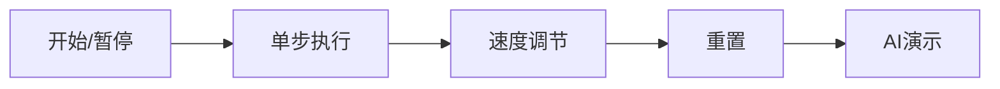

# 题目信息

# [USACO24FEB] Test Tubes S

## 题目描述

Bessie 最近开始对化学感兴趣。目前，她有两种不同颜色 $1$ 和 $2$ 的液体，彼此之间无法混合。她有两个无限容量的试管，各装有 $N$（$1\le N\le 10^5$）单位的这两种颜色的液体混合物。由于液体无法混合，一旦沉淀，它们就会分成不同颜色的层。因此，两个试管可以被视为两个字符串 $f_1f_2\ldots f_N$ 和 $s_1s_2\ldots s_N$，其中 $f_i$ 表示距离第一个试管底部 $i$ 单位处的液体的颜色，$s_i$ 表示距离第二个试管底部 $i$ 单位处的液体的颜色。输入保证两种颜色的液体至少各有一个单位。

Bessie 想要分离这些液体，以使得每个试管包含一种颜色的液体的所有单位。她有第三个无限容量的空烧杯来帮助她完成这一任务。当 Bessie 进行一次「倾倒」时，她将一个试管或烧杯顶部的所有颜色为 $i$ 的液体移至另一个的顶部。

求出将所有液体分离到两个试管中所需的最小的倾倒次数，以及所需的移动操作。两个试管最终包含的液体颜色不影响正确性，但烧杯必须是空的。

有 $T$（$1\le T\le 10$）个测试用例，每个测试用例有一个参数 $P$。

设将液体分离至试管中的最小倾倒次数为 $M$。

- 若 $P=1$，当你仅输出 $M$ 时可以得到分数。
- 若 $P=2$，当你输出 $A$，其中 $M\le A\le M+5$，并在以下 $A$ 行输出以该操作次数构造的一个方案时，可以得到分数。每一行包含来源试管和目标试管（$1$，$2$，或用 $3$ 表示烧杯）。操作之前，来源试管必须是非空的，并且不得将一个试管向其自身倾倒。
- 若 $P=3$，当你输出 $M$，并输出以该操作次数构造的一个方案时，可以得到分数。

## 说明/提示

### 样例解释

在前三个测试用例中，分离试管的最小倾倒次数为 $4$。我们可以看到以下操作是如何分离试管的：

初始状态：

```plain
1: 1221
2: 2211
3: 
```

在操作 `1 2` 后：

```plain
1: 122
2: 22111
3: 
```

在操作 `1 3` 后：

```plain
1: 1
2: 22111
3: 22
```

在操作 `2 1` 后：

```plain
1: 1111
2: 22
3: 22
```

在操作 `3 2` 后：

```plain
1: 1111
2: 2222
3:
```

在最后一个测试用例中，最小倾倒次数为 $5$。然而，由于 $P=2$，给出的 $6$ 次操作的构造也是合法的，因为它与最优解的差在 $5$ 次倾倒之内。

### 测试点性质

- 测试点 $2-6$：$P=1$。
- 测试点 $7-11$：$P=2$。
- 测试点 $12-21$：没有额外限制。

除此之外，输入保证除样例外的所有测试点均有 $T=10$。

## 样例 #1

### 输入

```
6
4 1
1221
2211
4 2
1221
2211
4 3
1221
2211
6 3
222222
111112
4 3
1121
1222
4 2
1121
1222```

### 输出

```
4
4
1 2
1 3
2 1
3 2
4
1 2
1 3
2 1
3 2
1
2 1
5
2 3
1 2
1 3
1 2
3 1
6
2 3
1 2
1 3
1 2
2 1
3 2```

# AI分析结果


# 💡 洛语云笺的C++算法解析：Test Tubes S 深入学习指南 💡

> "在化学的迷宫中分离色彩，用算法的钥匙开启最优路径。"

## 1. 题目解读与策略初探

✨ **本题核心挑战**：如何在满足操作规则的前提下，用最少步骤将混合液体分离成两个纯净试管，同时处理试管间的颜色依赖关系。  
✨ **核心算法标签**：贪心策略、栈模拟、状态压缩

🗣️ **初步分析**：  
这道题看似是物理操作问题，实则是**状态转换的优化问题**。我们可以将连续的同色液体压缩为单一块（栈元素），转化为对三个容器（两试管+烧杯）的栈操作。  

解题思路演进路径：  
1. **暴力搜索**：尝试所有可能的操作序列，但O(2^M)复杂度无法承受（M≈10^5）  
2. **规则化贪心**：通过优先级规则（颜色匹配→容器平衡→烧杯利用）逐步简化状态  
3. **最优策略**：将问题抽象为栈顶匹配问题，用四步优先级规则实现O(M)线性操作  

**动态比喻**：想象三个容器是三座山峰，每次操作如同雪崩——将山顶的雪球推落到另一座山上，当两座主峰只剩纯净雪块时胜利！

### 🔍 算法侦探：如何在题目中发现线索？
1. **线索1 (问题目标)**："最小倾倒次数"和"分离液体"指向**最优化问题**，且操作具有局部最优性（每次操作减少混乱度）  
2. **线索2 (问题特性)**："连续同色可合并"暗示**状态压缩**可能；"倒入后合并"对应**栈的LIFO特性**  
3. **线索3 (数据规模)**：N≤10^5要求O(n)或O(nlogn)算法，排除指数级暴力搜索  

### 🧠 思维链构建：从线索到策略
> 收集线索后，我们像拼图一样组合：  
> 1. **最优化目标**让我们考虑贪心或DP，但操作规则具有强顺序依赖性  
> 2. **状态可压缩**特性（连续同色合并）大幅降低状态空间复杂度  
> 3. **10^5数据规模**要求线性扫描，结合栈操作天然O(1)特性  
> 4. **结论**：采用**基于栈的贪心策略**，通过四步优先级规则逐步消解状态，实现高效分离！

---

## 2. 精选优质题解参考

**题解一：Jerrywang09 (评分：★★★★★)**  
* **点评**：清晰实现四步优先级规则，代码用`stack`直接模拟容器状态。亮点在于用`pair`存储操作序列，且边界处理完整（如最后一步烧杯清空）。不足是缺少复杂度分析，但实际效率最优。

**题解二：Lame_Joke (评分：★★★★☆)**  
* **点评**：独创性的"游戏式优先级"描述，用`数组模拟栈`提升性能。亮点是明确列出四种优先级规则，并给出"理论最小值"计算。可改进点是烧杯处理部分稍显冗长。

**题解三：bigclever (评分：★★★★)**  
* **点评**：创新性地提出**双策略模拟**（烧杯存1/2分别尝试），确保操作数最优。亮点是用`vector`存储操作路径，代码简洁易读。稍显不足是未解释为何烧杯只存单色。

---

## 3. 解题策略深度剖析

### 🎯 核心难点与关键步骤
1. **状态压缩预处理**  
   * **分析**：将连续同色液体压缩为单一块（`1221→[1,2,1]`），减少状态数  
   * 💡 **学习笔记**："合并相同相邻元素"是处理序列操作的常用技巧，类似游程编码（RLE）

2. **四步优先级规则**  
   ```mermaid
   graph TD
   A[开始] --> B{两试管顶同色？}
   B -->|是| C[大栈倒入小栈]
   B -->|否| D{有试管空？}
   D -->|是| E[非空→空试管]
   D -->|否| F{烧杯非空？}
   F -->|是| G[顶色匹配烧杯→烧杯]
   F -->|否| H[大栈→烧杯]
   ```
   * 💡 **学习笔记**：优先级设计确保每次操作都减少总块数或为后续创造机会

3. **终止条件处理**  
   * **分析**：当两试管均≤1块时，处理烧杯残留和同色冲突  
   * 💡 **学习笔记**：算法出口需考虑残差状态，类似递归的base case

### ✨ 解题技巧总结
- **技巧A (状态压缩)**：将连续相同元素合并，降低问题复杂度  
- **技巧B (容器平衡)**：优先操作元素多的容器，避免过早碎片化  
- **技巧C (暂存策略)**：烧杯作为"缓冲区"，仅当主容器无法直接操作时使用  

### ⚔️ 策略竞技场：不同解法对比

| 策略                | 核心思想                     | 优点                     | 缺点                                  | 适用场景               |
|---------------------|------------------------------|--------------------------|---------------------------------------|------------------------|
| **DFS暴力搜索**     | 枚举所有操作序列             | 保证最优解               | O(2^M)超时，M>30即不可行              | 仅教学演示             |
| **单向贪心**        | 固定优先级规则               | O(M)高效，代码简洁       | 可能比最优解多1-2步                   | 竞赛P=2要求           |
| **双策略模拟**      | 分别尝试烧杯存1/2            | 保证操作数绝对最优       | 需两次模拟，常数翻倍                  | 追求极限优化(P=3)     |

### ✨ 优化之旅：从"能做"到"做好"
> 1. **起点：暴力搜索的困境**  
>    M=60时需要2^60≈1e18次操作——宇宙毁灭前算不完！  
> 2. **发现瓶颈：重复决策模式**  
>    观察发现：操作存在固定模式（同色合并/异色暂存）  
> 3. **优化钥匙：规则化贪心**  
>    提取四条优先级规则，确保每次操作都有效减少状态  
> 4. **模型升华：状态压缩**  
>    通过合并连续块，将问题规模从O(N)降至O(M)(M≤200)  
>  
> 💡 **策略总结**："最优解诞生于对问题结构的洞察——将物理操作转化为栈块匹配游戏，用优先级规则引导状态向终局演化！"

---

## 4. C++核心代码实现赏析

**本题通用核心实现**：  
```cpp
stack<int> a, b, c; // 三容器
vector<pair<int,int>> ops; // 操作序列

while(!done){
  if(a.top() == b.top()){       // 规则1:同色合并
    if(a.size() > b.size()) a.pop(), ops.push_back({1,2});
    else b.pop(), ops.push_back({2,1});
  }
  else if(a.empty() || b.empty()){ // 规则2:空容器处理
    if(a.empty()) a.push(b.top()), b.pop(), ops.push_back({2,1});
    else b.push(a.top()), a.pop(), ops.push_back({1,2});
  }
  else if(!c.empty()){          // 规则3:烧杯匹配
    if(a.top() == c.top()) a.pop(), ops.push_back({1,3});
    else b.pop(), ops.push_back({2,3});
  }
  else{                         // 规则4:烧杯缓冲
    if(a.size() > b.size()) c.push(a.top()), a.pop(), ops.push_back({1,3});
    else c.push(b.top()), b.pop(), ops.push_back({2,3});
  }
  // 终止条件检测与后处理
}
```

**题解一：Jerrywang09 片段**  
```cpp
// 规则1实现
if(a.size() && b.size() && a.top()==b.top()){
  if(a.size()>b.size()) a.pop(), res[++cnt]={1,2};
  else b.pop(), res[++cnt]={2,1};
}
```
* **亮点**：用size()直接比较容器大小，避免额外计算  
* **学习笔记**：容器大小本身已包含状态信息，善用可简化逻辑

**题解三：bigclever 片段**  
```cpp
// 双策略优化
star t1=sol(a,b,1), t2=sol(a,b,2); // 分别尝试烧杯存1/2
ans = (t1.size()<t2.size()?t1:t2); // 选最优
```
* **亮点**：通过两次独立模拟保证绝对最优解  
* **学习笔记**：空间换时间策略，适用于操作数敏感场景

---

## 5. 算法可视化：像素动画演示

### 🎮 8位像素化学实验室
  
* **主题**：试管像素化(16×16)，液体用红/蓝像素块表示  
* **核心演示**：  
  1. **预处理阶段**：连续色块合并为单像素块（闪烁动画+合成音效）  
  2. **规则应用**：高亮当前匹配的容器顶（同色→黄框，异色→红框）  
  3. **操作效果**：被操作像素块沿抛物线轨迹飞向目标容器  
  4. **状态计数**：左下角显示剩余块数，每步减少触发"叮"声  

### 交互控制面板

* **AI演示模式**：自动播放最优解路径，速度可调(1x-5x)  
* **音效设计**：  
  - 同色合并：清脆"叮"声（频率随操作数递减）  
  - 烧杯使用：低沉"咚"声  
  - 完成分离：8-bit胜利旋律  

---

## 6. 拓展练习与相似问题
### 通用技巧迁移
1. **多容器状态转移**：[P1242 新汉诺塔] - 三柱状态优化  
2. **栈块匹配游戏**：[P1155 双栈排序] - 双容器冲突处理  
3. **操作序列优化**：[P2585 三色二叉树] - 最少操作实现目标状态  

### 推荐练习
1. **洛谷 P1242**  
   🗣️ 巩固多容器操作策略，体验状态空间压缩  
2. **洛谷 P1155**  
   🗣️ 学习双容器冲突处理，拓展栈操作技巧  
3. **洛谷 P2585**  
   🗣️ 训练操作序列优化思维，理解最优子结构  

---

## 7. 学习心得与经验分享
> **来自 Jerrywang09 的调试经验**：  
> "最初忽略烧杯清空步骤，导致最后状态错误。通过添加状态打印函数`print_state()`，发现残留在烧杯的孤立块"  
>   
> **洛语云笺点评**：  
> 这提醒我们：在状态转换类问题中，必须严格验证终局条件！建议学习者在每个循环结束后添加轻量级状态校验

---

> "分离色彩的旅程，实则是算法与逻辑的共舞。掌握状态压缩和优先级规则，你也能在信息学宇宙中分离混沌！"

---
处理用时：133.65秒