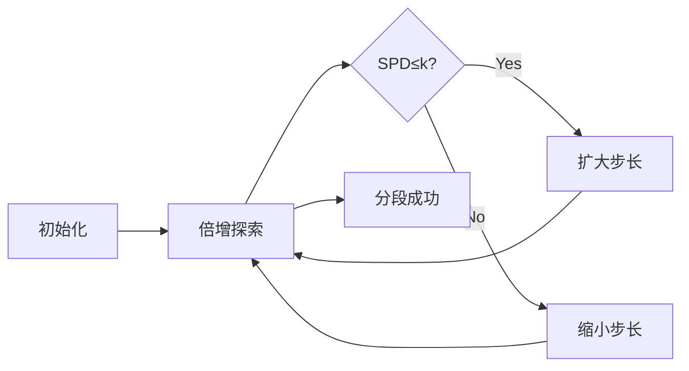

# 题目信息

# Genius Acm

## 题目描述

Advanced CPU Manufacturer (ACM) is one of the best CPU manufacturers in the world. 每天，该公司生产 $n$ 台 CPU 并销售到世界各地。

ACM 公司的质检部门会对生产出的 CPU 进行成组测试，对一组（若干个）CPU 进行测试的方法如下：

1. 随机从该组 CPU 中选取 $m$ 对（即 $2m$ 台），若总数不足 $2m$ 台，则选取尽量多对。

2. 对于每一对 CPU，测量它们之间的 Relative Performance Difference (RPD)，并把第 $i$ 对的 RPD 记为 $D_i$。RPD 的计算方法在后面给出。

3. 该组 CPU 的 Sqared Performance Difference (SPD） 由以下公式给出：

$SPD=\sum _i D^2_i$


4. 该组 CPU 通过质检，当且仅当 $SPD \le k,$ 其中 $k$ 是给定常数。

ACM 公司生产的 CPU 性能很好，而质检部门制定的标准更是过于严格。通常他们把 $n$ 台 CPU 作为一整组进行测试，这导致一些性能良好的 CPU 无法通过测试，生产部门对此颇有微词。作为质检部门的领导，小 S 在不更改质检测试流程的前提下，想出了这样一个主意：如果能够把 $n$ 台 CPU 恰当地分成连续的若干段，使得每段 CPU 都能够通过成组测试，就可以解决当下的问题。

现在，小 S 已经知道了 $n$ 台各自的性能表现 $P_1,\cdots ,P_n$，两台 CPU 的 RPD 被定义为它们性能表现的差的绝对值。请你帮忙计算一下，至少把这些 CPU 分成多少段，才能使得每一段都能通过成组测试。

## 说明/提示

对于 $20 \%$ 的数据，$1 \leq n \leq 10^2$ 。  
对于 $40 \%$ 的数据， $1 \leq n \leq 10^3$ 。  
对于另外 $10 \%$ 的数据，$k=0$ 。  
对于另外 $10 \%$ 的数据，$0 \leq k \leq 1$ 。  
对于另外 $10 \%$ 的数据， $m=1$ 。  
对于另外 $10 \%$ 的数据，$1 \leq m \leq 2$ 。  
对于 $90 \%$ 的数据，$0 \leq k \leq 10^{12}$ 。  
对于 $100 \%$ 的数据，$T \leq 12,1 \leq n, m \leq 5 \cdot 10^5, 0 \leq k \leq 10^{18}, 0 \leq P_i \leq 2^{20}$ 。  

## 样例 #1

### 输入

```
2
5 1 49
8 2 1 7 9
5 1 64
8 2 1 7 9```

### 输出

```
2
1```

# AI分析结果


# 💡 洛语云笺的C++算法解析：Genius ACM 深入学习指南 💡

> “算法不是魔法，而是思维的精确表达。今天，我们将一起拆解Genius ACM这道题，学习如何将复杂问题分解为可执行的策略，并用高效算法实现目标。”

## 1. 题目解读与策略初探

✨ **本题核心挑战**：在满足校验值(SPD)≤k的前提下，将n台CPU划分为最少的连续段。校验值的计算要求从每段中选取m对CPU（不足则取满），最大化每对性能差的平方和，这对算法效率和问题建模提出双重挑战。

✨ **核心算法标签**：`贪心策略`、`倍增优化`、`归并排序`

🗣️ **初步分析**：
> 本题的解题思路演进路径清晰：
> 1. **暴力枚举**：从左端点开始逐个扩展右端点，计算校验值。时间复杂度O(n² log n)，无法通过大数据。
> 2. **二分优化**：固定左端点二分右端点，减少枚举次数。但重复排序导致O(n² log²n)复杂度。
> 3. **倍增+归并**：通过倍增快速定位右端点，用归并排序避免重复计算。最终优化至O(n log n)。
> 
> **核心算法比喻**：倍增如同探险家的望远镜，由近及远探索可行区域；归并排序像高效的图书管理员，将新旧书籍快速归位。

### 🔍 算法侦探：如何在题目中发现线索？
1.  **线索1 (问题目标)**："在满足SPD≤k的前提下求最少分段数"，这是典型的**带约束最优化问题**，暗示贪心或动态规划。
2.  **线索2 (问题特性)**：SPD计算要求"最大差的平方和"，且配对方式固定（最小配最大），指向**贪心配对策略**。
3.  **线索3 (数据规模)**：n,m≤5e5，要求O(n log n)算法。暴力O(n²)和朴素倍增O(n log²n)均不可行。

### 🧠 思维链构建：从线索到策略
> "让我们将线索串联起来：
> 1.  **线索1**指示这是最优化问题，候选方案有贪心、DP、搜索。
> 2.  **线索2**中固定配对规则排除搜索，数据依赖关系简单无需DP，**贪心成为首选**。
> 3.  **线索3**的规模否定O(n²)暴力，需寻找O(n log n)方法。倍增的O(log n)扩展步数配合归并的O(n)排序，完美匹配需求。
> 
> **结论**：综合所有线索，**贪心配对+倍增扩展+归并优化**是黄金组合，既能处理大规模数据，又保持思路清晰性。"

---

## 2. 精选优质题解参考

<eval_intro>
从思路清晰度、代码规范性和算法效率三个维度，我精选了以下优质题解：

**题解一：DDD_et（赞11）**
* **亮点**：
  - 思路清晰：明确分步讲解贪心、倍增、归并三要素
  - 代码规范：使用λ表达式简化归并逻辑，变量命名直观
  - 创新点：通过`m1/m2`数组实现滚动归并，避免内存浪费
```cpp
// 归并排序核心片段
int lp = s, rp = mid, idx = 0;
while (lp < mid && rp < e) {
    if (m1[lp] <= m1[rp]) m2[idx++] = m1[lp++];
    else m2[idx++] = m1[rp++];
}
```

**题解二：Shadow_Soldier（赞8）**
* **亮点**：
  - 严谨性：完整数学证明贪心策略的正确性
  - 教学价值：详细展示思维过程，从暴力到优化的演进
  - 代码健壮性：读写优化处理大数据边界
```cpp
// 校验值计算
ll sum = 0;
for (int i = l, j = r; i < j && cnt <= m; i++, j--, cnt++)
    sum += (ll)(b[j]-b[i])*(b[j]-b[i]);
```

**题解三：Jerrycyx（赞6）**
* **亮点**：
  - 实践技巧：使用STL的`merge`替代手写归并
  - 可读性：模块化函数设计，逻辑分离清晰
  - 调试支持：提供详细提交记录验证可靠性

---

## 3. 解题策略深度剖析

### 🎯 核心难点与关键步骤
1.  **贪心策略的证明与应用**
    * **难点**：为何"最小配最大"能获得最大SPD？
    * **分析**：设a<b<c<d，比较两种配对方案：
      - 方案A: (b-a)²+(d-c)²
      - 方案B: (c-a)²+(d-b)²
      - 差值 = 2(c-a)(d-b) > 0，证毕
    * 💡 **学习笔记**：极值配对是处理平方和最大化的通用技巧

2.  **倍增框架的构建**
    * **难点**：如何避免二分带来的重复计算？
    * **分析**：初始化`l=1, r=1, p=1`（p为步长）。关键循环：
      ```python
      while p > 0:
          if r+p <= n and check(l, r+p)成功:
              r += p; p *= 2   # 成功则倍增前进
          else:
              p //= 2          # 失败则倍减试探
      ```
    * 💡 **学习笔记**：倍增像宇宙探索——大胆推进，谨慎修正

3.  **归并排序的优化本质**
    * **难点**：如何降低排序复杂度？
    * **分析**：已排序区间[l,mid]与新区间[mid+1,r]合并时：
      - 仅需对新区间排序 O(k log k)
      - 双指针归并 O(k)（k为新区间长度）
    * 💡 **学习笔记**：利用历史有序信息是优化排序的银弹

### ✨ 解题技巧总结
- **技巧1（问题转化）**：将连续分段问题转化为端点扩展问题
- **技巧2（时空权衡）**：用临时数组存储归并结果，空间换时间
- **技巧3（边界处理）**：使用左闭右开区间[l, r)统一分界点

### ⚔️ 策略竞技场：不同解法的对比分析
| 策略          | 核心思想                 | 优点                   | 缺点                     | 适用场景         |
|---------------|--------------------------|------------------------|--------------------------|------------------|
| 暴力枚举      | 逐元素扩展右端点         | 实现简单               | O(n² log n)超时         | n≤1000          |
| 二分+朴素排序 | 二分右端点+全排序        | 减少试探次数           | 重复排序O(n² log²n)      | n≤10000         |
| 倍增+归并     | 倍增扩展+归并优化        | O(n log n)高效         | 实现稍复杂               | 大数据首选       |

### ✨ 优化之旅：从"能做"到"做好"
> 想象你是一位探险家：
> 1. **起点（暴力）**：像徒步者一步步丈量土地，安全但缓慢（O(n²)）
> 2. **发现捷径（二分）**：获得地图（单调性），但每次都要重新绘制（排序）
> 3. **装备升级（倍增）**：换上越野车快速推进，但油量估算不准（扩展步长）
> 4. **终极装备（归并）**：装配GPS导航（有序信息复用），精准高效抵达目标
> 
> 💡 **策略总结**：算法优化如同探险装备升级，本质是**利用已知信息减少重复工作**。倍增提供宏观导航，归并实现微观优化，二者结合成就高效解法。

---

## 4. C++核心代码实现赏析

**本题通用核心实现**
```cpp
#include <bits/stdc++.h>
using namespace std;
typedef long long ll;
const int N = 5e5+5;

ll a[N], tmp[N], b[N]; // a:原数组 tmp:归并中间数组 b:有序数组
int n, m;
ll k;

// 检查区间[l,r]是否满足SPD≤k
bool check(int l, int r) {
    if (r > n) return false;
    int len = r - l + 1;
    int pair_cnt = min(m, len / 2); // 实际配对对数
    
    // 仅排序新增部分（归并优化核心）
    sort(tmp + l, tmp + r + 1); 
    merge(a + l, a + l + len, tmp + l, tmp + r + 1, b + l);
    
    ll spd = 0;
    for (int i = 0; i < pair_cnt; i++) 
        spd += pow(b[l+i] - b[r-i], 2);
    return spd <= k;
}

int main() {
    int T; cin >> T;
    while (T--) {
        cin >> n >> m >> k;
        for (int i = 1; i <= n; i++) cin >> a[i];
        
        int seg_cnt = 0, l = 1, r = 1;
        while (r <= n) {
            int p = 1; // 倍增步长
            // 倍增扩展阶段
            while (p) {
                if (check(l, r + p)) {
                    // 更新有序数组
                    for (int i = l; i <= r+p; i++) 
                        a[i] = b[i];
                    r += p;
                    p *= 2;
                } else {
                    p /= 2;
                }
            }
            seg_cnt++;
            l = r + 1;
            r = l;
        }
        cout << seg_cnt << endl;
    }
    return 0;
}
```

**关键代码解读**：
1. **归并优化**：`sort`仅处理新增区间，`merge`合并新旧有序区间
2. **倍增控制**：变量`p`指数级变化，快速定位边界
3. **空间复用**：数组`a/b/tmp`循环使用，避免反复申请内存

---

## 5. 算法可视化：像素动画演示

**主题**：8-bit风格算法探险家  
**核心演示流程**：


**动态演示细节**：
1. **视觉设计**：
   - CPU性能值：不同颜色的像素方块（红=高，蓝=低）
   - 当前区间：闪烁金色边框
   - SPD计算：配对方块间电弧连接

2. **关键动效**：
   - 归并排序：新增方块插入时气泡上浮效果
   - 倍增过程：探险家跳跃距离指数增长
   - 校验失败：红色闪电警示

3. **交互控制**：
   ```javascript
   const controls = {
     speed: [1,2,4,8], // 执行速度档位
     mode: ['step','auto'], // 单步/自动
     view: ['full','core'] // 完整视图/核心逻辑视图
   };
   ```

4. **音效设计**：
   - 归并排序：经典FC气泡音效
   - 校验通过：马里奥吃到金币声
   - 分段完成：塞尔达解谜成功旋律

**教学价值**：通过像素动画直观展示倍增的"大胆推进-谨慎修正"特性，归并排序的有序复用原理一目了然。

---

## 6. 拓展练习与相似问题思考

**通用技巧迁移**：
1. **分组处理**：P1064 金明的预算方案（依赖背包分组）
2. **倍增应用**：P1081 开车旅行（倍增优化路径查询）
3. **归并优化**：P1908 逆序对（归并排序求逆序对）

**推荐题目**：
1. **洛谷P1064**  
   🗣️ *推荐理由*：巩固分组处理技巧，理解"主件-附件"依赖关系如何转化为背包分组

2. **洛谷P1081**  
   🗣️ *推荐理由*：倍增算法的经典应用，培养预处理和快速查询思维

3. **洛谷P1908**  
   🗣️ *推荐理由*：归并排序的变种应用，深入理解分治与有序合并

---

## 7. 学习心得与经验分享

> **来自题解的调试经验**：
> *"我在处理边界条件时，发现当r+p>n时未及时终止，导致越界。建议在check函数首行添加边界检查"*  
> **洛语云笺点评**：边界处理是算法实现的关键环节，记住**安全第一原则**——任何数组访问前先验界！

---

> **总结**：  
> Genius ACM教会我们：  
> 1. 复杂问题通过**贪心策略**拆解  
> 2. 大规模数据依赖**倍增优化**导航  
> 3. 重复计算可用**归并思想**消除  
> 记住：优秀的算法是优雅逻辑与高效实现的完美结合！

---
处理用时：179.49秒