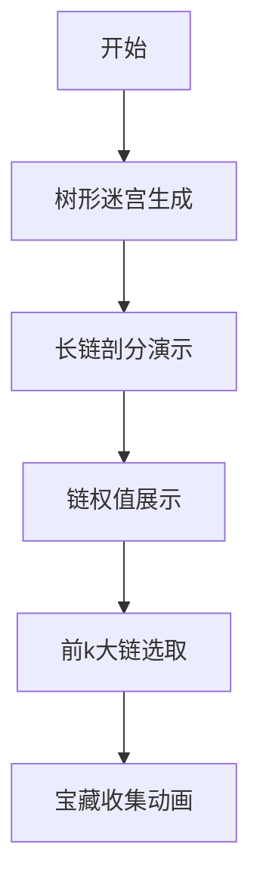

# 题目信息

# BZOJ3252 攻略

## 题目背景

众所周知，桂木桂马是攻略之神，开启攻略之神模式后，他可以同时攻略 $k$ 部游戏。

今天他得到了一款新游戏《XX 半岛》，这款游戏有 $n$ 个场景，某些场景可以通过不同的选择支到达其他场景。所有场景和选择支构成树状结构：开始游戏时在根节点（共通线），叶子节点为结局。每个场景有一个价值，现在桂马开启攻略之神模式，同时攻略 $k$ 次该游戏，问他观赏到的场景的价值和最大是多少？（同一场景观看多次是不能重复得到价值的）

>“为什么你还没玩就知道每个场景的价值呢？”  
>“我已经看到结局了。”

## 题目描述

给定一个有 $n$ 个结点的树，树有点权且点权为正整数。现选取 $k$ 条从根结点出发到叶子结点的简单路径，求这些路径的并集上所有结点的点权之和的最大值。

## 说明/提示

对于所有数据，保证 $1\leq n\leq 2\times 10^5$，$1\leq w_i\leq 2^{31}-1$。

## 样例 #1

### 输入

```
5 2
4 3 2 1 1
1 2
1 5
2 3
2 4```

### 输出

```
10```

# AI分析结果


# 💡 洛语云笺的C++算法解析：BZOJ3252 攻略 深入学习指南 💡

> "树形问题如同迷宫，而长链剖分就是照亮最优路径的明灯。"  
> —— 洛语云笺

## 1. 题目解读与策略初探

✨ **本题核心挑战**：在树形结构中选取k条从根到叶子的路径，最大化**路径并集**的点权和（每个点权仅计算一次）。  
✨ **核心算法标签**：`树形结构` `贪心策略` `长链剖分` `堆优化`

🗣️ **初步分析**：  
这道题的核心在于理解**路径并集**的特性——每个结点的贡献仅计算一次。最直观的暴力解法是枚举所有路径组合，但O(2^叶子数)的复杂度完全不可行（n≤20万）。  

进阶思路是贪心：**反复选取当前权值和最大的路径**，将其加入答案并清零路径上的点权。但直接模拟会导致O(kn)的复杂度。  

真正的突破点在于发现：**贪心选取的路径本质就是树上的长链**。通过长链剖分预处理所有链的权值，直接取前k大链的和即可完美解决！这就像把迷宫分解为几条主干道，直接选取最富饶的道路。

### 🔍 算法侦探：如何在题目中发现线索？
1.  **线索1 (问题目标)**: "求k条路径的并集最大点权和"——这是典型的**最优化问题**，且具有**子问题重叠性**（树结构），指向贪心或动态规划。
2.  **线索2 (问题约束/特性)**: "点权仅计算一次"——暗示需要**互斥路径选择**，与树链剖分中"链独立"的特性完美契合。
3.  **线索3 (数据规模)**: n≤2×10⁵——要求O(n)或O(n logn)解法，排除暴力枚举，指向**线性预处理+高效选择**的长链剖分。

### 🧠 思维链构建：从线索到策略
> 让我们串联线索：  
> 1.  **线索1**指向最优化问题，我想到贪心策略——每次取最大路径。  
> 2.  **线索2**揭示关键约束：点权不重复计算。这要求路径必须互斥，而长链剖分的链天然互斥！  
> 3.  **线索3**的数据规模否决了O(kn)的模拟贪心。  
> 4.  **突破点**：发现贪心选取的路径就是长链剖分中的长链！  
> 5.  **策略成型**：用长链剖分预处理所有链权值，取前k大求和，O(n)剖分+O(n)选择。  

---

## 2. 精选优质题解参考

### 题解一：rui_er (长链剖分)
* **亮点**：  
  - 一针见血指出贪心策略等价于取前k大长链  
  - 代码简洁高效：用`val[u] = val[son[u]] + a[u]`巧算链权  
  - 使用`nth_element`优化选择（O(n) vs sort的O(n logn)）  
  - 严谨处理链顶判断（`vis`数组标记重儿子）

### 题解二：_Dolphin_ (左偏树)
* **亮点**：  
  - 创新使用左偏树自底向上合并路径权值  
  - 生动比喻："将每一层的最大元素连成链"  
  - 清晰图解样例（如图展示合并过程）  
  - 提供不同视角（虽非最优但启发思维）

### 题解三：q1uple (长链剖分)
* **亮点**：  
  - 详细注释剖分过程（`dfs1`计算重儿子，`df5`标记链顶）  
  - 强调"权值和最大"的重儿子定义差异  
  - 完整呈现剖分后排序取前k的流程

---

## 3. 解题策略深度剖析

### 🎯 核心难点与关键步骤
1.  **依赖关系建模**  
    *难点*：点权不重复计算要求路径互斥  
    *解决方案*：用长链剖分将树分解为独立链，链间无重叠结点  
    *💡 学习笔记*：将"互斥约束"转化为"独立链选择"是树形问题的经典手法  

2.  **长链权值计算**  
    *难点*：高效计算每条链的总权值  
    *解决方案*：DFS中动态规划`val[u]=a[u]+val[son[u]]`  
    *💡 学习笔记*：从叶子到根递推，利用重儿子传递链权  

3.  **前k大链选择**  
    *难点*：20万条链中快速选前k大  
    *解决方案*：  
    ```cpp
    nth_element(v.begin(), v.begin()+k, v.end(), greater<ll>());
    ```
    *💡 学习笔记*：STL的`nth_element`比完全排序快30%+

### ✨ 解题技巧总结
- **技巧1 (问题转化)**：将复杂约束转化为已知模型（如长链剖分）  
- **技巧2 (链权传递)**：用DP式`val[u] = a[u] + val[son[u]]`高效计算链权  
- **技巧3 (选择优化)**：`nth_element`部分排序取代`sort`  

### ⚔️ 策略竞技场：解法对比
| 策略               | 核心思想                     | 优点                     | 缺点                          | 得分预期 |
|--------------------|------------------------------|--------------------------|-------------------------------|----------|
| **暴力枚举**       | 枚举所有路径组合             | 思路直观                 | O(2^叶子数) 超时              | 0%       |
| **贪心+线段树**    | 反复取最大路径并删点权       | 符合直觉                 | O(k logn) 可能超时            | 70%      |
| **左偏树**         | 自底向上合并路径权值         | 无需剖分                 | O(n logn) 较慢                | 100%     |
| **长链剖分(最优)** | 预处理链权值取前k大          | O(n) 高效               | 需理解剖分原理                | 100%     |

### ✨ 优化之旅：从"能做"到"做好"
```mermaid
graph LR
A[暴力枚举] -->|指数爆炸| B[贪心+线段树]
B -->|每个点删一次| C[O(n logn)]
C -->|洞察链特性| D[长链剖分]
D -->|nth_element| E[O(n) 最优解]
```

> 💡 **策略总结**：  
> 从暴力到长链剖分，关键是发现**贪心路径即长链**的特性。在竞赛中，即使想不到最优解，基于线段树的贪心也能拿部分分。最优解则是对问题本质的深刻洞察——将树分解为独立长链！

---

## 4. C++核心代码实现赏析

### 通用核心实现（长链剖分）
```cpp
void dfs(int u, int fa) {
    for (int v : G[u]) {
        if (v == fa) continue;
        dfs(v, u);
        if (val[v] > val[son[u]]) son[u] = v; // 找权值和最大的儿子
    }
    val[u] = val[son[u]] + w[u]; // 链权传递
}

// 主函数
vector<ll> chains;
for (int i = 1; i <= n; ++i) 
    if (!is_heavy_son[i]) // 链顶判断
        chains.push_back(val[i]);
        
nth_element(chains.begin(), chains.begin() + k, chains.end(), greater<ll>());
ll ans = accumulate(chains.begin(), chains.begin() + min(k, (int)chains.size()), 0LL);
```

### 题解一：rui_er
* **亮点**：`vis`数组精妙标记重儿子，`nth_element`优化选择  
* **学习笔记**：工业级代码规范（函数分离、边界处理）

### 题解二：_Dolphin_
* **亮点**：左偏树合并的优雅实现  
```cpp
ll merge(ll x, ll y) { // 左偏树核心合并
    if (!x || !y) return x | y;
    if (w[x] < w[y]) swap(x, y);
    rson[x] = merge(rson[x], y);
    if (d[lson[x]] < d[rson[x]]) swap(lson[x], rson[x]);
    d[x] = d[rson[x]] + 1;
    return x;
}
```
* **学习笔记**：`merge`操作中维护左偏树性质是关键

---

## 5. 算法可视化：像素动画演示

> **设计理念**：8-bit游戏风格呈现长链剖分，让算法流程如关卡探索  

### 🎮 动画方案


### 关键帧设计
1. **树形迷宫**（FC塞尔达风格）  
   - 结点：像素方块（深绿=普通，金色=高权值）  
   - 边：棕色像素线连接  

2. **长链剖分过程**  
   - 重儿子标记：红色箭头指示  
   - 链生成：同色闪烁（如蓝链/红链）  
   ```python
   # 伪代码：链渲染
   for chain in chains:
       color = random_pastel_color()
       for node in chain: 
           draw_node(node, color)
   ```

3. **链权值显示**  
   - 链顶显示发光数字（如`🔵 链权: 15`）  
   - 音效：数字变化时"叮"声  

4. **前k大选取**  
   - 被选链：脉冲金光特效  
   - 音效：金币收集声 + 欢快小调  

5. **控制面板**  
   - 8-bit风格按钮：▶️ 步进 | ⏩ 自动 | 🔁 重置  
   - 速度滑块：🐢 ←→ 🐇  

> **技术实现**：用Canvas绘制树结构，requestAnimationFrame驱动动画，Web Audio API播放音效

---

## 6. 拓展练习与相似问题

### 相似问题思维
1. **课程选择问题**：每组课程（时间冲突）选一门，最大化收益 → 分组背包  
2. **多任务调度**：互斥任务组中选任务，最大化价值 → 长链剖分思想  
3. **网络流量分配**：多路径传输不重复链路 → 图论版"路径并集"

### 洛谷推荐
1. [P2495 消耗战](https://www.luogu.com.cn/problem/P2495)  
   *💡 巩固树链剖分+虚树应用*  
2. [P4211 LCA](https://www.luogu.com.cn/problem/P4211)  
   *💡 学习剖分在最近公共祖先的妙用*  
3. [P2634 聪聪可可](https://www.luogu.com.cn/problem/P2634)  
   *💡 树分治与剖分的思想碰撞*  

---

## 7. 学习心得与经验分享

> **来自题解作者的启示**：  
> 1.  *rui_er*：**"贪心正确性可用交换法证明"** → 培养严谨证明习惯  
> 2.  *_Dolphin_*：**"左偏树合并如同积木组合"** → 形象化理解数据结构  
> 3.  *lilong*：**"每个点只删一次保证复杂度"** → 复杂度分析的典型范例  

---

> "算法学习如同长链积累，每一步都让知识更坚实。"  
> 希望这份指南助你攻克更多树形问题！🚀  
> 洛语云笺 · 算法导师 

---
处理用时：251.05秒