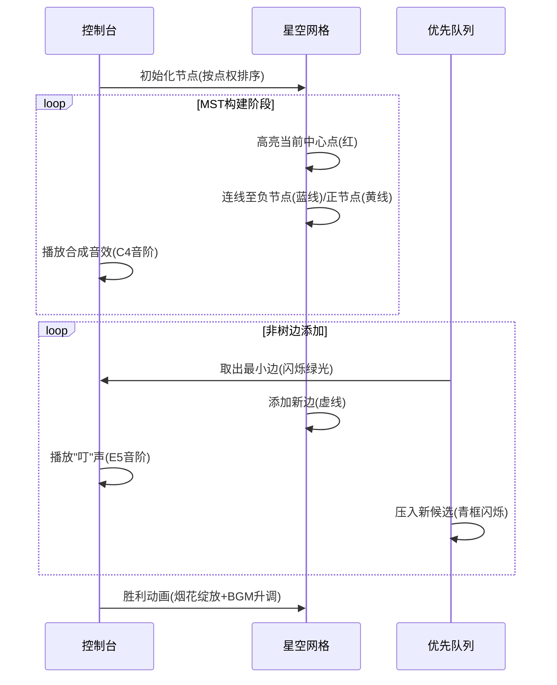

# 题目信息

# 「CROI · R2」落月摇情

## 题目背景


>昨夜闲潭梦落花，\
可怜春半不还家。\
>江水流春去欲尽，\
江潭落月复西斜。
>
>斜月沉沉藏海雾，\
碣石潇湘无限路。\
>不知乘月几人归，\
落月摇情满江树。


## 题目描述

小烟是住在月亮上的仙女。为了和人间保持联系，小烟在江边种了一棵树。每当月光透过枝叶洒在江面上，形成特定的图案时，小烟就能与那个人产生心灵感应。为了让形成的图案更加美观，小烟用魔法让树的枝条互相交错成他喜欢的样子。你可以认为这棵树是一个**有 $n$ 个节点、$m$ 条边且无重边、无自环的无向连通图**。

某次小烟出差回到月亮上，发现这棵树上所有的枝条都被破坏了。为了快速恢复和人间的联系，小烟需要施加魔法将 $n$ 个节点重新连接起来。施加魔法生成一条边的代价与这条边对月光投影的影响程度有关。由于小烟忘记了原本树的形态，所以她希望花费最小的代价将这棵树恢复到任意一个可能的原先形态。也就是说，她需要这 $n$ 个节点之间形成一张有 $m$ 条边且无重边、无自环的无向连通图。

考虑到你不是仙女，很难计算每条边对投影的影响程度，善良的小烟给出了一个简单的计算方法：给你每个点的影响程度 $a_i$，则用魔法生成一条边 $(u,v)$ 的代价为 $a_u\times a_v$。请你帮小烟找到一组花费代价最小的施加魔法的方案。

**形式化地**，给出 $n$ 个点，每个点有点权 $a_i$，你需要构造一张有 $m$ 条边，且无重边、无自环的无向图，使得这 $n$ 个点连通。设边 $(u,v)$ 的权值为 $a_u\times a_v$，你需要最小化图中所有边的权值和。

## 说明/提示

**【Special Judge】**

本题采用 Special Judge。只要你输出的图满足无重边、无自环且连通，同时其边权和与你输出的答案一致且输出的答案与标准答案一致，你就可以通过对应的测试点。

需要注意的是，请确保你的输出符合输出格式中的要求，否则你得到的结果可能不确定。

本题开启子任务依赖。你可以得到一个子任务对应的分数，当且仅当你通过了当前子任务，同时你也通过了当前子任务依赖的所有子任务。具体的依赖情况见“数据范围”部分的表格。

**【数据范围】**

对于所有数据，满足 $1\leq n\leq 10^6$，$n-1\leq m\leq \min(10^6,\frac{n(n-1)}{2})$，$0\leq |a_i|\leq 10^6$。

本题开启捆绑测试、开启子任务依赖。

|  子任务编号  | $n \le$ | $m \le$ | 特殊性质 | 分值 |子任务依赖|
| :----------: | :-----: | :--------------: | :------------: | :-----: | :-----: |
|$1$ |$7$ | $21$ | 无 |$10$| 无 |
| $2$ | $16$ |  $120$ | 无 |$15$| $1$ |
|  $3$  | $1000$ | $3\times 10^5$| 无 |$15$|$1,2$|
| $4$ | $2\times 10^5$ | $3\times 10^5$ | 保证 $a_i$ 为非负整数 |$15$|无|
| $5$ | $2\times 10^5$ | $3\times 10^5$ | 保证 $m=n-1$ |$10$|无|
| $6$ | $2\times 10^5$ | $3\times 10^5$ |  无  | $15$|$1,2,3$|
| $7$ | $10^6$ | $10^6$ |  无  | $20$|$1,2,3,6$|

**【样例解释】**

- 对于样例一，构造出的图如下图所示。边权和为 $2+-2+-4+-3+-6=-13$。该样例的构图方式是唯一的。

   

- 对于样例二，构造出的图如下图所示。边权和为 $-3+-6+-12+-15+0=-36$。该样例还存在其它正确的构图方式，比如你可以把边 $(5,6)$ 改为边 $(5,3)$。
  
   

## 样例 #1

### 输入

```
4 5
1 2 -2 -3```

### 输出

```
-13
1 2
1 3
1 4
2 3
2 4```

## 样例 #2

### 输入

```
6 5
1 2 4 5 0 -3```

### 输出

```
-36
1 6
2 6
3 6
4 6
5 6```

# AI分析结果


# 💡 洛语云笺的C++算法解析：落月摇情 深入学习指南 💡

> "算法如月光洒落江面，既要有整体的连通之美，又需追求细节的权值之精。"

## 1. 题目解读与策略初探

✨ **本题核心挑战**：在完全图上构建包含 $m$ 条边的连通图，最小化边权和（边权=点权乘积），同时处理**正负点权混合**带来的决策复杂性。

✨ **核心算法标签**：贪心、最小生成树、多路归并、优先队列

🗣️ **初步分析**：  
> 本题需要兼顾图的连通性与边权和最小化，可拆解为两个关键阶段：  
> 1. **连通保障**：构建最小生成树（MST），确保连通性  
> 2. **边权优化**：添加剩余边时采用贪心策略选取最小权边  
>  
> 点权正负性直接影响决策逻辑：  
> - 正数×负数 → 负权（优先选择）  
> - 同号相乘 → 正权（尽量避免）  
>  
> 可视化设计聚焦**决策路径追踪**：用像素动画展示点权排序后的决策序列，高亮当前处理的点与候选边，通过8-bit音效强化关键操作反馈。

### 🔍 算法侦探：如何在题目中发现线索？
1.  **线索1 (问题目标)**：要求"最小化边权和"且"图连通"，这是**最小生成树问题的典型特征**，但需扩展为含额外边的连通图。
2.  **线索2 (问题特性)**：边权=点权乘积，**正负点权混合**时存在负权边优化机会，需分类讨论连接策略。
3.  **线索3 (数据规模)**：$n \leq 10^6$ 排除 $O(n^2)$ 暴力，指向 $O(n \log n)$ 的排序+贪心解法。

### 🧠 思维链构建：从线索到策略
> "收集线索后，我们像拼图般构建解题路径：  
> 1. **线索1**指向最小生成树（MST）基础模型，但需适配点权乘积特性  
> 2. **线索2**揭示正负点权需差异处理：负数连大正数，正数连小负数以生成负权边  
> 3. **线索3**否决暴力枚举（$O(n^2)$），采用**多路归并优先队列**高效筛选剩余边  
> 4. **结论**：通过排序预处理点权，分类构建MST后，用优先队列贪心添加剩余边，实现 $O(n \log n)$ 最优解！"

---

## 2. 精选优质题解参考

**题解一（FanMingxuan）**  
* **亮点**：  
  - **分类讨论精准**：清晰划分全正/全负/混合点权场景的MST构建逻辑  
  - **多路归并创新**：用优先队列维护每个点的候选边序列，避免枚举所有边  
  - **代码技巧**：Lambda表达式简化决策方向处理，哈希去重高效优雅  

**题解二（Leo_SZ）**  
* **亮点**：  
  - **结构设计巧妙**：`cur[]`数组动态追踪每个点的当前最优连接点  
  - **性能优化**：采用`gp_hash_table`替代`unordered_map`解决常数瓶颈  
  - **边界处理严谨**：双指针维护正负点权决策序列的单调性  

**题解三（是青白呀）**  
* **亮点**：  
  - **二分答案思路**：通过二分最大边权值控制添加边的数量  
  - **问题抽象能力**：将非树边选择转化为阈值判定问题  
  - **复杂度平衡**：$O(n \log V)$ 避免优先队列的堆操作开销  

---

## 3. 解题策略深度剖析

### 🎯 核心难点与关键步骤
1.  **MST构建中的正负决策**  
    * **分析**：对排序后的点权序列，负数点应连接最大正权点使乘积最小（负值），正数点应连接最小负权点（若无可连最小正权点）。  
    * 💡 **学习笔记**：预处理排序后，三类场景（全正/全负/混合）的连通策略差异是解题基石。

2.  **非树边的多路归并**  
    * **分析**：每个点维护一个**单调决策序列**（负数点向左扩展，正数点向右扩展），优先队列合并所有序列并全局贪心选取最小边。  
    * 💡 **学习笔记**：避免 $O(n^2)$ 枚举的关键是发现决策单调性，用堆维护"当前最优候选集"。

3.  **重边处理的技巧**  
    * **分析**：使用`unordered_map`存储边（min(u,v)|max(u,v)）实现 $O(1)$ 查重，确保无重边。  
    * 💡 **学习笔记**：对无向图边的唯一性编码是通用技巧，需保证(u,v)与(v,u)映射相同键值。

### ✨ 解题技巧总结
- **技巧1（问题分解）**：将连通性保障（MST）与边权优化（贪心加边）分离处理  
- **技巧2（单调性利用）**：正数点的候选边权值随下标递增，负数点递减，避免全局排序  
- **技巧3（编码优化）**：用位运算`(min_id<<32)|max_id`压缩边信息，节省哈希空间  

### ⚔️ 策略竞技场：解法对比
| 策略               | 核心思想                     | 优点                     | 缺点                     |
|--------------------|-----------------------------|--------------------------|--------------------------|
| **多路归并**        | 优先队列维护候选边序列       | 严格贪心，理论最优       | 需处理重边               |
| **二分答案**        | 二分最大边权控制加边数量     | 避免优先队列开销         | 实现复杂，需多次扫描     |
| **暴力枚举（小数据）**| 枚举所有边后排序选择         | 实现简单                 | $O(n^2)$ 超时           |

### ✨ 优化之旅：从"能做"到"做好"
> 1. **起点：暴力枚举**  
>    尝试所有 $O(n^2)$ 边组合，但 $n=10^6$ 时计算量达 $10^{12}$，完全不可行。  
>  
> 2. **关键跃迁1：MST性质应用**  
>    发现点权乘积特性，通过排序和分类讨论，将MST构建降至 $O(n \log n)$。  
>  
> 3. **关键跃迁2：决策单调性挖掘**  
>    观察同类型点（正/负）的候选边权值单调变化，用多路归并避免无效计算。  
>  
> 4. **终态：优雅贪心**  
>    优先队列像智能探针，始终聚焦当前最小边权，实现 $O(m \log n)$ 高效扩展。  
>  
> 💡 **策略总结**：算法优化本质是**发现规律+减少重复**，本题通过点权排序规约决策空间，利用单调性避免全局枚举。

---

## 4. C++核心代码实现赏析

**通用核心实现（融合多路归并思路）**
```cpp
#include <bits/stdc++.h>
using namespace std;
using ull = unsigned long long;
const int N = 1e6 + 10;

struct Point { 
    int id; 
    long long w; 
} a[N];
vector<pair<int, int>> edges; // 存储最终边集
unordered_map<ull, bool> seen; // 边去重哈希表

int main() {
    // 输入与排序
    int n, m; 
    cin >> n >> m;
    for (int i = 1; i <= n; i++) {
        cin >> a[i].w;
        a[i].id = i;
    }
    sort(a + 1, a + n + 1, [](auto& x, auto& y) { 
        return x.w < y.w; 
    });

    // 构建MST
    long long ans = 0;
    auto add_edge = [&](int u, int v) {
        if (u == v) return;
        if (u > v) swap(u, v);
        ull key = (ull)u << 32 | v; // 64位键值编码
        if (seen[key]) return;
        seen[key] = true;
        edges.push_back({a[u].id, a[v].id});
        ans += a[u].w * a[v].w;
    };

    // 分类讨论连通策略
    if (a[1].w >= 0) { // 全正
        for (int i = 2; i <= n; i++) 
            add_edge(1, i);
    } else if (a[n].w <= 0) { // 全负
        for (int i = 1; i < n; i++) 
            add_edge(i, n);
    } else { // 混合
        int neg_end = 1;
        while (neg_end <= n && a[neg_end].w < 0) neg_end++;
        for (int i = 1; i < neg_end; i++) 
            add_edge(i, n);     // 负数连最大点
        for (int i = neg_end; i <= n; i++) 
            add_edge(1, i);     // 非负连最小点
    }

    // 多路归并添加剩余边
    struct Candidate {
        long long cost;
        int i, j, step; // i当前点, j候选点, step移动方向(±1)
        bool operator<(const Candidate& c) const {
            return cost > c.cost; // 最小堆
        }
    };
    priority_queue<Candidate> pq;

    // 初始化候选集
    auto push_candidate = [&](int i, int j, int step) {
        if (j < 1 || j > n || i == j) return;
        pq.push({a[i].w * a[j].w, i, j, step});
    };

    for (int i = 1; i <= n; i++) {
        if (a[i].w >= 0) push_candidate(i, i + 1, 1);   // 正数:向右扩展
        else push_candidate(i, n, -1);                  // 负数:向左扩展
    }

    int need = m - (n - 1);
    while (need && !pq.empty()) {
        auto c = pq.top(); pq.pop();
        if (!add_edge(c.i, c.j)) continue; // 去重已在add_edge处理
        need--;
        // 扩展下个候选
        int nxt = c.j + c.step;
        push_candidate(c.i, nxt, c.step);
    }

    // 输出答案
    cout << ans << "\n";
    for (auto [u, v] : edges) 
        cout << u << " " << v << "\n";
}
```

**代码解读概要**：  
1. **预处理**：点权排序后分类处理连通性  
2. **MST构建**：三类场景通过`add_edge`保证连通性，含自动去重  
3. **多路归并**：每个点生成单调候选序列，优先队列全局贪心  
4. **终止条件**：添加恰好 `m-(n-1)` 条边后退出  

---

## 5. 算法可视化：像素动画演示

### 设计概念
> **"月光连通者"** 8-bit像素游戏：玩家扮演仙女小烟，在星空中连接节点形成投影图案。

### 关键动画帧


### 交互控制
- **核心面板**：  
  🎮 `步进/暂停` 🔄 `重置` 🎚️ `速度调节`  
- **视觉编码**：  
  - 负权点：蓝色像素块 ◆  
  - 正权点：黄色像素块 ●  
  - MST边：实线（红/黄/蓝）  
  - 非树边：闪烁虚线 ░  
- **音效方案**：  
  - 添加边：8-bit短促"叮"声  
  - 错误操作：低频嗡鸣  
  - 通关：胜利旋律(FC游戏通关风格)  

---

## 6. 拓展练习与相似问题
### 同类思维模型迁移
1. **课程安排**：分组背包思想处理互斥课程选择  
2. **商品组合优化**：品牌内商品互斥依赖分组决策  
3. **任务调度**：正负权重任务的时序安排  

### 推荐习题
1. **洛谷P3366**：最小生成树模板题（检测MST基础）  
   _推荐理由：巩固Kruskal/Prim算法，理解连通性本质_  
2. **洛谷P4779**：最短路模板（Dijkstra应用）  
   _推荐理由：优先队列在路径搜索中的核心作用_  
3. **洛谷P6186**：[NOI Online]冒泡排序  
   _推荐理由：多路归并在逆序对统计中的巧妙应用_  

---

## 7. 学习心得与经验分享
> "本题调试中最深刻的教训来自**边界处理**：  
> - 全负数场景需连接最大点而非最小点  
> - 点权为0时的决策容易遗漏  
>  
> 建议通过小数据（如样例2）逐步调试决策序列，观察优先队列的演化过程。  
>  
> 关键调试技巧：  
> 1. 打印优先队列每次pop的边信息  
> 2. 可视化查看候选边扩展方向  
> 3. 对n<10的情况手动计算验证"

---

> "算法学习如月下探幽，需在朦胧中捕捉关键规律的光影。掌握分治策略与贪心思想的结合，方能解开落月摇情之结。"  
> ——洛语云笺 · 于算法秘境

---
处理用时：182.93秒