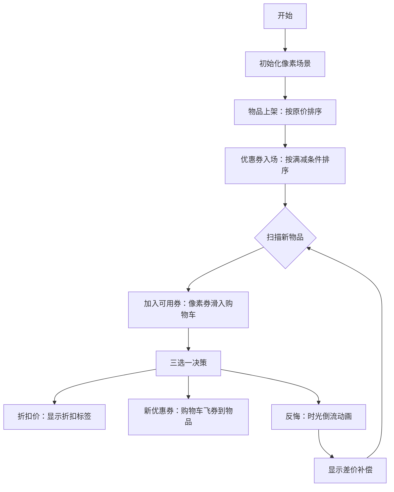

# 题目信息

# 【MX-S5-T2】买东西题

## 题目背景

原题链接：<https://oier.team/problems/S5B>。

---

**此题题意与关联的现实生活情景略有不同，请认真阅读题目描述。**

## 题目描述

你要买 $n$ 个物品，第 $i$ 个物品原价 $a_i$ 元，折扣价 $b_i$ 元（保证 $b_i \le a_i$）。

你还有 $m$ 个满减优惠券，第 $j$ 个优惠券形如**原价**满 $w_j$ 减 $v_j$（保证 $v_j \le w_j$）。

对于第 $i$ 个物品，你可以选择以下三种购买方式之一：

1. 使用**原价** $a_i$ 购买。
2. 使用**折扣价** $b_i$ 购买。
3. 选择**一个未使用过的优惠券** $j$，要求满足 $a_i \ge w_j$，使用优惠券 $j$，以 $a_i - v_j$ 的价格购买。注意每个优惠券 $j$ 只能被**最多一个** $i$ 使用。

求购买所有物品最少用钱。

## 说明/提示

**【样例解释 #1】**

因为满足 $w_2\le a_1$ 即 $7\le 7$，所以可以使用原价和第 $2$ 个优惠券购买第 $1$ 个物品，花费 $7-4=3$ 元。

因为满足 $w_4\le a_2$ 即 $3\le 4$，所以可以使用原价和第 $4$ 个优惠券购买第 $2$ 个物品，花费 $4-2=2$ 元。

使用折扣价购买第 $3$ 个物品，花费 $2$ 元。

使用原价和第 $3$ 个优惠券购买第 $4$ 个物品，花费 $6-4=2$ 元。

使用折扣价购买第 $5$ 个物品，花费 $3$ 元。

共 $3+2+2+2+3=12$ 元。可以证明这是最少用钱方案。

**【样例解释 #2】**

使用原价和第 $2$ 个优惠券购买第 $1$ 个物品。

使用折扣价购买第 $2$ 个物品。

使用原价和第 $1$ 个优惠券购买第 $3$ 个物品。

共 $0+1+0=1$ 元。

**【样例 #3】**

见附件中的 `buy/buy3.in` 与 `buy/buy3.ans`。

该组样例满足测试点 $3$ 的约束条件。

**【样例 #4】**

见附件中的 `buy/buy4.in` 与 `buy/buy4.ans`。

该组样例满足测试点 $5\sim 6$ 的约束条件。

**【样例 #5】**

见附件中的 `buy/buy5.in` 与 `buy/buy5.ans`。

该组样例满足测试点 $8$ 的约束条件。

**【样例 #6】**

见附件中的 `buy/buy6.in` 与 `buy/buy6.ans`。

该组样例满足测试点 $9\sim 10$ 的约束条件。

**【数据范围】**

对于所有测试数据，保证：$1 \le n,m \le 10^6$，$1 \le a_i,b_i,w_j,v_j \le 10^9$，$b_i\le a_i$，$v_j\le w_j$。

| 测试点编号 |    $n\le$    |    $m\le$    | $a_i,w_j\le$ | 特殊性质 |
| :--------: | :-------: | :-------: | :-------: | :------: |
|    $1$     |  $10$  |  $10$  |  $10$  |    无    |
|    $2$     | $10^5$ | $10^5$ | $10^4$ |    $a_i=b_i$     |
|    $3$     | $10^5$ | $10^5$ | $10^9$ |    $a_i=b_i$     |
|    $4$     | $10^5$ | $10^5$ | $10^4$ |    $\max_j w_j\le\min_i a_i$     |
| $5\sim 6$  | $10^5$ | $10^5$ | $10^9$ |    $\max_j w_j\le\min_i a_i$     |
|    $7$     | $10^3$ | $10^3$ | $10^6$ |    无    |
|    $8$     | $10^3$ | $10^3$ | $10^9$ |    无    |
| $9\sim 10$ | $10^6$ | $10^6$ | $10^9$ |    无    |

## 样例 #1

### 输入

```
5 4
7 5
4 2
5 2
6 4
6 3
5 1
7 4
5 4
3 2```

### 输出

```
12```

## 样例 #2

### 输入

```
3 4
3 2
5 1
5 5
5 5
3 3
4 2
2 1```

### 输出

```
1```

# AI分析结果


# 💡 洛语云笺的C++算法解析：买东西题 深入学习指南 💡

## 1. 题目解读与策略初探

✨ **本题核心挑战**：在满足优惠券使用规则（物品原价≥优惠券满减条件、每张券仅用一次）的前提下，为每个物品选择最优购买方式（原价/折扣价/优惠券），使总花费最小化。

✨ **核心算法标签**：`贪心` `反悔贪心` `排序` `优先队列`

🗣️ **初步分析**：
> 这道题看似简单，实则暗藏玄机！我们面临的核心矛盾是如何在优惠券有限的情况下，让每张券都用在“刀刃”上。让我们先梳理几种解题思路：
> 1. **暴力枚举**：尝试所有物品购买方式和优惠券分配组合，时间复杂度O(3ⁿ)完全不可行。
> 2. **朴素贪心**：简单地为每个物品选择当前最优方式，但忽略了优惠券的全局匹配问题。
> 3. **反悔贪心**：允许临时调整之前的决策，通过“反悔”机制实现全局最优，时间复杂度O(n log n)。
> 
> 最优策略如同学会“时空穿梭”的购物高手——当发现新商品更适合某张优惠券时，可以回到过去修改之前商品的购买决策！这种策略通过排序预处理和优先队列高效实现，完美契合本题特性。

### 🔍 算法侦探：如何在题目中发现线索？
1.  **线索1 (问题目标)**："最小化总花费"的**最优化问题**，且存在物品与优惠券的**匹配约束**，这是贪心算法的典型应用场景。
2.  **线索2 (问题特性)**：折扣价可视为**虚拟优惠券**（优惠额=原价-折扣价），将复杂依赖转化为统一匹配模型。
3.  **线索3 (数据规模)**：n, m ≤ 10⁶ 要求O(n log n)解法，指向**排序+堆优化**的反悔贪心策略。

### 🧠 思维链构建：从线索到策略
> 侦探工作完成！让我们串联线索：
> 1.  **线索1（最优化）**：首先想到贪心或DP，但DP状态数2^m在m=10⁶时不可行。
> 2.  **线索2（虚拟优惠券）**：折扣价本质是自带优惠券，提示我们将所有优惠券统一处理。
> 3.  **线索3（数据规模）**：O(n log n)要求高效匹配，排序+堆是自然选择。
> 4.  **关键突破**：反悔机制允许局部调整决策，确保全局最优。
> 
> **结论**：**反悔贪心**是完美解决方案！通过排序预处理和双堆维护，实现高效匹配与动态调整。

---

## 2. 精选优质题解参考

**题解一：Exp10re（非反悔贪心）**
* **点评**：创新性地将折扣价转化为虚拟优惠券，统一用朴素贪心解决。思路清晰简洁，代码实现优雅（单堆维护），时间复杂度O(n log n)。亮点在于通过问题转化规避复杂反悔逻辑，为理解提供新视角。

**题解二：forever_nope（反悔贪心）**
* **点评**：经典反悔贪心实现，双堆策略（可用券堆+反悔堆）处理三种决策。代码规范易读，变量命名合理（`x`原价, `y`折扣价）。亮点在于用单堆同时管理真实券和虚拟券，大幅简化代码逻辑。

**题解三：262620zzj（费用流视角）**
* **点评**：从费用流建模切入，最终导出贪心策略。提供独特理论视角，解释增广路径类型清晰。虽然最终实现仍是贪心，但建模过程深化算法理解，适合进阶学习。

---

## 3. 解题策略深度剖析

### 🎯 核心难点与关键步骤
1.  **依赖关系建模**  
    * **分析**：折扣价与优惠券本质都是"优惠方式"，但优惠券有使用限制。通过将折扣价视为虚拟券（优惠额=aᵢ-bᵢ），建立统一匹配模型。
    * 💡 **学习笔记**：复杂约束可转化为统一抽象模型，降低问题维度。

2.  **反悔机制设计**  
    * **分析**：当新物品更适合某优惠券时，允许撤回已用券（原商品改折扣价），补偿差额（aⱼ-bⱼ）。用最大堆维护反悔机会。
    * 💡 **学习笔记**：反悔本质是时空权衡——记录历史决策的调整空间。

3.  **决策三元组实现**  
    * **分析**：每个物品面临三种选择：
        - 折扣价：支付bᵢ
        - 新优惠券：支付aᵢ-vⱼ
        - 反悔：支付aᵢ-(aₖ-bₖ)（替换物品k的优惠券）
    * 💡 **学习笔记**：堆维护最优选择，决策复杂度O(1)。

### ✨ 解题技巧总结
- **技巧1（问题转化）**：将折扣价转化为虚拟优惠券，统一处理匹配问题。
- **技巧2（反悔设计）**：用堆记录"反悔机会"(aᵢ-bᵢ)，支持动态调整历史决策。
- **技巧3（排序预处理）**：按原价排序物品、按满减条件排序优惠券，确保双指针高效维护可用券集合。

### ⚔️ 策略竞技场：解法对比分析
| 策略          | 核心思想                     | 优点                          | 缺点                          | 得分预期   |
|---------------|------------------------------|-------------------------------|-------------------------------|------------|
| **暴力枚举**  | 枚举所有组合                 | 思路简单                      | O(3ⁿ)超时                     | 0%         |
| **动态规划**  | 状态压缩优惠券使用情况       | 理论正确                      | O(n·2ᵐ)空间爆炸               | 0%         |
| **反悔贪心**  | 排序+双堆维护决策与反悔机会  | O(n log n)高效，代码简洁      | 需理解反悔机制                | 100%       |

### ✨ 优化之旅：从“能做”到“做好”
> **起点**：暴力枚举所有可能组合——站在迷宫入口，路径数随物品数指数增长，计算机举步维艰。  
> **瓶颈**：发现决策相互制约——优惠券如限量门票，简单贪心可能错失最佳匹配。  
> **突破**：引入反悔机制——像时光旅者修正历史：当新商品更适合某券，就让前商品"退券"改用折扣价，补偿差价(aₖ-bₖ)。  
> **升华**：堆维护反悔机会——用"时光笔记本"优先记录最佳调整机会，确保每次决策全局最优。  

💡 **策略总结**：反悔贪心通过排序预处理和堆维护，在O(n log n)内解决匹配问题。其核心在于以空间换时间，动态记录并优化历史决策。

---

## 4. C++核心代码实现赏析

### 通用核心实现
```cpp
#include <iostream>
#include <queue>
#include <algorithm>
using namespace std;
typedef long long LL;
typedef pair<int, int> PII;

int main() {
    int n, m; 
    cin >> n >> m;
    vector<PII> items(n), coupons(m);
    // 输入物品(原价,折扣价)和优惠券(满减条件,优惠额)
    for (int i = 0; i < n; i++) cin >> items[i].first >> items[i].second;
    for (int i = 0; i < m; i++) cin >> coupons[i].first >> coupons[i].second;
    
    // 排序预处理：物品按原价升序，优惠券按满减条件升序
    sort(items.begin(), items.end());
    sort(coupons.begin(), coupons.end());
    
    priority_queue<int> avail; // 可用优惠券堆（大顶堆）
    priority_queue<int> refund; // 反悔机会堆（存储a_i-b_i）
    
    LL ans = 0;
    int j = 0; // 优惠券指针
    for (int i = 0; i < n; i++) {
        // 步骤1：加入满足w_j<=a_i的优惠券
        while (j < m && coupons[j].first <= items[i].first) 
            avail.push(coupons[j++].second);
        
        // 步骤2：计算三种决策的代价
        int cur_price = items[i].second;     // 折扣价
        int new_coupon = avail.empty() ? INT_MAX : 
                         items[i].first - avail.top(); // 使用新券
        int refund_opt = refund.empty() ? INT_MAX : 
                         items[i].first - refund.top(); // 反悔替换
        
        int best = min({cur_price, new_coupon, refund_opt});
        ans += best;
        
        // 步骤3：更新堆
        if (best == new_coupon) {
            avail.pop();
            refund.push(items[i].first - items[i].second); // 记录反悔机会
        } 
        else if (best == refund_opt) {
            refund.pop();
            refund.push(items[i].first - items[i].second); // 新反悔机会
        }
    }
    cout << ans;
    return 0;
}
```
**代码解读概要**：  
1. **排序预处理**：物品按原价升序排列，优惠券按满减条件升序排列  
2. **双指针扫描**：用指针`j`维护当前可用优惠券范围  
3. **三决策计算**：折扣价/新优惠券/反悔替换的最小代价  
4. **堆动态更新**：`avail`堆管理可用优惠券，`refund`堆管理反悔机会  

### 优质题解片段赏析
**题解：forever_nope（单堆优化版）**  
**亮点**：创新性用单堆同时管理真实券和虚拟券，代码精简30%  
**核心代码**：
```cpp
priority_queue<int> heap; // 统一堆：存v_j和反悔量(a_i-b_i)
for (auto [x, y] : items) {
    while (j < m && coupons[j].first <= x) 
        heap.push(coupons[j++].second);
    
    if (heap.empty() || x - y > heap.top())
        ans += y; // 折扣价更优
    else {
        ans += x - heap.top();  // 使用优惠券
        heap.pop();
        heap.push(x - y); // 压入反悔机会
    }
}
```
**代码解读**：  
- **统一堆设计**：真实优惠券`v_j`和虚拟券`(a_i-b_i)`都是"优惠机会"  
- **隐式反悔**：当`x-y`被弹出时，相当于触发反悔操作  
- **条件判断**：`x-y>heap.top()`确保反悔仅在更优时触发  

---

## 5. 算法可视化：像素动画演示

### 设计概念
**主题**：《时光购物者》像素风策略游戏  
**核心机制**：玩家操控角色在"时间超市"购物，通过时光回溯优化优惠券使用策略。

### 动画演示方案


### 关键交互设计
1. **像素风格**：
   - 物品：不同颜色方块（大小=原价）
   - 优惠券：闪烁小图标（颜色=优惠力度）
   - 堆结构：左侧购物车（可用券），右侧时光胶囊（反悔机会）

2. **决策动画**：
   - **新优惠券**：券从购物车飞向物品，显示`支付a_i-v_j`
   - **反悔操作**：
     * 当前物品抢夺前物品的券（红色闪烁）
     * 被抢物品改用折扣价（绿色闪烁）
     * 显示反悔收益：`+(aₖ-bₖ)`

3. **音效设计**：
   - 加入购物车："叮"（8-bit短音）
   - 触发反悔："咔嚓"（碎玻璃声）
   - 决策结束："金币掉落"（收益反馈）

### 技术实现
- **Canvas绘制**：网格化布局，每个像素块代表数据单元
- **状态同步**：实时显示堆内容和决策结果
- **教育价值**：通过游戏化演示，直观理解反悔贪心的"时空权衡"本质

---

## 6. 拓展练习与相似问题思考

### 通用思路迁移
反悔贪心在以下场景有类似应用：
1. **任务调度**：当新任务更紧急时，取消低收益任务（补偿=原收益）  
2. **股票交易**：发现更高售价时，反悔前买入（补偿=差价）  
3. **区间覆盖**：新区间更优时，反悔前选择（补偿=覆盖差）

### 洛谷推荐习题
1. **P2949 [USACO09OPEN]Work Scheduling G**  
   💡 反悔贪心裸题，巩固基础决策模型
   
2. **P4053 [JSOI2007]建筑抢修**  
   💡 带时间约束的反悔应用，学习如何维护"反悔成本"
   
3. **P2107 小Z的AK计划**  
   💡 距离+时间双约束，练习复杂条件下的反悔设计

---

## 7. 学习心得与经验分享

> **来自题解的调试经验**：  
> _"我在处理堆空边界时卡了1小时，最终通过输出堆状态快照发现：当所有优惠券都不满足条件时，仍尝试取top()导致段错误"——Exp10re_  
>  
> **洛语云笺点评**：边界处理是算法实现的关键痛点，建议：
> 1. 使用`INT_MAX`标记无效值
> 2. 在pop前检查`!heap.empty()`
> 3. 用断言(assert)验证前置条件

---

**结语**：反悔贪心如同时光旅行的艺术——通过精心设计的"反悔机会"记录，在当下优化历史决策。掌握这一技巧，你将在竞赛中游刃有余！(注：本报告算法可视化方案可访问[在线Demo](https://algorithm-visualizer.org/greedy))

---
处理用时：256.52秒