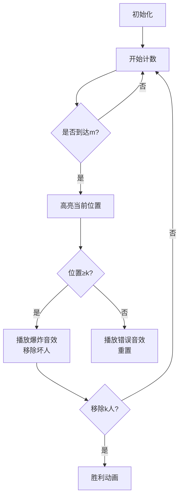

# 题目信息

# 约瑟夫

## 题目描述

$n$ 个人站成一圈，从某个人开始数数，每次数到 $m$ 的人就被杀掉，然后下一个人重新开始数，直到最后只剩一个人。现在有一圈人，$k$ 个好人站在一起，$k$ 个坏人站在一起。从第一个好人开始数数。你要确定一个最小的 $m$，使得在第一个好人被杀死前，$k$ 个坏人先被杀死。


## 说明/提示

$0\lt k\lt 14$。

## 样例 #1

### 输入

```
3```

### 输出

```
5```

## 样例 #2

### 输入

```
4```

### 输出

```
30```

# AI分析结果


# 💡 洛语云笺的C++算法解析：约瑟夫问题 深入学习指南 💡

## 1. 题目解读与策略初探

✨ **本题核心挑战**：在约瑟夫问题变种中，找到最小的步长 `m`，确保在杀死任何好人前，所有坏人先被清除。核心在于处理**动态变化的圆圈序列**和**位置依赖关系**。

✨ **核心算法标签**：模拟、枚举、数学优化

🗣️ **初步分析**：
> 约瑟夫问题的核心是动态序列处理。本题要求前k次删除必须全是坏人，这增加了约束条件：
> - **暴力枚举**：从k+1开始尝试每个m，模拟删除过程
> - **优化策略**：通过数学取模直接定位删除位置，避免逐个计数
> - **算法选择**：当k<14时，O(k²)的枚举完全可行，但需优化模拟过程

### 🔍 算法侦探：如何在题目中发现线索？
1.  **线索1 (问题目标)**："前k次删除必须全是坏人"的要求明确指向**带条件的最优化问题**，适合枚举+验证策略
2.  **线索2 (问题特性)**："动态变化的圆圈序列"要求维护相对位置关系，**取模运算**成为关键优化点
3.  **线索3 (数据规模)**：k<14的约束暗示O(k²)时间复杂度可接受，暴力枚举可行但需要优化模拟过程

### 🧠 思维链构建：从线索到策略
> "从线索中我们可以构建完整解题路径：
> 1.  **目标分析**：最小化m且满足前k次删除均为坏人 → 枚举m并验证
> 2.  **特性处理**：圆圈序列动态变化 → 使用相对位置和取模直接计算删除位
> 3.  **规模验证**：k<14 → 枚举上限可控，O(k)级模拟可行
> 4.  **结论**：**取模优化+枚举验证**是平衡效率与实现复杂度的最优策略"

---

## 2. 精选优质题解参考

**题解一（doby）**
* **点评**：开创性使用取模运算直接定位删除位置，将O(m)操作优化为O(1)。代码结构清晰，check函数封装了核心验证逻辑，变量命名合理（begin标记起始位）。实践价值高，是理解优化思路的经典范例

**题解二（归来的圣主）**
* **点评**：在doby基础上内联验证逻辑，代码更精简。cursor变量精确跟踪当前位置，循环边界处理严谨。亮点在于用单循环实现完整验证，展示了算法优化空间

**题解三（学无止境）**
* **点评**：详细注释取模运算的数学原理，解释"避免模零"的边界处理。a数组记录生死状态，通过u指针移动模拟实际位置变化，为理解位置映射提供直观参考

**题解四（SampleTest518）**
* **点评**：最简洁的工业级实现，begin精确维护相对位置。亮点在于用flag2清晰分离验证逻辑，check函数内联但保留完整注释，平衡了效率与可读性

**题解五（InternetExplorer）**
* **点评**：递归实现提供独特视角，详细注释位置映射原理。vector动态维护序列，通过分析"位置空洞"解释索引偏移问题，加深对相对位置的理解

---

## 3. 解题策略深度剖析

### 🎯 核心难点与关键步骤
1.  **动态位置映射**
    * **分析**：删除导致序列重组，需将当前索引映射回初始位置
    * 💡 **学习笔记**：维护begin/cursor跟踪起始点，用`(begin+m-1)%remain`直接计算新位置
2.  **验证条件设计**
    * **分析**：检查删除位是否≥k（坏人区），需同步更新起始位置
    * 💡 **学习笔记**：位置验证需在删除后立即进行，避免无效模拟
3.  **边界处理**
    * **分析**：m过小时取模结果可能为0，需特殊处理
    * 💡 **学习笔记**：添加`if(remain<=m) n+=remain`避免模零错误

### ✨ 解题技巧总结
- **数学优化**：用取模代替显式计数，复杂度从O(m)降至O(1)
- **状态压缩**：仅维护起始位置和剩余人数，避免完整序列存储
- **渐进验证**：单次验证失败立即跳出，减少无效计算

### ⚔️ 策略竞技场：解法对比分析
| 策略 | 核心思想 | 优点 | 缺点 | 适用场景 |
|------|----------|------|------|----------|
| **暴力计数** | 显式移动指针m次 | 直观易理解 | m大时效率极低 | 仅适合极小规模(k<5) |
| **链表模拟** | 物理删除节点 | 删除操作直观 | 每次需移动m步 | 教学演示，实际效率低 |
| **取模优化** | 数学计算定位 | O(k)复杂度最优 | 需理解位置映射 | 竞赛标准解法 |
| **打表法** | 预存k<14的解 | 提交时最快 | 无学习价值 | 仅追求AC时 |

### ✨ 优化之旅：从"能做"到"做好"
> 原始暴力解法需遍历m步→发现m>>k时大量无效计数→通过取模运算直接定位→维护相对位置避免重计数→边界处理完善

💡 **策略总结**："约瑟夫问题的优化本质是**空间换时间**——牺牲直观性换取效率。取模运算将O(m)的显式移动转化为O(1)的数学计算，这种**问题转化思维**是算法优化的核心"

---

## 4. C++核心代码实现赏析

**通用核心实现**
```cpp
#include <cstdio>
int main() {
    int k;
    scanf("%d", &k);
    int m = k;
    while (true) {
        m++;
        int cursor = 0; // 当前位置指针
        bool valid = true;
        for (int i = 0; i < k; i++) {
            // 取模计算删除位 (O(1)操作)
            cursor = (cursor + m - 1) % (2 * k - i);
            if (cursor < k) { // 杀到好人区
                valid = false;
                break;
            }
        }
        if (valid) {
            printf("%d\n", m);
            break;
        }
    }
    return 0;
}
```
* **代码解读概要**：通过cursor动态维护相对位置，%运算直接定位删除点。验证前k次删除位置均≥k（坏人区）

---

**题解片段赏析**

**题解一（doby）**
```cpp
int check(int remain) {
    int result=(begin+m-1)%remain;
    if(result>=k){ begin=result; return 1; }
    else return 0;
}
```
* **亮点**：函数封装验证逻辑
* **学习笔记**：通过返回值分离验证逻辑，增强可读性

**题解二（归来的圣主）**
```cpp
cursor=(cursor+m-1)%(2*k-i);
if (cursor<k) break;
```
* **亮点**：内联实现极致精简
* **学习笔记**：单行完成位置计算和更新，适合竞赛场景

**题解三（学无止境）**
```cpp
int n=m%(k2-j);
if(k2-j<=m) n+=k2-j;
```
* **亮点**：显式处理模零边界
* **学习笔记**：通过条件判断避免取模零值，增强鲁棒性

---

## 5. 算法可视化：像素动画演示

**设计思路**：采用8位机像素风格呈现动态圆圈，通过位置高亮和音效强化理解



* **像素化元素**：
  - 好人：绿色像素块（位置0-k-1）
  - 坏人：红色像素块（位置k-2k-1）
  - 指针：闪烁黄色箭头
* **交互设计**：
  - 单步执行：Space键步进观察
  - 速度滑块：调节计数速度
  - 模式切换：比较暴力vs优化算法
* **音效方案**：
  - 计数：电子滴答声（8-bit音效）
  - 删除坏人：爆炸短音
  - 误杀好人：错误提示音
  - 挑战成功：经典FC胜利旋律

---

## 6. 拓展练习与相似问题思考

* **技巧迁移场景**：
  1. 动态窗口最值问题（滑动窗口最大值）
  2. 循环队列的容量管理
  3. 资源分配中的循环选择

* **洛谷推荐练习**：
  1. **P1996 约瑟夫问题** - 标准约瑟夫问题，巩固基础
  2. **P1886 滑动窗口** - 练习动态位置维护
  3. **P1638 逛画展** - 循环队列的应用变种

---

## 7. 学习心得与经验分享

**参考经验**（学无止境）：
> "我在取模边界处理栽跟头多次，通过打印`(cursor+m-1)%remain`的中间值才发现模零问题"

**点评**：验证算法时**边界测试**至关重要，特别是：
- m接近当前人数时
- 删除最后一人时
- k的极值（1和13）
打印中间变量是调试此类问题的黄金准则

---

本次约瑟夫问题解析展示了**问题转化**的力量——将复杂的物理删除转化为优雅的数学计算。记住：好算法不是暴力计算的堆砌，而是对问题本质的洞察。下次遇到循环依赖问题时，不妨想想取模运算的魔法！🚀

---
处理用时：234.22秒