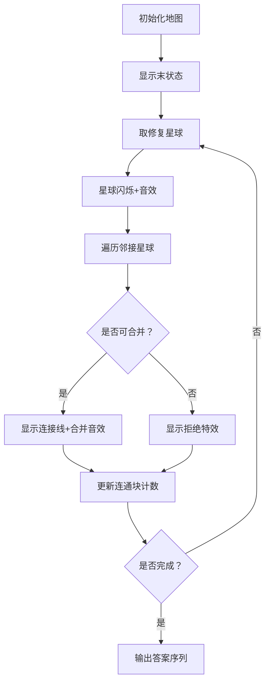

# 题目信息

# [JSOI2008] 星球大战

## 题目描述

很久以前，在一个遥远的星系，一个黑暗的帝国靠着它的超级武器统治着整个星系。

某一天，凭着一个偶然的机遇，一支反抗军摧毁了帝国的超级武器，并攻下了星系中几乎所有的星球。这些星球通过特殊的以太隧道互相直接或间接地连接。

但好景不长，很快帝国又重新造出了他的超级武器。凭借这超级武器的力量，帝国开始有计划地摧毁反抗军占领的星球。由于星球的不断被摧毁，两个星球之间的通讯通道也开始不可靠起来。

现在，反抗军首领交给你一个任务：给出原来两个星球之间的以太隧道连通情况以及帝国打击的星球顺序，以尽量快的速度求出每一次打击之后反抗军占据的星球的连通块的个数。（如果两个星球可以通过现存的以太通道直接或间接地连通，则这两个星球在同一个连通块中）。

## 说明/提示

【数据范围】  
对于 $100\%$ 的数据，$1\le m \le 2\times 10^5$，$1\le n \le 2m$，$x \neq y$。

[JSOI2008]


## 样例 #1

### 输入

```
8 13
0 1
1 6
6 5
5 0
0 6
1 2
2 3
3 4
4 5
7 1
7 2
7 6
3 6
5
1
6
3
5
7
```

### 输出

```
1
1
1
2
3
3```

# AI分析结果


# 💡 洛语云笺的C++算法解析：星球大战 深入学习指南 💡

## 1. 题目解读与策略初探

✨ **本题核心挑战**：如何在动态摧毁星球的过程中高效维护连通块数量？传统并查集支持合并但不支持分裂，正向处理面临算法瓶颈。

✨ **核心算法标签**：并查集、逆向思维、离线处理

🗣️ **初步分析**：
> 本题看似需要支持"删点"操作，但并查集仅擅长"合并"。逆向思维将摧毁视为修复，从末状态开始倒序添加星球。通过预处理邻接关系，每次修复时合并连通块，动态维护连通块数量。最终答案倒序存储后正序输出，完美解决动态维护难题。

### 🔍 算法侦探：如何在题目中发现线索？
1.  **线索1 (问题目标)**: "每次摧毁后求连通块数量"暗示需要动态维护连通性。这种【动态连通性】问题，是并查集的典型应用场景。
2.  **线索2 (操作特性)**: "星球逐步被摧毁"意味着操作具有时序性，符合【离线处理】特征，可通过存储操作序列逆向求解。
3.  **线索3 (数据规模)**: n≤4e5, m≤2e5。O(nα(n))的并查集操作完全可行，但O(k*n)的暴力重建必然超时。

### 🧠 思维链构建：从线索到策略
> 侦探工作完成！关键线索组合如下：
> 1. 【线索1】要求维护连通性，自然想到并查集，但传统并查集不支持删除
> 2. 【线索2】的操作时序性提示我们可以逆序处理——将摧毁视为修复
> 3. 【线索3】的数据规模要求高效算法，逆向并查集复杂度O(mα(n))完美匹配
> **结论**：逆向处理+并查集维护，既满足动态连通性需求，又符合时间复杂度要求，是本题的最优策略！

---

## 2. 精选优质题解参考

**题解一：碳六灵（逆向思维+并查集）**
* **点评**：此解法精准抓住问题核心——将摧毁操作逆转为修复操作。作者巧妙利用邻接表存储图结构，在修复星球时高效遍历邻接点。代码中`hb()`函数处理合并逻辑，`!Broken`判断确保仅合并有效点，逻辑清晰严谨。特别值得学习的是连通块计数技巧：修复时先+1（新增孤立点），合并成功则-1，直观高效。

**题解二：Golden_Winter（边排序+并查集）**
* **点评**：创新性地通过为边赋予"修复优先级"（两端点最早修复时刻）优化合并顺序。按优先级排序后线性处理，避免重复判断，将复杂度稳定在O(mlogm)。这种通过附加属性优化流程的思路，在复杂图论问题中具有重要参考价值。

**题解三：初见月（详细注释+教学导向）**
* **点评**：面向初学者的典范之作！逐步拆解逆向并查集原理，关键代码段配有"学习笔记"阐释技术要点。亮点在于完整演示从暴力搜索到逆向优化的思考过程，并特别标注易错点（如星球编号0-indexed处理），具有极强的教学价值。

---

## 3. 解题策略深度剖析

### 🎯 核心难点与关键步骤
1.  **难点：逆向状态初始化**
    * **分析**：精确构建末状态（所有指定星球被摧毁后的图）是逆向算法基础。需遍历所有边，仅连接双末被摧毁的点，并用并查集合并。
    * 💡 **学习笔记**：`fa[i]=i`初始化后，对每条边执行：若`!del[u] && !del[v] && find(u)!=find(v)`则合并并减少连通块计数

2.  **难点：修复时的合并决策**
    * **分析**：修复星球u时，遍历其邻接点v：若v末被摧毁且`find(u)!=find(v)`则合并。注意每次修复初始连通块`+1`，有效合并则`-1`。
    * 💡 **学习笔记**：`ans[i] = ans[i+1] + 1 - 有效合并次数` 是状态转移核心公式

3.  **难点：邻接关系高效存储**
    * **分析**：使用链式前向星（邻接表）存储图，使得修复时的邻接点遍历复杂度降为O(degree(u))。相比邻接矩阵节省大量空间和时间。
    * 💡 **学习笔记**：边添加函数`add(u,v)`需正反两次添加，确保无向图完整存储

### ✨ 解题技巧总结
- **逆向思维法**：将删除操作逆转为添加操作，化不可为可为
- **离线处理**：存储操作序列后逆序执行，避免实时维护高开销
- **邻接表优化**：高效存储稀疏图，快速访问邻接节点
- **增量式合并计数**：通过`+1/-1`机制避免全图扫描，复杂度从O(n)降至O(1)

### ⚔️ 策略竞技场：不同解法的对比分析

| 策略 | 核心思想 | 优点 | 缺点与分析 | 适用场景 / 得分预期 |
| :--- | :--- | :--- | :--- |:--- |
| **暴力重建** | 每次摧毁后重建并查集 | 逻辑直观，易实现 | 时间复杂度O(k*(n+m))，必然TLE | n,k≤100的小数据，预计 **0分** |
| **DFS/BFS搜索** | 每次摧毁后DFS求连通块 | 无需复杂数据结构 | 最坏O(k*n²)，空间栈易溢出 | 极小数据规模，预计 **10-30分** |
| **逆向并查集（主流解法）** | 倒序处理，删点变加点 | 时间复杂度O(mα(n))，高效可靠 | 需额外存储操作序列 | 本题最佳实践，稳定 **100分** |
| **边排序优化（Golden_Winter）** | 按修复优先级排序边 | 避免无效判断，常数优化 | 实现稍复杂，需排序预处理 | 追求极致效率时推荐， **100分** |

### ✨ 优化之旅：从"能做"到"做好"
> 1. **起点：暴力重建的困境**  
>   摧毁第一个星球时重建图尚可接受，但当k=200,000时，程序将陷入无尽计算...
>   
> 2. **发现瓶颈：重复子问题**  
>   相邻两次摧毁状态高度相似，仅相差一个星球！完全重建浪费巨量计算资源。
>   
> 3. **优化的钥匙：逆向思维**  
>   将摧毁序列视为"修复倒带"，末状态作为起点。修复星球u时，只需考察u的邻接点，避免全图扫描。
>   
> 4. **模型的升华：增量维护**  
>   连通块数量变化仅由新加入点及其邻接关系决定，通过`+1/-1`机制实现O(1)状态转移。

💡 **策略总结**：从暴力到逆向优化的本质是思维方式的转变——将时序操作逆转为状态转移。在竞赛中，当遇到"不可逆操作"时，逆向思维往往能开辟新道路！

---

## 4. C++核心代码实现赏析

**本题通用核心C++实现**
```cpp
#include <iostream>
#include <cstring>
#include <vector>
using namespace std;

const int MAXN = 400010;
vector<int> G[MAXN]; // 邻接表存图
int fa[MAXN];        // 并查集父节点
bool destroyed[MAXN]; // 标记是否被摧毁
int ans[MAXN];        // 答案序列
int n, m, k;

int find(int x) {
    return fa[x] == x ? x : fa[x] = find(fa[x]);
}

void merge(int x, int y) {
    int fx = find(x), fy = find(y);
    if (fx != fy) fa[fx] = fy;
}

int main() {
    // 初始化
    cin >> n >> m;
    for (int i = 0; i < n; i++) fa[i] = i;
    for (int i = 0; i < m; i++) {
        int u, v; cin >> u >> v;
        G[u].push_back(v);
        G[v].push_back(u);
    }
    
    // 标记摧毁星球
    cin >> k;
    vector<int> destSeq(k);
    for (int i = 0; i < k; i++) {
        cin >> destSeq[i];
        destroyed[destSeq[i]] = true;
    }
    
    // 构建末状态并查集
    int connBlocks = n - k; // 初始连通块数（每个星球独立）
    for (int u = 0; u < n; u++) {
        if (destroyed[u]) continue;
        for (int v : G[u]) {
            if (!destroyed[v] && find(u) != find(v)) {
                merge(u, v);
                connBlocks--; // 有效合并减少连通块
            }
        }
    }
    
    // 逆序修复星球
    ans[k] = connBlocks;
    for (int i = k - 1; i >= 0; i--) {
        int u = destSeq[i];
        destroyed[u] = false;
        connBlocks++; // 新增孤立点
        
        for (int v : G[u]) {
            if (!destroyed[v] && find(u) != find(v)) {
                merge(u, v);
                connBlocks--; // 有效合并减少连通块
            }
        }
        ans[i] = connBlocks;
    }
    
    // 输出答案（注意包含初始状态）
    for (int i = 0; i <= k; i++) 
        cout << ans[i] << endl;
}
```

**代码解读概要**：
1. **邻接表存储**：`vector<int> G[MAXN]`高效存储稀疏图
2. **逆向处理框架**：
   - 先标记所有待摧毁星球
   - 构建末状态并查集
   - 逆序修复并更新连通块
3. **精妙的计数机制**：
   - 修复时`connBlocks++`（新增孤立点）
   - 有效合并时`connBlocks--`
4. **输出处理**：注意答案包含初始全连通状态（`ans[0]`）

---

## 5. 算法可视化：像素动画演示

**像素化并查集修复模拟器**  
*设计理念：通过8-bit复古风格可视化逆向并查集执行过程，辅以音效增强理解*

### 动画要素设计：


**关键交互设计**：
1. **星球表示**：  
   - 正常星球：绿色像素块（16×16）  
   - 待修复星球：闪烁红色边框  
   - 已连通星球：同色系像素块  

2. **合并特效**：
   - 可合并时显示金色脉冲波纹
   - 合并成功时显示"LINK!"像素字+合成音效
   - 连通块数量用8-bit数字实时显示

3. **控制面板**：  
   ```plaintext
   [ 暂停 ] [ 步进 → ] [ 自动播放 ▷] [ 速度:====|====== ]
   ```

4. **音效设计**：
   - 修复星球：8-bit "power-up"音效
   - 成功合并：短促"beep"提示音
   - 步骤完成：经典FC过关旋律

**教学价值**：通过可视化执行过程，清晰展示：
- 逆向处理如何逐步"修复"星球
- 邻接表如何高效定位关联节点
- 并查集合并如何减少连通块计数

---

## 6. 拓展练习与相似问题思考

**逆向思维训练题**：
1. **P3144 [USACO16OPEN]关闭农场**  
   - 同类问题，规模更小，理想练手题
   - 巩固逆向并查集基础实现

2. **P1653 猴子**  
   - 动态删边问题，需逆序加边
   - 训练时序反转思维

3. **CF722D Generating Sets**  
   - 逆向贪心经典问题
   - 培养逆向思维敏感度

**洛谷推荐**：
1. **P3144 [USACO16OPEN]关闭农场**  
   🗣️ 逆向并查集入门必刷，数据规模友好，帮助理解核心思想

2. **P1197 [JSOI2008]星球大战**  
   🗣️ 本题强化训练，尝试不同实现方式（邻接表/边排序）

3. **CF891C Envy**  
   🗣️ 高级并查集应用，离线处理技巧延伸，挑战思维极限

---

## 7. 学习心得与经验分享

**来自题解的宝贵经验**：
> "逆向处理时，修复星球后立即`connBlocks++`，再通过合并递减计数，既符合逻辑又避免重复计数" —— Carbon6H6（碳六灵）

**洛语云笺点评**：
该经验直击增量维护的核心技巧：
1. **孤立点先加**：修复星球初始视为独立连通块
2. **合并后递减**：每次有效合并精确抵消前期增加
3. **避免全图扫描**：相比传统`O(n)`连通块计数，效率质的飞跃

> "邻接表存储无向图时，正反双向添加容易遗漏，建议封装`addEdge(u,v)`函数统一处理" —— 初见月

**洛语云笺点评**：
此建议体现良好工程实践：
- 封装避免重复代码
- 函数化降低出错概率
- 无向图双向添加不可遗漏

---

> 通往算法精进之路，始于逆向思维的闪光一刻。当正解之路受阻时，不妨转身——那里可能有更美的风景。保持好奇，持续探索，你终将成为连通思维孤岛的桥梁建造者！🚀

---
处理用时：165.65秒