# 题目信息

# 冗余依赖

## 题目描述

在设计关系数据库的表格时，术语“函数依赖”（FD）被用来表示不同域之间的关系。函数依赖是描述一个集合中的域的值与另一个集合中的域的值之间的关系。记号 $X \to Y$ 被用来表示当集合 $X$ 中的域被赋值后，集合 $Y$ 的域就可以确定相应的值。例如，一个数据表格包含“社会治安编号”（$S$）、“姓名”（$N$）、“地址”（$A$）、“电话”（$P$）的域，并且每个人都与某个特定的互不相同的 $S$ 值相对应，根据域 $S$ 就可以确定域 $N$ 、 $A$ 、 $P$ 的值。这就记作 $S \to \{N,A,P\}$。

写一个程序以找出一组依赖中所有的冗余依赖。一个依赖是冗余的是指它可以通过组里的其他依赖得到。例如，如果组里包括依赖 $A \to B$ 、 $B \to C$ 和 $A \to C$，那么第三个依赖是冗余的，因为域 $C$ 可以用前两个依赖得到（域 $A$ 确定了域 $B$ 的值，同样域 $B$ 确定了域 $C$ 的值）。在 $A \to B$ 、 $B \to C$ 、 $C \to A$ 、 $A \to C$ 、 $C \to B$ 和 $B \to A$ 中，所有的依赖都是冗余的。

现在要求你编写一个程序，从给定的依赖关系中找出冗余的。

## 说明/提示

### 样例 1 解释

依赖关系 $3$ 是冗余的。因为 $A\to C$ 可以使用前两个依赖关系 $A\to \{B,D\}$ 和 $\{B, D\}\to C$ 得到。

## 样例 #1

### 输入

```
3
A->BD
BD->C
A->C
```

### 输出

```
FD 3 is redundant using FDs: 1 2
```

## 样例 #2

### 输入

```
6
P->RST
VRT->SQP
PS->T
Q->TR
QS->P
SR->V
```

### 输出

```
FD 3 is redundant using FDs: 1
FD 5 is redundant using FDs: 4 6 2```

# AI分析结果


# 💡 洛语云笺的C++算法解析：冗余依赖 深入学习指南 💡

## 1. 题目解读与策略初探

✨ **本题核心挑战**：在函数依赖关系中识别冗余依赖，即找出那些可以通过其他依赖推导出来的依赖项，并输出最短推导路径。

✨ **核心算法标签**：搜索算法(BFS/DFS)、位运算优化、集合推导

🗣️ **初步分析**：
> 这道题的本质是知识推导问题——从初始知识集合出发，通过应用规则逐步扩展知识，直到覆盖目标知识。核心难点在于：
> 1. 如何高效表示和操作知识集合（26个字母域）
> 2. 如何找到最短推导路径
> 3. 如何处理依赖之间的传递关系
>
> 我们采用8位像素风格的"知识探险"可视化方案：字母域显示为彩色方块，依赖应用时触发像素动画和音效，推导路径以"关卡"形式呈现。

### 🔍 算法侦探：如何在题目中发现线索？

1.  **线索1 (问题目标)**："找出冗余依赖"要求我们进行**依赖推导验证**，这是典型的**状态空间搜索问题**。
2.  **线索2 (问题特性)**：依赖间的传递性（A→B和B→C ⇒ A→C）提示我们可以采用**知识扩散模型**，用集合运算模拟推导过程。
3.  **线索3 (数据规模)**：n≤100，字母域固定26个。O(n²)的BFS或带剪枝的DFS完全可行，位运算可将集合操作降至O(1)。

### 🧠 思维链构建：从线索到策略

> "综合线索：
> 1. 问题目标要求验证推导路径，这自然联想到搜索算法
> 2. 传递性特性说明知识集合可逐步扩展，BFS天然适合求最短路径
> 3. 数据规模支持O(n²)算法，位运算能高效处理26字母的集合
> 
> **结论**：采用**BFS+位运算**作为核心策略，从待检查依赖的左边出发，应用其他依赖扩展集合，记录路径并确保最短推导"

---

## 2. 精选优质题解参考

**题解一：无尽（赞8）**
* **点评**：此解法采用BFS队列实现，亮点在于：
  - 使用整型位运算（26bit）高效表示集合
  - 通过pred/e数组记录路径，天然保证最短路径
  - 代码结构清晰，队列操作规范，边界处理完整
  - 实际得分预估：100%（优化到位，复杂度O(n²)）

**题解三：无名之雾（赞2）**
* **点评**：采用"预检查+DFS"策略，亮点在于：
  - 预处理机制快速筛选冗余依赖，减少DFS调用
  - best变量剪枝优化DFS，避免无效搜索
  - 位运算实现简洁，集合操作高效
  - 实际得分预估：100%（预处理提升效率，DFS剪枝合理）

---

## 3. 解题策略深度剖析

### 🎯 核心难点与关键步骤

1.  **集合表示与操作**
    * **分析**：使用int的26个bit位表示字母集合（A=bit0,...,Z=bit25）。包含判断用位与操作：`(a & b)==b`
    * 💡 **学习笔记**：位运算将集合操作复杂度降至O(1)，是处理小规模离散集合的利器

2.  **推导过程实现**
    * **分析**：从待检查依赖左边出发，循环应用其他依赖：若依赖i的左边⊆当前集合，则将右边加入集合。BFS队列存储状态（当前集合，路径）
    * 💡 **学习笔记**：BFS队列先进先出特性保证首次找到的路径最短

3.  **路径记录与输出**
    * **分析**：每个队列节点记录（当前状态，前驱节点，使用的依赖）。到达目标后回溯输出路径
    * 💡 **学习笔记**：路径回溯是搜索算法的通用技巧，pred数组是经典实现方案

### ✨ 解题技巧总结

- **技巧1：位运算加速** - 26位整型表示集合，用位操作代替循环
- **技巧2：状态压缩** - 整数状态替代集合对象，提升效率
- **技巧3：双阶段处理** - 先快速判断冗余存在，再找最短路径

### ⚔️ 策略竞技场

| 策略 | 核心思想 | 优点 | 缺点 | 得分预期 |
|------|----------|------|------|----------|
| **暴力枚举** | 检查所有依赖子集能否推导目标 | 逻辑简单 | O(2ⁿ)不可接受 | 30% (n≤20) |
| **纯DFS** | 深度优先搜索所有推导路径 | 实现简单 | 路径不一定最短，需强剪枝 | 70% |
| **BFS+位运算(最优)** | 队列扩展，位运算集合操作 | 保证最短路径，O(n²)高效 | 需额外存储状态 | 100% |

### ✨ 优化之旅

> 1. **起点：暴力枚举**  
>   尝试所有2¹⁰⁰种子集，远超时限(1s≈10⁸操作)
> 
> 2. **发现重复推导**  
>   不同路径可能产生相同集合状态，存在重复计算
> 
> 3. **BFS优化**  
>   队列存储状态避免重复计算，天然保证最短路径
> 
> 4. **位运算突破**  
>   26bit整型替代集合操作，效率提升26倍

💡 **策略总结**："从暴力到BFS的进化，展现了'状态空间压缩'和'高效数据结构'的威力。竞赛中即使未想到位运算，规范的BFS实现也能获得大部分分数"

---

## 4. C++核心代码实现赏析

**本题通用核心实现**：
```cpp
#include <iostream>
#include <queue>
using namespace std;

const int MAXN = 105;
int n, pre[MAXN], res[MAXN]; // 依赖的左右集合

// BFS寻找冗余依赖的推导路径
void findRedundant(int k) {
    int start = pre[k], goal = res[k];
    queue<pair<int, int>> q; // <当前状态, 节点ID>
    vector<tuple<int, int, int>> nodes; // <状态, 前驱, 使用依赖>
    
    // 初始化
    nodes.emplace_back(start, -1, -1);
    q.push({start, 0});
    
    while (!q.empty()) {
        auto [state, id] = q.front(); q.pop();
        
        // 检查是否覆盖目标
        if ((state & goal) == goal) {
            // 回溯输出路径
            vector<int> path;
            while (id != 0) {
                auto [s, prev, used] = nodes[id];
                path.push_back(used);
                id = prev;
            }
            cout << "FD " << k+1 << " is redundant using FDs:";
            for (int i = path.size()-1; i >= 0; --i) 
                cout << " " << path[i]+1;
            cout << endl;
            return;
        }
        
        // 尝试应用每个依赖
        for (int i = 0; i < n; ++i) {
            if (i == k) continue;
            // 检查依赖是否可用
            if ((state & pre[i]) != pre[i]) continue;
            
            int newState = state | res[i];
            // 避免重复状态
            bool exists = false;
            for (auto &[s, p, u] : nodes) {
                if (s == newState) { exists = true; break; }
            }
            if (exists) continue;
            
            // 保存新节点
            nodes.emplace_back(newState, id, i);
            q.push({newState, nodes.size()-1});
        }
    }
}
```

**题解一（无尽）亮点代码**：
```cpp
// BFS核心扩展逻辑
while (h <= t) {
    int state = q_state[h];
    for (int i = 0; i < n; ++i) {
        if (i == k) continue;
        if ((state & pre[i]) != pre[i]) continue; // 检查依赖可用
        
        int newState = state | res[i];  // 位运算扩展集合
        if (visited[newState]) continue;
        
        // 记录路径
        pred[++t] = h;
        e[t] = i;
        q_state[t] = newState;
        visited[newState] = true;
        
        if ((newState & goal) == goal) { // 找到路径
            printPath(t); // 回溯输出
            return;
        }
    }
    h++;
}
```
💡 **学习笔记**：队列下标h/t隐式维护BFS层级，避免显式队列数据结构

**题解三（无名之雾）亮点代码**：
```cpp
// 预处理判断冗余
bool checkRedundant(int k) {
    int state = pre[k], goal = res[k];
    vector<bool> used(n, false);
    used[k] = true;
    
    bool changed;
    do {
        changed = false;
        for (int i = 0; i < n; ++i) {
            if (used[i]) continue;
            if ((state & pre[i]) != pre[i]) continue;
                
            state |= res[i];  // 位运算扩展
            used[i] = true;
            changed = true;
            
            if ((state & goal) == goal) 
                return true;
        }
    } while (changed);
    return false;
}
```
💡 **学习笔记**：预处理避免不必要搜索，位运算|实现集合并集

---

## 5. 算法可视化：像素动画演示

* **主题**：8位像素风格"知识探险"
* **核心演示**：BFS如何逐步扩展知识集合

* **设计框架**：

```mermaid
graph TD
    A[初始化] --> B[设置起点]
    B --> C{目标覆盖?}
    C -- 是 --> D[播放胜利动画]
    C -- 否 --> E[高亮可用依赖]
    E --> F[玩家/AI选择依赖]
    F --> G[扩展集合-像素动画]
    G --> C
```


* **像素动画关键帧**：
1. **初始化**：26字母域显示为灰色方块，当前集合方块亮绿色
2. **依赖检查**：可用依赖的左边方块闪烁蓝色
3. **应用依赖**：新字母方块从黄色渐变为绿色，伴随"叮"声
4. **路径记录**：屏幕下方显示当前路径，依赖编号以像素数字呈现
5. **胜利状态**：目标字母闪烁金光，播放8bit胜利音乐

* **游戏化设计**：
  - **关卡模式**：每个依赖检查作为独立关卡
  - **连击系统**：连续正确应用依赖获得连击分
  - **AI演示**：自动播放最优推导路径，速度可调

---

## 6. 拓展练习与相似问题

* **技巧迁移场景**：
  1. 课程选修系统（先修课依赖）
  2. 技能树解锁路径
  3. 工作流程依赖优化

* **推荐练习**：
  1. **洛谷P1347** 排序
     - 推荐理由：拓扑排序的依赖关系推导，巩固传递闭包
  2. **洛谷P2419** 牛大赛
     - 推荐理由：胜负关系传递，类似依赖推导
  3. **洛谷P4306** 连通数
     - 推荐理由：有向图可达性统计，位运算应用扩展

---

## 7. 学习心得分享

> **题解一作者心得**："在路径回溯时发现循环依赖会导致无限递归，通过状态记录数组解决"
> 
> **洛语云笺点评**：这提醒我们搜索算法必须包含**状态去重**，否则可能陷入死循环。使用visited数组记录状态是否访问过是通用解决方案

---

通过本次分析，我们掌握了依赖推导问题的核心解法：BFS+位运算+路径回溯。记住解题三部曲：**问题抽象→算法选择→优化实现**。继续加油，勇士们！🎮🚀

---
处理用时：251.08秒