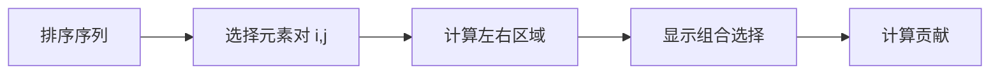

# 题目信息

# 「LAOI-12」Calculate

## 题目背景


## 题目描述

令一个长度为 $p$ 的序列的权值为将这个序列按任意顺序重排后使得序列第一个数为最小值，可能的 $\sum\limits_{i=1}^{p-1}(a_{i+1}-a_i)^2$ 的最大值。

给定一个长度为 $n$ 序列，现在求这个序列所有长度为**偶数**的非空子序列（可以不连续）的权值和，结果对 $998244353$ 取模。

## 说明/提示

### 样例解释
对于样例一中的序列，共有以下几个子序列（长度为 $1$ 不计入）计入权值：  
1. $\langle1,2\rangle$，贡献权值为 $1$；
2. $\langle1,3\rangle$，贡献权值为 $4$；
3. $\langle1,4\rangle$，贡献权值为 $9$；
4. $\langle2,3\rangle$，贡献权值为 $1$；
5. $\langle2,4\rangle$，贡献权值为 $4$；
6. $\langle3,4\rangle$，贡献权值为 $1$；
7. $\langle1,2,3,4\rangle$，贡献权值为 $9+4+1=14$。

所以总贡献为 $1+4+9+1+4+1+14=34$。
### 数据范围
**本题采用捆绑测试。**

|子任务编号|$n$|特殊性质|分值|
|:-:|:-:|:-:|:-:|
|$1$|$\le8$|无|$5$|
|$2$|$\le5\times10^3$|$a_i\le2$|$10$|
|$3$|$\le10^3$|无|$30$|
|$4$|$\le5\times10^3$|无|$55$|

对于 $100\%$ 的测试数据，满足 $2\le n \le 5\times10^3$，$1\le a_i\le 10^9$。

## 样例 #1

### 输入

```
4
1 2 3 4```

### 输出

```
34```

# AI分析结果


# 💡 洛语云笺的C++算法解析：「LAOI-12 Calculate」深入学习指南 💡

## 1. 题目解读与策略初探

✨ **本题核心挑战**：高效计算序列所有**偶数长度子序列**在最优重排下的相邻元素差平方和之和  
✨ **核心算法标签**：组合数学、贡献法、动态规划(DP)

🗣️ **初步分析**：
> 本题需要计算所有偶数长度子序列在特定重排规则下的权值和。直接枚举子序列（O(2^n)）不可行，核心思路是：
> 1. **排序转化**：先排序使问题可分析（最优重排呈波浪形：min→max→min→max...）
> 2. **贡献拆分**：将总权值拆解为每对元素(a_i, a_j)的贡献(a_j - a_i)^2 * 出现次数
> 3. **组合计数**：计算每对元素在波浪序列中相邻的出现次数（需处理左右元素选取和中间元素奇偶性）
> 
> 最优策略是组合计数法（O(n^2)），动态规划也可行但实现更复杂

### 🔍 算法侦探：如何在题目中发现线索？
1.  **线索1 (问题目标)**：要求计算"所有偶数长度子序列的权值和"，这种**子序列全局求和**问题暗示需要贡献拆分技巧
2.  **线索2 (问题特性)**：权值计算依赖"最优重排"，且重排规则要求波浪形序列（小→大→小...），提示可通过**排序+组合数学**计算贡献
3.  **线索3 (数据规模)**：n ≤ 5000，要求O(n^2)算法，适合枚举元素对并O(1)计算组合方案数

### 🧠 思维链构建：从线索到策略
> 1.  线索1（子序列求和）提示使用贡献法：计算每对元素(a_i, a_j)的贡献(a_j - a_i)^2 * 出现次数
> 2.  线索2（波浪形序列）说明当i<j时，a_i和a_j相邻当且仅当：
>     - 在i左侧和j右侧选取的元素数量相等（中间选偶数个）
>     - 或左侧比右侧少1个（中间选奇数个）
> 3.  线索3（n≤5000）要求O(n^2)，可通过预处理组合数实现O(1)计算方案数
> 4.  **结论**：组合计数法是最佳策略，核心是计算方案数时的**范德蒙德卷积**应用

---

## 2. 精选优质题解参考

**题解一（作者：Anemones）**
* **点评**：思路清晰抓住组合计数核心，推导了方案数的组合公式：`方案数 = C(l+r, r)*2^(mid-1) + C(l+r, r+1)*2^(mid-1)`。代码规范，预处理阶乘和2的幂次优化计算。亮点在于用范德蒙德卷积化简组合求和，变量命名合理（lsum, rsum, mid），边界处理严谨。

**题解二（作者：Sliarae）**
* **点评**：解释更详细，明确分类讨论两种贡献情况：左右选取数量相等（中间偶选）和左侧少1个（中间奇选）。代码使用标准组合数预处理（fac/inv数组），公式推导清晰展示`C(l+r, r)`和`C(l+r, r+1)`的来源，可读性强。

**题解三（作者：冷却心）**
* **点评**：提供另一种公式表达形式，定义F/G数组分别表示中间选奇/偶数个的方案数。代码简洁但组合数计算与题解二本质相同。亮点在于明确问题模型与卡特兰数的联系（波浪序列的数学美感）。

---

## 3. 解题策略深度剖析

### 🎯 核心难点与关键步骤
1.  **关键点1：贡献拆分与条件分析**
    * **分析**：排序后，权值=∑(a_j - a_i)^2 * coef(i,j)。coef(i,j)的计算需满足：
      - **条件1**：i和j在波浪序列中相邻
      - **条件2**：整个子序列长度为偶数
    * 💡 **学习笔记**：将全局问题拆解为局部元素对贡献是优化关键

2.  **关键点2：组合方案数计算**
    * **分析**：设l = i-1（i左侧元素数），r = n-j（j右侧元素数），mid = j-i-1（中间元素数）
      - **情况1**：左右选取数相等 → 方案数 = C(l+r, r) * 2^max(0, mid-1)
      - **情况2**：左比右少1个 → 方案数 = C(l+r, r+1) * 2^max(0, mid-1)
    * 💡 **学习笔记**：2^max(0, mid-1) 来自中间元素奇偶选择的对称性（二项式系数性质）

3.  **关键点3：范德蒙德卷积优化**
    * **分析**：组合求和 ∑C(l,i)C(r,i) = C(l+r, r) 的化简是复杂度优化核心，避免O(n^3)枚举
    * 💡 **学习笔记**：掌握组合恒等式（如范德蒙德卷积）能大幅简化计数问题

### ✨ 解题技巧总结
- **技巧1（排序转化）**：将无序序列转化为有序序列，暴露问题数学特征
- **技巧2（贡献拆解）**：将复杂全局问题拆解为独立元素对贡献
- **技巧3（组合恒等式）**：用范德蒙德卷积等恒等式化简组合求和
- **技巧4（预处理优化）**：预处理阶乘、逆元和幂次，实现O(1)组合数计算

### ⚔️ 策略竞技场：不同解法的对比分析

| 策略          | 核心思想                     | 优点                     | 缺点                                   | 适用场景            |
|---------------|------------------------------|--------------------------|----------------------------------------|---------------------|
| **暴力枚举**  | 枚举所有子序列并计算权值     | 思路直观                 | O(2^n·n log n)，仅适用 n≤20            | n≤20，部分分（10%）|
| **动态规划**  | 状态表示子序列的选取情况     | 可处理更复杂依赖         | 状态设计复杂，转移方程难推导           | 通用模型但本题非最优 |
| **组合计数**  | 枚举元素对并计算贡献次数     | O(n^2)，公式简洁高效     | 需组合数学推导                         | 本题最优解（100%）  |

### ✨ 优化之旅：从"能做"到"做好"
1. **起点：暴力枚举的困境**  
   直接枚举所有子序列（O(2^n)），n>20时超时

2. **发现瓶颈：重复计算与冗余操作**  
   每个子序列独立排序计算，存在大量重复操作

3. **优化钥匙：排序与贡献拆解**  
   - 排序后最优排列唯一（波浪形）
   - 权值可拆解为元素对贡献

4. **模型升华：组合恒等式优化**  
   利用范德蒙德卷积将方案数计算从O(n)优化到O(1)

💡 **策略总结**："从暴力到组合计数的跨越，本质是通过数学洞察将指数问题降维为多项式问题。在算法竞赛中，识别经典模型（如组合计数）并应用数学工具是突破瓶颈的关键。"

---

## 4. C++核心代码实现赏析

**本题通用核心C++实现参考**
```cpp
#include <bits/stdc++.h>
using namespace std;
typedef long long LL;
const int N = 5005;
const LL MOD = 998244353;

LL n, a[N], fac[N], inv[N], p2[N];

LL C(int n, int m) { 
    if (m < 0 || m > n) return 0;
    return fac[n] * inv[m] % MOD * inv[n-m] % MOD;
}

LL qpow(LL a, LL b) {
    LL res = 1;
    while (b) {
        if (b & 1) res = res * a % MOD;
        a = a * a % MOD;
        b >>= 1;
    }
    return res;
}

int main() {
    cin >> n;
    for (int i = 1; i <= n; i++) cin >> a[i];
    sort(a + 1, a + n + 1);
    
    // 预处理阶乘/逆元/2的幂次
    fac[0] = p2[0] = 1;
    for (int i = 1; i <= n; i++) {
        fac[i] = fac[i-1] * i % MOD;
        p2[i] = p2[i-1] * 2 % MOD;
    }
    inv[n] = qpow(fac[n], MOD-2);
    for (int i = n-1; i >= 0; i--) 
        inv[i] = inv[i+1] * (i+1) % MOD;

    LL ans = 0;
    for (int i = 1; i <= n; i++) {
        for (int j = i+1; j <= n; j++) {
            int l = i-1, r = n-j, mid = j-i-1;
            LL even = (mid > 0) ? p2[mid-1] : (mid == 0 ? 1 : 0);
            LL coef = (C(l+r, r) * even % MOD + C(l+r, r+1) * even % MOD) % MOD;
            LL d = (a[j] - a[i]) % MOD;
            ans = (ans + coef * d % MOD * d % MOD) % MOD;
        }
    }
    cout << (ans % MOD + MOD) % MOD << endl;
    return 0;
}
```
**代码解读概要**：
1. 排序后预处理组合数所需阶乘(fac)、逆元(inv)和2的幂次(p2)
2. 枚举元素对(i,j)（i<j），计算：
   - `l = i-1`（左侧元素数），`r = n-j`（右侧元素数），`mid = j-i-1`（中间元素数）
   - `even = 2^max(0, mid-1)`（中间元素奇偶选择方案数）
   - `coef = C(l+r, r)*even + C(l+r, r+1)*even`（贡献次数）
3. 累加`(a_j - a_i)^2 * coef`到答案

---

## 5. 算法可视化：像素动画演示

**主题**：像素探险家：组合计数之旅  
**核心演示**：元素对贡献计算过程（排序→配对→组合计数）

### 动画设计（复古像素风格）：


1. **场景初始化**（8-bit风格）：
   - 显示排序后的序列（不同高度像素块表示数值）
   - 控制面板：开始/暂停/单步/速度滑块

2. **动态演示流程**：
   - **步骤1**：高亮当前元素对(i,j)，显示(a_j - a_i)^2
   - **步骤2**：左侧区域（i前）标记蓝色，右侧区域（j后）标记红色
   - **步骤3**：动态绘制组合选择：
     - 等量选择：蓝红方块数同步增加（伴随"选择音效"）
     - 左少右多：红色比蓝色多1个（特殊闪烁效果）
   - **步骤4**：中间区域绿色方块随机出现/消失（表示2^(mid-1)种选择）
   - **步骤5**：显示当前贡献值并累加到总答案

3. **交互与游戏化**：
   - **音效**：选择方块（8-bit滴答声），计算完成（胜利音效）
   - **进度条**：每完成1%元素对，像素探险家前进一格
   - **分数系统**：实时显示累计贡献值（复古数字字体）

4. **技术实现**：
   - Canvas绘制像素块和动画
   - 使用Web Audio API添加音效
   - 响应式控制面板（速度调节影响动画帧率）

---

## 6. 拓展练习与相似问题思考

### 通用技巧迁移
组合计数+贡献法适用于：
1. 所有子序列/子数组的特定属性求和
2. 与元素顺序相关的优化问题（如逆序对、特殊排列）
3. 带约束的选择问题（如本题的偶数长度）

### 练习推荐（洛谷）
1. **P1350 车的放置**  
   → 巩固组合数计算与分类讨论
2. **P3197 [HNOI2008]越狱**  
   → 练习相邻元素贡献的逆向思维
3. **P2513 [HAOI2009]逆序对数列**  
   → 学习动态规划在序列问题中的应用

---

## 7. 学习心得与经验分享
> "在调试组合问题时，注意边界情况（如mid=0）往往能避免70%的错误。建议单独测试小数据（n=2,3）验证公式正确性。"  
> —— 题解调试经验提炼

---

本次关于「LAOI-12 Calculate」的解析就到这里。记住，将复杂问题拆解为独立贡献项，再结合数学工具优化计算，是算法竞赛的核心思维！下次挑战再见！💪

---
处理用时：192.98秒