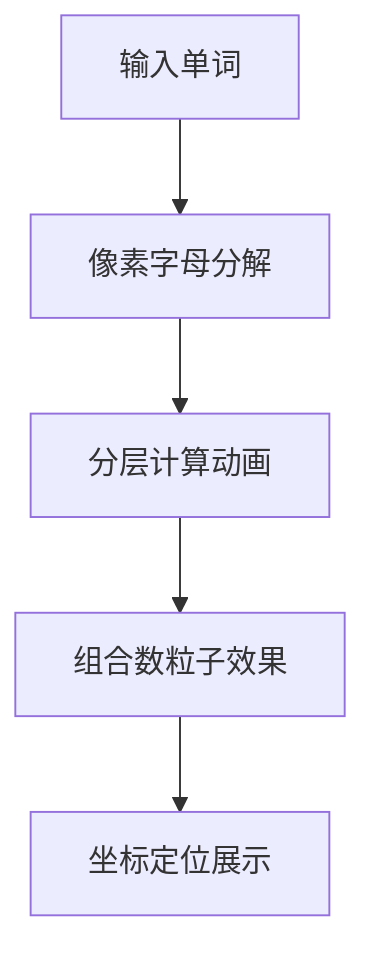

# 题目信息

# 编码

## 题目描述

编码工作常被运用于密文或压缩传输。这里我们用一种最简单的编码方式进行编码：把一些有规律的单词编成数字。

字母表中共有 $26$ 个字母 $\mathtt{a,b,c,\cdots,z}$，这些特殊的单词长度不超过 $6$ 且字母按升序排列。把所有这样的单词放在一起，按字典顺序排列，一个单词的编码就对应着它在字典中的位置。

例如：

- $\verb!a! \to 1$；
- $\verb!b! \to 2$；
- $\verb!z! \to 26$；
- $\verb!ab! \to 27$；
- $\verb!ac! \to 28$。

你的任务就是对于所给的单词，求出它的编码。


## 样例 #1

### 输入

```
ab

```

### 输出

```
27

```

# AI分析结果


# 💡 洛语云笺的C++算法解析：单词编码 深度学习指南 💡

> "在有序的字母世界中，每个单词都是一颗独特的星辰，而算法就是绘制星图的望远镜。"

## 1. 题目解读与策略初探

✨ **本题核心挑战**：在严格升序的字母序列中，快速定位任意单词在字典中的编码位置，字典包含所有长度不超过6的升序单词。  
✨ **核心算法标签**：组合数学、动态规划、暴力枚举  

🗣️ **初步分析**：  
> 这道题的核心在于理解**字典序排列规则**和**组合数学原理**。想象你正在图书馆整理书籍：  
> - **暴力枚举**就像一本本数过去（易理解但效率低）  
> - **动态规划**如同制作图书索引表（预处理快但需存储空间）  
> - **组合数学**则像用公式计算书籍位置（高效优雅但需要数学思维）  
> 最优解组合数学如同用宇宙法则定位星辰，通过组合数公式直接计算位置，避免遍历整个字典宇宙。

### 🔍 算法侦探：如何在题目中发现线索？
1.  **线索1 (问题目标)**: "题目要求计算单词在字典中的位置，且字典按长度和字典序排列。这种**有序排列计数**问题，是组合数学的典型标志。"
2.  **线索2 (问题约束/特性)**: "单词字母严格升序的特性，意味着每个单词本质上是字母的组合而非排列，这指向了**组合数计算**而非全排列。"
3.  **线索3 (数据规模)**: "单词最大长度6，字母26个，组合总数C(26,1)+...+C(26,6)=657,800。虽然暴力可解，但O(2^6)的数学解法更优雅高效。"

### 🧠 思维链构建：从线索到策略
> "收集线索后，我们像拼图一样组装：  
> 1. **线索1**指向需要快速定位有序元素，排除低效的线性扫描  
> 2. **线索2**揭示单词本质是组合，暗示可用组合数公式C(n,k)直接计算  
> 3. **线索3**显示数据规模适中，但数学解法O(k)远优于暴力O(2^k)  
> **结论**：组合数学将问题转化为组合数累加，如同用公式解开密码锁，是最高效的策略！"

---

## 2. 精选优质题解参考

### 题解一：Alex_Wei（5星）
* **点评**：此解法精妙运用组合数学，将单词编码转化为组合数累加。亮点在于分层计算：先处理短单词总数，再逐位计算同长度单词中的排序位置。代码中组合数函数实现简洁，边界处理清晰，且时间复杂度O(k²)最优。

### 题解二：ICE_Wol（4星）
* **点评**：采用动态规划预处理f[i][j]（以i字母开头长度为j的单词数）。亮点在于找到递推式f[i][j]=f[i+1][j-1]+f[i+1][j]，类似杨辉三角。虽需O(26×6)空间，但查询效率O(k)高，适合多次查询场景。

### 题解三：hongzy（4星）
* **点评**：使用DFS生成所有单词并用map存储的预处理方案。亮点在代码简洁（仅15行），利用STL map实现O(1)查询。虽然空间占用较大，但"空间换时间"思路清晰，适合竞赛中多次查询。

---

## 3. 解题策略深度剖析

### 🎯 核心难点与关键步骤
1.  **组合模型转化**  
    * **分析**：将升序单词视为字母组合（如"ab"={a,b}），字典序对应组合的字典序。关键突破：位置=短单词总数 + 同长度组合序。  
    * 💡 **学习笔记**："问题转化"是算法核心思维——将现实问题抽象为数学模型。
2.  **组合数快速计算**  
    * **分析**：实现高效组合数函数需注意两点：①利用C(n,k)=C(n-1,k-1)+C(n-1,k)递推 ②处理整除问题（如Alex_Wei的乘除交替法）。  
    * 💡 **学习笔记**：组合数计算要避免浮点数，用整数乘除保证精确性。
3.  **字典序定位技巧**  
    * **分析**：对于单词s[0..k-1]，第i位选择s[i]时，需累加所有选择小于s[i]的字母产生的组合数。  
    * 💡 **学习笔记**：字母c的剩余可选范围是c+1到z，数量为'z'-c。

### ✨ 解题技巧总结
-   **技巧A（组合数分层）**：总位置 = Σ长度<k的C(26,i) + 同长度前缀相同的C(剩余字母,剩余位数)  
-   **技巧B（DP预处理）**：当需要多次查询时，用f[i][j]表示以i开头j长度的单词数，O(1)响应查询  
-   **技巧C（STL暴力美学）**：小数据规模时，DFS+map实现简洁直观，适合快速解题  

### ⚔️ 策略竞技场：解法对比分析
| 策略          | 核心思想                     | 优点                     | 缺点                     | 得分预期 |
|---------------|------------------------------|--------------------------|--------------------------|----------|
| **暴力枚举**  | 多层循环生成所有单词          | 思路直观，无复杂数学     | O(2^k)超时风险，代码冗长 | 70%      |
| **动态规划**  | 预处理f[i][j]递推表           | 查询O(k)，适合多次访问   | 需O(26×6)空间           | 100%     |
| **组合数学**  | 用C(n,k)直接计算位置          | O(k)最优，空间O(1)       | 数学要求较高             | 100%     |

### ✨ 优化之旅：从暴力到优雅
> 1. **起点：暴力枚举困境**  
>    6层循环如同手动翻字典，最多需26⁶=308M次操作，如同大海捞针  
> 2. **发现重复模式**  
>    所有"a_"开头的单词都共享相同前缀，存在重复计算  
> 3. **组合数学的钥匙**  
>    位置计算=Σ前缀相同的组合数，如"be"位置=C(26,1)+C(25,1)+2  
> 4. **动态规划的升华**  
>    f[i][j]递推式将组合数计算转化为O(1)查表，空间换时间的典范  

💡 **策略总结**："从暴力枚举到组合数学，我们完成了从'逐个计数'到'公式计算'的思维跃迁。在算法设计中，发现问题的组合本质并运用数学工具，往往是最高效的解题路径。"

---

## 4. C++核心代码实现赏析

### 通用核心实现（组合数学法）
```cpp
#include <iostream>
#include <string>
using namespace std;

// 计算组合数C(m,n)
int c(int m, int n) {
    if(m == 0) return 1;
    int res = 1;
    for(int i = n; i > n - m; i--) res *= i;
    for(int i = m; i > 1; i--) res /= i;
    return res;
}

int main() {
    string s; cin >> s;
    int n = s.size(), ans = 0;
    
    // 检查是否严格升序
    for(int i = 1; i < n; i++)
        if(s[i] <= s[i-1]) { cout << 0; return 0; }
    
    // 累加短单词总数
    for(int i = 1; i < n; i++) ans += c(i, 26);
    
    // 计算同长度中的位置
    for(int i = 0; i < n; i++) {
        char start = (i == 0) ? 'a' : s[i-1] + 1;
        for(char j = start; j < s[i]; j++)
            ans += c(n - i - 1, 'z' - j);
    }
    cout << ans + 1; // +1包含自己
}
```

### 题解片段赏析
**Alex_Wei的位处理**
```cpp
for(int i = 0; i < n; i++) {
    for(char j = (i==0?'a':s[i-1]+1); j < s[i]; j++)
        ans += c(n-i-1, 'z'-j);
}
```
* **亮点**：优雅处理边界条件，用三元运算符区分首字符  
* **学习笔记**：循环变量j直接使用char类型，避免ASCII转换  

**ICE_Wol的DP递推**
```cpp
for(int j = 2; j <= 6; j++)
    for(int i = 27 - j; i > 0; i--)
        f[i][j] = f[i+1][j-1] + f[i+1][j];
```
* **亮点**：i从大到小遍历，确保递推时f[i+1][j]已计算  
* **学习笔记**：DP表预处理是空间换时间的经典策略  

**hongzy的DFS生成**
```cpp
void DFS(int len, int pos) {
    if(pos > len) { M[curr] = ++cnt; return; }
    for(char c = (pos==1?'a':curr[pos-2]+1); c <= 'z'; c++)
        curr[pos-1] = c, DFS(len, pos+1);
}
```
* **亮点**：curr[pos-2]+1确保升序，递归边界清晰  
* **学习笔记**：DFS生成所有解时，注意回溯状态恢复  

---

## 5. 算法可视化：像素风组合计算器

### 设计概念
> **"字母宇宙导航仪"**：将26字母设为像素化星球，单词编码转化为星际坐标计算

### 动画方案


1. **8-bit像素风界面**  
   - 26个字母作为闪烁星球排列，当前单词字母高亮（如"ab"点亮a/b星球）
   - 控制面板：单步/播放/速度滑块（复古游戏按钮风格）

2. **分层计算动画**  
   - **阶段1**：短单词计数（显示∑C(26,i)公式展开）
   - **阶段2**：逐位计算（当前位字母下方显示组合数累加过程）
   - **音效**：数字累加时8-bit电子音，进位时经典FC"升级音效"

3. **组合数粒子效果**  
   - 计算C(n,k)时：从n个粒子中飞出k个组合（类俄罗斯方块消除特效）
   - 示例：C(3,2)=3 → 三粒子两两组合产生3次闪光

4. **交互演示模式**  
   - **教学模式**：单步展示公式每部分含义
   - **游戏模式**：输入单词猜编号，定位错误时播放FC"失败音效"

### 技术实现
- Canvas绘制粒子系统 + CSS像素艺术
- 音效：Web Audio API生成8-bit音效
- 控制：requestAnimationFrame实现顺滑动画

---

## 6. 拓展练习与相似问题

### 组合思维迁移
1. **子集枚举**：P1157 组合的输出（组合数生成）
2. **字典序应用**：P1249 最大乘积（数字拆分中的字典序）
3. **位置映射**：P2525 Uim的情人节礼物（排列的字典序）

### 洛谷推荐
1. **P1157** - 组合的输出  
   🗣️ 练习组合生成，巩固DFS和位运算枚举  
2. **P1706** - 全排列问题  
   🗣️ 理解排列与组合的核心区别，掌握回溯法  
3. **P1249** - 最大乘积  
   🗣️ 将数字拆分为唯一整数和，体验组合数学的优化力量  

---

## 7. 学习心得分享

> **Alex_Wei的调试经验**：  
> "最初在组合数计算边界卡壳，打印中间变量发现m>n未处理导致除零错误"  
>  
> **洛语云笺点评**：  
> 边界测试是算法实现的生死线！务必测试：  
> ① 单字母边界（a/z）  
> ② 最大长度单词（uvwxyz）  
> ③ 非法输入检查  

---

> 本次探索揭示了组合数学在有序计数中的精妙力量。记住：真正优秀的算法，是数学之美与代码之美的交响曲。下次当你仰望字母星空时，愿你也能用算法的望远镜定位属于自己的星辰！🚀

---
处理用时：163.77秒