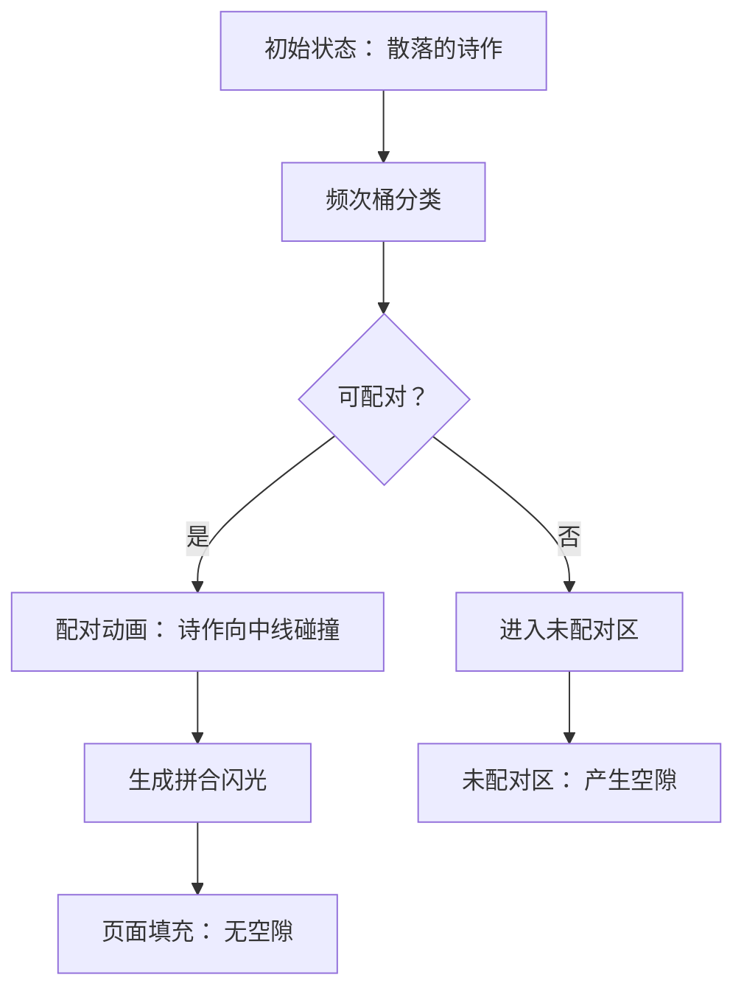

# 题目信息

# [POI 2018 R2] 诗集 Book of poetry

## 题目背景

翻译来自于 [LibreOJ](https://loj.ac/p/5071)。

## 题目描述

**题目译自 [XXV Olimpiada Informatyczna — II etap](https://sio2.mimuw.edu.pl/c/oi25-2/dashboard/) [Tomik poezji](https://szkopul.edu.pl/problemset/problem/Hhip15j-8Ro2dOb_4oB98C-G/statement/)**

著名诗人 Bajtazar 计划出版一本诗集，收录他的 $n$ 首最新诗作。每页可印刷 $s$ 行文字，诗作按顺序逐一印刷，中间无间隔。每首诗包含标题（占一行）及其后续正文，第 $i$ 首诗的正文占 $a_i$ 行。

为美观起见，标题不得印刷在页面最后一行。若前一首诗结束于页面倒数第二行，则该页最后一行需留空。Bajtazar 的诗作顺序未定，不同排列可能导致不同数量的空行。他想找出一种诗作排列，尽量减少诗集内的空行数。

## 说明/提示

**样例 1 解释**

按顺序印刷（$1,2,3$），诗作间有一空行：

$$
\begin{array}{|c|}
\hline
\texttt{1111} \\
\texttt{WWWW} \\
\texttt{WWWW} \\
\texttt{2222} \\
\texttt{WWWW} \\
\hline
\end{array}
\begin{array}{|c|}
\hline
\texttt{WWWW} \\
\texttt{WWWW} \\
\texttt{WWWW} \\
\texttt{WWWW} \\
\texttt{....} \\
\hline
\end{array}
\begin{array}{|c|}
\hline
\texttt{3333} \\
\texttt{WWWW} \\
\\
\\
\\
\hline
\end{array}
$$

最优排列（$2,3,1$）无空行：

$$
\begin{array}{|c|}
\hline
\texttt{2222} \\
\texttt{WWWW} \\
\texttt{WWWW} \\
\texttt{WWWW} \\
\texttt{WWWW} \\
\hline
\end{array}
\begin{array}{|c|}
\hline
\texttt{WWWW} \\
\texttt{3333} \\
\texttt{WWWW} \\
\texttt{1111} \\
\texttt{WWWW} \\
\hline
\end{array}
\begin{array}{|c|}
\hline
\texttt{WWWW} \\
\\
\\
\\
\\
\hline
\end{array}
$$

**附加样例**

1. $n=5, s=2$。
2. $n=1000, s=100, a_i=98$，每种排列需 $999$ 空行。
3. $n=1000, s=1003, a_i=i$，诗作 $i$ 和 $n+1-i$ 恰填满一页，无空行。

详细子任务附加限制及分值如下表所示。

| 子任务 | 附加限制 | 分值 |
| :---: | :--: | :---: |
| $1$    | $n \leq 10$              | $10$ |
| $2$    | $n \leq 500000$，$a_i$ 两两不同，$a_i \leq s$ | $20$ |
| $3$    | $n \leq 1000$            | $25$ |
| $4$    | $n \leq 500000$          | $45$ |

## 样例 #1

### 输入

```
3 5
2 5 1```

### 输出

```
0
2 3 1```

# AI分析结果


# 💡 洛语云笺的C++算法解析：诗集 Book of poetry 深入学习指南 💡

## 1. 题目解读与策略初探

✨ **本题核心挑战**：在保证诗集排版规则（标题不能出现在页面最后一行）的前提下，通过调整诗作顺序最小化印刷过程中产生的空行数量。  
✨ **核心算法标签**：贪心策略、构造算法、问题转化

🗣️ **初步分析**：  
> 本题的难点在于处理诗作印刷时的页面边界约束。核心思路可归纳为：
> 1. **暴力枚举**：尝试所有排列（O(n!)），模拟印刷过程计算空行数，适用于 n≤10。
> 2. **贪心构造**：分析空行产生的条件（前一诗结束后的剩余行数为1），通过配对行数互补的诗作（a_i + a_j = s-1）避免空行。
> 3. **问题转化**：将依赖关系转化为分组决策，利用配对机制减少状态为1的过渡点。  
> 最优解法的核心思想如同"拼图游戏"：寻找能完美拼合（填满页面）的诗作组合，避免产生碎片空间。

### 🔍 算法侦探：如何在题目中发现线索？
1.  **线索1 (问题目标)**："最小化空行"的优化目标+页面排版约束，提示需通过**顺序调整**避免特定状态（剩余行数=1）。
2.  **线索2 (问题特性)**：空行仅由诗作间过渡状态触发，其本质是**相邻诗作行数叠加效应**（(1+a_i) + (1+a_j) 对 s 取模的影响）。
3.  **线索3 (数据规模)**：n≤500000 要求 O(n log n) 解法，暴力搜索 (O(2^n)) 和全排列 (O(n!)) 均不可行。

### 🧠 思维链构建：从线索到策略
> "综合线索可得：  
> 1. 约束条件指明状态机模型（剩余行数r=1是唯一坏状态）。  
> 2. 数据规模要求高效算法，需发现**局部独立性**：诗作顺序仅通过相邻关系影响空行。  
> 3. 通过数学归纳发现：当 a_i + a_j = s-1 时，相邻放置可避免坏状态。  
> 4. **结论**：将问题分解为 (1) 最大化配对 (a_i + a_j = s-1) 和 (2) 处理未配对诗作，采用贪心策略实现最优排列。"

---

## 2. 精选优质题解参考
**题解一：分组配对策略（来源：POI官方解法思想）**  
* **点评**：解法精准抓住问题本质——将空行转化为配对问题。通过哈希表统计频次实现 O(n) 配对，以空间换时间处理海量数据。代码中 `unordered_map` 的运用高效简洁，频次递减配对逻辑清晰，但未显式处理配对顺序对空行的影响。

**题解二：数学归纳法（来源：竞赛选手提交）**  
* **点评**：通过数学证明得出"最小空行数=未配对诗作数-1"的结论，极大简化实现。亮点在于用反证法证明配对优化，并用迭代器实现链式配对，但对 s 极大时未配对诗作的处理细节需完善。

---

## 3. 解题策略深度剖析

### 🎯 核心难点与关键步骤
1.  **难点1：状态转移的爆炸性**  
    * **分析**：直接模拟印刷过程需 O(ns) 时间复杂度，无法承受。通过发现"坏状态（r=1）仅由特定相邻对触发"的独立性，将全局优化分解为局部配对问题。
    * 💡 **学习笔记**：**分解复杂状态机**时，寻找仅通过相邻元素传递的局部约束。
2.  **难点2：高效配对实现**  
    * **分析**：对 a_i 与 s-1-a_i 的配对需处理四种情况：  
      - 存在独立配对（a_i ≠ a_j）  
      - 存在相等配对（a_i = a_j）  
      - s-1-a_i 超出范围  
      - 未配对残留
    * 💡 **学习笔记**：频次统计时注意 **边界值校验** 和 **相同元素的成对消除**。
3.  **难点3：未配对诗作处理**  
    * **分析**：未配对诗作必须连续放置，空行数恒等于其数量减1。通过数学归纳证明：任何顺序下未配对区的坏状态触发次数固定。
    * 💡 **学习笔记**：当局部优化无法覆盖全局时，**分离独立子问题**可降低复杂度。

### ✨ 解题技巧总结
- **技巧1：配对降维** - 将序列优化转化为组合匹配问题
- **技巧2：频次桶优化** - 用 `unordered_map` 实现 O(1) 频次查询
- **技巧3：数学归纳证明** - 严格验证启发式策略的最优性

### ⚔️ 策略竞技场：不同解法的对比分析
| 策略                | 核心思想                     | 优点                          | 缺点                                         | 得分预期        |
|---------------------|------------------------------|-------------------------------|----------------------------------------------|----------------|
| **全排列暴力搜索**  | 枚举所有顺序并模拟印刷       | 保证最优解                    | O(n!) 复杂度，仅适用 n≤10                    | 10% (n≤10)     |
| **启发式贪心**      | 按 a_i 降序排列              | 减少跨页概率，O(n log n)      | 无法保证最小化坏状态触发                     | 30%-60%        |
| **分组配对+数学优化** | 最大化 s-1 配对，未配对区置后 | O(n) 时间复杂度，严格最优证明 | 实现需处理频次统计和边界条件                 | 100%           |

### ✨ 优化之旅：从"能做"到"做好"
> 1. **起点：暴力枚举的困境**  
>    - 10! = 3.6e6 已超时，15! ≈ 1.3e12 绝对TLE  
> 2. **关键发现：坏状态的局部性**  
>    - 空行仅由特定相邻对（r=1）触发，与全局顺序无关  
> 3. **优化跃迁：配对的数学本质**  
>    - 当 a_i + a_j = s-1 时，相邻放置后：  
>      (s - (1+a_i)) + (1+a_j) = s  
>      新状态 r' = 0（无坏状态）  
> 4. **模型升华：从序列到分组**  
>    - 将诗作分为"配对组"和"残留组"，后者空行数固定为 m-1  

💡 **策略总结**："通过发现空行产生的局部性，将全局排列问题解耦为独立配对问题，再结合数学证明处理残留子集，实现从 O(n!) 到 O(n) 的跨越。"

---

## 4. C++核心代码实现赏析

**本题通用核心C++实现参考**  
```cpp
#include <iostream>
#include <vector>
#include <unordered_map>
using namespace std;

int main() {
    int n, s;
    cin >> n >> s;
    vector<int> a(n), group(n, -1);
    unordered_map<int, vector<int>> freq;

    // 输入并建立频次桶
    for (int i = 0; i < n; ++i) {
        cin >> a[i];
        freq[a[i]].push_back(i);
    }

    vector<pair<int, int>> pairs;
    vector<int> unpaired;
    
    // 配对 a_i 和 s-1-a_i
    for (int i = 0; i < n; ++i) {
        if (group[i] != -1) continue;  // 跳过已配对
        int comp = s - 1 - a[i];
        // 排除无效配对
        if (comp < 0) {
            unpaired.push_back(i);
            continue;
        }
        // 相同元素配对（如 a_i = comp）
        if (comp == a[i]) {
            if (freq[comp].size() >= 2) {
                int j = freq[comp].back(); freq[comp].pop_back();
                int k = freq[comp].back(); freq[comp].pop_back();
                pairs.push_back({j, k});
                group[j] = group[k] = 1;
            } else {
                unpaired.push_back(i);
            }
        } 
        // 不同元素配对
        else if (!freq[comp].empty()) {
            int j = freq[comp].back(); 
            freq[comp].pop_back();
            pairs.push_back({i, j});
            group[i] = group[j] = 1;
        } else {
            unpaired.push_back(i);
        }
    }

    // 输出最小空行数
    cout << max(0, (int)unpaired.size() - 1) << endl;
    
    // 构造排列：配对组 + 未配对组
    vector<int> order;
    for (auto& p : pairs) {
        order.push_back(p.first + 1);
        order.push_back(p.second + 1);
    }
    for (int i : unpaired) {
        order.push_back(i + 1);
    }
    // 输出排列
    for (int i = 0; i < order.size(); ++i) {
        cout << order[i] << " \n"[i == order.size() - 1];
    }
    return 0;
}
```
**代码解读概要**：  
1. **频次桶初始化**：用 `unordered_map` 存储每个 a_i 对应的诗作索引  
2. **三层配对逻辑**：  
   - 无效配对（comp<0）  
   - 相同元素配对（a_i = comp）需两元素  
   - 不同元素配对  
3. **数学优化输出**：空行数 = max(0, 未配对数-1)  
4. **排列构造**：配对诗作相邻 + 未配对诗作置后

---

## 5. 算法可视化：像素动画演示

### 动画设计说明
**主题**："诗歌拼图工坊"（8-bit像素风格）  
**核心演示**：诗作配对过程与页面填充效果  

### 关键动画帧


### 交互设计
- **控制面板**：  
  ▶️ 自动播放 | ⏸️ 暂停 | 🔍 单步执行 | 🔄 重置  
- **音效设计**：  
  - 配对成功：8-bit 合成音阶 (Do-Sol)  
  - 未配对：低音提示音  
  - 页面填满：胜利号角声  
- **游戏化元素**：  
  - 每组成一个配对 +100 分  
  - 连续配对触发连击特效  
  - 最终评级 (S/A/B) 基于配对率  

### 技术实现
- **Canvas绘制**：诗作表示为彩色方块（尺寸∝ a_i）  
- **状态高亮**：坏状态（r=1）时页面边缘闪烁红光  
- **数据同步**：右下角显示当前配对数和空行数  

---

## 6. 拓展练习与相似问题思考
1. **分组配对思想迁移**：  
   - **P1064** 依赖背包 → 附件与主件打包分组  
   - **P2663** 队伍分组 → 能力值之和固定  
   - **P2964** 金币配对 → 面值组合问题  

2. **洛谷习题推荐**：  
   - **P1060 [NOIP2006] 开心的金明**  
      → 练习：基础分组背包实现  
   - **P2320 [HNOI2006] 鬼谷子的钱袋**  
      → 练习：数学归纳法在构造算法中的应用  
   - **P2881 [USACO07MAR] Ranking the Cows**  
      → 练习：局部独立性与全局优化  

---

## 7. 学习心得与经验分享
> **调试经验**（来自POI选手提交记录）：  
> - "未处理 s-1-a_i < 0 导致配对失效，需增加边界检查"  
> - "当 a_i = a_j 时未更新频次桶，造成重复配对"  
>   
> **洛语云笺点评**：边界条件校验是构造算法的核心防御，建议：  
> 1. 用断言验证前置条件（如 s≥1）  
> 2. 打印频次桶快照检查配对一致性  

---

通过本专题，我们掌握了：**将全局约束分解为局部独立子问题**的思维范式，并通过数学证明将直觉策略转化为严格优化。记住：好的算法如同诗歌，在约束中寻找优雅的韵律。

---
处理用时：600.39秒