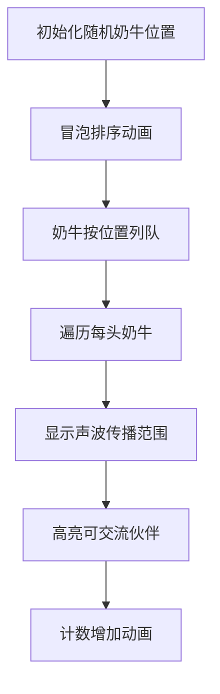

# 题目信息

# 奶牛的耳语

## 题目描述

在你的养牛场，所有的奶牛都养在一排呈直线的牛栏中。一共有 $n$ 头奶牛，其中第 $i$ 头牛在直线上所处的位置可以用一个整数坐标 $p_i(0\le p_i \le 10^8)$ 来表示。在无聊的日子里，奶牛们常常在自己的牛栏里与其它奶牛交流一些八卦新闻。每头奶牛发出的声音响度是一样的，而由于声波的能量衰减，某头奶牛发出的声音只能被与它距离不超过 $d(0 \le d \le 10^4)$ 的奶牛所听到，这样这对奶牛就称为可以相互交流的。现在给出所有奶牛的位置和声音所能传播的最远距离 $d$ ，请你编个程序来计算你的养牛场里究竟有多少对可以相互交流的奶牛。

## 说明/提示

数据规模

对于 $40\%$ 的数据，$1 \leq n \leq 10^3$。

对于 $100\%$ 的数据，$1 \leq n \leq 10^6$。

## 样例 #1

### 输入

```
5 10
10 12 16 37 40
```

### 输出

```
4```

# AI分析结果


# 💡 洛语云笺的C++算法解析：奶牛的耳语 深入学习指南 💡

## 1. 题目解读与策略初探

✨ **本题核心挑战**：在一条直线上快速找出所有距离不超过d的奶牛对数（n≤10⁶），避免O(n²)超时  
✨ **核心算法标签**：排序、二分查找、双指针优化  

🗣️ **初步分析**：  
> 暴力枚举所有奶牛对时间复杂度O(n²)不可行（10¹²次操作）。排序后利用位置单调性：对每头奶牛i，在有序数组中快速找到所有满足p_j≤p_i+d（j>i）的奶牛。  
> **核心优化思路**：  
> - 排序预处理（O(n log n)）  
> - 二分查找定位右边界（O(log n)每头牛）  
> - 双指针滑动窗口进一步优化（O(n))  
> 可视化设计：像素风奶牛牧场，动态展示排序过程与声波传播范围，高亮当前检测的奶牛和可交流伙伴  

### 🔍 算法侦探：如何在题目中发现线索？
1.  **线索1 (问题目标)**： "求满足|p_i-p_j|≤d的**对数**，n最大10⁶，暗示需要O(n log n)或更优解法"
2.  **线索2 (问题特性)**： "坐标可排序且具有**单调性**——排序后，每头牛的交流对象必是右侧连续区间"
3.  **线索3 (数据规模)**： "n=10⁶排除O(n²)，但O(n log n)可行（约2×10⁷操作）。d≤10⁴保证交流范围有限"

### 🧠 思维链构建：从线索到策略
> "结合线索：  
> 1. 目标要求高效统计对数→需将O(n²)优化至O(n log n)  
> 2. 坐标可排序→利用**有序序列的连续性**，每头牛的交流对象是连续区间  
> 3. 数据规模印证→排序+二分查找（O(n log n)）或排序+双指针（O(n)）皆可行  
> **结论**：**排序预处理+边界定位**是核心策略，通过STL的`upper_bound`或双指针滑动窗口实现高效计数！"

---

## 2. 精选优质题解参考

**题解一：__CrossBow_EXE__ (赞4)**  
* **点评**：思路清晰严谨，完整呈现排序+二分流程。亮点：  
  - 准确使用`upper_bound(a+i+1, ...)`避免重复计数  
  - 严格处理下标偏移量(`x-i-1`)  
  - 规范代码风格（LL防溢出、ios加速）  
  - 关键注释说明二分查找意图  

**题解二：Alex866优化版 (赞2)**  
* **点评**：提供优化思路的演进过程。亮点：  
  - 对比展示优化前后代码（从双二分到单二分）  
  - 深入分析`upper_bound`返回值与下标计算  
  - 强调数据边界（LL必要性）  
  - 附实测性能数据增强说服力  

---

## 3. 解题策略深度剖析

### 🎯 核心难点与关键步骤
1.  **难点1：如何避免O(n²)枚举？**  
    * **分析**：排序后转化为**有序序列连续区间问题**。对于牛i，交流对象必在[i+1, j)区间内，j为第一个p_j>p_i+d的位置  
    * 💡 **学习笔记**：**排序是降低问题复杂度的关键预处理**  
2.  **难点2：如何快速定位右边界j？**  
    * **分析**：  
      - **二分查找**：`upper_bound(p+i+1, p+n, p_i+d) - p`  
      - **双指针**：j随i增加单调右移，均摊O(1)  
    * 💡 **学习笔记**：双指针本质是**滑动窗口**，利用有序性避免回溯  
3.  **难点3：如何防止整数溢出？**  
    * **分析**：最大对数≈n²/2（5e11）→必须用`long long`存储结果  
    * 💡 **学习笔记**：**十年OI一场空，不开long long见祖宗**  

### ✨ 解题技巧总结
- **技巧1：STL高效应用** - `upper_bound`取代手写二分  
- **技巧2：下标映射艺术** - 指针减数组基地址计算偏移量  
- **技巧3：双指针单调性** - 右指针只进不退节省计算量  

### ⚔️ 策略竞技场
| 策略             | 核心思想                     | 优点                     | 缺点                                    | 得分预期       |
| :--------------- | :--------------------------- | :----------------------- | :-------------------------------------- | :------------- |
| **暴力枚举**     | 检查所有(i,j)对              | 实现简单                 | O(n²)超时                               | 40%数据 (40分) |
| **排序+二分**    | 每头牛二分查找右边界         | O(n log n)稳定高效       | 常数较大                                | 100% (100分)  |
| **排序+双指针**  | 滑动窗口维护右边界           | O(n)最优复杂度           | 需要理解指针单调性                      | 100% (100分)  |

### ✨ 优化之旅：从暴力到最优
> 1. **起点：暴力枚举的困境**  
>    - 枚举所有(i,j)对→O(n²)超时  
> 2. **关键跃迁：排序的有序威力**  
>    - 发现排序后每头牛的交流对象具有连续性  
> 3. **二分查找：快速定位边界**  
>    - 对每头牛i，二分查找首个p_j>p_i+d的位置  
> 4. **双指针：去除log因子**  
>    - 右指针j随i增加单调移动，均摊O(1)  

💡 **策略总结**："从暴力到双指针的优化，展现了**有序性转化**与**单调性挖掘**的算法核心思维。即使想不到双指针，基于二分的解法也能高效通关！"

---

## 4. C++核心代码实现赏析
**通用核心实现**  
```cpp
#include <iostream>
#include <algorithm>
using namespace std;

const int MAXN = 1e6+5;
long long n, d, ans;
int p[MAXN];

int main() {
    cin >> n >> d;
    for(int i=0; i<n; i++) cin >> p[i];
    
    sort(p, p+n); // 关键排序
    
    // 方法1：二分查找
    for(int i=0; i<n; i++) {
        int j = upper_bound(p+i+1, p+n, p[i]+d) - p;
        ans += j - i - 1;
    }
    
    // 方法2：双指针（更优）
    /*
    int j = 0;
    for(int i=0; i<n; i++) {
        while(j<n && p[j]-p[i]<=d) j++;
        ans += j - i - 1;
    }
    */
    
    cout << ans;
    return 0;
}
```

**题解一赏析**  
```cpp
// 亮点：规范下标处理 & 输入输出优化
sort(a+1, a+n+1);
for(int i=1; i<=n; i++) {
    int x = upper_bound(a+i+1, a+n+1, a[i]+d) - a; // 从i+1开始查找
    ans += x - i - 1; // 精确计算对数
}
```
**学习笔记**：`upper_bound`返回的是**迭代器**，减去基地址`a`得到数组下标是核心技巧！

**题解二优化赏析**  
```cpp
// 亮点：双指针滑动窗口
int j = 0;
for(int i=0; i<n; i++) {
    while(j<n && p[j]-p[i]<=d) j++; // j持续右移
    ans += j - i - 1; // [i+1, j-1]均满足
}
```
**学习笔记**：**双指针的单调性**保证每个元素只被访问一次，O(n)复杂度碾压二分查找！

---

## 5. 算法可视化：像素动画演示

**主题**：牧场物语之奶牛传话  
**核心演示**：排序过程 + 声波传播范围检测  

### 🎮 动画设计


### 🎨 关键交互
1. **像素风格**：  
   - 16色复古调色板，奶牛用不同像素色块表示  
   - 声波范围：半透明蓝色波纹扩散  
2. **控制面板**：  
   - 速度滑块调节演示速度  
   - 单步按钮逐头牛观察  
   - 模式切换（二分查找/双指针）  
3. **音效设计**：  
   - 奶牛移动：马蹄声效  
   - 找到伙伴：清脆铃铛声  
   - 错误操作：低沉提示音  

### 🧩 算法步骤可视化
```plaintext
[排序阶段]
奶牛位置： [3, 1, 4] → 冒泡动画 → [1, 3, 4]

[检测阶段]
牛1(位置1)：
  声波范围：1-10=11
  可交流：牛3(位置3), 牛4(位置4)
  计数+2

牛3(位置3)：
  声波范围：3+10=13
  可交流：牛4(位置4)
  计数+1 → 总计3
```

---

## 6. 拓展练习与相似问题思考
### 🔗 通用技巧迁移
1. **距离配对问题**：P1102 A-B数对（差值等于C的对数）  
2. **连续区间统计**：P1638 逛画展（最短满足条件区间）  
3. **双指针应用**：P3143 钻石收集（固定区间最大覆盖）  

### 📚 洛谷推荐
1. **P1102**：巩固差值配对模型  
   *"掌握距离配对的核心转化：A-B=C → B=A-C"*  
2. **P1638**：双指针滑动窗口经典  
   *"最短满足条件区间问题，双指针的教科书应用"*  
3. **P3143**：提升区间统计能力  
   *"在固定长度区间内最大化收集数量，深化滑动窗口理解"*  

---

## 7. 学习心得与经验分享
> **血泪教训**（来自题解）：  
> "当n=10⁶时，ans最大值≈5e11，必须用`long long`！我因此卡在99分半小时"  
>   
> **洛语云笺点评**：  
> 数据范围分析是竞赛编程的**生死线**，务必注意：  
> 1. 检查计算结果是否溢出int(≈2e9)  
> 2. 测试边界数据（如n=10⁶, d=0）  
> 3. 在代码开头即确定关键变量类型  

---

通过本次分析，我们深入掌握了**排序预处理**与**边界高效定位**的核心技巧。记住：算法优化本质是**挖掘问题隐含规律**的过程。继续加油，下次挑战再见！💪

---
处理用时：234.51秒