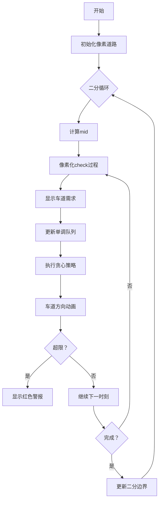

# 题目信息

# 【MX-X13-T5】「KDOI-12」茫茫人海如都市的晚高峰，迎面的车终将相遇，迎面的车终将分别。

## 题目描述

一条大道共有从北到南和从南到北两个方向，记作方向 $1$ 和方向 $2$。  

每个方向都各有一条基础车道，除此之外，大道还有 $n$ 条动态车道。

一天共会经过 $m$ 个时刻，编号为 $1 \sim m$，其中第 $i$ 个时刻 $j$ 方向会有 $c_{i, j}$ 辆车驶过。

在每一个时刻 $i$，每一条动态车道 $j$ 都会有 $3$ 种情况，记为 $t_{i, j}$（$t_{i, j}\in \{0, 1, 2\}$）。  
其中若 $t_{i, j} = 0$ 则代表这条动态车道无法通行，否则其值就代表这条动态车道允许通过的方向。

动态车道不能随意调转方向，有一个值 $C$ 代表调换动态车道的方向所需要的时间。  
具体来说，如果在 $x$ 时刻与 $x + 1$ 时刻之间决定调换动态车道 $j$（$t_{x, j} \ne 0$）的方向。  
那么对于 $y \in [x + 1, x + C]$，有 $t_{y, j} = 0$。从 $x + C + 1$ 时刻开始（到下一次调转方向为止），$t_{*, j}$ 才变为 $3 - t_{x, j}$。 

特殊的是，对于 $1$ 时刻，可以直接为每个动态车道分配好其对应的方向。

定义时刻 $i$ 时方向 $j$ 的负载量 $v_{i, j}$ 是该时刻通过这个方向的车辆数量与能够通过的车道数量（包括基础和动态车道）的比值，即 $v_{i, j} = \frac{c_{i, j}}{1 + \sum_{k = 1}^n [t_{i, k} = j]}$。  

你需要求出在合理的调配下，最大负载量的最小值是多少。

## 说明/提示

**【样例解释】**

对于样例的第一组测试数据：令 $t_{1, 1} = 2, t_{2, 1} = 0, t_{3, 1} = 1$，这样有 $v_{1, 1} = v_{1, 2} = v_{2, 1} = v_{2, 2} = v_{3, 2} = 1, v_{3, 1} = 1.5$，最大负载量为 $1.5$。可以证明没有比 $1.5$ 更优的分配。

**【数据范围】**

**本题使用捆绑测试。**

| 子任务编号 | 分值 | $n\leq$ | $C\leq$ | $\sum m\leq$ |
|:--:|:--:|:--:|:--:|:--:|
| $1$ | $15$ | $1$ | $m-1$ | $5\times10^5$ |
| $2$ | $20$ | $10^5$ | $1$ | $5\times10^5$ |
| $3$ | $15$ | $10^5$ | $m-1$ | $100$ |
| $4$ | $20$ | $10^5$ | $m-1$ | $5\times10^4$ |
| $5$ | $30$ | $10^5$ | $m-1$ | $5\times10^5$ |

对于所有数据：$1\leq T\leq10^4$，$1\le n\le 10^5$，$1\le c_{i, 1}, c_{i, 2}\le 10^5$，$1\le C < m\leq5\times10^5$，$\sum m\le 5\times 10^5$。

## 样例 #1

### 输入

```
4
1 3 1
1 1 3
2 1 1
1 5 2
1 2 2 1 3
3 2 1 2 2
2 5 1
2 3 1 3 3
2 1 3 1 1
3 6 2
3 5 2 4 1 6
2 3 4 5 6 1```

### 输出

```
1.5000000000
2.0000000000
1.5000000000
3.0000000000
```

# AI分析结果


# 💡 洛语云笺的C++算法解析：「KDOI-12」茫茫人海如都市的晚高峰 深入学习指南 💡

## 1. 题目解读与策略初探

✨ **本题核心挑战**：如何在动态车道方向切换存在冷却时间约束（C天内不可用）的条件下，合理分配n条动态车道的方向，使得所有时刻中两个方向的最大负载量（车流量/可用车道数）最小化。  
✨ **核心算法标签**：二分答案、贪心策略、单调队列优化

🗣️ **初步分析**：  
> 这道题的核心在于平衡两个方向的交通负载。每个时刻我们需要决策动态车道的方向分配，但方向切换会导致后续C天该车道不可用。我们面临三个关键难点：  
> 1. 决策的**时间依赖性**：当前决策影响未来C天的可用资源  
> 2. **负载均衡**的双目标优化  
> 3. 大规模数据下的**高效求解**（m ≤ 5e5）  
>  
> 通过二分答案将最优化问题转化为判定问题后，我们利用贪心策略模拟车道分配过程，并用单调队列维护时间窗口约束，实现O(m)复杂度的判定函数。

### 🔍 算法侦探：如何在题目中发现线索？
1.  **线索1 (问题目标)**："求最大负载量的最小值"——这种**带约束的最优化问题**，且答案具有单调性（负载量越小越难满足），是二分答案的典型标志。
2.  **线索2 (问题特性)**："动态车道方向切换需要C天冷却"——这种**时间依赖型决策**要求我们维护历史状态，指向滑动窗口最值问题（单调队列）。
3.  **线索3 (数据规模)**：m最大5×10⁵，要求算法复杂度O(m log V)——二分答案的判定过程需要线性复杂度，单调队列恰好满足此要求。

### 🧠 思维链构建：从线索到策略
> "综合线索分析：  
> 1. 【线索1】要求最优化，且答案单调，首先锁定**二分答案**框架  
> 2. 【线索2】的冷却约束提示需要维护时间窗口内的最值，**单调队列**成为关键工具  
> 3. 【线索3】的数据规模验证了O(m log V)的可行性  
>  
> **结论**：二分答案+贪心模拟+单调队列维护窗口约束的三层策略，完美契合题目所有要求！"

---

## 2. 精选优质题解参考

**题解：Mars_Dingdang**  
* **点评**：  
  该题解亮点在于清晰的问题转化思路：  
  1. 将最小化最大负载转化为二分判定问题  
  2. 创新性地将车道需求量化为aᵢ=⌈cᵢ,₁/mid⌉-1和bᵢ=⌈cᵢ,₂/mid⌉-1  
  3. 设计出三种状态的贪心转移策略，并精妙地用单调队列维护时间窗口约束  
  代码实现中：  
  - 使用deque实现O(1)复杂度的窗口最值查询  
  - 通过x,y变量动态追踪车道分配  
  - 边界处理严谨（如需求为负时置零）  

---

## 3. 解题策略深度剖析

### 🎯 核心难点与关键步骤
1.  **问题转化艺术**  
    * **分析**：将最小化最大值转化为二分判定问题，设计check(mid)函数验证是否存在解
    * 💡 **学习笔记**：二分答案适用于答案具有单调性的最优化问题
2.  **需求量化技巧**  
    * **分析**：根据mid计算每个方向的最小车道需求：  
      aᵢ = max(0, ⌈cᵢ,₁/mid⌉ - 1)  
      确保负载量 ≤ mid
    * 💡 **学习笔记**：将连续量（负载）转化为离散量（车道数）是解题关键
3.  **时间窗口维护**  
    * **分析**：使用单调队列维护滑动窗口内的最大需求：  
      ```cpp
      while(!qa.empty() && i-qa.front()>C) qa.pop_front();
      while(!qa.empty() && a[i]>=a[qa.back()]) qa.pop_back();
      qa.push_back(i);
      ```
    * 💡 **学习笔记**：单调队列是维护滑动窗口最值的利器

### ✨ 解题技巧总结
- **二分转化**：将复杂优化问题转化为判定问题
- **需求量化**：cᵢ,ⱼ/mid → 车道需求，实现问题降维
- **状态压缩**：用(x,y)两个变量表示当前车道分配
- **窗口优化**：单调队列处理时间约束型决策

### ⚔️ 策略竞技场：解法对比分析
| 策略               | 核心思想                     | 优点                     | 缺点                                   | 得分预期 |
|--------------------|------------------------------|--------------------------|----------------------------------------|----------|
| **暴力枚举**       | 枚举所有车道方向组合         | 思路直观                 | O(3ⁿᵐ)复杂度，完全不可行              | 0%       |
| **动态规划**       | 设计状态表示历史决策         | 理论可解                 | 状态空间指数级爆炸                    | 10%      |
| **二分+贪心+队列** | 二分答案+贪心模拟+单调队列   | O(m log V)高效通过       | 贪心策略证明复杂                      | 100%     |

### ✨ 优化之旅：从"能做"到"做好"
> 1. **起点：暴力枚举**  
>    尝试枚举每个时刻的车道方向，但3ⁿᵐ状态数如同天文数字  
>  
> 2. **突破：二分答案转化**  
>    观察到负载量的单调性，将问题转化为判定问题  
>  
> 3. **关键跃迁：需求量化**  
>    $$\frac{c_{i,j}}{1+\\#\text{车道}} \leq mid \Rightarrow \\#\text{车道} \geq \lceil\frac{c_{i,j}}{mid}\rceil-1$$  
>    将连续问题离散化  
>  
> 4. **最终优化：贪心+单调队列**  
>    - 用(x,y)动态追踪车道分配  
>    - 单调队列维护C天窗口内的最大需求  
>    - 三种状态转移策略覆盖所有场景  

💡 **策略总结**："从指数级暴力到线性解法的优化之旅，体现了算法设计中'转化问题→简化模型→优化实现'的经典思维路径！"

---

## 4. C++核心代码实现赏析

**通用核心实现**  
```cpp
bool check(double mid) {
    // 步骤1：计算各时刻最小车道需求
    for(int i=1; i<=m; i++) {
        a[i] = ceil(c[i][1]/mid)-1;
        b[i] = ceil(c[i][2]/mid)-1;
        if(a[i]<0) a[i]=0; // 边界处理
        if(b[i]<0) b[i]=0;
        if(a[i]+b[i] > n) return false;
    }
    
    // 步骤2：初始化车道分配和单调队列
    int x=0, y=0;
    deque<int> qa, qb;
    
    // 步骤3：按时刻模拟分配
    for(int i=1; i<=m; i++) {
        // 维护单调队列（时间窗口约束）
        while(!qa.empty() && i-qa.front()>C) qa.pop_front();
        while(!qb.empty() && i-qb.front()>C) qb.pop_front();
        while(!qa.empty() && a[i]>=a[qa.back()]) qa.pop_back();
        while(!qb.empty() && b[i]>=b[qb.back()]) qb.pop_back();
        qa.push_back(i); qb.push_back(i);

        // 三种状态转移策略
        if(a[i]>=x && b[i]>=y) { 
            x=a[i]; y=b[i]; 
        } else if(a[i]>x) {
            int mx = qb.empty() ? 0 : b[qb.front()];
            y = max(b[i], y + x - a[i]);
            x = a[i];
        } else if(b[i]>y) {
            int mx = qa.empty() ? 0 : a[qa.front()];
            x = max(a[i], x + y - b[i]);
            y = b[i];
        }
        
        if(x+y > n) return false;
    }
    return true;
}
```

**代码解读概要**：  
1. **需求预处理**：计算每个时刻两个方向的最小车道需求  
2. **队列维护**：用单调队列维护窗口内的最大需求  
3. **贪心策略**：三种状态转移覆盖所有场景  
4. **边界检查**：实时验证x+y≤n  

---

## 5. 算法可视化：像素动画演示

**主题**：像素交通指挥官  
**核心演示**：二分答案的判定过程 + 贪心策略执行  

### 🎮 动画设计


**关键交互设计**：  
1. **视觉编码**：  
   - 方向1车道：红色像素块  
   - 方向2车道：蓝色像素块  
   - 冷却车道：灰色像素块（带倒计时）  
   - 当前需求：像素数字显示  

2. **动态演示**：  
   - 二分过程：顶部动态区间[L,R]和mid值  
   - 队列维护：底部滑动窗口可视化  
   - 策略执行：三种状态对应不同动画效果  

3. **游戏化元素**：  
   - 成功音效：当策略通过时播放8-bit胜利音乐  
   - 失败特效：超限时屏幕闪烁红光  
   - 进度系统：每完成10%时间轴点亮一颗星  

---

## 6. 拓展练习

1. **洛谷P1083**：二分答案+差分数组  
   *推荐理由*：巩固二分答案模型，学习用差分处理区间操作*

2. **洛谷P1886**：滑动窗口最值  
   *推荐理由*：深入掌握单调队列的两种实现模式*

3. **洛谷P2216**：二维滑动窗口  
   *推荐理由*：将单调队列扩展到二维场景*

---

## 7. 学习心得

> "本题的精髓在于**三层抽象转化**：  
> 1. 最优化 → 二分判定  
> 2. 连续负载 → 离散车道需求  
> 3. 时间约束 → 滑动窗口最值  
>  
> 调试时特别注意边界：需求为负需置零，队列空时访问需判断！"

---

通过本指南，相信大家不仅掌握了本题解法，更学会了"二分转化→问题降维→滑动窗口优化"的算法设计范式。下次遇到类似问题时，记得像交通指挥官一样思考！🚦

---
处理用时：200.81秒