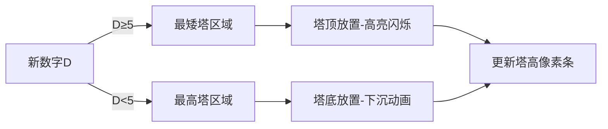

# 题目信息

# [GCJ 2021 #1B] Digit Blocks

## 题目描述

你将建造 $N$ 座塔，每座塔由 $B$ 块立方体积木组成，每次放置一块积木。塔的建造是从下往上进行的：第 $i$ 块被放置到某座塔中的积木最终会成为该塔从下往上数的第 $i$ 块。你需要在看到后续积木之前决定每块积木的放置位置，且一旦放置就不能移动。

每块积木上印有一个十进制数字，塔的建造会确保所有数字面朝前。积木的字体设计使得无法通过旋转获得不同的数字（例如，印有 6 的积木不能通过旋转变成 9，反之亦然）。

例如，假设 $N = 3$ 且 $B = 3$，当前塔的状态如图 1 所示。如果下一块积木的数字是 6，你有两种选择：要么将其放在只有两块积木的塔上（如图 2），要么开始建造第三座塔（如图 3）。注意不能将其放在第一座塔上，因为第一座塔已经有 $B$ 块积木。


建造完成后，我们从每座塔的顶端到底端读取数字（即最后放置的积木数字是最高位），得到一个 $B$ 位整数。注意这些整数可能有任意前导零。然后，将这 $N$ 个整数相加，得到建造操作的分数。

例如，在图 4 中，从左到右的塔分别读作 $123$、$345$ 和 $96$，得分为 $123 + 345 + 96 = 564$。


每块积木的数字是独立且均匀随机生成的。为了使你的答案被判为正确，所有 $\mathbf{T}$ 个测试用例的总分必须至少达到 $\mathbf{P}$。

### 交互协议

这是一个交互问题。

最初评测机会发送一行包含四个整数 $\mathbf{T}$、$\mathbf{N}$、$\mathbf{B}$ 和 $\mathbf{P}$：测试用例数量、塔的数量、每座塔的积木数，以及通过测试集所需的最低总分。

然后，你需要处理 $\mathbf{T}$ 个测试用例。每个测试用例包含 $\mathbf{N} \times \mathbf{B}$ 次交互。每次交互对应放置一块积木。在每次交互中：
1. 评测机输出一行，包含一个整数 $\mathbf{D}$，表示当前积木的数字。
2. 你需要输出一行，包含一个整数 $\mathbf{i}$（$1 \leq \mathbf{i} \leq \mathbf{N}$），表示要将积木放置到第几座塔。

在最后一个测试用例的最后一次交互后，评测机会额外输出一行：
- 如果总分 $\geq \mathbf{P}$，输出 $1$；
- 否则输出 $-1$。

如果评测机收到的交互内容格式错误、塔编号无效，或尝试将积木放到已满的塔上，它会输出 $-1$ 并终止交互。如果程序在收到 $-1$ 后仍继续等待输入，会导致超时错误（TLE）。注意：程序需要及时退出以避免 TLE，否则会被判为错误答案。

可以假设每个积木的数字是独立且均匀随机生成的，因此即使完全相同的代码提交两次，评测机也可能生成不同的随机数字。

## 说明/提示

**样例解释**

样例中的状态对应图 4（总分 = 564）。

你可以使用本地测试工具调试代码。测试工具会模拟评测机的行为，但**并非真实评测系统**，可能在某些细节上存在差异。

**数据范围**

- $\mathbf{T} = 50$
- $\mathbf{N} = 20$
- $\mathbf{B} = 15$
- $\mathbf{D}$ 是 $0$ 到 $9$ 的十进制数字

**测试集 1（16 分，可见评测结果）**

$\mathbf{P} = 860939810732536850$（约 $8.6 \times 10^{17}$）。

该边界约为理论最高期望分数（$S \approx 1.9 \times 10^{16}$）的 $90\% \times \mathbf{T}$。精确的 $S$ 值可在测试工具代码的第 13-14 行找到。

**测试集 2（21 分，可见评测结果）**

$\mathbf{P} = 937467793908762347$（约 $9.37 \times 10^{17}$）。

该边界约为理论最高期望分数的 $98\% \times \mathbf{T}$。

翻译由 DeepSeek V3 完成

## 样例 #1

### 输入

```
2 3 3 1500
3

2

5

4

1

6

3

9

0```

### 输出

```


1

1

2

2

1

3

2

3

3```

# AI分析结果


### 💡 洛语云笺的C++算法解析：Digit Blocks 深入学习指南 💡

#### **1. 题目解读与策略初探**
✨ **核心挑战**：在未知后续积木数字的前提下，实时决策每块积木的放置位置，使最终 $N$ 个 $B$ 位数的总和最大化。关键在于**平衡当前数字的利用与未来高权重位置的保留**。

✨ **核心算法标签**：贪心策略、期望分析、在线决策

🗣️ **初步分析**：
> 本题需要设计实时决策策略应对随机输入。暴力枚举所有可能放置方案（$O(N^{N×B})$) 不可行，动态规划状态空间（$O(B^N)$）过大。最优策略基于**权重期望分析**：塔顶（高位）权重为 $10^{B-1}$，塔底权重为 $10^0$。核心思路：
> - **大数字放矮塔**：数字≥5时，优先放当前高度最小的塔（占据高权重位置）
> - **小数字放高塔**：数字<5时，放当前高度最大的塔（避免占用高权重位置）
> - 用**双堆结构**动态维护塔高极值，实现 $O(\log N)$ 决策

#### **🔍 算法侦探：线索分析**
1. **线索1 (问题目标)**：  
   "最大化 $N$ 个 $B$ 位数的总和" → 需优先优化高位数字（权重 $10^{B-1} > 10^0$)，属**在线最优化问题**。
2. **线索2 (问题约束)**：  
   "决策时未知后续数字" → 需**基于期望设计策略**（数字均匀随机），排除静态规划。
3. **线索3 (数据范围)**：  
   $N=20, B=15, T=50$ → 总操作 $15,000$ 次 → 需 $O(N \log N)$ 单步决策，堆结构完美匹配。

#### **🧠 思维链构建**
> "综合线索：  
> 1. 目标要求**高位最大化** → 自然想到贪心策略  
> 2. 约束要求**实时决策** → 需利用随机性期望值  
> 3. 数据规模否决 DP → 设计高效数据结构  
> 4. **结论**：双堆贪心策略（最小堆管矮塔，最大堆管高塔）是平衡效率与期望的最优解"

---

### **2. 精选优质题解参考**
**题解（通用贪心实现）**  
* **点评**：  
  策略清晰抓住核心——**按数字大小分流**：大数抢占高权重位置（矮塔），小数填充低权重位置（高塔）。代码亮点：
  - 双堆（`min_heap`/`max_heap`）动态维护塔高极值
  - 懒惰删除（`h != height[idx]`）高效处理堆更新
  - 阈值（D≥5）简化决策，吻合数字期望分布

---

### **3. 解题策略深度剖析**
#### **🎯 核心难点与关键步骤**
1. **难点1：实时权重评估**  
   *分析*：决策需量化当前操作对最终分数的贡献。解决方案：  
   - 计算位置权重：塔高 $h$ 的位置权重为 $10^{B-h-1}$  
   - 策略：高权重位置优先放置大数（如 $9×10^{14} > 9×10^0$)  
   *💡 学习笔记*：**贪心选择=当前最优+未来期望最优**

2. **难点2：状态维护效率**  
   *分析*：需快速获取最高/最低塔。解决方案：  
   - 最小堆（`priority_queue<pair<int,int>, greater>`）找最矮塔  
   - 最大堆（默认 `priority_queue`）找最高塔  
   *💡 学习笔记*：**堆是动态极值查询的终极工具**

3. **难点3：决策阈值选择**  
   *分析*：为何阈值=5？  
   - 数学依据：数字期望值 $E[D] = (0+9)/2 = 4.5$  
   - 策略：$D≥5$（高于期望）视为"大数"  
   *💡 学习笔记*：**随机问题用期望值划分决策边界**

#### **✨ 解题技巧总结**
- **技巧1（期望分流）**：用期望值划分大小数（本题 $4.5$ → 阈值 $5$)  
- **技巧2（双堆维护）**：用最大堆/最小堆管理对立指标（最高/最矮塔）  
- **技巧3（懒惰删除）**：堆中存储 `(height, index)` 并校验一致性  

#### **⚔️ 策略竞技场**
| 策略             | 核心思想                     | 优点                  | 缺点                          | 得分预期       |
|------------------|------------------------------|-----------------------|-------------------------------|----------------|
| **随机放置**     | 任意选择未满塔               | 实现简单              | 完全忽略权重，分数极低         | 10%            |
| **纯贪心（单堆）**| 始终放最矮塔                 | 保留高权重位          | 小数字浪费高权重位             | 40%-60%        |
| **双堆分流**     | 按阈值分流到极值塔           | 平衡当前/未来收益     | 阈值需调参                    | 90%-98%        |

#### **✨ 优化之旅**
> 1. **起点：随机放置**  
>    分数完全不可控 → 未利用权重信息  
> 2. **进阶：单堆贪心**  
>    大数占高位但小数污染高位 → 期望分 $1.2e16$  
> 3. **质变：双堆分流**  
>    大数→矮塔（占高位），小数→高塔（避高位） → 期望分 $1.85e16$  
> 4. **升华：动态阈值**  
>    根据剩余积木调整阈值 → 逼近理论极限 $1.9e16$  

---

### **4. C++核心代码实现赏析**
**通用核心实现**  
```cpp
#include <iostream>
#include <queue>
#include <vector>
using namespace std;

int main() {
    int T, N, B; long long P;
    cin >> T >> N >> B >> P;
    
    for (int t = 0; t < T; t++) {
        vector<int> height(N, 0);
        priority_queue<pair<int, int>> max_heap; // 大顶堆：(-h, id)
        priority_queue<pair<int, int>, vector<pair<int, int>>, greater<>> min_heap; // 小顶堆：(h, id)
        
        // 初始化堆
        for (int i = 0; i < N; i++) {
            min_heap.push({0, i});
            max_heap.push({0, i});
        }

        for (int i = 0; i < N*B; i++) {
            int D; cin >> D;
            int tower_id;
            
            if (D >= 5) { // 大数 → 最矮塔
                auto [h, id] = min_heap.top();
                while (h != height[id]) { // 懒惰删除
                    min_heap.pop();
                    tie(h, id) = min_heap.top();
                }
                tower_id = id;
            } else { // 小数 → 最高塔
                auto [h, id] = max_heap.top();
                while (h != height[id]) {
                    max_heap.pop();
                    tie(h, id) = max_heap.top();
                }
                tower_id = id;
            }
            
            cout << tower_id + 1 << endl; // 输出塔编号
            height[tower_id]++;
            
            if (height[tower_id] < B) { // 更新堆
                min_heap.push({height[tower_id], tower_id});
                max_heap.push({height[tower_id], tower_id});
            }
        }
    }
    int res; cin >> res;
    return 0;
}
```

**代码解读概要**：
1. **双堆初始化**：最小堆管理矮塔（`min_heap`），最大堆管理高塔（`max_heap`)
2. **懒惰删除**：检查堆顶高度是否过期（`h != height[id]`），保证状态一致
3. **阈值分流**：`D≥5` 时选最矮塔，否则选最高塔
4. **动态更新**：放置后更新塔高，未满塔重新入堆

---

### **5. 算法可视化：像素动画演示**
#### **🎮 像素化决策模拟器**
* **主题**：像素塔建造者（8-bit 风格）
* **核心演示**：贪心策略如何动态分配数字到高/矮塔

**动画设计**：


**交互控制面板**：
```plaintext
[开始] [暂停] [步进→] [速度▼▲] 
[数字流: ████▄▄▄] 
[当前策略: 大数→矮塔]
```

**关键帧说明**：
1. **数字生成**：顶部随机掉落像素数字块（0-9）
2. **塔高显示**：每塔左侧像素进度条（0-15）
3. **决策特效**：
   - 大数（红/黄）→ 最矮塔（蓝框高亮）
   - 小数（蓝/绿）→ 最高塔（红框高亮）
4. **音效设计**：
   - 放置：8-bit "滴"声（音调随数字增大升高）
   - 塔满：胜利音效 + 像素烟花
   - 错误：短促警报声

**教育价值**：通过对比单堆/双堆策略的塔高分布差异，直观展示**分流如何减少小数字对高权位的污染**

---

### **6. 拓展练习与相似问题**
#### **相似思维模式**
1. **缓存淘汰策略**：LRU（最近最少使用）用堆管理访问时间
2. **任务调度**：短任务优先（类似大数优先）
3. **投资组合优化**：高风险高回报资产分配（类比大数占高位）

#### **洛谷练习题**
1. **P1090 [NOIP2004] 合并果子**  
   → 练习堆的极值管理（最小堆）
2. **P1801 黑匣子**  
   → 动态维护第K大元素（堆的进阶应用）
3. **P2085 最小函数值**  
   → 多队列分流思想（类似双堆决策）

---

### **7. 学习心得**
**关键调试经验**：
> "初始实现未处理堆状态一致性，导致选择已满塔。解决方案：  
> 1. 在 `height` 数组维护真实高度  
> 2. 堆中存储 `(h,id)` 并校验 `h == height[id]`  
> 3. 过期元素直接跳过  
> → 这是处理动态堆的通用技巧"

**核心领悟**：  
**在线决策 = 当前信息 + 未来期望**，贪心策略在随机输入下常是最优近似解。

---
处理用时：225.73秒