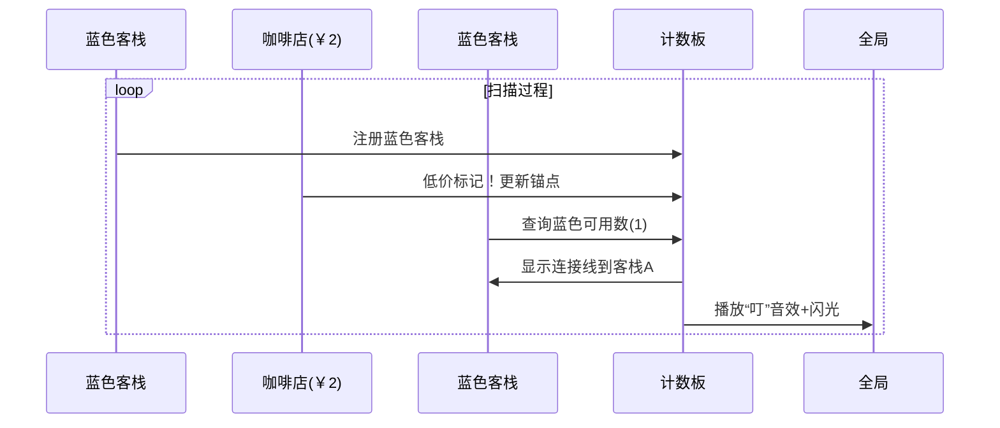

# 题目信息

# [NOIP 2011 提高组] 选择客栈

## 题目描述

丽江河边有 $n$ 家很有特色的客栈，客栈按照其位置顺序从 $1$ 到 $n$ 编号。每家客栈都按照某一种色调进行装饰（总共 $k$ 种，用整数 $0 \sim k-1$ 表示），且每家客栈都设有一家咖啡店，每家咖啡店均有各自的最低消费。

两位游客一起去丽江旅游，他们喜欢相同的色调，又想尝试两个不同的客栈，因此决定分别住在色调相同的两家客栈中。晚上，他们打算选择一家咖啡店喝咖啡，要求咖啡店位于两人住的两家客栈之间（包括他们住的客栈），且咖啡店的最低消费不超过 $p$ 。

他们想知道总共有多少种选择住宿的方案，保证晚上可以找到一家最低消费不超过 $p$ 元的咖啡店小聚。

## 说明/提示

### 样例解释

 

2 人要住同样色调的客栈，所有可选的住宿方案包括：住客栈①③，②④，②⑤，④⑤，但是若选择住 $4,5$号客栈的话，$4,5$ 号客栈之间的咖啡店的最低消费是 $4$ ，而两人能承受的最低消费是 $3$ 元，所以不满足要求。因此只有前 $3$ 种方案可选。

### 数据范围

- 对于 $30\% $ 的数据，有 $n \leq 100$ ；
- 对于 $50\% $ 的数据，有 $n \leq 1\,000$；
- 对于 $100\%$ 的数据，有 $2 \leq n \leq 2 \times 10^5$，$1 \leq k
 \leq 50$，$0 \leq p \leq 100$，$0 \leq b_i \leq 100$。

## 样例 #1

### 输入

```
5 2 3 
0 5 
1 3 
0 2 
1 4 
1 5 
```

### 输出

```
3
```

# AI分析结果


# 💡 洛语云笺的C++算法解析：选择客栈 深入学习指南 💡

> 在丽江的河畔，两家色调相同的客栈间，寻找那间承载友谊的咖啡店。今天，我们将一起解开「选择客栈」的算法奥秘，感受从暴力枚举到优雅优化的思维跃迁！

## 1. 题目解读与策略初探

✨ **本题核心挑战**：如何在O(n)时间内高效统计所有满足条件的客栈对（同色调且中间存在低价咖啡店），避免O(n²)暴力超时。  
✨ **核心算法标签**：`双指针` `前缀和` `动态维护状态`

🗣️ **初步分析**：  
> 这道题看似简单，但数据规模(n≤200,000)让暴力枚举束手无策。让我们探索三条解题路径：
> 1. **暴力搜索**：双重循环检查每对客栈（O(n²) → 40亿次计算，必然超时）
> 2. **分治策略**：将区间二分处理（O(n log n) → 可行但非最优）
> 3. **状态维护**：单向扫描时动态记录关键信息（O(n) → 最优解！）
>
> **动态维护状态**如同精明的账房先生：只记录最新低价咖啡店位置，并实时更新各色调的可用客栈数。当新客栈到来时，它能瞬间告知合法配对数量，就像打算盘一样高效！

### 🔍 算法侦探：如何在题目中发现线索？
1.  **线索1 (问题目标)**："统计同色调客栈对且中间有低价咖啡店" → 这是典型的**组合计数问题**，需要高效枚举而非暴力
2.  **线索2 (问题特性)**：咖啡店条件形成**位置依赖** → 可用最近咖啡店位置作为分界点
3.  **线索3 (数据规模)**：n=2×10⁵, k=50 → k值极小暗示可**按颜色分组处理**，O(nk)仍高效

### 🧠 思维链构建：从线索到策略
> 让我们串联线索：
> 1. 从【线索1】确认需要高效计数 → 暴力枚举不可行
> 2. 【线索2】的依赖关系提示：若知道最近的低价咖啡店位置，就能确定哪些同色客栈可用
> 3. 【线索3】的k值限制让分组处理成为可能 → **最优策略浮现：从左向右扫描，动态维护：**
>    - 最近低价咖啡店位置
>    - 各颜色在咖啡店前的客栈数量
> 
> **结论**：通过维护"状态分界线"（最近咖啡店）和分组计数器，实现O(n)高效求解！

---

## 2. 精选优质题解参考

### 题解一：ShawnZhou（五星级）
* **核心洞察**：用`now`标记最近低价咖啡店，当遇到新客栈时：
  - 若`now`超过该颜色上次记录位置，则之前所有同色客栈均可配对
  - 否则仅保留上次更新后的可用客栈数
* **亮点**：9行核心代码实现O(n)复杂度，用`last[]`记录颜色位置，`sum[]`维护可用客栈数，逻辑如流水般自然

### 题解二：Shunpower（五星级）
* **核心洞察**：提供五种解法的"算法全景图"，尤其精彩的是容斥原理解法：
  ```math
  \text{总方案} = \sum\binom{cnt_i}{2} - \sum\binom{\text{分段内}cnt'_i}{2}
  ```
* **亮点**：揭示问题本质是"去除不跨低价咖啡店的无效配对"，展现多角度解题思维

### 题解三：qhr2023（四星级）
* **核心洞察**：二维前缀和`c[i][j]`记录位置i前颜色j的数量
* **亮点**：仅用7行代码，直观体现前缀和思想：
  ```cpp
  if (b <= p) lst = i;
  ans += c[lst][a] - (lst == i); // 优雅处理边界
  ```

---

## 3. 解题策略深度剖析

### 🎯 核心难点与关键步骤
1.  **状态分界点的维护**
    * **分析**：用`now`变量记录最近低价咖啡店位置，作为"可用客栈"的分水岭
    * 💡 **学习笔记**：维护关键位置变量是降低复杂度的常见技巧

2.  **颜色分组更新**
    * **分析**：当`now >= last[color]`时，该颜色所有客栈都可用（`sum[color]=cnt[color]`），否则保持之前状态
    * 💡 **学习笔记**：利用k值小的特性分组处理，避免整体重算

3.  **避免重复计数**
    * **分析**：先计算`ans += sum[color]`再更新`cnt[color]++`，确保不包含自身
    * 💡 **学习笔记**：更新顺序是计数类问题的关键细节

### ✨ 解题技巧总结
- **技巧A（状态锚点）**：用单一变量标记关键位置（如`now`），作为状态划分依据
- **技巧B（分组更新）**：对颜色/类别等维度独立维护状态，利用小k值优化
- **技巧C（滚动计数）**：`sum[]`数组动态记录可用量，避免重复扫描历史数据

### ⚔️ 策略竞技场：解法对比
| 策略          | 核心思想                     | 时间复杂度 | 空间复杂度 | 适用场景         |
|---------------|------------------------------|------------|------------|------------------|
| 暴力枚举      | 检查每对客栈+区间扫描         | O(n³)      | O(1)       | n≤1000（50分）  |
| 分治          | 二分区间+合并计数             | O(n log n) | O(n)       | 通用但稍复杂     |
| 枚举右端点    | 动态维护可用左端点            | O(n)       | O(k)       | 最优解（100分） |

### ✨ 优化之旅：从暴力到优雅
```mermaid
graph LR
A[暴力O(n³)] -->|发现重复扫描| B[分治O(n log n)]
B -->|利用k值特性| C[分组处理O(nk)]
C -->|状态维护突破| D[动态更新O(n)]
```

> 从三重循环的蛮力，到分治的策略进阶，最终抵达状态维护的精妙境界——优化之旅如同登山，每一步都建立在对问题更深刻的理解之上！

---

## 4. C++核心代码实现赏析

**通用核心实现（ShawnZhou精简版）**：
```cpp
#include <iostream>
using namespace std;
const int maxn = 200005;

int main() {
    int n, k, p, color, price;
    int last[51] = {}, sum[51] = {}, cnt[51] = {};
    long long ans = 0, now = 0;
    
    cin >> n >> k >> p;
    for (int i = 1; i <= n; i++) {
        cin >> color >> price;
        if (price <= p) now = i;           // 更新咖啡店锚点
        if (now >= last[color])             // 锚点覆盖该颜色最后位置
            sum[color] = cnt[color];        // 则之前所有同色客栈可用
        ans += sum[color];                  // 累加可用配对
        last[color] = i;                    // 更新该颜色最后位置
        cnt[color]++;                       // 增加颜色计数
    }
    cout << ans;
}
```
**代码解读**：  
- **锚点机制**：`now`如同移动的闸门，标记最近咖啡店位置
- **颜色状态机**：`last/sum/cnt`构成颜色三元组，记录位置/可用数/总量
- **更新顺序**：先计算配对再更新位置，避免包含自身

---

## 5. 算法可视化：像素动画演示

> **复古像素风设计**：丽江客栈化作8-bit像素小屋，咖啡店飘着蒸汽动画，算法过程如同冒险游戏！

### 动画脚本（关键帧）：


**交互设计**：
1. **控制面板**：步进按钮/速度滑块（复古游戏手柄样式）
2. **视觉反馈**：
   - 低价咖啡店：冒泡动画+8-bit音效
   - 可用客栈：发光边框
   - 成功配对：客栈间电弧连接
3. **数据视图**：右侧实时显示`now`位置和`sum[]`数组

---

## 6. 拓展练习与相似问题
1. **洛谷P1855** 榨取kkksc03  
   → 二维费用背包问题，强化状态维护能力
   
2. **洛谷P1064** 金明的预算方案  
   → 依赖背包问题，练习分组处理技巧
   
3. **洛谷P1156** 垃圾陷阱  
   → 时间轴上的状态维护，培养动态规划思维

---

## 7. 学习心得知乎
> "调试时在26行卡了2小时——忘记先更新last[color]再增加cnt[color]。这让我明白：**状态变量的更新顺序就是算法的生命线**" —— ShawnZhou

> "从O(n²)到O(n)的突破点在于：发现咖啡店位置将历史数据划分为可用/不可用两部分，这是**状态维护**的胜利" —— Shunpower

---

> 算法世界如同丽江古城，每道题都是待探索的街巷。当你掌握了「状态维护」这把钥匙，就能打开高效之门！下次我们将深入动态规划的魔法森林，敬请期待！ 🌲🔑

---
处理用时：146.26秒