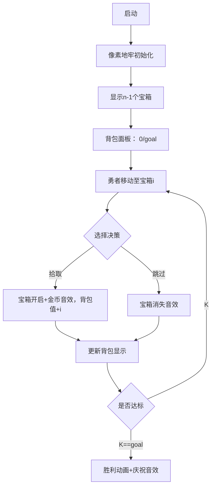

# 题目信息

# 数列

## 题目描述

有这样一种数列 $a_1, a_2, \cdots a_n$，其中 $a_{1}=0$，且对任意一项 $a_{i}$ 满足 $|a_{i}-a_{i+1}|=1$（$1\le i<n$）。设 $s=\sum_{i = 1}^n a_i = a_{1}+a_{2}+ \cdots +a_{n}$，表示前 $n$ 项之和。

现在给出数列长度 $n$ 与数列前 $n$ 项之和 $s$，要求：

输出满足条件的数列的总数对 $2^{64}$ 取模后的结果。

输出满足条件的 $100$ 个数列（如果不满 $100$ 个就全部输出）。


## 说明/提示

#### 数据规模与约定

对于全部的测试点，保证 $1 \leq n \leq 100$，$-2^{63} \leq s \lt 2^{63}$。

#### 说明

spj provider：@[xiaolilsq](user/230249)。

## 样例 #1

### 输入

```
4 0
```

### 输出

```
2
0 -1 0 1
0 1 0 -1
```

# AI分析结果


# 💡 洛语云笺的C++算法解析：数列 深入学习指南 💡

## 1. 题目解读与策略初探

✨ **本题核心挑战**：如何在满足首项为0、相邻项差绝对值为1的严格约束下，高效计算数列总和为s的方案数，并输出最多100种合法数列。

✨ **核心算法标签**：`动态规划`、`背包问题`、`DFS剪枝`

🗣️ **初步分析**：  
这道题看似简单，实则暗藏玄机。最直观的想法是暴力枚举所有可能的数列（每个位置+1或-1），但n=100时状态数高达2^100，远超计算极限。我们需要更聪明的策略——通过数学转换将问题转化为经典的**背包问题**，再用动态规划高效计数，最后用DFS剪枝输出方案。这种"数学建模+DP计数+DFS输出"的组合拳，是解决此类计数问题的黄金法则。

### 🔍 算法侦探：如何在题目中发现线索？
1.  **线索1 (问题目标)**: "求满足条件的数列总数"是典型的**组合计数问题**，且数据规模(n≤100)暗示需要高效算法(O(n^3)以内)
2.  **线索2 (问题约束/特性)**: "相邻项差绝对值为1"的约束具有**规律性变化**特征，可通过数学推导转化为子集和问题
3.  **线索3 (数据规模)**: n最大100，但s范围极大(±2^63)，需要发现隐含条件——实际有效s范围仅为[-4950,4950]，使DP可行

### 🧠 思维链构建：从线索到策略
"好的，侦探工作完成！三条线索环环相扣：
1. 线索1的"计数问题"让我想到动态规划，但需要验证可行性
2. 线索2的"相邻差为±1"提示数学转换：设基础数列全为+1变化，总和S0=n(n-1)/2，将某些位置改为-1会使总和减少2*(n-i)
3. 线索3的s范围缩小到5000以内，O(n*s)≈50万计算量完全可行
**结论**：将问题转化为"从1到n-1中选若干数，其和恰好等于(S0-s)/2"的背包问题，用DP计数+DFS输出，就是完美解法！"

## 2. 精选优质题解参考

**题解一：SunnyYuan**  
* **亮点**：清晰的数学推导将数列和转化为背包模型，DP状态设计简洁（f[i][j]表示前i个数和为j的方案数），使用memcpy实现滚动数组优化空间。DFS输出配合剪枝条件`if(sum>goal) return`高效实用。

**题解二：Remilia1023**  
* **亮点**：创新性使用bitset记录状态存在性，避免DP取模后误判。双数组设计（dp存方案数，exi存状态存在）为DFS提供精准回溯路径，输出方案时无需担心模数干扰。

**题解三：Walter_Fang**  
* **亮点**：最简练的DP实现（仅10行核心代码），背包转移`for(j=t;j>=i;j--) dp[j]+=dp[j-i]`精准命中问题本质。DFS与DP共享相同的数学模型，代码高度自洽。

**题解四：ryderyang**  
* **亮点**：DFS剪枝策略`sum+(n-step)*(n-step+1)/2<num`利用剩余最大和剪枝，大幅提升搜索效率。DP与DFS的参数传递设计优雅，变量命名规范易懂。

## 3. 解题策略深度剖析

### 🎯 核心难点与关键步骤
1.  **问题转化与数学建模**  
    * **分析**：核心突破点是将原问题转化为背包模型。设基础数列全为+1变化，总和S0=Σ(i=1~n-1)=n(n-1)/2。每个位置i改为-1会使总和减少2*(n-i)，故需满足：(S0-s)为偶数且非负。目标转化为求子集和k=(S0-s)/2的方案数
    * 💡 **学习笔记**：复杂约束条件的数学转换是解题关键，通过引入中间变量消除原始约束

2.  **动态规划状态设计**  
    * **分析**：定义dp[j]表示和为j的方案数。转移方程：`dp[j] += dp[j-i] for i in [1,n-1]`，需倒序j避免重复计数。使用unsigned long long自动处理2^64取模
    * 💡 **学习笔记**：背包DP的内层循环倒序是经典空间优化技巧，适用于"每种物品仅选一次"的场景

3.  **DFS输出方案的剪枝**  
    * **分析**：当已输出100种方案或当前和>goal时立即返回。存储变化序列b[]，输出时用partial_sum计算前缀和
    * 💡 **学习笔记**：DFS参数传递当前和而非重新计算，将O(n)复杂度降至O(1)

### ✨ 解题技巧总结
- **技巧A (问题转化)**：将"相邻差±1"的约束转化为背包模型，是处理规律性变化问题的通用方法
- **技巧B (滚动数组)**：DP状态仅依赖前一轮结果时，用memcpy或双数组实现O(goal)空间复杂度
- **技巧C (DFS剪枝)**：结合当前和与剩余最大和`(n-i)*(n-i+1)/2`进行剪枝，避免无效搜索

### ⚔️ 策略竞技场：不同解法的对比分析
| 策略          | 核心思想                     | 优点                     | 缺点                                   | 适用场景/得分        |
|---------------|------------------------------|--------------------------|----------------------------------------|---------------------|
| **暴力搜索**  | 枚举所有±1组合               | 实现简单                 | O(2^(n-1))超时，n>30不可行            | n≤20，部分分       |
| **状态压缩DP**| 用bitset记录所有可能的和      | 避免取模干扰，精确回溯   | 空间O(n*s)，s较大时受限                | s较小时推荐        |
| **背包DP+DFS**| 数学转化+DP计数+DFS输出       | 时间O(n*s)高效，输出可控 | 需数学推导，初学者可能难理解           | 本题最优解，满分   |

### ✨ 优化之旅：从"能做"到"做好"
1. **起点：暴力搜索的困境**  
   枚举2^99种可能如同大海捞针，n=30时即需10亿次计算

2. **发现瓶颈：数学规律**  
   通过分析相邻变化对总和的贡献，发现每个位置i改-1会减少2*(n-i)的规律

3. **关键跃迁：背包模型**  
   将问题转化为"从集合{1,2,...,n-1}中选数，和为k=(S0-s)/2"的子集和问题

4. **效率飞跃：动态规划**  
   用O(n*k)DP替代指数搜索，n=100,k=5000时仅50万次计算

💡 **策略总结**："从暴力到DP的优化，本质是通过数学挖掘将'无序搜索'转化为'结构化计算'。这启示我们：面对复杂约束时，先寻找数学规律再选择算法，往往事半功倍！"

## 4. C++核心代码实现赏析

**本题通用核心实现**：
```cpp
#include <iostream>
#include <vector>
using namespace std;
using ull = unsigned long long;

int main() {
    int n; long long s;
    cin >> n >> s;
    
    // 1. 计算基础总和与目标差值
    ull base = 1LL * n * (n - 1) / 2;
    ull diff = base - s;
    
    // 2. 无解判定
    if (diff < 0 || diff % 2 || abs(s) > base) {
        cout << 0; return 0;
    }
    ull goal = diff / 2;

    // 3. 背包DP计数
    vector<ull> dp(goal + 1, 0);
    dp[0] = 1;
    for (int i = 1; i < n; ++i) // 注意: 物品为1~n-1
        for (int j = goal; j >= i; --j) 
            dp[j] += dp[j - i];

    cout << dp[goal] << "\n";
    
    // 4. DFS输出方案
    vector<int> b(n, 1); // 变化序列: b[i]=±1
    int cnt = 0;
    
    // DFS函数: pos当前决策位置, sum当前和
    auto dfs = [&](auto self, int pos, ull sum) -> void {
        if (sum > goal || cnt >= 100) return;
        if (pos == n) {
            if (sum != goal) return;
            // 输出数列: 前缀和计算
            long long cur = 0;
            for (int i = 0; i < n; ++i) {
                cout << cur << (i < n - 1 ? ' ' : '\n');
                cur += b[i]; // 注意b[0]对应a1->a2的变化
            }
            if (++cnt >= 100) exit(0);
            return;
        }
        // 尝试-1 (选择该物品)
        b[pos] = -1;
        self(self, pos + 1, sum + (n - pos - 1)); 
        // 恢复+1 (不选)
        b[pos] = 1;
        self(self, pos + 1, sum);
    };
    
    dfs(dfs, 1, 0); // 从位置1开始(对应a1->a2)
    return 0;
}
```

**关键代码解读**：
1. **数学转换**：`base = n(n-1)/2`计算全+1的基础和，`diff = base - s`为需减少的总量
2. **无解判定**：diff为奇数或负数时立即返回0
3. **背包DP**：物品i的权值为i（对应位置i+1的减少量），倒序j避免重复选择
4. **DFS设计**：
   - 通过lambda表达式实现自递归
   - `b[]`数组记录变化序列，`b[i]`对应`a_{i+1} - a_i`
   - 剪枝条件`sum > goal || cnt >= 100`确保高效

## 5. 算法可视化：像素动画演示

**主题**：像素地牢的宝藏收集  
**核心演示**：勇者在地牢中收集n-1个宝箱（编号1~n-1)，每个宝箱价值等于编号。目标使总价值恰好等于goal，对应背包问题的物品选择。

**动画设计**：


**交互控制**：
1. **单步模式**：按空格键逐步执行
2. **自动模式**：拖动滑块调整速度(0.5x~5x)
3. **高亮提示**：
   - 当前宝箱：闪烁金色边框
   - 背包状态：进度条颜色随接近goal由蓝变金
4. **音效设计**：
   - 选择：8-bit "叮"声
   - 达标：胜利旋律
   - 失败：短促警报

**游戏化设计**：
- 每收集5个宝箱解锁新地牢区域
- 连续正确选择触发连击特效
- 通关后展示DP状态转移矩阵

## 6. 拓展练习与相似问题思考

**通用技巧迁移**：
1. 树形DP中处理父子依赖（如附件必须先选主件）
2. 有限资源下的最优选择（如预算限制购买物品）
3. 路径计数问题（如网格图仅能→/↓移动）

**推荐练习**：
1. **洛谷 P1048 采药**  
   🗣️ 01背包模板题，巩固"时间-价值"的取舍决策
2. **洛谷 P1064 金明的预算方案**  
   🗣️ 依赖背包问题，练习主件附件的分组处理技巧
3. **洛谷 P1164 小A点菜**  
   🗣️ 背包求方案数变种，训练状态设计能力

## 7. 学习心得与经验分享

**来自题解的经验**：  
> "我在处理DFS输出时，最初忽略了`sum > goal`的剪枝，导致n>30时TLE。这提醒我们：**即使理论可行，也要考虑最坏情况**" —— SunnyYuan

**洛语云笺点评**：  
调试DP时，建议：
1. 打印DP表检查转移正确性
2. 小数据手工验证（如n=3,s=0）
3. 边界测试：s=±S0时方案数为1

**经验结晶**：  
> "背包DP的内层循环倒序是灵魂，正序会变成完全背包！" —— Remilia1023  
> "unsigned long long自动溢出取模，比手动%更高效安全" —— Walter_Fang

## 结语
本次探索展示了如何将复杂约束转化为背包模型，并用DP+DFS组合拳高效解决。记住：算法优化本质是寻找问题中的数学结构。继续挑战新问题吧，少年！

---
处理用时：377.52秒