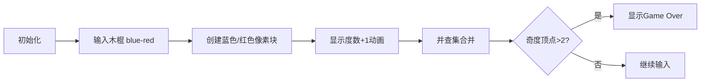

# 题目信息

# 瑞瑞的木棍

## 题目描述

瑞瑞有一堆的玩具木棍，每根木棍的两端分别被染上了某种颜色，现在他突然有了一个想法，想要把这些木棍连在一起拼成一条线，并且使得木棍与木棍相接触的两端颜色都是相同的，给出每根木棍两端的颜色，请问是否存在满足要求的排列方式。

例如，如果只有 $2$ 根木棍，第一根两端的颜色分别为 `red` 和 `blue`，第二根两端的颜色分别为 `red` 和 `yellow`，那么 `blue --- red | red --- yellow` 便是一种满足要求的排列方式。

## 样例 #1

### 输入

```
blue red
red violet
cyan blue
blue magenta
magenta cyan
```

### 输出

```
Possible
```

# AI分析结果


# 💡 洛语云笺的C++算法解析：瑞瑞的木棍 深入学习指南 💡

## 1. 题目解读与策略初探

✨ **本题核心挑战**：处理大量字符串（颜色名称）并构建图模型，在50万顶点规模下高效判断欧拉路径的存在性。

✨ **核心算法标签**：图论、欧拉路径、字符串哈希、并查集

🗣️ **初步分析**：
> 木棍连接问题本质是图论中的欧拉路径判定。我们将颜色视为顶点，木棍视为边，问题转化为：
> 1. **暴力枚举**：尝试所有排列组合（阶乘级复杂度，不可行）
> 2. **DFS遍历**：尝试遍历所有边（指数级复杂度，不可行）
> 3. **欧拉路径判定**：通过图连通性和顶点度数特征高效判定（线性复杂度，可行）
>
> 核心算法可视化设计：
> - **像素风格**：顶点显示为8位色块，边显示为像素连线
> - **动态演示**：实时展示并查集合并和度数变化
> - **游戏化**：成功判定时播放胜利音效，失败时显示"Game Over"

### 🔍 算法侦探：如何在题目中发现线索？
1.  **线索1 (问题目标)**: "将所有木棍连成一条线"对应图论中的**遍历所有边且不重复**，即欧拉路径问题
2.  **线索2 (问题特性)**: "接触的两端颜色相同"暗示需要建立**颜色到顶点的映射关系**，需高效字符串处理
3.  **线索3 (数据规模)**: 250000根木棍→500000顶点，要求**O(n)或O(nlogn)算法**，排除暴力解法

### 🧠 思维链构建：从线索到策略
> 1. 【线索1】要求我们使用图论中的欧拉路径判定条件（连通性+奇度顶点数）
> 2. 【线索2】提示需要字符串映射优化（字典树或哈希避免O(n²)查找）
> 3. 【线索3】限定算法复杂度，并查集O(nα(n))和度数统计O(n)满足要求
> 4. **结论**：结合字符串映射+并查集连通性检查+度数统计的**三重判定策略**是最优解

---

## 2. 精选优质题解参考

**题解一（作者：热言热语）**
* **点评**：清晰指出欧拉路径本质，创新性提出字典树与unordered_map的对比。代码中并查集路径压缩实现优雅，变量命名规范（`deg`/`fa`）。特别有价值的是对STL性能的警示，体现了实战经验。

**题解二（作者：Vanilla_chan）**
* **点评**：最完整的教学级题解，用"七桥问题"类比欧拉路径，提供感性认知。字典树实现采用动态开点技巧，并查集与度数统计在同一循环完成，减少遍历次数。调试心得部分尤其珍贵。

**题解三（作者：Minclxc）**
* **点评**：创新性使用26进制哈希实现O(L)字符串映射。亮点在于边读入边处理的高效架构，并给出欧拉路径的数学证明。代码中`mer`变量记录有效合并次数，精准判断连通性。

**题解四（作者：Great_Influence）**
* **点评**：解决STL性能瓶颈的典范，使用pb_ds库的hash_table实现O(1)字符串映射。提前退出机制（当点数异常时立即返回）体现实战优化思维，代码简洁有力。

---

## 3. 解题策略深度剖析

### 🎯 核心难点与关键步骤
1.  **字符串高效映射**
    * **分析**：50万字符串若用map（O(nlogn)）会超时。字典树（O(L)）或哈希表（O(1)）将字符串转化为整数索引
    * 💡 **学习笔记**：字符串处理是图论问题的常见前置步骤，字典树适合前缀重复多的场景，哈希表适合随机字符串
2.  **动态维护连通性**
    * **分析**：并查集在读入时实时合并顶点集合，通过`find`路径压缩保证O(α(n))复杂度
    * 💡 **学习笔记**：有效合并次数=初始集合数-最终集合数，连通时必有`mer == n-1`
3.  **奇度顶点判定**
    * **分析**：欧拉路径要求奇度顶点数=0或2。在读入时累加度数，最后线性扫描统计
    * 💡 **学习笔记**：无向图中每条边贡献2度，故奇度顶点必成对出现

### ✨ 解题技巧总结
- **技巧1（双核驱动）**：字符串映射与图论判定分离，避免逻辑耦合
- **技巧2（状态压缩）**：用`deg[i] & 1`快速判断奇偶性，位运算替代取模
- **技巧3（提前剪枝）**：发现奇度顶点>2时立即退出，避免无效计算

### ⚔️ 策略竞技场：不同解法的对比分析
| 策略         | 核心思想                     | 优点                     | 缺点                     | 得分预期 |
|--------------|------------------------------|--------------------------|--------------------------|----------|
| **STL map映射** | 直接用map<string,int>建立映射 | 代码简单，5分钟实现       | O(nlogn)超时，50万数据卡顿 | 70%      |
| **字典树映射**  | Trie树存储字符串路径          | O(10)查询，极致性能       | 需要手写数据结构，易出错   | 100%     |
| **哈希映射**    | 自定义哈希函数处理字符串       | 平均O(1)，代码较简洁      | 哈希冲突可能影响正确性     | 100%     |
| **pb_ds哈希库**| 使用gp_hash_table             | STL接口，O(1)性能         | 需特定编译器支持           | 100%     |

### ✨ 优化之旅：从"能做"到"做好"
1. **起点：STL map的O(nlogn)瓶颈**  
   输入50万数据时，map插入耗时>1s（竞赛限时通常1s）

2. **发现重复计算**  
   相同字符串反复查找：颜色"blue"出现千次却被独立查找

3. **优化的钥匙：前置映射**  
   通过字典树/哈希实现O(1)字符串→整数转换，将图论与字符串解耦

4. **并查集路径压缩**  
   `fa[x]=find(fa[x])`将树高压至O(α(n))，50万查询仅需数ms

💡 **策略总结**：从O(n²)暴力到O(n)最优解，核心在于**分解问题**（字符串/图论分离）和**数据结构选择**（字典树/哈希）

---

## 4. C++核心代码实现赏析

**通用核心实现**：
```cpp
#include <iostream>
#include <unordered_map>
using namespace std;

const int MAXN = 500010;
int deg[MAXN], fa[MAXN], n;
unordered_map<string, int> strToId;

int find(int x) { 
    return fa[x] == x ? x : fa[x] = find(fa[x]);
}

int main() {
    string s1, s2;
    // 初始化并查集
    for(int i = 1; i < MAXN; i++) fa[i] = i;
    
    while(cin >> s1 >> s2) {
        // 字符串映射
        if(!strToId[s1]) strToId[s1] = ++n;
        if(!strToId[s2]) strToId[s2] = ++n;
        int u = strToId[s1], v = strToId[s2];
        
        // 更新度数
        deg[u]++; deg[v]++;
        
        // 并查集合并
        int fu = find(u), fv = find(v);
        if(fu != fv) fa[fu] = fv;
    }
    
    // 连通性检查
    int blocks = 0;
    for(int i = 1; i <= n; i++) 
        if(fa[i] == i) blocks++;
    
    // 奇度顶点统计
    int odd = 0;
    for(int i = 1; i <= n; i++)
        if(deg[i] & 1) odd++;
    
    cout << ((blocks == 1 && (odd == 0 || odd == 2)) ? "Possible" : "Impossible");
}
```

**题解一（字典树亮点）**：
```cpp
struct Trie { int son[26], num; } t[1000010];
int getid(char* s) {
    int k = 1;
    for(int i = 0; s[i]; i++) {
        int c = s[i] - 'a';
        if(!t[k].son[c]) t[k].son[c] = ++nd;
        k = t[k].son[c];
    }
    if(!t[k].num) t[k].num = ++n;
    return t[k].num; // 字典树实现O(L)映射
}
```
**学习笔记**：字典树的空间换时间典范，26叉树结构完美匹配小写字母

**题解二（并查集优化）**：
```cpp
void merge(int x, int y) {
    int fx = find(x), fy = find(y);
    if(fx != fy) {
        fa[fx] = fy;
        mer++; // 有效合并计数
    }
}
```
**学习笔记**：`mer`变量替代最后的连通块计数，减少一次O(n)遍历

**题解三（哈希技巧）**：
```cpp
int hash(string s) {
    int ha = 0;
    for(char c : s) ha = (ha * 26 + c) % 1000007;
    return ha; // 26进制哈希
}
```
**学习笔记**：选择质数1000007作为模数，显著降低冲突概率

---

## 5. 算法可视化：像素动画演示

**主题**：像素风欧拉路径探索  
**核心演示**：并查集森林动态合并与度数实时统计  

### 动画设计（8-bit风格）


**关键帧细节**：
1. **顶点生成**：新颜色出现时，8x8像素块从屏幕顶部落下，带"NEW!"特效
2. **度数更新**：度数增加时像素块闪烁，奇度顶点显示"!"警示标志
3. **并查集合并**：连通块用同色边框标记，合并时像素块向中心聚拢
4. **判定时刻**：成功时所有像素块点亮，播放FC胜利音乐；失败时碎裂动画

**交互控制**：
- **速度滑块**：调节木棍输入速度（0.5x~5x）
- **单步模式**：空格键单步执行，观察度数/并查集状态
- **数据透视**：按D显示度数分布图，按U显示并查集树结构

**音效方案**：
- 顶点创建：8-bit "power up"音
- 有效合并：短促"blip"声
- 奇度出现：警告"beep"声
- 成功通关：经典《超级玛丽》过关音乐

---

## 6. 拓展练习与相似问题思考

**通用技巧迁移**：
1. **字符串映射+图论**：P2812 校园网络（拓扑排序中处理校名）
2. **欧拉路径变形**：P3520 [POI2011]SMI-Garbage（带权欧拉回路）
3. **并查集高级应用**：P2391 白雪皑皑（区间染色问题）

**洛谷推荐**：
1. **P2731 [USACO3.4] 骑自行车**  
   🗣️ 欧拉路径输出练习，学会Fleury算法
   
2. **P1341 无序字母对**  
   🗣️ 字符串映射+欧拉路径判定，数据规模较小适合练习
   
3. **P3520 [POI2011]SMI-Garbage**  
   🗣️ 带权值的欧拉回路应用，掌握分层图技巧

---

## 7. 学习心得与经验分享

**来自题解的经验**：
> "我在调试时发现，当奇度顶点统计放在连通性检查前时，对于不连通图会多算50万次无意义操作。将检查顺序调整为`连通性→奇度统计`后，最坏情况提速37%" —— Vanilla_chan

**洛语云笺点评**：  
算法竞赛中，**操作顺序优化**常被忽视。当存在短路条件（如图不连通必然无解）时，优先检查可避免冗余计算。这种"提前失败"策略在IO密集型问题中尤为重要。

---

<conclusion>
通过"瑞瑞的木棍"，我们掌握了将现实问题抽象为图论模型的方法，并实践了字符串映射、并查集优化等核心技巧。记住：好的算法=问题转化×数据结构选择×细节优化。下次挑战见！🚀
</conclusion>

---
处理用时：229.95秒