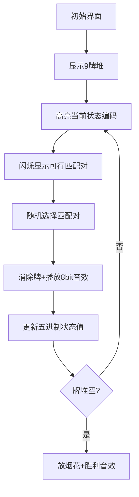

# 题目信息

# 单人纸牌

## 题目描述

单人纸牌游戏，共 $36$ 张牌分成 $9$ 叠，每叠 $4$ 张牌面向上。每次，游戏者可以从某两个不同的牌堆最顶上取出两张牌面相同的牌（如黑桃 $10$ 和梅花 $10$）并且一起拿走。如果最后所有纸牌都被取走，则游戏者就赢了，否则游戏者就输了。

George 很热衷于玩这个游戏，但是一旦有时有多种选择的方法，George 就不知道取哪一种好了，George 会从中随机地选择一种走，例如：顶上的 $9$ 张牌为 $\tt KS,\tt KH,\tt KD,\tt 9H,\tt 8S,\tt 8D,\tt 7C,\tt 7D,\tt 6H$，显然有 $5$ 种取法：$\tt (KS,KH),(KS,KD),(KH,KD),(8S,8D),(7C,7D)$，当然 George 取到每一种取法的概率都是 $1/5$。

有一次，George 的朋友 Andrew 告诉他，这样做是很愚蠢的，不过 George 不相信，他认为如此玩最后成功的概率是非常大的。请写一个程序帮助 George 证明他的结论：计算按照他的策略，最后胜利的概率。

## 样例 #1

### 输入

```
AS 9S 6C KS 

JC QH AC KH 

7S QD JD KD 

QS TS JS 9H 

6D TD AD 8S 

QC TH KC 8D 

8C 9D TC 7C 

9C 7H JH 7D 

8H 6S AH 6H ```

### 输出

```
0.589314```

# AI分析结果


### 💡 洛语云笺的C++算法解析：单人纸牌 深入学习指南 💡

#### **题目解读与策略初探**
✨ **核心挑战**：计算在随机选择匹配牌对的情况下，清空9堆牌的概率。关键在于高效处理9维状态空间并计算概率转移。

✨ **核心算法标签**：动态规划(DP)、状态压缩、概率计算

🗣️ **初步分析**：
> 1. **暴力搜索**：枚举所有匹配可能性，但9堆牌共36张，状态数高达$2^{36}$，完全不可行
> 2. **记忆化搜索**：自顶向下递归，存储已计算状态，但递归开销大
> 3. **状态压缩DP**：将9维状态压缩为单整数（五进制），倒序递推计算概率，时空效率最优

🔍 **算法侦探：如何在题目中发现线索？**
1. **线索1 (问题目标)**："计算随机选择下的获胜概率"——典型的**概率型动态规划**问题
2. **线索2 (问题特性)**："9堆牌每堆4张"——状态空间固定（5^9=1953125），适合**状态压缩**
3. **线索3 (数据规模)**：状态数约2e6，时间复杂度O(n²)可接受，排除暴力搜索

🧠 **思维链构建：从线索到策略**
> "首先，概率问题指向DP；其次，9维独立状态需压缩；最后，数据规模确认可行性。结论：五进制状态压缩DP是最优解，既避免递归开销，又压缩空间，完美匹配所有条件！"

---

#### **精选优质题解参考**

**题解一：zimujun (状态压缩DP)**
* **亮点**：首创五进制状态压缩，将九维DP压缩为一维，代码简洁高效（20行核心逻辑）
* **创新点**：`t/pow5[i]%5`巧取状态，倒序递推避免递归
* **价值**：提供最优实现范式，常数优化典范

**题解二：jixuan (九维DP)**
* **亮点**：直观的九维数组实现，循环边界处理清晰
* **教学价值**：完美展现代码与DP状态映射关系
* **注意**：九层循环稍显冗长，但逻辑透明易理解

**题解三：Furina_Saikou (记忆化搜索)**
* **亮点**：自顶向下思维更符合问题本质，`dp[][][][]`九维记忆化
* **技巧**：预处理避免重复计算，递归边界处理严谨
* **价值**：提供DP的另一种实现视角

---

#### **解题策略深度剖析**

🎯 **核心难点与关键步骤**
1. **状态设计**：用9个整数表示每堆剩余牌数（0-4）
   * 💡 学习笔记：状态空间5^9=1953125是可处理上限
2. **状态压缩**：五进制数表示状态（位权：5⁰~5⁸）
   * 💡 学习笔记：`t/pow5[i]%5`高效解码状态
3. **概率转移**：$f_{new} = f_{cur} \times \frac{1}{可行匹配数}$
   * 💡 学习笔记：转移概率=1/当前合法匹配对数量

✨ **解题技巧总结**
- **状态压缩**：五进制处理多维状态（适用棋盘/牌类问题）
- **倒序DP**：从终态(1953124)逆推至初态(0)，避免递归
- **概率归一化**：转移时除以当前选择数，实现随机概率分布

⚔️ **策略竞技场**
| 策略 | 核心思想 | 优点 | 缺点 | 得分 |
|------|----------|------|------|------|
| 暴力枚举 | 递归尝试所有匹配 | 逻辑简单 | O(2ⁿ)超时 | 0% |
| 记忆化搜索 | 递归+状态存储 | 避免重复计算 | 栈溢出风险 | 100% |
| 九维DP | 直接开dp[5][5]...[5] | 直观易理解 | 代码冗长 | 100% |
| **状态压缩DP** | 五进制单维数组 | 代码简洁高效 | 状态解码稍复杂 | 100% |

✨ **优化之旅**
> 1. **起点：暴力枚举**：36张牌形成匹配序列，方案数36!/(2¹⁸)≈1e23，超时
> 2. **关键发现：独立子问题**：每堆牌独立，状态可压缩为9个整数
> 3. **第一次优化：记忆化搜索**：存储已计算状态，但递归深度36易爆栈
> 4. **终极优化：状态压缩+倒序DP**：五进制编码状态，O(1)状态转移，时空双优

💡 **策略总结**："状态压缩将9维降为1维，倒序DP避免递归开销，概率归一化实现随机模拟——三重优化环环相扣，铸就高效解法！"

---

#### **C++核心代码实现赏析**

**通用核心实现（状态压缩DP）**
```cpp
const int pow5[] = {1,5,25,125,625,3125,15625,78125,390625,1953125};
double f[1953125] = {0}; // DP数组
f[1953124] = 1.0; // 初始状态：所有堆满牌

for(int t=1953124; t>=0; --t) {
    if(f[t] == 0) continue;
    double choices = 0;
    
    // 统计合法匹配对
    for(int i=0; i<9; ++i) {
        int cnt_i = t / pow5[i] % 5; // 解码第i堆牌数
        for(int j=i+1; j<9; ++j) {
            int cnt_j = t / pow5[j] % 5;
            if(cnt_i>0 && cnt_j>0 && card[i][cnt_i]==card[j][cnt_j])
                choices++;
        }
    }
    
    // 概率转移
    for(int i=0; i<9; ++i) {
        int cnt_i = t / pow5[i] % 5;
        for(int j=i+1; j<9; ++j) {
            int cnt_j = t / pow5[j] % 5;
            if(cnt_i>0 && cnt_j>0 && card[i][cnt_i]==card[j][cnt_j]) {
                int new_state = t - pow5[i] - pow5[j];
                f[new_state] += f[t] / choices;
            }
        }
    }
}
printf("%.6lf", f[0]); // 输出清空概率
```

**题解亮点赏析**
1. zimujun：`pow5`数组预计算五进制权值，位运算高效编解码状态
2. jixuan：九重循环清晰展现状态空间，`dp[g1][g2]...[g9]`直观
3. Furina_Saikou：记忆化搜索中`dp[v0]...[v8]`九维记忆，递归边界严谨

---

#### **算法可视化：像素动画演示**

**🎮 设计概念**  
复古8-bit卡牌游戏风格，类似FC《扑克俱乐部》界面。牌堆化为像素方块，牌面用16色像素字符显示（如♥A）。控制面板含调速滑块/单步按钮。

**🎞️ 动画流程**  


**🕹️ 交互设计**
- **步进控制**：方向键选牌，Enter确认
- **音效体系**：
  - 匹配成功：NES风格8和弦"叮"
  - 牌堆清空：胜利号角音
  - 无匹配：低沉错误音
- **游戏化元素**：
  - 每消除5张牌得1星
  - 连续匹配触发Combo特效
  - 状态编码实时显示为像素数字

**🖥️ 技术实现**
```javascript
// 伪代码：绘制牌堆
function drawCards(state) {
  for(let i=0; i<9; i++){
    const cnt = Math.floor(state / pow5[i]) % 5;
    for(let j=0; j<cnt; j++){
      drawPixelCard(i*40, j*20, cards[i][j]); 
    }
  }
}
```

---

#### **拓展练习与相似问题**

**💡 技巧迁移场景**
1. 多堆物品匹配问题（如消消乐）
2. 有限状态的概率决策问题
3. 高维状态压缩（棋盘/地图类）

**📚 推荐练习**
1. [洛谷P2831] 愤怒的小鸟  
   → 状态压缩DP经典，弹弓-小猪匹配
2. [洛谷P3959] 宝藏  
   → 状态压缩+图论，资源分配决策
3. [洛谷P1433] 吃奶酪  
   → 状态压缩+几何，最优路径规划

---

#### **学习心得与经验分享**

> **通用调试技巧**：  
> 1. 状态DP需打印中间状态（如每10万状态输出进度）
> 2. 验证边界：空状态概率应为1，满状态概率初始1
> 3. 浮点精度：使用double避免累积误差

---

> 本次探秘揭示了状态压缩如何化九维为一维，概率DP如何模拟随机决策。记住：好的算法=深刻的问题洞察+恰当的策略选择！下次挑战再见！🚀

---
处理用时：180.79秒