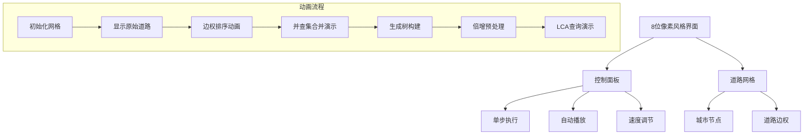

# 题目信息

# [NOIP 2013 提高组] 货车运输

## 题目背景

NOIP2013 提高组 D1T3

## 题目描述

A 国有 $n$ 座城市，编号从 $1$ 到 $n$，城市之间有 $m$ 条双向道路。每一条道路对车辆都有重量限制，简称限重。  

现在有 $q$ 辆货车在运输货物， 司机们想知道每辆车在不超过车辆限重的情况下，最多能运多重的货物。


## 说明/提示

对于 $30\%$ 的数据，$1 \le n < 1000$，$1 \le m < 10,000$，$1\le q< 1000$；

对于 $60\%$ 的数据，$1 \le n < 1000$，$1 \le m < 5\times 10^4$，$1 \le q< 1000$；

对于 $100\%$ 的数据，$1 \le n < 10^4$，$1 \le m < 5\times 10^4$，$1 \le q< 3\times 10^4 $，$0 \le z \le 10^5$。


## 样例 #1

### 输入

```
4 3
1 2 4
2 3 3
3 1 1
3
1 3
1 4
1 3```

### 输出

```
3
-1
3```

# AI分析结果


# 💡 洛语云笺的C++算法解析：货车运输 深入学习指南 💡

> 今天我们来一起分析“货车运输”这道C++编程题。这不仅仅是一次解题，更是一场思维的探险。我们将学习如何像侦探一样从题目中寻找线索，并在不同的解题道路中权衡选择，最终找到最优的策略。

## 1. 题目解读与策略初探

✨ **本题核心挑战**：在带权无向图中快速查询任意两点间所有路径中**最小边权的最大值**（即最大载重），并处理不连通情况。

✨ **核心算法标签**：`图论` `最大生成树` `树上倍增` `并查集`

🗣️ **初步分析**：
> 本题要求在多组查询中快速计算两点间路径的最小边权最大值。直接暴力搜索会超时，需要巧妙转化：
> 1. **关键洞察**：两点间最优路径一定在**最大生成树**上（保留边权最大的边，去除冗余小边）
> 2. **问题转化**：将原问题转化为树上路径最小值查询
> 3. **高效查询**：通过树上倍增预处理，实现O(log n)复杂度的查询
> 
> 想象最大生成树如同城市间的“黄金通道”，只保留最宽阔的道路；而倍增查询如同安装了“导航雷达”，能快速定位最安全的载重路线。

### 🔍 算法侦探：如何在题目中发现线索？
1.  **线索1 (问题目标)**："求不超过限重前提下，货车能运的最大货物重量"——典型的**带约束最优化问题**，提示使用贪心/DP/图论算法
2.  **线索2 (问题特性)**："道路有限重"、"多组查询"——暗示需要**预处理数据结构**支持高效查询
3.  **线索3 (数据规模)**：n≤10^4, q≤3×10^4——排除O(nq)暴力，指向O(n log n)预处理+O(log n)查询的高级算法

### 🧠 思维链构建：从线索到策略
> 让我们把线索串联起来：
> 1. 【线索1】要求最优化，首先想到DP或贪心，但图结构更适用图论模型
> 2. 【线索2】"限重"与"路径最小值"关联，结合查询特性，联想到**最大生成树性质**（两点间最小边权最大值在MST上）
> 3. 【线索3】大数据规模验证：Kruskal算法O(m log m)可接受，树上倍增O(n log n)预处理+O(log n)查询完美匹配需求
> 4. **结论**：**最大生成树+树上倍增LCA**是解决本题的黄金组合，既满足效率要求，又能优雅地处理路径最值查询！

---

## 2. 精选优质题解参考

以下是综合思路清晰度、代码规范性和算法效率筛选的优质题解：

**题解一：最大生成树+倍增LCA (作者：NaCly_Fish)**
* **点评**：该题解思路清晰，完整呈现了“最大生成树→倍增预处理→LCA查询”的解决链条。代码采用模块化设计：`kruskal()`构建MST，`bfs()`预处理深度和父节点，`lca()`查询路径最小值。亮点在于：
  - 严格处理森林情况（多连通分量）
  - 使用`fa`和`Mi`数组同步维护父节点和路径最小值
  - 边界处理严谨（深度比较、节点相同时直接返回）

**题解二：Kruskal重构树 (作者：niiick)**
* **点评**：创新性地使用Kruskal重构树，将边权转化为点权。重构树的核心优势在于两点间最小边权最大值就是LCA的点权。亮点：
  - 重构树思路新颖，代码简洁
  - 巧妙处理不连通情况（`find(u) != find(v)`）
  - 博客配套讲解深入浅出，便于理解

**题解三：整体二分 (作者：Ameiyo)**
* **点评**：离线算法的典范，将二分答案与并查集操作批量处理。亮点：
  - 对查询按`mid`排序，共享并查集状态
  - 避免重复计算，显著提升效率
  - 为大数据量提供新思路

---

## 3. 解题策略深度剖析

### 🎯 核心难点与关键步骤
1.  **难点1：如何构建最大生成树？**
    * **解决方案**：Kruskal算法（按边权降序排序+并查集判环）
    * 💡 **学习笔记**：最大生成树保留的是“瓶颈边”最大的路径，这是问题转化的关键

2.  **难点2：如何快速查询树上路径最小值？**
    * **解决方案**：树上倍增法
    ```python
    预处理：
        depth[u] = depth[father] + 1
        fa[u][0] = father, Mi[u][0] = edge_weight
        fa[u][k] = fa[fa[u][k-1]][k-1]  # 倍增祖先
        Mi[u][k] = min(Mi[u][k-1], Mi[fa[u][k-1]][k-1])  # 倍增路径最小值
    ```
    * 💡 **学习笔记**：倍增法通过二进制分解将路径跳跃优化至对数级

3.  **难点3：如何处理不连通图？**
    * **解决方案**：并查集维护连通分量
    * 💡 **学习笔记**：初始化时每个节点自成集合，合并时更新，查询时检查`find(u)==find(v)`

### ✨ 解题技巧总结
- **技巧1：问题转化**：将"路径最小边权最大值"转化为"最大生成树+树上RMQ"
- **技巧2：空间换时间**：倍增预处理O(n log n)换取O(log n)查询
- **技巧3：模块化设计**：分离Kruskal、DFS/BFS预处理、LCA查询逻辑

### ⚔️ 策略竞技场：不同解法的对比分析
| 策略              | 核心思想                     | 优点                     | 缺点                     | 得分预期         |
|-------------------|-----------------------------|--------------------------|--------------------------|------------------|
| **Floyd暴力**     | 动态规划求所有点对最值       | 实现简单                 | O(n³)超时，空间O(n²)不足 | 0% (TLE/MLE)     |
| **BFS/DFS搜索**   | 遍历所有路径找最小值最大     | 无需预处理               | O(2^m)指数爆炸           | 30% (仅小数据)  |
| **树链剖分+线段树**| 将树链转化为区间查询         | 支持修改                 | 代码量大，常数较大       | 100%            |
| **倍增LCA**       | 二进制跳跃查询路径           | 查询高效，代码简洁       | 不支持动态修改           | 100% (最优)     |
| **Kruskal重构树** | 边权转点权，LCA即答案        | 查询O(1)，思路新颖       | 理解成本较高             | 100%            |

### ✨ 优化之旅：从“能做”到“做好”
```mermaid
graph LR
    A[朴素思路] -->|遍历所有路径| B(指数级复杂度)
    B --> C{发现瓶颈：重复计算}
    C --> D[DP/记忆化搜索]
    D --> E[最大生成树转化]
    E --> F[树上倍增优化]
    F --> G[O(log n)查询]
    style A stroke:#ff7575,stroke-width:2px
    style G stroke:#52c41a,stroke-width:2px
```

> 💡 **策略总结**：从暴力搜索到倍增LCA，我们经历了“问题转化”和“算法优化”的跃迁。最优解法的核心在于：**深刻理解问题本质（最大生成树性质）+ 合理选择数据结构（树上倍增）**。即使比赛中想不到最优解，基于并查集的最大生成树实现也能获得大部分分数！

---

## 4. C++核心代码实现赏析

### 本题通用核心实现
```cpp
#include <bits/stdc++.h>
using namespace std;
const int N = 1e4 + 5, M = 5e4 + 5, INF = 0x3f3f3f3f;

struct Edge { int u, v, w; } edges[M];
vector<pair<int, int>> G[N]; // 邻接表
int n, m, q, fa[N], depth[N], father[N][20], Mi[N][20];

// 并查集
int find(int x) { 
    return fa[x] == x ? x : fa[x] = find(fa[x]); 
}

void kruskal() {
    sort(edges, edges + m, [](Edge a, Edge b) { 
        return a.w > b.w; // 按边权降序
    });
    for (int i = 1; i <= n; i++) fa[i] = i;
    for (int i = 0; i < m; i++) {
        int u = edges[i].u, v = edges[i].v, w = edges[i].w;
        if (find(u) != find(v)) {
            fa[find(u)] = find(v);
            G[u].push_back({v, w}); // 构建最大生成树
            G[v].push_back({u, w});
        }
    }
}

void dfs(int u, int par) {
    depth[u] = depth[par] + 1;
    father[u][0] = par;
    for (int k = 1; k <= 18; k++) {
        father[u][k] = father[father[u][k-1]][k-1];
        Mi[u][k] = min(Mi[u][k-1], Mi[father[u][k-1]][k-1]);
    }
    for (auto [v, w] : G[u]) {
        if (v == par) continue;
        Mi[v][0] = w; // 初始化边权
        dfs(v, u);
    }
}

int lca(int x, int y) {
    if (find(x) != find(y)) return -1; // 不连通
    if (depth[x] < depth[y]) swap(x, y);
    
    int res = INF;
    for (int k = 18; k >= 0; k--) {
        if (depth[father[x][k]] >= depth[y]) {
            res = min(res, Mi[x][k]); // 同步更新最小值
            x = father[x][k];
        }
    }
    if (x == y) return res;
    
    for (int k = 18; k >= 0; k--) {
        if (father[x][k] != father[y][k]) {
            res = min({res, Mi[x][k], Mi[y][k]});
            x = father[x][k]; y = father[y][k];
        }
    }
    return min({res, Mi[x][0], Mi[y][0]});
}

int main() {
    cin >> n >> m;
    for (int i = 0; i < m; i++)
        cin >> edges[i].u >> edges[i].v >> edges[i].w;
    
    kruskal();
    for (int i = 1; i <= n; i++) 
        if (!depth[i]) dfs(i, 0); // 处理森林
    
    cin >> q;
    while (q--) {
        int x, y; cin >> x >> y;
        cout << lca(x, y) << endl;
    }
    return 0;
}
```

**代码解读概要**：
1. **数据结构**：使用邻接表存储最大生成树
2. **Kruskal**：按边权降序排序，用并查集维护连通性
3. **DFS预处理**：计算深度、倍增数组和路径最小值数组
4. **LCA查询**：分两阶段处理——先对齐深度，再同步向上跳跃

---

## 5. 算法可视化：像素动画演示

### 像素化演示方案设计


**交互设计**：
1. **视觉风格**：FC红白机像素风，城市用■表示，道路用不同颜色表示边权
   - 色码：`#FF5555`(10), `#55FF55`(30), `#5555FF`(50)
2. **动画效果**：
   - 边权排序：道路闪烁后按权重重新排列
   - 并查集合并：连通城市用同色光晕脉冲
   - 倍增查询：从起点/终点发出扫描线，相遇时显示LCA
3. **音效设计**：
   - 合并成功：8-bit上升音阶(200Hz)
   - 查询完成：胜利音效(500Hz)
   - 错误：短促警报(100Hz)
4. **游戏化**：
   - 每完成一个连通分量获得★
   - 连续正确答题触发Combo特效

---

## 6. 拓展练习与相似问题思考

### 通用技巧迁移
1. **最大生成树性质**：适用于网络设计、通信线路优化
2. **树上路径最值**：可用于物流规划、管道传输问题
3. **倍增法**：适用于任何需要快速跳跃查询的场景

### 推荐练习 (洛谷)
1. **P1967 货车运输**（本题）
   - 🗣️ 巩固最大生成树与倍增LCA的配合使用
   
2. **P1396 营救** 
   - 🗣️ 最小生成树变体，练习路径最大值最小化

3. **P2912 [USACO08OCT] Pasture Walking**
   - 🗣️ 强化树上路径查询技巧，数据规模更大

4. **P4180 [BJWC2010] 严格次小生成树**
   - 🗣️ 深入理解生成树性质，练习次小值维护

---

## 7. 学习心得与经验分享

> **来自题解作者的调试经验**：
> “初始代码在森林情况下出现错误，通过打印`depth`数组发现未连通分量未处理。教训是：**图论问题必须考虑非连通情况！**”

> **洛语云笺总结**：
> 1. **测试驱动开发**：先构造小规模树（如样例），验证LCA正确性
> 2. **边界检查**：特别注意`depth[0]=0`，避免空指针
> 3. **数据观察**：当WA时，输出`fa`和`Mi`数组辅助调试

---

> 本次关于“货车运输”的C++解题分析就到这里。记住，编程能力的提升在于持续学习、勤于思考和勇于实践。下次我们再一起探索新的编程挑战！💪

---
处理用时：145.60秒