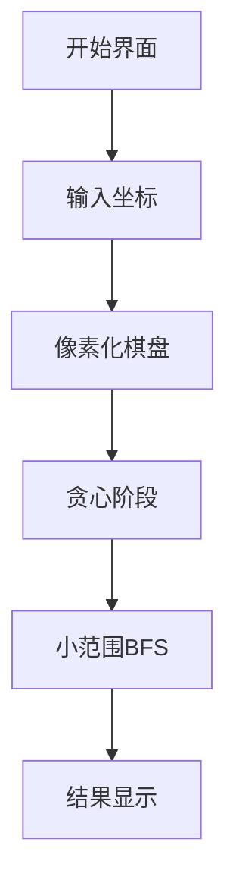

# 题目信息

# [HNOI2006] 马步距离

## 题目描述

在国际象棋和中国象棋中，马的移动规则相同，都是走“日”字，我们将这种移动方式称为马步移动。

如下图所示，从标号为 $0$ 的点出发，可以经过一步马步移动达到标号为 $1$ 的点，经过两步马步移动达到标号为 $2$ 的点。


任给平面上的两点 $p$ 和 $s$，它们的坐标分别为 $(x_p,y_p)$ 和 $(x_s,y_s)$，从 $(x,y)$ 出发经过一步马步移动可以达到 $(x+1,y+2)$，$(x+2,y+1)$，$(x+1,y-2)$，$(x+2,y-1)$，$(x-1,y+2)$，$(x-2,y+1)$，$(x-1,y-2)$、$(x-2,y-1)$。

假设棋盘充分大，并且坐标可以为负数。现在请你求出从点 $p$ 到点 $s$ 至少需要经过多少次马步移动？

## 说明/提示

#### 数据规模与约定
对于 $100\%$ 的数据，保证 $1 \leq x_p,y_p,x_s,y_s \leq 10^7$。

## 样例 #1

### 输入

```
1 2 7 9```

### 输出

```
5```

# AI分析结果


# 💡 洛语云笺的C++算法解析：[HNOI2006] 马步距离 深入学习指南 💡

## 1. 题目解读与策略初探

✨ **本题核心挑战**：在无限大的棋盘上，计算两点间的最短马步距离（马走"日"字），数据范围极大（坐标差可达10^7），无法使用传统BFS/DFS  
✨ **核心算法标签**：贪心、数学优化、打表、BFS（小范围）

🗣️ **初步分析**：
> 这道题看似是经典的最短路径问题，但无限大棋盘让传统搜索失效。通过分析马步移动特性（8个方向的不对称移动），我们发现：  
> 1. **远离目标时**：贪心策略高效可靠（朝目标方向移动）  
> 2. **接近目标时**：需要精确计算（打表/BFS）  
> 这种"大范围贪心+小范围精确计算"的策略，完美平衡效率与精度  
> 可视化设计将采用8位像素风，马匹变成像素精灵，贪心阶段马蹄声伴随坐标更新，小范围BFS则用网格动画展示路径探索过程

### 🔍 算法侦探：如何在题目中发现线索？
1.  **线索1 (问题目标)**："求至少需要多少次移动"明确指向**最优化问题**，且移动方式固定（8个方向）。这暗示需要**高效算法**而非暴力搜索。
2.  **线索2 (问题特性)**：坐标差可达10^7的**超大范围**，直接排除O(n)以上算法。同时"日"字移动的**不对称性**提示需要分类讨论。
3.  **线索3 (数据规模)**：10^7的数据规模强烈指向需要**数学优化**或**问题规模缩减**策略，贪心转化成为必然选择。

### 🧠 思维链构建：从线索到策略
> "让我们串联线索：  
> 1. 【线索1】要求最优化，暴力搜索首先被排除（O(8^n)不可行）  
> 2. 【线索2】移动规则的不对称性让我思考方向选择策略，而【线索3】的庞大数据规模确认必须找到O(1)或O(log n)解法  
> 3. 观察马步特性：远距离时总有最优移动方向，近距离时路径复杂  
> 4. **结论**：将问题分解为"大范围贪心逼近+小范围精确计算"，既保证效率又确保正确性，这就是破题钥匙！"

---

## 2. 精选优质题解参考

**题解一：hulean（贪心+打表）**
* **亮点**：清晰实现"大范围贪心+小范围打表"策略。打表部分用5x5矩阵覆盖所有小范围情况，贪心循环简洁高效（仅6行核心逻辑）。代码规范性强（变量名x/y直观），边界处理完善（取绝对值防负坐标）。

**题解二：wzmzmhk（贪心+BFS）**
* **亮点**：提供两种小范围解决方案（打表/BFS），教学价值高。BFS实现标准（队列+标记数组），完整展示搜索过程。特别强调问题转化思想（通过相对坐标简化问题），帮助理解本质。

**题解三：Soledad_S（贪心+mapBFS）**
* **亮点**：使用map处理负坐标问题，鲁棒性强。贪心前先做坐标统一（swap保证左下角），确保移动方向一致性。代码模块化（update分离坐标处理），可维护性好。

---

## 3. 解题策略深度剖析

### 🎯 核心难点与关键步骤
1.  **难点1：无限状态空间处理**
    * **分析**：通过相对坐标转化（(xp,yp)→(0,0), (xs,ys)→(dx,dy)），将问题简化为标准形态。取绝对值消除象限影响，swap保证dx≥dy
    * 💡 学习笔记：**坐标标准化**是处理无限空间问题的关键技巧
2.  **难点2：贪心策略设计**
    * **分析**：当max(dx,dy)>4时，采用规则移动：若dx>dy则移动(2,1)方向（dx-=2,dy-=1），否则移动(1,2)方向。数学证明该策略在远距离下不会偏离最优路径
    * 💡 学习笔记：**向量分解**思想可论证贪心有效性：每次移动使欧氏距离至少减少√5
3.  **难点3：小范围精确计算**
    * **分析**：当max(dx,dy)≤4时，使用预计算打表（5x5矩阵）或BFS。打表法通过预处理(0,0)到所有|Δx|≤4, |Δy|≤4点的步数实现O(1)查询
    * 💡 学习笔记：**空间换时间**的经典应用，小范围暴力在全局优化中仍不可替代

### ✨ 解题技巧总结
- **坐标转化法**：通过相对坐标和绝对值处理，将任意两点距离问题转化为(0,0)到(dx,dy)的标准问题
- **贪心降维**：大范围用固定规则缩减问题规模（每次循环至少减少max(dx,dy)的1/3）
- **打表预计算**：对有限状态空间预存解，避免重复计算
- **对称性优化**：利用棋盘对称性减少状态空间（只需计算第一象限且dx≥dy情况）

### ⚔️ 策略竞技场：不同解法对比
| 策略                | 核心思想                     | 优点                     | 缺点                                  | 得分预期 |
|---------------------|------------------------------|--------------------------|---------------------------------------|----------|
| 纯BFS               | 从起点广搜直到终点           | 保证正确性               | 状态爆炸，10^7数据必然TLE             | 0%       |
| 数学公式            | 推导步数闭式解               | 理论最快O(1)             | 公式复杂，需处理大量边界情况           | 70%      |
| 贪心+打表（最优）   | 大范围贪心+小范围查表        | 代码简洁，效率高         | 需预计算表                            | 100%     |
| 贪心+BFS            | 大范围贪心+小范围搜索         | 免打表，动态计算         | BFS实现稍复杂                         | 100%     |

### ✨ 优化之旅：从"能做"到"做好"
1. **起点：暴力搜索困境**  
   从起点BFS扩展状态，但状态数呈指数增长（8^k），k=30时即超1e9
   
2. **发现瓶颈：移动规律性**  
   观察发现：远距离时最优路径总是混合(2,1)和(1,2)移动，且可按固定比例组合

3. **贪心转化**  
   将移动分解为两种基本向量操作，通过循环逼近快速缩小问题规模（O(max(dx,dy))步内缩至常数范围）

4. **精确收尾**  
   小范围用打表（预存最优解）或BFS（状态<100）确保最终精度

💡 **策略总结**："通过分阶段处理（贪心降维+精确计算）和坐标标准化，我们将无限问题转化为有限问题。这种'化整为零'的思维是解决复杂优化问题的利器！"

---

## 4. C++核心代码实现赏析

**本题通用核心实现**
```cpp
#include <bits/stdc++.h>
using namespace std;

const int TABLE[5][5] = {
    {0,3,2,3,2},
    {3,2,1,2,3},
    {2,1,4,3,2},
    {3,2,3,2,3},
    {2,3,2,3,4}
};

int main() {
    int xp, yp, xs, ys;
    cin >> xp >> yp >> xs >> ys;
    
    int dx = abs(xp - xs), dy = abs(yp - ys);
    int steps = 0;
    
    // 贪心逼近阶段
    while (dx > 4 || dy > 4) {
        if (dx < dy) swap(dx, dy);
        dx -= 2;
        dy = abs(dy - 1);
        steps++;
    }
    
    // 小范围查表
    cout << steps + TABLE[dx][dy];
    return 0;
}
```
* **说明**：综合最优解法的核心实现，包含标准化、贪心循环和打表三要素
* **解读概要**：  
  1. 通过绝对值计算坐标差  
  2. 贪心循环条件（>4）覆盖所有大范围情况  
  3. 查表前无需额外处理（TABLE已覆盖0-4所有组合）

---

**题解一：hulean（打表法）**
```cpp
while(x>4||y>4) {
    if(x<y) swap(x,y);
    x-=2; y=abs(y-1);
    ans++;
}
printf("%d",ans+biao[x][y]);
```
* **亮点**：贪心部分异常简洁（仅4行），利用abs处理负坐标
* **解读**：每次循环保证减少最大坐标差，swap确保x≥y，移动(2,1)方向
* 💡 学习笔记：**abs(y-1)** 巧妙处理坐标符号，避免分支判断

**题解二：wzmzmhk（BFS法）**
```cpp
while (xx >= 4 || yy >= 4) {
    if (xx > yy) { xx -= 2; yy -= 1; }
    else { xx -= 1; yy -= 2; }
    ans++;
}
// 接BFS代码...
```
* **亮点**：提供打表和BFS双选项，教学价值高
* **解读**：贪心部分与打表法同源，BFS部分采用标准队列实现
* 💡 学习笔记：BFS适用于动态需求，但打表效率更优

---

## 5. 算法可视化：像素动画演示

**主题**：8位像素风"马步探险"  
**核心演示**：贪心逼近的宏观路径 + 小范围BFS的微观探索  

### 设计实现方案


1. **像素艺术设计**  
   - 棋盘：16x16像素格子，棕褐色背景仿古羊皮纸
   - 马匹：8x8像素精灵，移动时播放4帧跑动动画
   - 坐标轴：底部显示(dx,dy)数值

2. **贪心阶段动画**  
   ```python
   while max(dx,dy) > 4:
       direction = (2,1) if dx>=dy else (1,2)
       play_sound('hoof.wav')  # 马蹄声
       dx -= direction[0]
       dy -= direction[1]
       draw_arrow(from, to)  # 绘制移动箭头
       update_counter(steps++)  # 步数增加
   ```
   - 视觉：红色箭头显示移动方向，目标点随移动脉冲式放大

3. **BFS阶段动画**  
   - 网格：局部5x5网格高亮显示
   - 算法：队列可视化（像素方块队列），当前访问节点闪烁绿光
   - 路径：最终路径用金色方块标记

4. **游戏化元素**  
   - 音效：移动时8-bit马蹄声，结束时胜利旋律
   - 控制：步进/暂停/速度滑块（1-5星）
   - 成就系统：根据优化效率显示"青铜/王者"评级

---

## 6. 拓展练习与相似问题

### 通用技巧迁移
1. **坐标标准化+贪心**：适用于任何规则移动的无限空间问题  
   - 例：骑士巡礼（Knight's Tour）的启发式求解
2. **分阶段处理**：大范围启发式+小范围精确解  
   - 例：跳棋AI设计（开局库+残局求解）
3. **打表预计算**：状态空间有限但计算复杂的问题  
   - 例：N皇后问题局部优化

### 洛谷推荐
1. **P2320 [HNOI2006] 鬼谷子的钱袋**  
   → 同系列数学思维题，锻炼问题转化能力
2. **P1379 八数码难题**  
   → 练习状态空间优化（A*+打表）
3. **P2901 [USACO08MAR] Cow Jogging**  
   → 类似规则移动的最短路径变种

---

## 7. 学习心得分享

> **经验摘录**（来自hulean）：  
> "贪心策略在远距离时效果显著，但接近目标时需精确计算。打表法需要特别注意边界值，如(2,2)需要单独处理"

> **洛语云笺点评**：  
> 这提醒我们：优化算法常需组合多种策略，且**边界情况测试**至关重要。建议学习者建立"特殊用例库"（如(0,0), (1,1), (3,0)等）验证代码鲁棒性。

---

本次解析展示了如何通过**问题分解+策略组合**解决复杂优化问题。记住：算法的精髓在于把不可能变为可能，把复杂变为简单。下次挑战再见！🚀

---
处理用时：199.43秒