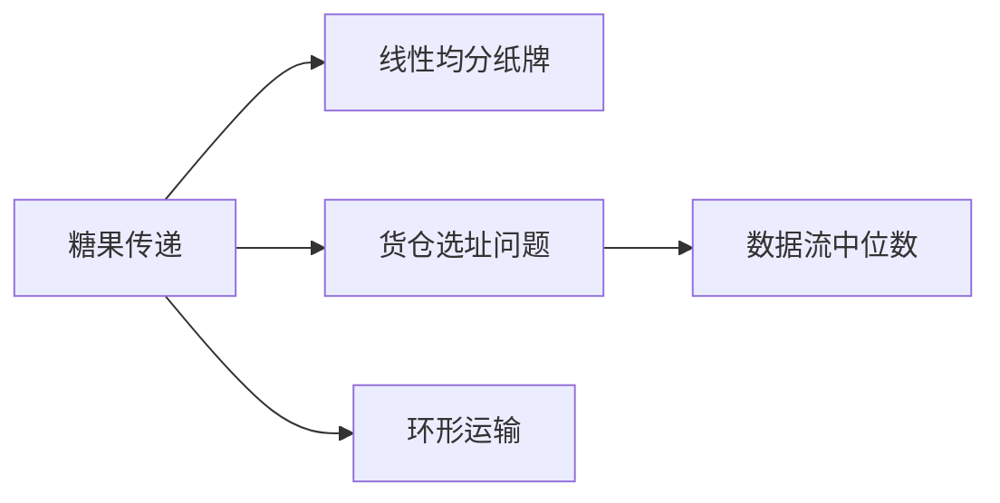

# 题目信息

# [HAOI2008] 糖果传递

## 题目描述

有 $n$ 个小朋友坐成一圈，每人有 $a_i$ 个糖果。每人只能给左右两人传递糖果。每人每次传递一个糖果代价为 $1$。


## 说明/提示

对于 $100\%$ 的数据 $1 \leq n\le 10^6$，$1 \leq a _ i \leq 1.5 \times 10 ^ 9$。


## 样例 #1

### 输入

```
4
1
2
5
4```

### 输出

```
4```

# AI分析结果


# 💡 洛语云笺的C++算法解析：[HAOI2008]糖果传递 深入学习指南 💡

> "环形传递糖果，最小代价求解——看数学思维如何化环为线，中位数巧解难题！"

## 1. 题目解读与策略初探

✨ **本题核心挑战**：在环形结构中，通过最小代价的糖果传递使所有小朋友糖果数相等，核心难点在于**环形依赖关系**和**大规模数据处理**。  
✨ **核心算法标签**：数学推导、贪心策略、中位数应用、环形问题转化

🗣️ **初步分析**：  
> 这道题初看像是模拟题，但n≤10⁶的数据规模排除了暴力模拟的可能。我们从基础思路出发：  
> 1. **暴力枚举起点**：枚举每个小朋友作为起点，模拟传递过程。时间复杂度O(n²)，完全不可行。  
> 2. **环形转线性技巧**：通过数学推导将环形问题转化为线性问题，发现**前缀和数组**与**中位数性质**的巧妙联系。  
> 3. **中位数求解**：最终问题转化为求数轴上一点到所有点的距离和最小——这正是**中位数**的经典应用场景！  

### 🔍 算法侦探：如何在题目中发现线索？
1.  **线索1 (问题目标)**："最小化传递代价"+"环形结构"，暗示需要**整体优化**而非局部决策，排除贪心模拟。
2.  **线索2 (问题特性)**："每人只能向左右传递"+"最终糖果数相同"，提示存在**数学关系**，可建立方程组求解。
3.  **线索3 (数据规模)**：n≤10⁶，a_i≤1.5×10⁹，要求O(n)或O(n log n)算法，指向**前缀和预处理**与**高效中位数查找**。

### 🧠 思维链构建：从线索到策略
> "让我们串联线索：  
> 1. **线索1**要求全局最优解，暴力枚举行不通→需要**数学建模**  
> 2. **线索2**的环形特性提示经典问题→联想到**环形均分纸牌**的转化技巧  
> 3. **线索3**的大规模数据→必须用**前缀和**避免重复计算，用**中位数**优化距离和  
> 4. **最终策略**：通过数学推导将环形传递转化为前缀和数组，利用中位数性质O(n)求解最小距离和！"

---

## 2. 精选优质题解参考

> 从思路清晰度、代码规范性和算法效率等维度，精选以下优质题解：

**题解一（作者：wyhwyh）**  
* **点评**：此解最完整呈现数学推导过程，从均分纸牌基础模型出发，逐步推导环形情况下的前缀和关系，最终优雅转化为中位数问题。代码实现简洁有力（12行核心逻辑），变量命名规范（`ave`，`c[]`），数学证明完备，是理解本题本质的最佳参考。

**题解二（作者：岸芷汀兰）**  
* **点评**：清晰指出"环形断开位置对前缀和的影响"，通过表格展示不同断开位置的数学关系转化，直观呈现问题本质。代码采用工业级规范（寄存器变量、读写优化），并强调`long long`防溢出细节，极具实战参考价值。

**题解三（作者：LiRewriter）**  
* **点评**：创新性使用`nth_element`取代排序，将中位数查找优化至O(n)，完美解决10⁶规模的核心瓶颈。代码引入现代C++特性，对`STL`的高效运用为竞赛选手提供了重要优化思路。

---

## 3. 解题策略深度剖析

### 🎯 核心难点与关键步骤
1.  **环形结构的线性转化**  
    * **分析**：设$x_i$表示$i$给$i-1$的糖果数，推导出方程组：
      $a_i - x_i + x_{i+1} = ave$  
      通过迭代代入得到通用解：$x_i = x_1 - \sum_{k=1}^{i-1}(a_k - ave)$  
    * 💡 **学习笔记**：通过设第一个传递量$x_1$为自由变量，将环形问题转化为$x_1$的线性函数

2.  **目标函数的最小化**  
    * **分析**：目标函数$min\sum|x_i| = min\sum|x_1 - c_i|$，其中$c_i = \sum_{k=1}^{i-1}(a_k - ave)$  
      根据数轴距离性质，当$x_1$取$c_i$的中位数时，距离和最小
    * 💡 **学习笔记**：中位数是求解最小绝对偏差和的利器，与均值最小化平方和形成对比

3.  **高效中位数求解**  
    * **分析**：对前缀和数组`c[]`取中位数有三种实现方式：
      - 完全排序：O(n log n) → 稳定易理解
      - nth_element：O(n) → 竞赛最优解
      - 快速选择算法：手写实现更可控
    * 💡 **学习笔记**：数据规模决定中位数求法，$n≤10^6$时`nth_element`是最佳实践

### ✨ 解题技巧总结
- **技巧1（模型转化）**：将环形问题通过"设自由变量+迭代消元"转化为线性问题
- **技巧2（前缀和应用）**：用前缀和数组`c[]`捕获累积差异，避免重复计算
- **技巧3（中位数性质）**：最小化$\sum|x-a_i|$等价于取$\{a_i\}$的中位数
- **技巧4（防溢出处理）**：`long long`统一处理大整数，避免中途溢出

### ⚔️ 策略竞技场：不同解法的对比分析
| 策略                | 核心思想                     | 优点                     | 缺点                     | 适用场景              |
|---------------------|------------------------------|--------------------------|--------------------------|-----------------------|
| **暴力枚举起点**    | 枚举每个起点模拟传递过程      | 思路直观                 | O(n²)超时，n>10⁴即失效   | 教学演示，不可实战    |
| **数学推导+排序**   | 前缀和数组排序取中位数        | 严格数学证明，代码简洁   | 排序O(n log n)是瓶颈     | 常规解题，100%分数    |
| **数学推导+nth_element** | 线性时间选择中位数            | O(n)最优时间复杂度       | STL依赖                  | 竞赛高效方案，100%   |

### ✨ 优化之旅：从"能做"到"做好"
> 1. **起点：暴力模拟的困境**  
>    当尝试枚举每个起点模拟传递时，如同在迷宫中盲目探索——每条路径都需O(n)计算，总计O(n²)在n=10⁶时远超时限
> 
> 2. **关键跃迁：数学关系发掘**  
>    发现$x_i$与$x_1$的线性关系：$x_i = x_1 - c_i$，将问题转化为$\min\sum|x_1 - c_i|$
> 
> 3. **几何化洞察**  
>    意识到$\min\sum|x_1 - c_i|$等价于在数轴上找一点到所有点距离和最小——中位数的经典应用！
> 
> 4. **算法升华**  
>    使用`nth_element`将中位数查找优化至O(n)，完美匹配大规模数据
> 
> 💡 **策略总结**："从暴力枚举到数学优化，体现了算法设计的精髓：**深入分析问题结构→建立数学模型→应用经典结论→选择最优实现**"

---

## 4. C++核心代码实现赏析

**本题通用核心C++实现参考**
```cpp
#include <iostream>
#include <algorithm>
#include <cmath>
using namespace std;
typedef long long LL;
const int N = 1e6 + 10;

int main() {
    int n;
    LL sum = 0;
    cin >> n;
    LL a[N], c[N] = {0};
    
    // 输入并计算总和
    for (int i = 1; i <= n; i++) {
        cin >> a[i];
        sum += a[i];
    }
    LL ave = sum / n;
    
    // 计算前缀和数组c
    for (int i = 1; i <= n; i++) {
        a[i] -= ave;
        c[i] = c[i - 1] + a[i];
    }
    
    // 中位数查找（nth_element优化）
    nth_element(c + 1, c + n/2 + 1, c + n + 1);
    LL mid = c[n/2 + 1];
    
    // 计算最小代价
    LL ans = 0;
    for (int i = 1; i <= n; i++) {
        ans += abs(c[i] - mid);
    }
    cout << ans;
    return 0;
}
```
**代码解读概要**：  
1. 输入同时累加求总和`sum`  
2. 计算平均值`ave`并构建差值数组`a[i] -= ave`  
3. 关键步骤：计算前缀和数组`c[i] = c[i-1] + a[i]`  
4. 使用`nth_element`高效选择中位数  
5. 累加各点到中位数的距离得最小代价  

---

## 5. 算法可视化：像素动画演示

> **设计理念**：8位像素风格模拟糖果传递，用颜色变化和音效强化中位数概念理解

### 动画脚本（复古游戏化设计）：
1. **场景初始化**  
   - 像素化环形布局：每个小朋友显示为16x16像素角色  
   - 糖果计数显示在角色头顶，用不同颜色区分盈余/亏缺  
   - 控制面板：开始/暂停、单步执行、速度调节滑块

2. **关键帧演示**  
   ```plaintext
   帧1: [初始状态]
   👦(5) -> 👧(3) -> 👦(2) -> 👩(6)  // 红/蓝色标记差异
   
   帧2: [计算前缀和]
   c[1]=-2 (显示↑箭头) 
   c[2]=-3 (显示→箭头)
   c[3]=-1 (显示↓箭头)

   帧3: [中位选择]
   数轴显示c[1],c[2],c[3]位置
   像素粒子特效标记中位点

   帧4: [距离计算]
   |c[i]-mid| 显示为像素弹簧伸缩
   伴随"叮"音效累计距离和
   ```

3. **交互设计**  
   - **单步执行**：按空格键逐步展示数学推导  
   - **自动演示**：AI控制速度（可调0.5x-2x）  
   - **音效反馈**：
     * 计算前缀和：8-bit"滴答"声  
     * 中位选择：经典FC"获得道具"音效  
     * 正确解答：马里奥过关音乐  

> **技术实现**：HTML5 Canvas绘制动态数轴，Web Audio API生成音效

---

## 6. 拓展练习与相似问题思考

### 知识迁移图谱


### 推荐练习（洛谷题库）：
1. **P1031 均分纸牌**  
   🗣️ *推荐理由*：本题的线性版本，帮助理解前缀和基础
   
2. **P2125 图书馆书架上的书**  
   🗣️ *推荐理由*：环形传递的变体，需结合贪心优化
   
3. **P1168 中位数**  
   🗣️ *推荐理由*：动态维护中位数，强化核心算法应用

---

## 7. 学习心得与经验分享

> **来自题解作者的经验**：  
> *"调试时最容易忽略的是整数溢出——a_i≤1.5×10⁹且n≤10⁶，求和需用long long。我曾在比赛时因此丢失30分！"*  
> *"数学推导中，设第一个传递量x₁为自由变量是破环关键，这个技巧可推广到各类环形决策问题"*

💡 **洛语云笺总结**：  
1. **调试技巧**：10⁶规模问题需注意  
   - 变量统一用`long long`  
   - 验证前缀和范围  
2. **思维训练**：遇到环形结构时  
   - 尝试设自由变量破环  
   - 寻找累积量（前缀和）  
3. **算法选择**：中位数应用场景识别  
   - 最小化绝对偏差和  
   - 快速选择优化  

> "掌握从暴力到优化的思维跃迁，比记忆十种算法更有价值！下次遇到环形问题，记得尝试化环为线，让中位数指引最优解！"

---
处理用时：178.37秒