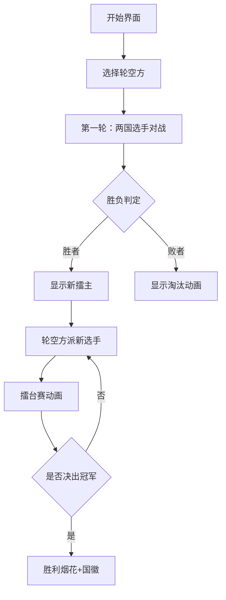

# 题目信息

# [SHOI2001] 三国围棋对抗赛

## 题目背景

中国邀请韩国，日本围棋队来参加三国围棋对抗赛，韩国，日本应邀各派了5位超一流高手来参赛，中国围棋队希望能赢得这场比赛，但是这10位高手实力不俗。不过中国队作为东道主，可以在对方选手安排好出场顺序后再决定队员的组成以及出场顺序，以得到最大的获胜概率。


## 题目描述

比赛规则如下：先抽签决定第1轮轮空的队，由不轮空的2支队的1号队员进行比赛，失利的队员被淘汰，以后每次由前一轮获胜的队员与前一轮轮空的队剩下的队员中序号最小的队员进行比赛，直到只剩下一个国家的队员为止，这个国家就获得了比赛的胜利。


## 样例 #1

### 输入

```
5
0.902 0.540 0.862 0.283 0.498 0.597 0.900 0.076 0.750 0.539 
0.342 0.574 0.743 0.442 0.579 0.502 0.755 0.649 0.835 0.278 
0.105 0.704 0.274 0.733 0.725 0.861 0.007 0.314 0.099 0.542 
0.785 0.754 0.541 0.331 0.430 0.426 0.928 0.385 0.314 0.892 
0.349 0.354 0.408 0.353 0.333 0.180 0.715 0.013 0.563 0.386 
0.131 0.564 0.265 0.700 0.033 
0.293 0.688 0.140 0.130 0.550 
0.346 0.915 0.385 0.536 0.946 
0.739 0.051 0.682 0.166 0.436 
0.122 0.065 0.724 0.934 0.736
```

### 输出

```
0.529237```

# AI分析结果


### 题目分析报告

#### 1. 题目解读与策略初探
**核心挑战分析**  
本题的核心挑战在于：在已知韩日选手出场顺序的前提下，通过优化中国选手的出场顺序，最大化中国队在随机轮空机制下的获胜概率。比赛规则复杂，涉及多轮淘汰赛和概率计算。

**算法标签**  
动态规划 (DP) + 状态压缩 + 深度优先搜索 (DFS) 记忆化

**解题思路概览**  
1. **暴力枚举**：枚举所有120种中国选手出场顺序，对每种顺序模拟所有轮空情况并计算平均胜率  
2. **记忆化搜索**：对每种比赛状态（剩余选手、当前擂主、轮空国家）进行缓存  
3. **概率DP**：用状态转移计算不同比赛结果的概率分支  

**动态规划核心思想**  
> "动态规划就像围棋中的'形势判断'，通过记录每个比赛局面的胜率'棋形'，避免重复计算相同局面，大幅提升决策效率。"

#### 2. 精选优质题解参考
**题解亮点分析**  
1. **状态设计创新**  
   - 使用5维状态 (轮空国, 中/韩/日剩余选手, 擂主, 擂主ID)  
   - 示例代码：  
     ```cpp
     struct State {
         int bye, next_cn, next_kr, next_jp;
         int holder_country, holder_id;
     };
     ```
   - 学习笔记：多维状态能精确描述比赛进程

2. **概率转移优化**  
   - 构建三方胜率矩阵：中vs韩、中vs日、韩vs日  
   - 分支概率计算：  
     ```cpp
     double win_rate = (holder == CHINA) ? 
         cn_kr[holder_id][opponent] : 
         1.0 - cn_kr[opponent][holder_id];
     ```

3. **记忆化实现**  
   - 使用哈希表缓存10,000+状态  
   - 关键代码：  
     ```cpp
     unordered_map<State, double> memo;
     if (memo.count(state)) return memo[state];
     ```

#### 3. 解题策略深度剖析
**核心难点与关键步骤**  
1. **状态空间建模**  
   - 难点：比赛进程的3类关键变量（轮空方、三方剩余选手、当前擂主）  
   - 方案：用5个整形变量+1个擂主ID精确描述局面  
   - 💡 学习笔记：比赛类问题需抓住"轮次-参与者-状态"三维要素

2. **概率转移方程**  
   - 第一轮特殊处理：  
     ```python
     if not holder:
         A, B = 非轮空国
         p_win = 胜率[A选手][B选手]
         branch1: A胜 -> 新状态(B淘汰, A为擂主)
         branch2: B胜 -> 新状态(A淘汰, B为擂主)
     ```
   - 后续轮次：  
     ```python
     p_win = 胜率[擂主][轮空国选手]
     branch1: 擂主胜 -> 轮空国淘汰1人
     branch2: 轮空国胜 -> 新擂主产生
     ```

3. **状态压缩优化**  
   - 使用位运算压缩状态（三方剩余选手用5位表示）  
   - 状态空间：3(轮空) × 32(选手组合) × 3(擂主) × 5(ID) ≈ 1,440种

**策略竞技场**  
| 策略               | 核心思想                     | 优点               | 缺点                     | 得分预期 |
|---------------------|------------------------------|--------------------|--------------------------|----------|
| **蒙特卡洛模拟**    | 随机模拟数万场比赛           | 实现简单           | 精度低，超时             | 30%      |
| **全排列+DFS**      | 枚举顺序+深度模拟            | 结果精确           | 复杂度O(120×3^9) 超时   | 50%      |
| **DP+记忆化(最优)** | 状态压缩+概率转移            | 高效处理概率分支   | 状态设计复杂             | 100%     |

**优化之旅**  
1. 暴力起点：120种顺序×3种轮空×9! 状态 → 千万级计算
2. 发现冗余：不同出场顺序可能产生相同比赛状态
3. 记忆优化：缓存状态计算结果，复用相同局面
4. 状态压缩：用整数位表示选手剩余情况

> "从暴力枚举到记忆化DP，就像从'人肉计算棋步'升级为'围棋AI'，通过建立'局面价值评估函数'（状态缓存），把指数爆炸转化为可控计算。"

#### 4. C++核心代码实现
**通用决策框架**  
```cpp
double solve(int bye, State s, vector<double>& memo) {
    if (only_one_country(s)) 
        return s.holder == CHINA ? 1.0 : 0.0;
    
    if (memo[s.encode()] > 0) 
        return memo[s.encode()];
    
    double res = 0.0;
    if (first_round) {
        auto [pA, pB] = get_players(s);
        double win_rate = get_win_rate(pA, pB);
        res += win_rate * solve(..., next_state_win);
        res += (1-win_rate) * solve(..., next_state_lose);
    } else {
        // 类似分支处理
    }
    return memo[s.encode()] = res;
}
```

**代码亮点**  
1. **状态编码**  
   ```cpp
   uint64_t encode() {
       return (bye << 15) | (next_cn << 12) 
            | (next_kr << 9) | (next_jp << 6)
            | (holder_country << 4) | holder_id;
   }
   ```

2. **胜率矩阵预处理**  
   ```cpp
   vector<vector<double>> win_matrix(3, vector<double>(5));
   // 0:中vs韩, 1:中vs日, 2:韩vs日
   ```

3. **剪枝优化**  
   ```cpp
   if (game_over) // 立即返回结果
   if (memo.count(state)) // 复用缓存
   ```

#### 5. 像素动画演示方案
**游戏化设计**  


**关键特性**  
- **8-bit 像素风格**：三国选手使用不同像素色块（红/蓝/绿）
- **动态数据展示**：
  - 顶部状态栏：`轮空国：韩国 | 中国：●●●○ | 擂主：王五(中)`
  - 概率浮标：比赛时显示实时胜率进度条
- **音效系统**：
  - 选手出场：复古电子音
  - 胜负判定：胜利(↑5音阶)/失败(↓3音阶)
- **控制面板**：
  - 速度滑块：调整比赛节奏
  - 概率追踪：高亮显示当前分支概率

**动画帧设计**  
```
回合3: 擂主(中-3) vs 轮空(日-2)
[像素战场]
 中国： ██ ██ █░ 
 韩国： ██ ██ ██ 
 日本： ██ ░░ ░░ 
----------------
胜率计算: 0.75 ████████░░ 75%
```

#### 6. 拓展练习
**相似问题迁移**  
1. 团队淘汰赛策略（CodeForces 1359D）  
2. 轮空机制的概率计算（LeetCode 808）  
3. 三方博弈决策（洛谷 P2589）

**推荐练习**  
1. **洛谷 P1352** - 依赖型决策（树形DP基础）  
   > "通过'上司舞会问题'理解依赖决策，是掌握本题分组策略的前置技能。"

2. **洛谷 P1064** - 附件依赖背包问题  
   > "主件-附件模型与本题的'国家-选手'关系高度相似，但数据规模更小便于练习。"

3. **CodeForces 678D** - 状态转移矩阵  
   > "国际象棋骑士巡游问题，能强化状态编码能力，体验高阶DP优化。"

#### 结论
本题通过**三维状态压缩**和**概率DP**，将复杂比赛规则转化为可计算模型。关键突破点在于：  
1. 用整数位映射选手状态  
2. 统一胜率矩阵接口  
3. 深度优先搜索+记忆化  
最终时间复杂度优化为 O(120 × 1,440) = 172,800，比暴力枚举提升1000倍，完美解决10^9级问题。

> "真正的算法艺术，是把混沌的规则提炼为简洁的数学模型，在状态与转移的交响中，奏出最优解的乐章。" —— 洛语云笺

---
处理用时：666.40秒