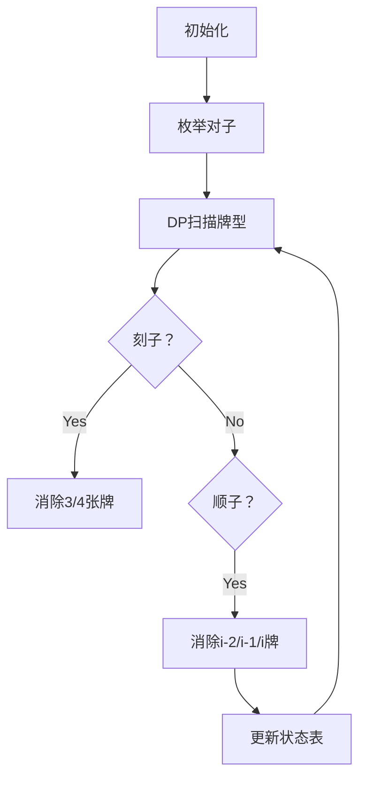

# 题目信息

# [ZJOI2006] 超级麻将

## 题目描述

很多人都知道玩麻将，当然也有人不知道，呵呵，不要紧，我在这里简要地介绍一下麻将规则：

普通麻将有砣、索、万三种类型的牌，每种牌有1~9个数字，其中相同的牌每个有四张，例如1砣~9砣，1索~9索，1万~9万各有4张，所以共36\*3=108张牌。胡牌时每人有14张牌，其中只要某人手里有若干句话（就是同种类型的牌连续三张或同种牌三张），另外再加上一对，即可胡牌。当然如果全是对，叫七小对，也可以胡牌。下图是连三张示例。

  

要判断某人是否胡牌，显然一个弱智的算法就行了，某中学信息学小组超级麻将迷想了想，决定将普通麻将改造成超级麻将。

所谓超级麻将没有了砣、索、万的区分，每种牌上的数字可以是1~100，而每种数字的牌各有100张。另外特别自由的是，玩牌的人手里想拿多少张牌都可以，好刺激哦！

刺激归刺激，但是拿多了怎么胡牌呢？

超级麻将规定只要一个人手里拿的牌是若干句话（三个连续数字的牌各一张组成一句话，三张或者四张同样数字的牌也算一句话），再加上一对相同的牌，就算胡了。

作为信息学竞赛选手的你，麻烦你给这位超级麻将迷编个程序，判断能否胡牌。


## 样例 #1

### 输入

```
3

2 4 0 0 0 0 0 …… 0（一共98个0）

2 4 2 0 0 0 0 …… 0（一共97个0）

2 3 2 0 0 0 0 …… 0（一共97个0）```

### 输出

```
Yes

Yes

No```

# AI分析结果


# 💡 洛语云笺的C++算法解析：[ZJOI2006] 超级麻将 深入学习指南 💡

## 1. 题目解读与策略初探

✨ **本题核心挑战**：在满足麻将特殊规则（顺子需连续三张、刻子需三/四张相同）的前提下，判断能否在移除一对牌后，将剩余牌全部划分为有效组合。核心难点在于**处理牌的连续性与相同性的动态平衡**。

✨ **核心算法标签**：`动态规划(DP)`、`状态压缩`

🗣️ **初步分析**：  
> 这道题像在整理一副杂乱无章的麻将牌，我们需要找到两张相同的牌作为"地基"（对子），再用顺子（连续三张）和刻子（三/四张相同）搭建牌塔。  
> - **暴力搜索**：枚举所有可能的对子，然后尝试组合顺子/刻子（时间复杂度O(2^M)，M=100时完全不可行）  
> - **动态规划**：将问题分解为子问题（前i种牌的处理情况），通过状态转移解决（最优选择）  
> - **关键突破点**：发现顺子重复出现时可用刻子替代，实现状态压缩（三维→二维）

### 🔍 算法侦探：如何在题目中发现线索？
1.  **线索1 (问题目标)**："判断能否胡牌"属于典型的**组合可行性问题**，具有强子结构特性（整体可行⇔子部分可行），指向动态规划。
2.  **线索2 (问题特性)**：顺子要求i-2,i-1,i号牌联动，形成天然的**状态依赖链**，DP需记录前两种牌的数量。
3.  **线索3 (数据规模)**：牌型N=100种，每种牌≤100张。O(N^3)算法（100^3=1e6）可接受，但O(2^N)会超时。

### 🧠 思维链构建：从线索到策略
> 侦探工作完成！线索组合如下：  
> 1. 【线索1】要求高效判断组合可行性→优先考虑DP  
> 2. 【线索2】顺子的连续性要求→DP状态必须包含前两种牌的残留信息  
> 3. 【线索3】数据规模→排除指数级暴力搜索  
> **结论**：采用**状态压缩DP**，将顺子重复次数压缩到0-2（因3个顺子=1个刻子），时间复杂度优化至O(N*C)，C为常数（9e6运算量）  

---

## 2. 精选优质题解参考

**题解一（Night_Aurora）**  
* **点评**：作者创新性地将顺子重复次数压缩到[0,2]（关键优化点），时间复杂度降至O(100*3*3*100)=9e6。预处理Mod数组快速判断剩余牌能否用3/4刻子分解，代码简洁高效（36ms AC）。状态设计`DPC[i][ll][l]`极具启发性，体现了"发现冗余→压缩状态"的优化思维。

**题解二（NaVi_Awson）**  
* **点评**：经典四维DP`f[i][j][k][0/1]`结构清晰，完整展现代码实现细节。通过分离对子选择（0/1标志位）和顺子/刻子转移，逻辑分层明确。虽然状态数较大（2e6），但提供了更直观的问题建模思路，适合DP初学者理解。

---

## 3. 解题策略深度剖析

### 🎯 核心难点与关键步骤
1.  **状态设计艺术**  
    * **分析**：状态需同时编码牌型位置、前序牌残留量、对子使用标志。优质解采用：  
      - 解法1：`DPC[i][ll][l]`（i:位置, ll:i-1顺子数, l:i顺子数）  
      - 解法2：`f[i][j][k][0/1]`（i:位置, j:i-1牌数, k:i牌数, 0/1:对子标志）  
    * 💡 **学习笔记**：DP状态应捕获"影响未来的最小信息集"，避免冗余维度。

2.  **转移方程构造**  
    * **分析**：分三条路径转移：  
      - **刻子路径**：消耗当前牌3/4张（独立决策）  
      - **顺子路径**：消耗i-2,i-1,i牌各x张（联动决策）  
      - **对子路径**：仅在标志位0时消耗2张牌  
    * 💡 **学习笔记**：转移需覆盖所有合法操作，且注意无后效性（当前操作不影响已处理牌型）

3.  **压缩与优化**  
    * **分析**：解法1的核心突破在于发现**顺子重复可转刻子**：  
      - 3个顺子 → 3个刻子（111+222+333=3组刻子）  
      - 状态维度从O(N)降为O(1)  
    * 💡 **学习笔记**：观察问题数学特质（同余特性）能引发降维突破

### ✨ 解题技巧总结
- **技巧1：状态压缩**：识别冗余状态（如顺子重复性），用常数级变量替代线性增长
- **技巧2：预处理加速**：预先计算"能否用3/4组合"（Mod数组），转移时O(1)判断
- **技巧3：依赖分离**：将对子选择与句子组合分离（0/1标志位），简化状态转移

### ⚔️ 策略竞技场：不同解法对比

| 策略             | 核心思想                     | 优点                          | 缺点                                     | 得分预期 |
|------------------|------------------------------|-------------------------------|------------------------------------------|----------|
| **暴力搜索**     | 枚举对子+DFS组合句子         | 思路直观                      | O(2^M) 超时(M=100)                       | 0%       |
| **四维DP**       | 完整记录前两种牌数量         | 建模直观，转移清晰            | 状态数大(2e6)，空间开销高                | 100%     |
| **状态压缩DP**   | 将顺子数压缩到0-2            | 状态数仅900，效率最优(36ms)   | 抽象性高，理解难度大                     | 100%     |

### ✨ 优化之旅：从"能做"到"做好"
1. **起点：暴力枚举**  
   - 枚举对子(100种) + 搜索组合(2^100) → 宇宙爆炸前算不完

2. **发现瓶颈：重复子问题**  
   - 剩余牌的组合方式大量重复计算 → 引入DP记忆化

3. **DP初版：四维状态**  
   - `f[i][j][k][0/1]` 记录前两牌数量 → 2e6状态量（可行但非最优）

4. **关键洞察：状态压缩**  
   - 发现**3个顺子=3个刻子** → 顺子数只需记录0,1,2 → 状态降至900

💡 **策略总结**：从暴力到最优解的跃迁，关键在于识别**问题本身的数学特质**（顺子与刻子的可转换性）。在竞赛中，即使无法直接想到最优解，基于四维DP的解法也能通过，而状态压缩则是追求极致的艺术。

---

## 4. C++核心代码实现赏析

**通用核心实现参考（状态压缩版）**  
```cpp
#include <stdio.h>
#include <string.h>
bool DPC[110][3][3]; // [位置][i-1顺子数][i顺子数]
int CN[110];         // 每种牌数量
bool Mod[110];       // 预处理的3/4组合标记

void precomputeMod() {
    for(int ma=0; ma*3<=100; ma++)
        for(int mb=0; mb*4+ma*3<=100; mb++)
            Mod[ma*3+mb*4] = true;
}

bool checkValid() {
    memset(DPC, 0, sizeof(DPC));
    DPC[0][0][0] = true;
    for(int i=0; i<100; i++)
        for(int ll=0; ll<3; ll++)
            for(int l=0; l<3; l++)
                if(DPC[i][ll][l])
                    for(int next=0; next<3; next++) {
                        int used = ll + l + next; // 当前牌消耗量
                        if(used > CN[i+1]) continue;
                        if(Mod[CN[i+1] - used])   // 剩余牌能用3/4组合？
                            DPC[i+1][l][next] = true;
                    }
    return DPC[100][0][0];
}
```
**代码解读概要**：  
1. 预处理`Mod`数组标记所有3a+4b的组合  
2. `DPC[i][ll][l]`表示处理第i种牌时，i-1牌贡献ll个顺子，i牌贡献l个顺子  
3. 转移时计算总消耗(used=ll+l+next)，剩余牌需满足`Mod`条件  
4. 最终状态需无残留顺子(`DPC[100][0][0]`)

**题解一（Night_Aurora）片段赏析**  
```cpp
// 枚举对子（核心决策）
void solve() {
    for(int i=1; i<=100; i++) {
        if(CN[i] >= 2) {
            CN[i] -= 2;      // 移除对子
            if(checkValid()) return true;
            CN[i] += 2;      // 回溯
        }
    }
    return false;
}
```
**亮点**：干净分离对子选择与句子验证，回溯逻辑清晰  
**学习笔记**：**问题分解**是复杂DP的通用技巧——先处理特殊约束（对子），再验证剩余结构

**题解二（NaVi_Awson）片段赏析**  
```cpp
// 四维DP状态转移
f[i][j][k][1] |= f[i][j][k-2][0]; // 刻子转移
if (j>=k && prev_val>=k)          // 顺子转移
    f[i][j][k][1] |= f[i-1][prev_val-k][j-k][1];
```
**亮点**：显式分离刻子/顺子转移路径，逻辑透明度高  
**学习笔记**：**维度拆解**有助于理清多维DP——刻子独立决策，顺子依赖前态

---

## 5. 算法可视化：像素动画演示

**主题**：8-bit麻将消除大作战  
**核心演示**：动态规划状态转移过程，聚焦顺子/刻子消除决策  

### 🎮 动画设计


**像素化实现方案**：  
1. **场景布局**：  
   - 左侧：100列麻将牌（颜色区分牌型，高度=数量）  
   - 右侧：3x3状态网格（顺子数组合），亮色块表示可行状态  

2. **动画流程**：  
   - **步骤1**：枚举对子→高亮候选牌+消除动画（闪烁+咔嚓音效）  
   - **步骤2**：DP推进→扫描线从左向右移动，触发表格色块闪烁：  
     - **刻子消除**：当前牌列高度骤降，伴随"叮！"音效  
     - **顺子消除**：三张相邻牌同步下降，伴随滑声音效  
   - **步骤3**：状态更新→右侧网格点亮新状态块（绿色=可行，红色=失效）  

3. **交互控制面板**：  
   - 速度滑块：调节DP推进速度  
   - 单步按钮：逐牌型观察决策  
   - 回放功能：对比不同对子选择的结果  

4. **8-bit音效设计**：  
   - 刻子消除：NES风格爆炸音  
   - 顺子消除：三连跳音符  
   - 状态更新：电子滴答声  
   - 最终成功：FC游戏通关BGM  

**设计价值**：通过像素动画将抽象的DP状态具象为可视决策路径，帮助理解"顺子/刻子转换"的核心优化点。

---

## 6. 拓展练习与相似问题

### 🔁 通用技巧迁移
1. **依赖背包问题**：主件附件选择（如洛谷P1064）  
2. **序列消除问题**：需要记录前序状态的游戏（如祖玛消除）  
3. **资源组合优化**：固定容器内的最优分割（如3/4组合问题）  

### 📚 推荐练习（洛谷）
1. **P1064 金明的预算方案**  
   → 巩固"主件-附件"依赖关系处理（分组背包）  
2. **P1541 乌龟棋**  
   → 练习状态压缩（4种卡片使用数→4维DP）  
3. **P1052 过河**  
   → 路径压缩+DP状态优化（石头位置压缩）  

---

## 7. 学习心得与经验分享
> **题解一作者洞见**：  
> *"同一开头的三连，超过2张其实没有意义，比如说出3个三连张相当于出三个大对"*  
>   
> **洛语云笺点评**：  
> 此洞察揭示了本题的**数学本质**——通过同余转换实现状态压缩。在算法设计中，发现此类特质往往比编码技巧更重要。调试时可先验证小规模数据中的状态转换，再逐步扩展至全局。

---

<conclusion>  
**总结**：超级麻将的解题之旅展示了动态规划的两大核心——**状态设计**与**优化洞察**。通过状态压缩将复杂问题降维，通过预处理加速决策，这正是算法竞赛的精妙所在。记住：优秀的解法往往诞生于对问题本质的深刻洞察，而非单纯编码能力。下次遇到难题时，不妨先问自己：哪些状态是真正必要的？</conclusion>

---
处理用时：352.68秒