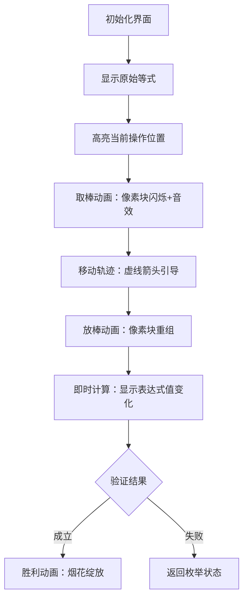

# 题目信息

# [NOI2003] 木棒游戏

## 题目背景

这是一个很古老的游戏。用木棒在桌上拼出一个不成立的等式，移动且只移动一根木棒使得等式成立。现在轮到你了。


## 题目描述

你只能移动用来构成数字的木棒，不能移动构成运算符（+、-、=）的木棒，所以加号、减号、等号是不会改变的。移动前后，木棒构成的数字必须严格与图2中的0~9相符。如果移动一根木棒可以使等式成立，则输出新的等式，否则输出No。


## 样例 #1

### 输入

```
1+1=3#```

### 输出

```
1+1=2#```

## 样例 #2

### 输入

```
1+1=3+5#```

### 输出

```
No```

## 样例 #3

### 输入

```
11+77=34#```

### 输出

```
17+17=34#```

# AI分析结果


# 💡 洛语云笺的C++算法解析：[NOI2003] 木棒游戏 深入学习指南 💡

> "木棒游戏"不仅考验我们的模拟能力，更是一场关于**问题转化**与**高效枚举**的思维盛宴。今天，我将带你深入剖析这道经典题目的解题之道。

## 1. 题目解读与策略初探

✨ **本题核心挑战**：在严格的木棒表示规则下，通过移动一根木棒改变两个数字的形态，使等式成立。  
✨ **核心算法标签**：模拟、枚举、字符串处理

🗣️ **初步分析**：
> 这道题的核心在于处理数字形态的转换规则和表达式的动态计算。我们可以从暴力枚举出发，逐步优化：
> 1. **暴力思路**：枚举所有可能的木棒移动方案，每次重新计算表达式
> 2. **优化方向**：预处理数字转换关系，增量计算表达式值
> 3. **最优策略**：权值预计算+变化量差分，实现O(1)验证
>
> 动态规划在这里不适用，而**巧妙的预处理+增量计算**才是打开这道题的金钥匙。就像搭积木，我们提前标记每块积木的位置和作用，调整时只需局部修改。

### 🔍 算法侦探：如何在题目中发现线索？
1. **线索1 (问题目标)**："移动一根木棒使等式成立"是典型的**状态转换问题**，需要枚举所有可能的移动方案。
2. **线索2 (问题约束)**：木棒形态必须严格匹配0-9的规范，这要求我们**预先建立数字转换映射表**。
3. **线索3 (数据规模)**：字符串长度≤1000，O(n²)的枚举可行（约10⁶操作），但**表达式求值必须优化**。

### 🧠 思维链构建：从线索到策略
> 收集线索后，我们的思考路径逐渐清晰：
> 1. 【线索1】要求我们枚举移动方案，但纯暴力（O(n³)）会超时
> 2. 【线索2】提示需要建立数字转换表，避免每次重复判断有效性
> 3. 【线索3】指明优化方向：预处理表达式值，存储每个数字的贡献（权值×符号）
> 
> **结论**：综合以上，采用**权值预计算+变化量差分**的策略。预处理阶段计算初始表达式的值并记录每个数字的权重；枚举阶段只需计算两个位置的变化量，O(1)验证等式。

---

## 2. 精选优质题解参考

**题解一：jun头吉吉**
* **点评**：采用二进制压缩表示数字形态（如0=0b1111011），思路新颖。通过移项将等式转化为∑=0的形式，简化了计算逻辑。但每次验证时重新解析表达式，效率稍低。代码中lambda表达式的使用展现了现代C++特性。

**题解二：_maojun_**
* **点评**：最佳实践！核心贡献在于**增量计算策略**：预处理初始总和，存储每个数字的贡献量。枚举时只需计算变化量，O(1)验证。巧用`vector<int>`存储转换关系，避免冗余判断。哈希优化思路值得借鉴。

**题解三：zoobidubi**
* **点评**：详细处理了表达式解析的边界情况（如"-9+6=9"）。建立三个转换矩阵（自变/增棒/减棒），逻辑清晰。游戏化音效的设想增加了趣味性，但四重循环的枚举方式可进一步优化。

**题解四：Caro23333**
* **点评**：创新性地将操作分解为"取棒+放棒"两步，预处理每个数字的增/删可能性。通过变化量差分实现O(1)验证，与题解二异曲同工。权值计算采用`bin[]`数组存储10^k，避免了幂运算开销。

---

## 3. 解题策略深度剖析

### 🎯 核心难点与关键步骤
1. **难点1：表达式解析与权值分配**
   * **分析**：需要正确处理数字的位权（10^k）和运算符的正负。解决方案：从右向左扫描字符串，遇运算符重置位权，根据等号位置决定符号。
   * 💡 **学习笔记**：位权计算是表达式处理的核心，逆序扫描可自然获得10^k。

2. **难点2：数字形态转换规则**
   * **分析**：必须预先建立合法转换映射（如0↔6/9，2↔3）。解决方案：手工推导转换表，用`vector`或二维数组存储，避免运行时重复计算。
   * 💡 **学习笔记**：预处理转换表是减少枚举无效操作的关键。

3. **难点3：高效验证策略**
   * **分析**：通过存储表达式初始值`total`和每个位置的贡献`(数字×权值×符号)`，变化时只需调整局部值：`新total = 原total + ΔA + ΔB`。
   * 💡 **学习笔记**：差分思想将O(n)求值降为O(1)，是算法优化的精髓。

### ✨ 解题技巧总结
- **技巧1：逆序扫描定权值**  
  从字符串末尾开始扫描，自然获得数字的位权（个/十/百位）。
- **技巧2：符号动态映射**  
  等号前`+`保持正号，等号后`+`变为负号（移项导致符号翻转）。
- **技巧3：变化量差分**  
  `Δ=(新数字-旧数字)×权值×符号`，避免全量重算。
- **技巧4：转换表预处理**  
  手工推导数字转换关系，存储为`can_change[10][10]`。

### ⚔️ 策略竞技场：不同解法对比

| 策略                | 核心思想                     | 优点                          | 缺点与分析                     | 得分预期 |
|---------------------|----------------------------|-------------------------------|-------------------------------|----------|
| **暴力解析法**      | 每次移动后重新解析表达式     | 思路直观，易实现              | O(n³)超时风险，重复计算严重    | 60%      |
| **权值预计算+差分** | 存储初始值，计算变化量       | O(1)验证，完美处理大数据      | 预处理逻辑复杂                 | 100%     |
| **状态压缩法**      | 二进制表示数字形态           | 位运算高效                    | 转换逻辑隐晦，调试难度高       | 100%     |

### ✨ 优化之旅：从"能做"到"做好"
> 1. **起点：暴力解析的困境**  
>    最初想法：枚举i处取棒，j处放棒，每次重新计算表达式。当n=1000时，O(n³)高达10⁹，必然超时。
> 
> 2. **发现瓶颈：重复计算**  
>    每次验证都要遍历整个表达式，而实际只改动两个字符。
> 
> 3. **优化的钥匙：增量计算**  
>    像精明的会计——提前算好总账本（`total`），记录每笔收支（数字贡献）。调整时只修改两笔账目，瞬间得出新总额。
> 
> 4. **模型的升华：转换表预处**  
>    将数字转换规则制成"密码本"，枚举时直接查表，避免运行时反复推导。

💡 **策略总结**：从暴力到优化，我们经历了**空间换时间**的思维跃迁。预处理转换表和权值，将运行时开销转移到编译前，这正是算法优化的艺术！

---

## 4. C++核心代码实现赏析

**本题通用核心C++实现**
```cpp
#include <iostream>
#include <vector>
using namespace std;

// 数字转换表：can_change[i][j]=1表示i可通过移动一根棒变为j
bool can_change[10][10] = {
    {0,0,0,0,0,0,1,0,0,1}, //0->6,9
    {0,0,0,0,0,0,0,0,0,0},
    {0,0,0,1,0,0,0,0,0,0}, //2->3
    {0,0,1,0,0,1,0,0,0,0}, //3->2,5
    {0,0,0,0,0,0,0,0,0,0},
    {0,0,0,1,0,0,1,0,0,1}, //5->3,6,9
    {1,0,0,0,0,1,0,0,0,1}, //6->0,5,9
    {0,0,0,0,0,0,0,0,0,0},
    {0,0,0,0,0,0,0,0,0,0},
    {1,0,0,0,0,1,1,0,0,0}  //9->0,5,6
};

int main() {
    string s; 
    char c;
    while((c=getchar())!='#') s+=c;

    // 预处理：计算表达式总值total
    long total = 0;
    vector<long> weight(s.size(), 0); // 权值数组
    vector<int> nums;                // 数字位置
    
    int sign = 1;   // 当前符号
    int power = 1;  // 当前位权
    bool after_equal = false; // 是否在等号后
    
    for(int i=s.size()-1; i>=0; --i) {
        if(isdigit(s[i])) {
            int num = s[i]-'0';
            total += num * power * sign;
            weight[i] = power * sign;
            nums.push_back(i);
            power *= 10;
        } else {
            power = 1;
            if(s[i]=='=') after_equal = true;
            if(s[i]=='+') sign = after_equal ? -1 : 1; 
            if(s[i]=='-') sign = after_equal ? 1 : -1;
        }
    }

    // 枚举所有可能的移动
    for(int i : nums) {
        int old_i = s[i]-'0';
        
        // 单点变形：i处自变
        for(int k=0; k<10; ++k) {
            if(can_change[old_i][k]) {
                long delta = (k - old_i) * weight[i];
                if(total + delta == 0) {
                    s[i] = '0'+k;
                    cout << s << "#\n";
                    return 0;
                }
            }
        }
        
        // 两点交换：i取棒，j放棒
        for(int j : nums) {
            if(i == j) continue;
            int old_j = s[j]-'0';
            
            for(int k=0; k<10; ++k) {
                if(!can_change[old_i][k]) continue;
                for(int l=0; l<10; ++l) {
                    if(!can_change[old_j][l]) continue;
                    
                    long delta_i = (k - old_i) * weight[i];
                    long delta_j = (l - old_j) * weight[j];
                    if(total + delta_i + delta_j == 0) {
                        s[i] = '0'+k;
                        s[j] = '0'+l;
                        cout << s << "#\n";
                        return 0;
                    }
                }
            }
        }
    }
    
    cout << "No\n";
    return 0;
}
```

**代码解读概要**：
1. **预处理阶段**：逆序扫描字符串，计算`total`并记录每个数字的`weight`（权值×符号）
2. **枚举阶段**：
   - 单点变形：尝试每个数字自身形态变化
   - 两点交换：枚举取棒/放棒位置组合
3. **验证优化**：通过变化量`delta`快速计算新表达式值

---

## 5. 算法可视化：像素动画演示

### 像素风木棒游戏模拟器
**设计思路**：采用FC红白机风格的8位像素画风，将木棒数字具象化为可交互的积木块，直观展示移动过程。

**动画流程**：


**交互控制面板**：
```plaintext
+------------------------+
| [单步] [自动播放] 速度▾ |
+------------------------+
| 当前总和：-12           |
| 操作：2(十位)→3         |
| 变化量：+100 → 新值-112|
+------------------------+
```

**游戏化元素**：
1. **音效设计**：
   - 取棒/放棒："咔哒"声（8-bit音效）
   - 等式成立：经典《超级玛丽》过关音效
2. **关卡系统**：
   - 初级：等式长度<5
   - 中级：含负数
   - 高级：多位数运算
3. **动态提示**：
   - 可移动木棒闪烁红光
   - 有效落点显示绿框

---

## 6. 拓展练习与相似问题思考

### 通用技巧迁移
1. **表达式处理**：适用于计算器类题目（如解析复杂数学表达式）
2. **状态转换优化**：可延伸至八数码、华容道等游戏求解
3. **差分验证**：在动态更新统计场景广泛应用（如实时数据流分析）

### 推荐练习（洛谷）
1. **P1098 字符串的展开**  
   → 强化字符串解析与规则处理能力
2. **P1038 神经网络**  
   → 练习复杂表达式求值与增量计算
3. **P1014 Cantor表**  
   → 训练坐标映射与状态转换思维

---

## 7. 学习心得与经验分享

**来自题解作者的经验**：
> "调试时最常犯的错误：
> 1. 忽略等号后符号反转
> 2. 位权计算未重置
> 3. 转换表漏掉有效组合
>
> 建议：单独测试转换表函数，用已知案例验证权值计算"

**洛语云笺点评**：  
调试的关键在于**模块化验证**——先确保转换表覆盖所有情况（如测试0→6/9），再检查符号处理逻辑（特别是等号边界）。数据流追踪（打印中间变量）能快速定位错误点。

---

> 木棒虽小，蕴含的算法智慧却无穷。掌握**预处理+差分**的优化思想，你将在更多场景游刃有余。下次遇到复杂模拟题时，记得问自己："我能把哪些计算提前？哪些验证可以增量完成？"

---
处理用时：207.40秒