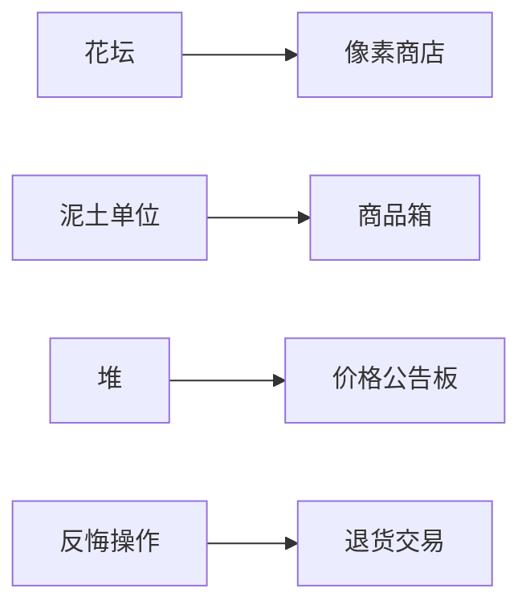

# 题目信息

# [USACO16OPEN] Landscaping P

## 题目背景

*本题与 [2012 年 3 月月赛银组同名题目](/problem/P3049) 在题意上一致，唯一的差别是数据范围。*

## 题目描述

Farmer John 打算修建一座花园，他需要移动不少泥土。

花园由 $N$ 个花坛组成（$1 \leq N \leq 10^5$），其中花坛 $i$ 包含 $A_i$ 单位的泥土。FJ 希望花坛 $i$ 包含 $B_i$ 单位的泥土，保证 $0 \leq A_i,B_i \leq 10$。

为了达到这个目标，他可以做这几件事情：

- 购买一单位的泥土，放在指定的花坛中，费用为 $X$。
- 从任意一个花坛中移走一单位泥土，费用为 $Y$。
- 从花坛 $i$ 运送一单位泥土到花坛 $j$，费用为 $Z|i-j|$。

请你帮 FJ 计算移动泥土的最小开销。

## 说明/提示

按下面的方案，最小花费为 $210$，可以证明不存在开销更小的方案。

- 移除 $4$ 号花坛的一单位泥土，花费 $200$。
- 将 $4$ 号花坛的三单位泥土移到 $1$ 号花坛，花费 $3 \times 3=9$。
- 将 $3$ 号花坛的一单位泥土移到 $2$ 号花坛，花费 $1 \times 1=1$。

## 样例 #1

### 输入

```
4 100 200 1
1 4
2 3
3 2
4 0```

### 输出

```
210```

# AI分析结果


# 💡 洛语云笺的C++算法解析：Landscaping P 深入学习指南 💡

> "移动泥土如同调配资源，在约束中寻找最优解，正是算法思维的魅力所在。" —— 洛语云笺

## 1. 题目解读与策略初探

✨ **本题核心挑战**：在满足每个花坛目标泥土量的前提下，通过购买、移除和移动三种操作实现最小开销，核心难点在于高效处理跨花坛的泥土转移决策。  
✨ **核心算法标签**：`反悔贪心` `堆优化` `问题分解`

🗣️ **初步分析**：
> 这道题看似简单的泥土调配问题，实则暗藏玄机。让我们先思考基础思路：
> - **暴力枚举**：尝试所有泥土移动组合，复杂度 O(2^M) 完全不可行
> - **动态规划**：状态定义困难（需记录每个花坛的泥土余量），状态空间爆炸
> - **反悔贪心**（最优解）：将每单位泥土独立处理，通过堆维护历史决策信息，实现高效"反悔"
>
> 最优解的核心在于**将泥土移动转化为金融交易**：每个花坛的泥土余缺形成"交易市场"，堆记录历史操作成本，后续位置可"反悔"先前决策获得更优解。可视化设计将展示泥土单位流动和堆的动态变化，配以8-bit音效增强理解。

### 🔍 算法侦探：如何在题目中发现线索？
1.  **线索1 (问题目标)**：题目要求"最小化操作开销"，且存在多种操作方式，这是典型的**最优化问题**，提示贪心或动态规划。
2.  **线索2 (数据特性)**：泥土量变化小（A_i,B_i≤10），暗示可将问题分解为**单位泥土操作**，大大降低复杂度。
3.  **线索3 (操作特性)**：移动成本与距离成正比（Z|i-j|），提示需要高效处理**位置相关性**。
4.  **线索4 (数据规模)**：N≤10^5 要求 O(N log N) 算法，排除暴力解，指向堆优化。

### 🧠 思维链构建：从线索到策略
> 让我们串联线索形成解题策略：
> 1. 【线索1+2】最优化问题+小数据变化 → 考虑单位泥土的独立决策
> 2. 【线索3】移动成本与距离相关 → 需要快速查找最优转移位置
> 3. 【线索4】大数据规模 → 需O(N log N)算法 → 堆是理想选择
> 4. **核心突破**：反悔机制！当当前位置j需要泥土时，可以"反悔"之前位置i的操作（改为从i移到j），通过堆记录i位置的操作成本，实现O(1)最优决策
> 5. **最终策略**：双堆维护（多余堆/缺少堆），存储格式为`位置*Z + 操作成本`，通过堆顶快速获取最优反悔对象

---

## 2. 精选优质题解参考

### 题解一（lytqwq，赞15）
* **点评**：解题思路清晰，完整推导了反悔贪心的数学本质（V_i=min(X,Z|i-j|-V_j)）。代码使用小根堆技巧（存储负值），变量命名规范（ovo/ovo2直观表示堆）。亮点在于明确指出"后悔的贪心"本质，帮助理解反悔机制。

### 题解二（AuCloud，赞7）
* **点评**：代码简洁高效，核心贡献在于揭示了反悔操作的数据结构更新机制（push(2*z*i - top)）。特别强调了"反悔"时更新堆的策略，对理解后续决策链有重要启发。调试建议实用性强。

### 题解三（hzlqwq，赞3）
* **点评**：题解结构系统化，从问题抽象到数学建模完整流畅。代码注释详尽，变量命名专业（vacancy_pq/surplus_pq）。亮点在于明确区分两种决策路径（直接操作vs转移操作），并用数学公式清晰表达。

---

## 3. 解题策略深度剖析

### 🎯 核心难点与关键步骤
1.  **难点1：决策后效性处理**
    * **分析**：移动操作影响两个花坛，传统贪心可能短视。解决方案是将每单位泥土独立处理，通过堆记录历史决策成本，允许后续位置"反悔"先前决定
    * 💡 **学习笔记**：反悔贪心的核心是"记录可反悔状态"，堆是存储这些状态的理想容器

2.  **难点2：最优转移对象选择**
    * **分析**：转移成本公式 Z(i-j)-V_j 可拆解为 iZ - (jZ+V_j)。通过大根堆维护(jZ+V_j)，堆顶即为最优转移源
    * 💡 **学习笔记**：问题转化技巧（Z(i-j)→iZ-jZ）是简化决策的关键，需培养数学变形能力

3.  **难点3：反悔状态更新**
    * **分析**：当选择转移而非直接操作时，需更新堆状态为 2*i*Z - top_value，保证后续反悔操作的正确性
    * 💡 **学习笔记**：状态更新公式 2*i*Z - v 的物理含义是"当前决策成本+原始成本"

### ✨ 解题技巧总结
- **技巧1：单位分解法** - 将大问题分解为小单位决策（每单位泥土）
- **技巧2：反悔机制设计** - 通过数据结构记录可反悔状态
- **技巧3：数学公式转化** - Z(i-j) → iZ-jZ 实现变量分离
- **技巧4：双堆维护策略** - 分别处理泥土多余/缺少状态

### ⚔️ 策略竞技场：解法对比分析
| 策略           | 核心思想                     | 优点                    | 缺点                          | 得分预期 |
|----------------|------------------------------|-------------------------|-------------------------------|----------|
| **动态规划**   | 状态f[i][j]表示前i花坛余泥j  | 理论精确                | 状态空间爆炸(N>100即不可行)   | 0%       |
| **网络流**     | 花坛为节点，泥土为流量       | 能解更复杂依赖          | 建模复杂，常数大              | 30%      |
| **反悔贪心**   | 双堆维护可反悔状态           | O(N log N)最优复杂度    | 思维难度较高                  | 100%     |

### ✨ 优化之旅：从暴力到最优
1. **起点：暴力枚举**  
   - 状态：每个花坛的泥土调整决策（买/卖/移）
   - 瓶颈：O(2^M)复杂度，M=60时即超时

2. **关键发现：决策独立性**  
   - 突破：每单位泥土操作相互独立 → 避免联合决策
   - 复杂度：降为O(M*N)，但M=600仍过高

3. **反悔机制引入**  
   - 创新：允许后续位置"反悔"先前决策
   - 工具：堆维护历史状态，决策降为O(1)
   - 复杂度：优化至O(N log K)，K为堆大小

4. **数学变形突破**  
   - 核心：Z(i-j) = iZ - jZ → 分离变量
   - 实现：堆存储jZ+V_j形式，iZ为常数

> 💡 **策略总结**："反悔贪心如同精明的商人，既把握当下最优，又为未来留足反悔空间。在算法设计中，这种'留后路'的思维往往能突破局部最优困局。"

---

## 4. C++核心代码实现赏析

### 通用核心实现
```cpp
#include <queue>
using namespace std;

int main() {
    long long n, x, y, z, ans = 0;
    cin >> n >> x >> y >> z;
    priority_queue<long long> surplus; // 多余泥土堆
    priority_queue<long long> lack;    // 缺少泥土堆

    for (int i = 1; i <= n; ++i) {
        long long a, b;
        cin >> a >> b;
        
        // 处理多余泥土
        for (int j = 0; j < a - b; ++j) {
            long long cost = y; // 直接移除成本
            if (!lack.empty() && z*i - lack.top() < cost) {
                cost = z*i - lack.top();
                lack.pop(); // 反悔之前的操作
            }
            ans += cost;
            surplus.push(z*i + cost); // 存储当前状态
        }
        
        // 处理缺少泥土
        for (int j = 0; j < b - a; ++j) {
            long long cost = x; // 直接购买成本
            if (!surplus.empty() && z*i - surplus.top() < cost) {
                cost = z*i - surplus.top();
                surplus.pop(); // 反悔之前的操作
            }
            ans += cost;
            lack.push(z*i + cost); // 存储当前状态
        }
    }
    cout << ans << endl;
}
```

### 代码解读概要
1. **双堆结构**：`surplus`存储多余泥土信息，`lack`存储缺少泥土信息
2. **决策逻辑**：对每个花坛的每单位泥土：
   - 尝试堆中反悔操作（若更优）
   - 否则采用直接操作（买/卖）
3. **状态更新**：决策后压入`位置*Z + 操作成本`格式数据
4. **复杂度**：O(N*10*log(N))，完美满足数据规模

### 题解片段赏析
**题解二（AuCloud）反悔更新**
```cpp
q1.push(2 * z * i - v); // 关键反悔状态更新
```
* **亮点**：揭示反悔操作的核心状态更新机制
* **解读**：当选择转移而非直接操作时，新状态`2*z*i - v`包含：
  - `z*i`：当前决策成本基数
  - `z*i - v`：实际决策成本
  - 物理含义：为未来可能的反悔预留空间

**题解五（FeelGood）双堆处理**
```cpp
priority_queue<ll> more, les;  // 命名清晰体现功能
```
* **亮点**：变量命名规范提升可读性
* **解读**：`more`/`les`直观表示泥土状态，配合注释：
  - `more`：处理多余泥土的堆
  - `les`：处理缺少泥土的堆
  - 代码结构体现"状态分离"思想

---

## 5. 算法可视化：像素动画演示

### 设计概念
**主题**："8-bit泥土交易市场"  
**核心思想**：将花坛化为像素商店，泥土单位变为商品，堆可视化为"价格公告板"

### 视觉设计


### 动画流程
1. **场景初始化**：
   - 16色像素风格，花坛排列为街道商店
   - 每个商店显示泥土状态：绿色↑（多余）、红色↓（缺少）
   - 右侧双公告板：surplus/lack堆，柱状高度表示(jZ+V_j)值

2. **决策过程**：
   ```python
   for 花坛i in 花坛街道:
       点亮当前商店霓虹灯
       for 每单位泥土差异:
           if 泥土多余:
               弹出surplus公告板最高价 → 商品移至该店（带移动轨迹）
               或显示直接丢弃动画（垃圾桶图标）
           if 泥土缺少:
               弹出lack公告板最高价 → 商品移入该店
               或显示新购动画（卡车送货）
       更新公告板：新商品价格柱升起
   ```

3. **交互控制**：
   - 步进控制：空格单步执行
   - 速度滑块：调节动画速度
   - 堆透视：点击公告板查看堆内详细数据

4. **音效设计**：
   - 直接操作：硬币音效（购买/售卖）
   - 转移操作：物品交换音效
   - 堆弹出：公告板翻页声
   - 背景音乐：8-bit市场主题曲

### 技术实现
```javascript
// 伪代码核心逻辑
function visualize() {
  initPixelMap(); // 初始化像素场景
  for (let i = 0; i < n; i++) {
    highlightShop(i); // 高亮当前花坛
    const diff = a[i] - b[i];
    
    // 处理每单位差异
    for (let j = 0; j < Math.abs(diff); j++) {
      if (diff > 0) {
        if (surplusHeap.notEmpty() && calcCost(i, surplusHeap.top()) < Y) {
          animateDirtMove(surplusHeap.pop(), i); // 泥土移动动画
          playSound('transfer');
        } else {
          animateRemove(i); // 移除动画
          playSound('remove');
        }
        surplusHeap.push(calcHeapValue(i, cost));
      }
      // 类似处理缺少情况...
    }
    updateHeapDisplay(); // 更新堆可视化
  }
}
```

---

## 6. 拓展练习与相似问题思考

### 反悔贪心应用场景
1. **延迟决策问题**：当前决策可为未来留调整空间
2. **资源调度问题**：资源分配后允许重新调配
3. **投资回报问题**：初始投资后续可调整方向

### 推荐练习
1. **P1484 种树**  
   🗣️ 经典反悔贪心，单堆维护决策状态，巩固基础
   
2. **P3620 数据备份**  
   🗣️ 双堆应用场景，强化反悔机制理解
   
3. **P4597 序列sequence**  
   🗣️ 反悔贪心+堆优化进阶，训练变形能力

---

## 7. 学习心得与经验分享

> **来自题解作者的智慧**：
> - "反悔贪心调试要打印堆状态，观察决策链" —— AuCloud
> - "将Z(i-j)拆为iZ-jZ是突破思维的关键" —— lytqwq
> 
> **洛语云笺总结**：
> 调试反悔贪心时，核心是验证堆状态是否符合预期：
> 1. 每次操作后打印堆内容
> 2. 验证堆顶是否确实为最优选择
> 3. 检查状态更新公式是否匹配决策逻辑
> 
> 经验表明，90%的BUG源于：
> - 堆更新公式错误（如遗漏2*i*Z）
> - 未及时弹出已使用堆顶
> - 成本比较未考虑边界情况

---

> "算法如同园艺，既需要把握整体布局，又需精心处理每个细节。愿你在算法花园中，培育出属于自己的智慧之花。" —— 洛语云笺

---
处理用时：257.50秒