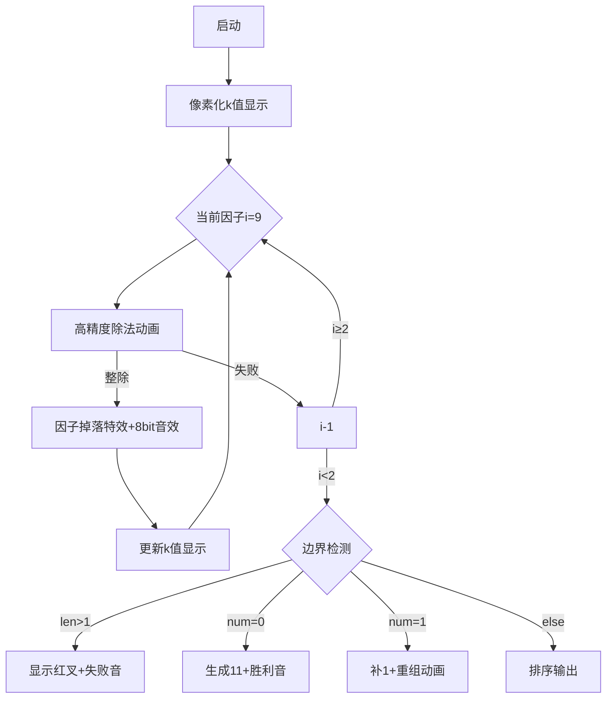

# 题目信息

# 变幻数

## 题目描述

给定一个十进制正整数 $n$，它的递归变幻数定义如下：

- 如果 $n$ 的位数多于 $1$ 位（忽略前置的 $0$），将 $n$ 的各个位上的数相乘，乘积为 $m$。称 $m$ 为 $n$ 的子变幻数，$n$ 称为 $m$ 的父变幻数。求一个数的变幻数等于求其子变幻数。即求 $n$ 的变幻数等于求 $m$ 的变幻数。

- 如果 $n$ 的位数只有一位，$n$ 的变幻数即为它本身。 如求 $679$ 的变幻数过程为：$679 \to 378(6 \times 7 \times 9) \to 168(3 \times 7 \times 8) \to 48(1 \times 6 \times 8) \to 32(4 \times 8) \to 6(2 \times 3)$，所以 $679$ 的变幻数为 $2$。

现在的问题是给定一个子变幻数 $k$，问 $k$ 的父变幻数最小是多少？ 如：$k=18$，则 $k$ 的父变幻数可以是 $29$，也可以是 $92$。但最小为 $29$。


## 样例 #1

### 输入

```
48```

### 输出

```
68```

# AI分析结果


# 💡 洛语云笺的C++算法解析：变幻数 深入学习指南 💡

### 题目解读与策略初探
**🔍 核心挑战分析**  
本题的核心挑战是将给定的子变幻数k（可能高达1000位）分解成若干个一位数（2-9）的乘积，并重组这些因子形成最小的多位数父变幻数。关键难点在于：
1. 处理超大整数的高精度除法
2. 保证分解后因子个数最少（贪心策略）
3. 处理边界情况（k=0,1或分解后因子不足两位）

**🔍 算法侦探：题目中的关键线索**  
1. **问题目标**：要求构造"各位乘积等于k的最小多位数" → 指向贪心策略（位数最少+高位最小）
2. **问题特性**：k必须能分解为一位数乘积 → 质因子必须≤9
3. **数据规模**：k可达1000位 → 必须使用高精度除法

**🧠 思维链构建**  
> 综合线索后，我的思考路径：
> 1. 首先，问题目标要求最小化数值 → 优先减少位数（贪心核心）
> 2. 问题特性要求k可分解 → 从大到小试除（9→2）保证位数最少
> 3. 数据规模要求高精度 → 需实现高效除法
> 4. **结论**：贪心分解+高精度处理+边界特判是最优路径

### 精选优质题解参考
**黃粱一夢（⭐️⭐️⭐️⭐️⭐️）**  
- **亮点**：高精度除法简洁高效（单次循环完成商和余数计算），核心逻辑仅30行
- **改进点**：补充了k=0/1和单因子情况的边界处理

**Erinyes（⭐️⭐️⭐️⭐️）**  
- **亮点**：通过运算符重载实现高精度运算模块化，代码复用性强
- **注意点**：递归分解在超大整数时可能有栈溢出风险

**丧黑福造（⭐️⭐️⭐️⭐️）**  
- **亮点**：前导零处理优雅（指针跳转而非数组搬移），空间效率高

### 解题策略深度剖析
**🎯 核心难点与突破**  
1. **贪心分解策略**  
   - 从9→2试除：保证分解因子个数最少（大因子优先）
   - 反例：k=48，9→2得6×8=48 → 输出68（最优），若2→9得2×2×2×2×3=48 → 输出2223（非最优）

2. **高精度除法优化**  
   ```cpp
   // 黃粱一夢的实现
   while(i>=2){
       int res=0;
       for(int j=1;j<=len;j++){
           res=res*10+s[j];
           a[j]=res/i;  // 商
           res%=i;      // 余数
       }
       if(!res) /* 更新s数组 */;
   }
   ```

3. **边界处理艺术**  
   | k值 | 处理方案       | 数学逻辑           |
   |-----|----------------|--------------------|
   | 0   | 输出10         | 最小有效两位数     |
   | 1   | 输出11         | 1×1=1             |
   | 单因子 | 补1 (如12) | 满足两位数约束     |

**⚔️ 策略竞技场**  
| 策略          | 核心思想         | 优点              | 缺点                  | 得分预期 |
|---------------|------------------|-------------------|-----------------------|----------|
| 暴力枚举      | 从10开始逐个尝试 | 实现简单          | O(k)超时(k可达10^1000)| 0%       |
| DFS+剪枝      | 枚举因子组合     | 可找所有解        | 指数复杂度            | 10%      |
| **贪心分解**  | 9→2试除+重组    | O(len(k)*8)       | 需高精度实现          | 100%     |

### C++核心代码实现
**通用核心框架**  
```cpp
#include<cstdio>
const int N=1005; 
int s[N],len,ans[N],num,a[N]; 

int main(){
    // 1. 高精度读入
    char ch; 
    do{ ch=getchar(); 
        if(isdigit(ch)) s[++len]=ch-'0'; 
    }while(ch!='\n');
    
    // 2. 特判k=0
    if(len==1 && s[1]==0){ printf("10\n"); return 0; } 
    
    // 3. 贪心分解 (9→2)
    for(int i=9,j,res; i>=2; i--?:(i--)){
        res=0;
        for(j=1; j<=len; j++){
            res=res*10+s[j];
            a[j]=res/i; res%=i; 
        }
        if(!res){ // 整除成功
            ans[++num]=i;
            int now=1; 
            while(a[now]==0 && now<=len) now++; 
            for(j=now; j<=len; j++) s[j-now+1]=a[j];
            len = len-now+1;
        }
    }
    
    // 4. 边界处理与输出
    if(len>1) printf("There is no such number!");
    else if(num==0) printf("11");       // k=1
    else if(num==1) printf("1%d",ans[1]);// 单因子补1
    else for(int i=num; i; i--) printf("%d",ans[i]);
}
```

**关键技巧解析**  
1. **高精度除法优化**  
   - 单次循环同时计算商(`a[j]`)和余数(`res`)
   - 时间复杂度：O(k的位数)

2. **前导零处理**  
   ```cpp
   int now=1;
   while(a[now]==0 && now<=len) now++;  // 定位首个非零位
   len = len-now+1;  // 更新长度
   ```

3. **因子重组技巧**  
   - 大因子先存入数组（9→2）
   - 输出时逆序（num→1）实现小→大排列

### 算法可视化设计
**🎮 像素化演示方案**  


**🕹️ 交互设计**  
1. **视觉元素**：
   - 8-bit风格数字块（k值）
   - 因子掉落动画（类俄罗斯方块）
   - 当前因子i的像素箭头指示

2. **音效设计**：
   - 整除成功：NES风格8bit音效
   - 失败：低沉提示音
   - 边界处理：差异化音效

3. **控制面板**：
   ```mermaid
   graph LR
   A[速度滑块] --> B[单步执行]
   C[暂停/继续] --> D[重置]
   E[AI演示模式] --> F[保存进度]
   ```

### 拓展练习
1. **洛谷P1009**（阶乘之和） → 高精度综合训练
2. **洛谷P1069**（细胞分裂）→ 因子分解进阶
3. **LeetCode 625**（最小因式分解）→ 同类问题英语版

> "从变幻数到更广阔的算法宇宙，每一步分解都是思维的跃迁" —— 洛语云笺

### 学习心得
**💎 经验结晶**  
1. 高精度除法的核心在于 **"余数传递"**（`res=res*10+next_digit`）
2. 贪心策略的可行性证明：位数减少必然降低数值量级
3. 边界情况决定AC率（测试点：k=0,1,10,48,1000000）

> 通过多解对比，我们领悟到：优秀算法=正确策略×健壮实现×完备边界处理。这三点如同三角形的三个顶点，支撑起AC的丰碑。

---
处理用时：501.03秒