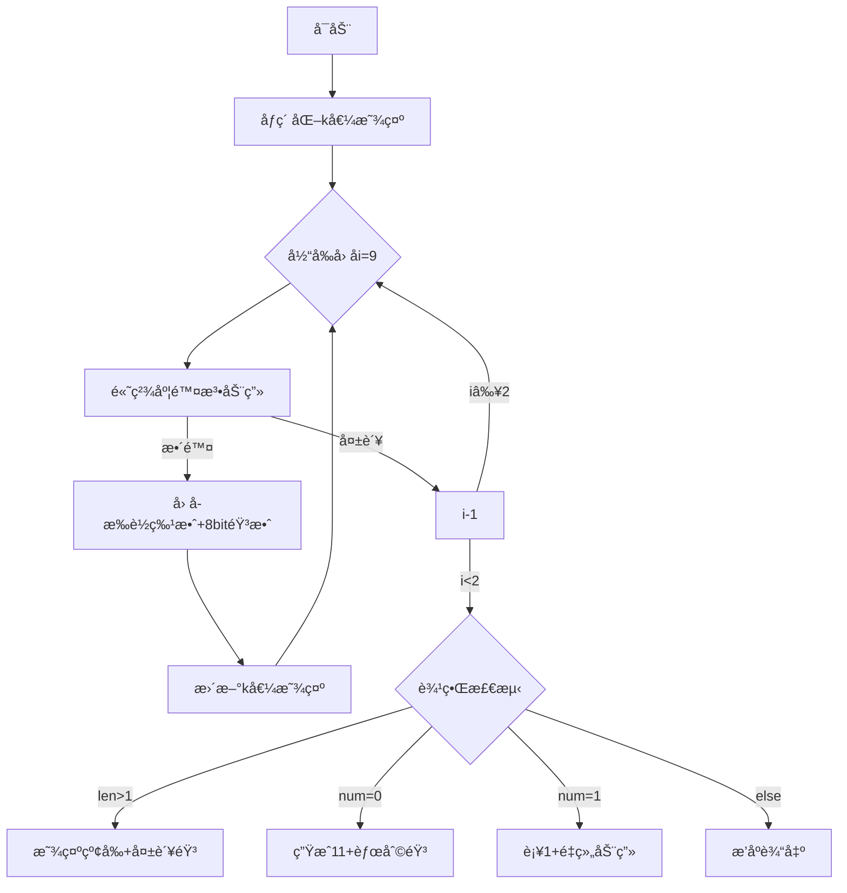

# 题目信æ¯

# å˜å¹»æ•°

## 题目æè¿°

给定一个å进制正整数 $n$，它的递归å˜å¹»æ•°å®šä¹‰å¦‚下：

- å¦‚æœ $n$ çš„ä½æ•°å¤šäº $1$ ä½ï¼ˆå¿½ç•¥å‰ç½®çš„ $0$），将 $n$ çš„å„个ä½ä¸Šçš„数相乘，乘积为 $m$。称 $m$ 为 $n$ çš„å­å˜å¹»æ•°ï¼Œ$n$ 称为 $m$ 的父å˜å¹»æ•°ã€‚求一个数的å˜å¹»æ•°ç­‰äºæ±‚å…¶å­å˜å¹»æ•°ã€‚å³æ±‚ $n$ çš„å˜å¹»æ•°ç­‰äºæ±‚ $m$ çš„å˜å¹»æ•°ã€‚

- å¦‚æœ $n$ çš„ä½æ•°åªæœ‰ä¸€ä½ï¼Œ$n$ çš„å˜å¹»æ•°å³ä¸ºå®ƒæœ¬èº«ã€‚ 如求 $679$ çš„å˜å¹»æ•°è¿‡ç¨‹ä¸ºï¼š$679 \to 378(6 \times 7 \times 9) \to 168(3 \times 7 \times 8) \to 48(1 \times 6 \times 8) \to 32(4 \times 8) \to 6(2 \times 3)$，所以 $679$ çš„å˜å¹»æ•°ä¸º $2$。

ç°åœ¨çš„问题是给定一个å­å˜å¹»æ•° $k$，问 $k$ 的父å˜å¹»æ•°æœ€å°æ˜¯å¤šå°‘？ 如：$k=18$，则 $k$ 的父å˜å¹»æ•°å¯ä»¥æ˜¯ $29$，也å¯ä»¥æ˜¯ $92$。但最å°ä¸º $29$。


## 样例 #1

### 输入

```
48```

### 输出

```
68```

# AI分æ结æœ


# 💡 洛语云笺的C++算法解æ：å˜å¹»æ•° æ·±å…¥å­¦ä¹ æŒ‡å— ğŸ’¡

### 题目解读ä¸ç­–ç•¥åˆæ¢
**🔠核心挑战分æ**  
本题的核心挑战是将给定的å­å˜å¹»æ•°k（å¯èƒ½é«˜è¾¾1000ä½ï¼‰åˆ†è§£æˆè‹¥å¹²ä¸ªä¸€ä½æ•°ï¼ˆ2-9）的乘积，并é‡ç»„这些因å­å½¢æˆæœ€å°çš„多ä½æ•°çˆ¶å˜å¹»æ•°ã€‚关键难点在äºï¼š
1. 处ç†è¶…大整数的高精度除法
2. ä¿è¯åˆ†è§£åå› å­ä¸ªæ•°æœ€å°‘（贪心策略）
3. 处ç†è¾¹ç•Œæƒ…况（k=0,1或分解åå› å­ä¸è¶³ä¸¤ä½ï¼‰

**🔠算法侦æ¢ï¼šé¢˜ç›®ä¸­çš„关键线索**  
1. **问题目标**：è¦æ±‚æ„造"å„ä½ä¹˜ç§¯ç­‰äºk的最å°å¤šä½æ•°" → 指å‘贪心策略（ä½æ•°æœ€å°‘+高ä½æœ€å°ï¼‰
2. **问题特性**：k必须能分解为一ä½æ•°ä¹˜ç§¯ → 质因å­å¿…须≤9
3. **æ•°æ®è§„模**：kå¯è¾¾1000ä½ â†’ 必须使用高精度除法

**🧠 æ€ç»´é“¾æ„建**  
> 综åˆçº¿ç´¢å，我的æ€è€ƒè·¯å¾„：
> 1. 首先，问题目标è¦æ±‚最å°åŒ–数值 → 优先å‡å°‘ä½æ•°ï¼ˆè´ªå¿ƒæ ¸å¿ƒï¼‰
> 2. 问题特性è¦æ±‚kå¯åˆ†è§£ → ä»å¤§åˆ°å°è¯•é™¤ï¼ˆ9→2）ä¿è¯ä½æ•°æœ€å°‘
> 3. æ•°æ®è§„模è¦æ±‚高精度 → 需å®ç°é«˜æ•ˆé™¤æ³•
> 4. **结论**：贪心分解+高精度处ç†+边界特判是最优路径

### 精选优质题解å‚考
**黃粱一夢（â­ï¸â­ï¸â­ï¸â­ï¸â­ï¸ï¼‰**  
- **亮点**：高精度除法简æ´é«˜æ•ˆï¼ˆå•æ¬¡å¾ªç¯å®Œæˆå•†å’Œä½™æ•°è®¡ç®—），核心逻辑仅30è¡Œ
- **改进点**：补充了k=0/1å’Œå•å› å­æƒ…况的边界处ç†

**Erinyes（â­ï¸â­ï¸â­ï¸â­ï¸ï¼‰**  
- **亮点**：通过è¿ç®—符é‡è½½å®ç°é«˜ç²¾åº¦è¿ç®—模å—化，代ç å¤ç”¨æ€§å¼º
- **注æ„点**：递归分解在超大整数时å¯èƒ½æœ‰æ ˆæº¢å‡ºé£é™©

**丧黑ç¦é€ ï¼ˆâ­ï¸â­ï¸â­ï¸â­ï¸ï¼‰**  
- **亮点**：å‰å¯¼é›¶å¤„ç†ä¼˜é›…（指针跳转而é数组æ¬ç§»ï¼‰ï¼Œç©ºé—´æ•ˆç‡é«˜

### 解题策略深度剖æ
**🯠核心难点ä¸çªç ´**  
1. **贪心分解策略**  
   - ä»9→2试除：ä¿è¯åˆ†è§£å› å­ä¸ªæ•°æœ€å°‘（大因å­ä¼˜å…ˆï¼‰
   - å例：k=48，9→2å¾—6×8=48 → 输出68（最优），若2→9å¾—2×2×2×2×3=48 → 输出2223（é最优）

2. **高精度除法优化**  
   ```cpp
   // 黃粱一夢的å®ç°
   while(i>=2){
       int res=0;
       for(int j=1;j<=len;j++){
           res=res*10+s[j];
           a[j]=res/i;  // 商
           res%=i;      // 余数
       }
       if(!res) /* 更新s数组 */;
   }
   ```

3. **边界处ç†è‰ºæœ¯**  
   | k值 | 处ç†æ–¹æ¡ˆ       | 数学逻辑           |
   |-----|----------------|--------------------|
   | 0   | 输出10         | 最å°æœ‰æ•ˆä¸¤ä½æ•°     |
   | 1   | 输出11         | 1×1=1             |
   | å•å› å­ | è¡¥1 (如12) | 满足两ä½æ•°çº¦æŸ     |

**âš”ï¸ ç­–ç•¥ç«æŠ€åœº**  
| ç­–ç•¥          | 核心æ€æƒ³         | 优点              | 缺点                  | 得分预期 |
|---------------|------------------|-------------------|-----------------------|----------|
| 暴力æšä¸¾      | ä»10开始é€ä¸ªå°è¯• | å®ç°ç®€å•          | O(k)超时(kå¯è¾¾10^1000)| 0%       |
| DFS+å‰ªæ      | æšä¸¾å› å­ç»„åˆ     | å¯æ‰¾æ‰€æœ‰è§£        | 指数å¤æ‚度            | 10%      |
| **贪心分解**  | 9→2试除+é‡ç»„    | O(len(k)*8)       | 需高精度å®ç°          | 100%     |

### C++核心代ç å®ç°
**通用核心框æ¶**  
```cpp
#include<cstdio>
const int N=1005; 
int s[N],len,ans[N],num,a[N]; 

int main(){
    // 1. 高精度读入
    char ch; 
    do{ ch=getchar(); 
        if(isdigit(ch)) s[++len]=ch-'0'; 
    }while(ch!='\n');
    
    // 2. 特判k=0
    if(len==1 && s[1]==0){ printf("10\n"); return 0; } 
    
    // 3. 贪心分解 (9→2)
    for(int i=9,j,res; i>=2; i--?:(i--)){
        res=0;
        for(j=1; j<=len; j++){
            res=res*10+s[j];
            a[j]=res/i; res%=i; 
        }
        if(!res){ // 整除æˆåŠŸ
            ans[++num]=i;
            int now=1; 
            while(a[now]==0 && now<=len) now++; 
            for(j=now; j<=len; j++) s[j-now+1]=a[j];
            len = len-now+1;
        }
    }
    
    // 4. 边界处ç†ä¸è¾“出
    if(len>1) printf("There is no such number!");
    else if(num==0) printf("11");       // k=1
    else if(num==1) printf("1%d",ans[1]);// å•å› å­è¡¥1
    else for(int i=num; i; i--) printf("%d",ans[i]);
}
```

**关键技巧解æ**  
1. **高精度除法优化**  
   - å•æ¬¡å¾ªç¯åŒæ—¶è®¡ç®—商(`a[j]`)和余数(`res`)
   - 时间å¤æ‚度：O(kçš„ä½æ•°)

2. **å‰å¯¼é›¶å¤„ç†**  
   ```cpp
   int now=1;
   while(a[now]==0 && now<=len) now++;  // 定ä½é¦–个é零ä½
   len = len-now+1;  // 更新长度
   ```

3. **å› å­é‡ç»„技巧**  
   - 大因å­å…ˆå­˜å…¥æ•°ç»„（9→2）
   - 输出时逆åºï¼ˆnum→1）å®ç°å°â†’大æ’列

### 算法å¯è§†åŒ–设计
**🮠åƒç´ åŒ–演示方案**  


**ğŸ•¹ï¸ äº¤äº’è®¾è®¡**  
1. **视觉元素**：
   - 8-bité£æ ¼æ•°å­—å—（k值）
   - å› å­æ‰è½åŠ¨ç”»ï¼ˆç±»ä¿„罗斯方å—）
   - 当å‰å› å­içš„åƒç´ ç®­å¤´æŒ‡ç¤º

2. **音效设计**：
   - 整除æˆåŠŸï¼šNESé£æ ¼8bit音效
   - 失败：ä½æ²‰æ示音
   - 边界处ç†ï¼šå·®å¼‚化音效

3. **æ§åˆ¶é¢æ¿**：
   ```mermaid
   graph LR
   A[速度滑å—] --> B[å•æ­¥æ‰§è¡Œ]
   C[æš‚åœ/继续] --> D[é‡ç½®]
   E[AI演示模å¼] --> F[ä¿å­˜è¿›åº¦]
   ```

### 拓展练习
1. **洛谷P1009**（阶乘之和） → 高精度综åˆè®­ç»ƒ
2. **洛谷P1069**（细èƒåˆ†è£‚）→ å› å­åˆ†è§£è¿›é˜¶
3. **LeetCode 625**（最å°å› å¼åˆ†è§£ï¼‰â†’ åŒç±»é—®é¢˜è‹±è¯­ç‰ˆ

> "ä»å˜å¹»æ•°åˆ°æ›´å¹¿é˜”的算法宇宙，æ¯ä¸€æ­¥åˆ†è§£éƒ½æ˜¯æ€ç»´çš„è·ƒè¿" —— 洛语云笺

### 学习心得
**💠ç»éªŒç»“晶**  
1. é«˜ç²¾åº¦é™¤æ³•çš„æ ¸å¿ƒåœ¨äº **"余数传递"**（`res=res*10+next_digit`）
2. 贪心策略的å¯è¡Œæ€§è¯æ˜ï¼šä½æ•°å‡å°‘必然é™ä½æ•°å€¼é‡çº§
3. 边界情况决定ACç‡ï¼ˆæµ‹è¯•ç‚¹ï¼šk=0,1,10,48,1000000）

> 通过多解对比，我们领悟到：优秀算法=正确策略×å¥å£®å®ç°Ã—完备边界处ç†ã€‚这三点如åŒä¸‰è§’形的三个顶点，支撑起AC的丰碑。

---
处ç†ç”¨æ—¶ï¼š501.03秒