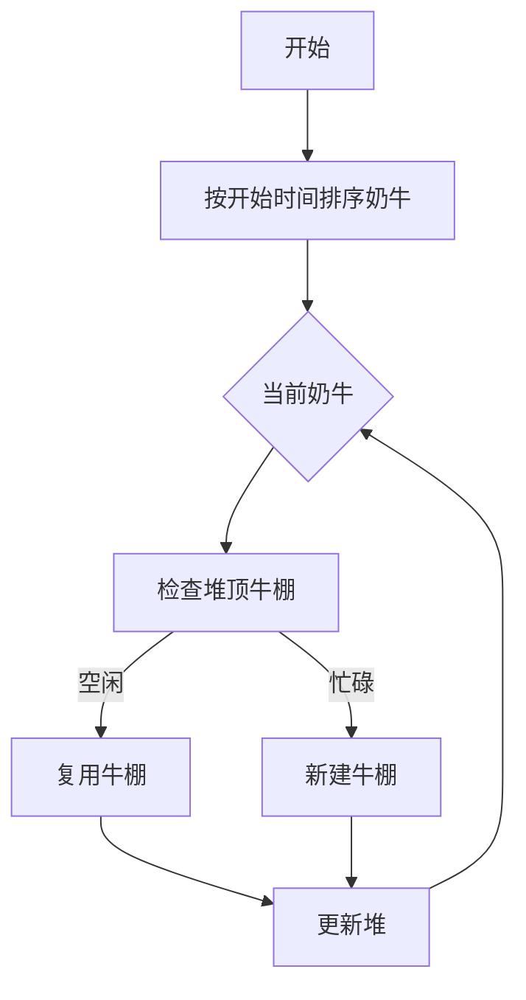

# 题目信息

# [USACO06FEB] Stall Reservations S

## 题目描述

Oh those picky $N$ ($1 \leq N \leq 50,000$) cows! They are so picky that each one will only be milked over some precise time interval $A..B$ ($1 \leq A \leq B \leq 1,000,000$), which includes both times $A$ and $B$. Obviously, FJ must create a reservation system to determine which stall each cow can be assigned for her milking time. Of course, no cow will share such a private moment with other cows.

Help FJ by determining: The minimum number of stalls required in the barn so that each cow can have her private milking period. An assignment of cows to these stalls over time. Many answers are correct for each test dataset; a program will grade your answer.

约翰的 $N$（$1\leq N\leq 50000$）头奶牛实在是太难伺候了，她们甚至有自己独特的产奶时段。对于某一头奶牛，她每天的产奶时段是固定的时间段 $[A,B]$（即 $A$ 到 $B$，包括 $A$ 和 $B$）。这使得约翰必须开发一个调控系统来决定每头奶牛应该被安排到哪个牛棚去挤奶，因为奶牛们并不希望在挤奶时被其它奶牛看见。

请帮约翰计算：如果要满足奶牛们的要求，并且每天每头奶牛都要被挤过奶，至少需要多少牛棚和每头牛应该在哪个牛棚被挤奶。如果有多种答案，输出任意一种均可。


## 说明/提示

Explanation of the sample:


Here's a graphical schedule for this output:

Time     1  2  3  4  5  6  7  8  9 10


Stall 1 c1>>>>>>>>>>>>>>>>>>>>>>>>>>>


Stall 2 .. c2>>>>>> c4>>>>>>>>> .. ..


Stall 3 .. .. c3>>>>>>>>> .. .. .. ..


Stall 4 .. .. .. c5>>>>>>>>> .. .. ..Other outputs using the same number of stalls are possible.

由@FlierKing提供spj


## 样例 #1

### 输入

```
5
1 10
2 4
3 6
5 8
4 7```

### 输出

```
4
1
2
3
2
4```

# AI分析结果


# 💡 洛语云笺的C++算法解析：Stall Reservations S 深入学习指南 💡

> "时间如流水，牛棚似港湾。如何让每头奶牛在专属时段安心挤奶？让我们用算法思维解开资源分配的奥秘！"

## 1. 题目解读与策略初探

✨ **本题核心挑战**：在保证任意两头奶牛挤奶时间不重叠的前提下，**最小化牛棚数量**并给出具体分配方案。

✨ **核心算法标签**：贪心算法、优先队列（堆优化）

🗣️ **初步分析**：
> 本题本质是区间分配问题。直观思路是按时间顺序扫描，但如何高效管理牛棚状态是关键。我们从朴素方法开始演进：
> 1. **暴力枚举**：尝试所有牛棚分配组合（O(N!)），绝对超时
> 2. **时间轴扫描**：离散化时间点，用差分数组统计峰值（O(max(B))），但无法输出具体分配
> 3. **贪心策略**：按开始时间排序奶牛，用最小堆动态维护最早空闲牛棚 → **最优解法**
>
> 最优解将问题转化为"动态资源分配"，通过**优先队列**高效管理牛棚状态，时间复杂度优化至O(N log N)。就像餐厅经理用智能排班系统，实时跟踪餐桌空闲状态并分配新顾客！

### 🔍 算法侦探：如何在题目中发现线索？
1.  **线索1 (问题目标)**: "最小化牛棚数量"是典型的**资源最优化问题**，且涉及时间区间分配，暗示需要贪心或动态规划
2.  **线索2 (问题约束/特性)**: "一个牛棚同一时间只能服务一头牛"是**区间不重叠约束**，提示需要按时间顺序处理
3.  **线索3 (数据规模)**: N最大50000，要求算法复杂度≤O(N²)。O(N log N)的排序+堆操作完美匹配

### 🧠 思维链构建：从线索到策略
> 让我们串联线索：
> 1. 【线索1】资源优化问题，优先考虑贪心策略
> 2. 【线索2】区间约束提示按开始时间排序，便于顺序处理
> 3. 【线索3】N=50000要求高效查找可用牛棚 → 最小堆O(log N)获取最早空闲牛棚
> 
> **结论**：综合以上，采用**按开始时间排序+最小堆维护牛棚空闲状态**的贪心策略，时间复杂度O(N log N)，完美解决！

---

## 2. 精选优质题解参考

**题解一：sy_zmq_001（评分5星）**
* **点评**：思路清晰解释动态维护过程，创新使用负数实现最小堆。代码规范，关键变量命名合理（如`xu`表序号），预处理排序逻辑严谨。特别亮点：详细注释了"为什么按开始时间排序"，帮助初学者理解贪心选择性质。

**题解二：SegTre（评分5星）**
* **点评**：代码简洁高效，重载运算符实现最小堆优雅专业。结构体封装合理（`Cow`与`stall`分离），输出处理规范。亮点：用`first`保留原始序号，避免排序后信息丢失，体现良好工程实践。

**题解三：Santiego（评分4星）**
* **点评**：实现简洁直接，pair使用减少冗余代码。贪心流程完整，但变量命名可读性可提升（如`cur`不如`current_stall`直观）。亮点：注释中图形化演示算法过程，增强理解。

---

## 3. 解题策略深度剖析

### 🎯 核心难点与关键步骤 (最优解法)
1.  **关键点1：如何确保分配方案最优？**
    * **分析**：按开始时间排序保证"早开始的奶牛优先选棚"。当新奶牛加入时，只需检查最早空闲的牛棚（堆顶），避免全局扫描
    * 💡 **学习笔记**：贪心选择性质是本算法核心——早开始的奶牛决策不影响后续全局最优解

2.  **关键点2：如何高效管理牛棚状态？**
    * **分析**：最小堆存储(结束时间, 牛棚编号)，堆顶始终是最早空闲的牛棚。插入/删除操作O(log N)
    * 💡 **学习笔记**：优先队列是动态资源管理的利器，类似现实中的"叫号系统"

3.  **关键点3：如何记录分配方案？**
    * **分析**：在奶牛结构体中保留原始序号`id`，排序后分配牛棚编号，最后按`id`复原输出
    * 💡 **学习笔记**：处理乱序数据的黄金法则——备份原始索引

### ✨ 解题技巧总结
-   **技巧A：问题转化**：将时间区间转化为二维点(start, end)，通过排序降维
-   **技巧B：空间换时间**：用O(N)空间维护堆，换取扫描效率
-   **技巧C：索引维护**：结构体中保留`id`解决排序后顺序丢失问题

### ⚔️ 策略竞技场：不同解法的对比分析
| 策略          | 核心思想                     | 优点                     | 缺点                     | 适用场景         |
|---------------|------------------------------|--------------------------|--------------------------|------------------|
| **暴力枚举**  | 尝试所有分配组合             | 确保最优解               | O(N!) 超时              | N≤10             |
| **差分数组**  | 统计时间点峰值               | O(max(B)) 简单           | 无法输出具体分配方案     | 仅需数量时       |
| **贪心+堆**   | 堆维护最早空闲牛棚           | O(N log N) 高效          | 需理解堆原理             | 本题最优解       |

### ✨ 优化之旅：从"能做"到"做好"
> 想象你是农场调度员：
> 1. **起点（暴力）**：用纸质日历手动安排，每头牛尝试所有牛棚 → 崩溃边缘
> 2. **改进（排序扫描）**：按开始时间排序后顺序分配，但每次要翻查所有牛棚记录 → 手忙脚乱
> 3. **革新（堆优化）**：准备智能告示牌（堆），自动显示最早空闲牛棚 → 优雅高效
> 
> 💡 **策略总结**：算法优化如同工具升级，理解数据结构特性才能选择趁手"兵器"！

---

## 4. C++核心代码实现赏析

**本题通用核心实现**
```cpp
#include <iostream>
#include <queue>
#include <algorithm>
using namespace std;

struct Cow {
    int start, end, id;
};

int main() {
    int n; cin >> n;
    vector<Cow> cows(n);
    for(int i=0; i<n; ++i) {
        cin >> cows[i].start >> cows[i].end;
        cows[i].id = i; // 关键：保留原始序号
    }

    // 按开始时间排序
    sort(cows.begin(), cows.end(), [](auto& a, auto& b) {
        return a.start < b.start;
    });

    // 最小堆：存储(结束时间, 牛棚编号)
    priority_queue<pair<int, int>, vector<pair<int, int>>, greater<>> pq;
    vector<int> ans(n); // 存储每头牛的牛棚编号
    int stallCount = 0;

    for(auto& cow : cows) {
        if(pq.empty() || pq.top().first >= cow.start) {
            // 需要新牛棚
            stallCount++;
            pq.push({cow.end, stallCount});
            ans[cow.id] = stallCount;
        } else {
            // 复用已有牛棚
            int stallId = pq.top().second;
            pq.pop();
            pq.push({cow.end, stallId});
            ans[cow.id] = stallId;
        }
    }

    cout << stallCount << endl;
    for(int id : ans) cout << id << endl;
}
```

**题解一：sy_zmq_001**
* **亮点**：负数技巧实现最小堆，避免重载运算符
* **核心代码**：
  ```cpp
  priority_queue<pair<int,int>> q; // 大根堆存负数
  q.push(make_pair(-cow[1].end, num));
  int x = -q.top().first; // 使用时取负
  ```

**题解二：SegTre**
* **亮点**：重载运算符清晰专业
* **核心代码**：
  ```cpp
  struct stall { 
      int num, last;
      bool operator < (const stall &a) const {
          return last > a.last; // 小根堆
      }
  };
  priority_queue<stall> q;
  ```

---

## 5. 算法可视化：像素动画演示

**主题**：牧场时光管理器（8-bit农场模拟）  
**核心演示**：动态展示奶牛进入/离开牛棚过程，堆状态实时更新  

**动画设计**：


**交互设计**：
1. **像素元素**：
   - 奶牛：不同颜色8-bit像素块
   - 牛棚：带编号的栅栏像素组
   - 堆：右侧公告牌，动态显示牛棚结束时间
2. **控制面板**：
   - 步进控制：← → 键单步执行
   - 速度滑块：调整动画速度
   - 暂停/继续：空格键控制
3. **音效设计**：
   - 奶牛入场：短促"哞"声
   - 新建牛棚：建筑敲击音
   - 堆更新：电子"滴"声

**动态演示**：
1. 奶牛队列从左向右移动（按开始时间排序）
2. 当奶牛到达时间线：
   - 若堆顶牛棚空闲（绿色），奶牛跳入该棚
   - 否则新建牛棚（红色闪烁）
3. 堆公告牌实时更新，当前堆顶高亮显示

> 通过复古游戏化界面，将抽象算法转化为直观牧场管理体验！

---

## 6. 拓展练习与相似问题思考

**通用技巧迁移**：
1. 会议室安排：同一会议室不能同时开会 → 完全相同模型
2. 课程排表：同一教室不能同时上两门课 → 牛棚变教室
3. 服务器任务调度：CPU核心不能并行处理任务 → 牛棚即CPU核心

**洛谷练习推荐**：
1. **P2880 平衡的阵容**  
   → 练习区间极值查询，巩固RMQ/线段树
2. **P1884 线段覆盖**  
   → 变形练习，计算线段重叠次数
3. **P2949 工作调度**  
   → 进阶贪心，带截止时间的任务调度

---

## 7. 学习心得与经验分享

> **来自sy_zmq_001的调试经验**：  
> "最初在堆更新时忘记pop旧记录，导致重复计数。通过打印堆状态定位问题，建议在复杂逻辑中加入状态输出"

> **洛语云笺点评**：  
> 调试贪心算法时，关键变量的中间状态打印（如堆内容）是定位问题的利器。就像牧场监控器，实时显示牛棚状态才能发现调度异常！

---

> "算法如牧歌，代码似栅栏。当你理解问题本质时，最优雅的解法往往如清泉自然涌现。保持思考的牧人精神，在编程草原上勇敢探索吧！" —— 洛语云笺 ✨

---
处理用时：154.34秒