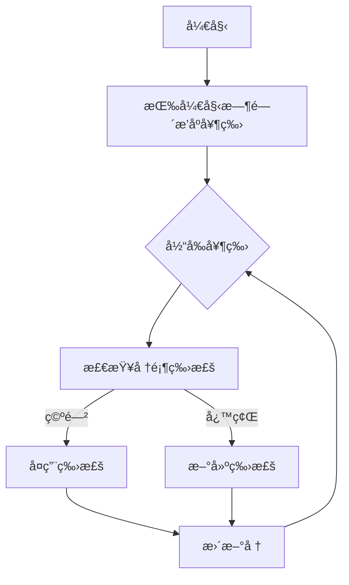

# 题目信æ¯

# [USACO06FEB] Stall Reservations S

## 题目æè¿°

Oh those picky $N$ ($1 \leq N \leq 50,000$) cows! They are so picky that each one will only be milked over some precise time interval $A..B$ ($1 \leq A \leq B \leq 1,000,000$), which includes both times $A$ and $B$. Obviously, FJ must create a reservation system to determine which stall each cow can be assigned for her milking time. Of course, no cow will share such a private moment with other cows.

Help FJ by determining: The minimum number of stalls required in the barn so that each cow can have her private milking period. An assignment of cows to these stalls over time. Many answers are correct for each test dataset; a program will grade your answer.

约翰的 $N$（$1\leq N\leq 50000$）头奶牛å®åœ¨æ˜¯å¤ªéš¾ä¼ºå€™äº†ï¼Œå¥¹ä»¬ç”šè‡³æœ‰è‡ªå·±ç‹¬ç‰¹çš„产奶时段。对äºæŸä¸€å¤´å¥¶ç‰›ï¼Œå¥¹æ¯å¤©çš„产奶时段是固定的时间段 $[A,B]$ï¼ˆå³ $A$ 到 $B$，包括 $A$ å’Œ $B$）。这使得约翰必须开å‘一个调æ§ç³»ç»Ÿæ¥å†³å®šæ¯å¤´å¥¶ç‰›åº”该被安æ’到哪个牛棚å»æŒ¤å¥¶ï¼Œå› ä¸ºå¥¶ç‰›ä»¬å¹¶ä¸å¸Œæœ›åœ¨æŒ¤å¥¶æ—¶è¢«å…¶å®ƒå¥¶ç‰›çœ‹è§ã€‚

请帮约翰计算：如æœè¦æ»¡è¶³å¥¶ç‰›ä»¬çš„è¦æ±‚，并且æ¯å¤©æ¯å¤´å¥¶ç‰›éƒ½è¦è¢«æŒ¤è¿‡å¥¶ï¼Œè‡³å°‘需è¦å¤šå°‘牛棚和æ¯å¤´ç‰›åº”该在哪个牛棚被挤奶。如æœæœ‰å¤šç§ç­”案，输出任æ„一ç§å‡å¯ã€‚


## 说æ˜/æ示

Explanation of the sample:


Here's a graphical schedule for this output:

Time     1  2  3  4  5  6  7  8  9 10


Stall 1 c1>>>>>>>>>>>>>>>>>>>>>>>>>>>


Stall 2 .. c2>>>>>> c4>>>>>>>>> .. ..


Stall 3 .. .. c3>>>>>>>>> .. .. .. ..


Stall 4 .. .. .. c5>>>>>>>>> .. .. ..Other outputs using the same number of stalls are possible.

ç”±@FlierKingæä¾›spj


## 样例 #1

### 输入

```
5
1 10
2 4
3 6
5 8
4 7```

### 输出

```
4
1
2
3
2
4```

# AI分æ结æœ


# 💡 洛语云笺的C++算法解æ：Stall Reservations S æ·±å…¥å­¦ä¹ æŒ‡å— ğŸ’¡

> "时间如æµæ°´ï¼Œç‰›æ£šä¼¼æ¸¯æ¹¾ã€‚如何让æ¯å¤´å¥¶ç‰›åœ¨ä¸“å±æ—¶æ®µå®‰å¿ƒæŒ¤å¥¶ï¼Ÿè®©æˆ‘们用算法æ€ç»´è§£å¼€èµ„æºåˆ†é…的奥秘ï¼"

## 1. 题目解读ä¸ç­–ç•¥åˆæ¢

✨ **本题核心挑战**：在ä¿è¯ä»»æ„两头奶牛挤奶时间ä¸é‡å çš„å‰æ下，**最å°åŒ–牛棚数é‡**并给出具体分é…方案。

✨ **核心算法标签**：贪心算法ã€ä¼˜å…ˆé˜Ÿåˆ—（堆优化）

ğŸ—£ï¸ **åˆæ­¥åˆ†æ**：
> 本题本质是区间分é…问题。直观æ€è·¯æ˜¯æŒ‰æ—¶é—´é¡ºåºæ‰«æ，但如何高效管ç†ç‰›æ£šçŠ¶æ€æ˜¯å…³é”®ã€‚我们ä»æœ´ç´ æ–¹æ³•å¼€å§‹æ¼”进：
> 1. **暴力æšä¸¾**：å°è¯•æ‰€æœ‰ç‰›æ£šåˆ†é…组åˆï¼ˆO(N!)），ç»å¯¹è¶…æ—¶
> 2. **时间轴扫æ**：离散化时间点，用差分数组统计峰值（O(max(B))），但无法输出具体分é…
> 3. **贪心策略**：按开始时间æ’åºå¥¶ç‰›ï¼Œç”¨æœ€å°å †åŠ¨æ€ç»´æŠ¤æœ€æ—©ç©ºé—²ç‰›æ£š → **最优解法**
>
> 最优解将问题转化为"动æ€èµ„æºåˆ†é…"，通过**优先队列**高效管ç†ç‰›æ£šçŠ¶æ€ï¼Œæ—¶é—´å¤æ‚度优化至O(N log N)。就åƒé¤å…ç»ç†ç”¨æ™ºèƒ½æ’ç­ç³»ç»Ÿï¼Œå®æ—¶è·Ÿè¸ªé¤æ¡Œç©ºé—²çŠ¶æ€å¹¶åˆ†é…新顾客ï¼

### 🔠算法侦æ¢ï¼šå¦‚何在题目中å‘ç°çº¿ç´¢ï¼Ÿ
1.  **线索1 (问题目标)**: "最å°åŒ–牛棚数é‡"是典å‹çš„**资æºæœ€ä¼˜åŒ–问题**，且涉åŠæ—¶é—´åŒºé—´åˆ†é…，暗示需è¦è´ªå¿ƒæˆ–动æ€è§„划
2.  **线索2 (问题约æŸ/特性)**: "一个牛棚åŒä¸€æ—¶é—´åªèƒ½æœåŠ¡ä¸€å¤´ç‰›"是**区间ä¸é‡å çº¦æŸ**，æ示需è¦æŒ‰æ—¶é—´é¡ºåºå¤„ç†
3.  **线索3 (æ•°æ®è§„模)**: N最大50000，è¦æ±‚算法å¤æ‚度≤O(N²)。O(N log N)çš„æ’åº+å †æ“作完ç¾åŒ¹é…

### 🧠 æ€ç»´é“¾æ„建：ä»çº¿ç´¢åˆ°ç­–ç•¥
> 让我们串è”线索：
> 1. ã€çº¿ç´¢1】资æºä¼˜åŒ–问题，优先考虑贪心策略
> 2. ã€çº¿ç´¢2】区间约æŸæ示按开始时间æ’åºï¼Œä¾¿äºé¡ºåºå¤„ç†
> 3. ã€çº¿ç´¢3】N=50000è¦æ±‚高效查找å¯ç”¨ç‰›æ£š → 最å°å †O(log N)è·å–最早空闲牛棚
> 
> **结论**：综åˆä»¥ä¸Šï¼Œé‡‡ç”¨**按开始时间æ’åº+最å°å †ç»´æŠ¤ç‰›æ£šç©ºé—²çŠ¶æ€**的贪心策略，时间å¤æ‚度O(N log N)，完ç¾è§£å†³ï¼

---

## 2. 精选优质题解å‚考

**题解一：sy_zmq_001（评分5星）**
* **点评**：æ€è·¯æ¸…晰解释动æ€ç»´æŠ¤è¿‡ç¨‹ï¼Œåˆ›æ–°ä½¿ç”¨è´Ÿæ•°å®ç°æœ€å°å †ã€‚代ç è§„范，关键å˜é‡å‘½ååˆç†ï¼ˆå¦‚`xu`表åºå·ï¼‰ï¼Œé¢„处ç†æ’åºé€»è¾‘严谨。特别亮点：详细注释了"为什么按开始时间æ’åº"，帮助åˆå­¦è€…ç†è§£è´ªå¿ƒé€‰æ‹©æ€§è´¨ã€‚

**题解二：SegTre（评分5星）**
* **点评**：代ç ç®€æ´é«˜æ•ˆï¼Œé‡è½½è¿ç®—符å®ç°æœ€å°å †ä¼˜é›…专业。结æ„体å°è£…åˆç†ï¼ˆ`Cow`ä¸`stall`分离），输出处ç†è§„范。亮点：用`first`ä¿ç•™åŸå§‹åºå·ï¼Œé¿å…æ’åºåä¿¡æ¯ä¸¢å¤±ï¼Œä½“ç°è‰¯å¥½å·¥ç¨‹å®è·µã€‚

**题解三：Santiego（评分4星）**
* **点评**：å®ç°ç®€æ´ç›´æ¥ï¼Œpair使用å‡å°‘冗余代ç ã€‚贪心æµç¨‹å®Œæ•´ï¼Œä½†å˜é‡å‘½åå¯è¯»æ€§å¯æå‡ï¼ˆå¦‚`cur`ä¸å¦‚`current_stall`直观）。亮点：注释中图形化演示算法过程，å¢å¼ºç†è§£ã€‚

---

## 3. 解题策略深度剖æ

### 🯠核心难点ä¸å…³é”®æ­¥éª¤ (最优解法)
1.  **关键点1：如何确ä¿åˆ†é…方案最优？**
    * **分æ**：按开始时间æ’åºä¿è¯"早开始的奶牛优先选棚"。当新奶牛加入时，åªéœ€æ£€æŸ¥æœ€æ—©ç©ºé—²çš„牛棚（堆顶），é¿å…全局扫æ
    * 💡 **学习笔记**：贪心选择性质是本算法核心——早开始的奶牛决策ä¸å½±å“å续全局最优解

2.  **关键点2：如何高效管ç†ç‰›æ£šçŠ¶æ€ï¼Ÿ**
    * **分æ**：最å°å †å­˜å‚¨(结æŸæ—¶é—´, 牛棚编å·)，堆顶始终是最早空闲的牛棚。æ’å…¥/删除æ“作O(log N)
    * 💡 **学习笔记**：优先队列是动æ€èµ„æºç®¡ç†çš„利器，类似ç°å®ä¸­çš„"å«å·ç³»ç»Ÿ"

3.  **关键点3：如何记录分é…方案？**
    * **分æ**：在奶牛结æ„体中ä¿ç•™åŸå§‹åºå·`id`，æ’åºå分é…牛棚编å·ï¼Œæœ€å按`id`å¤åŸè¾“出
    * 💡 **学习笔记**：处ç†ä¹±åºæ•°æ®çš„黄金法则——备份åŸå§‹ç´¢å¼•

### ✨ 解题技巧总结
-   **技巧A：问题转化**：将时间区间转化为二维点(start, end)，通过æ’åºé™ç»´
-   **技巧B：空间æ¢æ—¶é—´**：用O(N)空间维护堆，æ¢å–扫æ效ç‡
-   **技巧C：索引维护**：结æ„体中ä¿ç•™`id`解决æ’åºå顺åºä¸¢å¤±é—®é¢˜

### âš”ï¸ ç­–ç•¥ç«æŠ€åœºï¼šä¸åŒè§£æ³•çš„对比分æ
| ç­–ç•¥          | 核心æ€æƒ³                     | 优点                     | 缺点                     | 适用场景         |
|---------------|------------------------------|--------------------------|--------------------------|------------------|
| **暴力æšä¸¾**  | å°è¯•æ‰€æœ‰åˆ†é…ç»„åˆ             | ç¡®ä¿æœ€ä¼˜è§£               | O(N!) 超时              | N≤10             |
| **差分数组**  | 统计时间点峰值               | O(max(B)) ç®€å•           | 无法输出具体分é…方案     | 仅需数é‡æ—¶       |
| **贪心+å †**   | 堆维护最早空闲牛棚           | O(N log N) 高效          | 需ç†è§£å †åŸç†             | 本题最优解       |

### ✨ 优化之旅：ä»"能åš"到"åšå¥½"
> 想象你是农场调度员：
> 1. **起点（暴力）**：用纸质日å†æ‰‹åŠ¨å®‰æ’，æ¯å¤´ç‰›å°è¯•æ‰€æœ‰ç‰›æ£š → 崩溃边缘
> 2. **改进（æ’åºæ‰«æ）**：按开始时间æ’åºå顺åºåˆ†é…，但æ¯æ¬¡è¦ç¿»æŸ¥æ‰€æœ‰ç‰›æ£šè®°å½• → 手忙脚乱
> 3. **é©æ–°ï¼ˆå †ä¼˜åŒ–）**：准备智能告示牌（堆），自动显示最早空闲牛棚 → 优雅高效
> 
> 💡 **策略总结**：算法优化如åŒå·¥å…·å‡çº§ï¼Œç†è§£æ•°æ®ç»“æ„特性æ‰èƒ½é€‰æ‹©è¶æ‰‹"兵器"ï¼

---

## 4. C++核心代ç å®ç°èµæ

**本题通用核心å®ç°**
```cpp
#include <iostream>
#include <queue>
#include <algorithm>
using namespace std;

struct Cow {
    int start, end, id;
};

int main() {
    int n; cin >> n;
    vector<Cow> cows(n);
    for(int i=0; i<n; ++i) {
        cin >> cows[i].start >> cows[i].end;
        cows[i].id = i; // 关键：ä¿ç•™åŸå§‹åºå·
    }

    // 按开始时间æ’åº
    sort(cows.begin(), cows.end(), [](auto& a, auto& b) {
        return a.start < b.start;
    });

    // 最å°å †ï¼šå­˜å‚¨(结æŸæ—¶é—´, 牛棚编å·)
    priority_queue<pair<int, int>, vector<pair<int, int>>, greater<>> pq;
    vector<int> ans(n); // 存储æ¯å¤´ç‰›çš„牛棚编å·
    int stallCount = 0;

    for(auto& cow : cows) {
        if(pq.empty() || pq.top().first >= cow.start) {
            // 需è¦æ–°ç‰›æ£š
            stallCount++;
            pq.push({cow.end, stallCount});
            ans[cow.id] = stallCount;
        } else {
            // å¤ç”¨å·²æœ‰ç‰›æ£š
            int stallId = pq.top().second;
            pq.pop();
            pq.push({cow.end, stallId});
            ans[cow.id] = stallId;
        }
    }

    cout << stallCount << endl;
    for(int id : ans) cout << id << endl;
}
```

**题解一：sy_zmq_001**
* **亮点**：负数技巧å®ç°æœ€å°å †ï¼Œé¿å…é‡è½½è¿ç®—符
* **核心代ç **：
  ```cpp
  priority_queue<pair<int,int>> q; // 大根堆存负数
  q.push(make_pair(-cow[1].end, num));
  int x = -q.top().first; // 使用时å–è´Ÿ
  ```

**题解二：SegTre**
* **亮点**：é‡è½½è¿ç®—符清晰专业
* **核心代ç **：
  ```cpp
  struct stall { 
      int num, last;
      bool operator < (const stall &a) const {
          return last > a.last; // å°æ ¹å †
      }
  };
  priority_queue<stall> q;
  ```

---

## 5. 算法å¯è§†åŒ–：åƒç´ åŠ¨ç”»æ¼”示

**主题**：牧场时光管ç†å™¨ï¼ˆ8-bit农场模拟）  
**核心演示**：动æ€å±•ç¤ºå¥¶ç‰›è¿›å…¥/离开牛棚过程，堆状æ€å®æ—¶æ›´æ–°  

**动画设计**：


**交互设计**：
1. **åƒç´ å…ƒç´ **：
   - 奶牛：ä¸åŒé¢œè‰²8-bitåƒç´ å—
   - 牛棚：带编å·çš„æ …æ åƒç´ ç»„
   - 堆：å³ä¾§å…¬å‘Šç‰Œï¼ŒåŠ¨æ€æ˜¾ç¤ºç‰›æ£šç»“æŸæ—¶é—´
2. **æ§åˆ¶é¢æ¿**：
   - 步进æ§åˆ¶ï¼šâ† → é”®å•æ­¥æ‰§è¡Œ
   - 速度滑å—：调整动画速度
   - æš‚åœ/继续：空格键æ§åˆ¶
3. **音效设计**：
   - 奶牛入场：短促"å“"声
   - 新建牛棚：建筑敲击音
   - 堆更新：电å­"æ»´"声

**动æ€æ¼”示**：
1. 奶牛队列ä»å·¦å‘å³ç§»åŠ¨ï¼ˆæŒ‰å¼€å§‹æ—¶é—´æ’åºï¼‰
2. 当奶牛到达时间线：
   - 若堆顶牛棚空闲（绿色），奶牛跳入该棚
   - å¦åˆ™æ–°å»ºç‰›æ£šï¼ˆçº¢è‰²é—ªçƒï¼‰
3. 堆公告牌å®æ—¶æ›´æ–°ï¼Œå½“å‰å †é¡¶é«˜äº®æ˜¾ç¤º

> 通过å¤å¤æ¸¸æˆåŒ–ç•Œé¢ï¼Œå°†æŠ½è±¡ç®—法转化为直观牧场管ç†ä½“验ï¼

---

## 6. 拓展练习ä¸ç›¸ä¼¼é—®é¢˜æ€è€ƒ

**通用技巧è¿ç§»**：
1. 会议室安æ’：åŒä¸€ä¼šè®®å®¤ä¸èƒ½åŒæ—¶å¼€ä¼š → 完全相åŒæ¨¡å‹
2. 课程æ’表：åŒä¸€æ•™å®¤ä¸èƒ½åŒæ—¶ä¸Šä¸¤é—¨è¯¾ → 牛棚å˜æ•™å®¤
3. æœåŠ¡å™¨ä»»åŠ¡è°ƒåº¦ï¼šCPU核心ä¸èƒ½å¹¶è¡Œå¤„ç†ä»»åŠ¡ → 牛棚å³CPU核心

**洛谷练习æ¨è**：
1. **P2880 平衡的阵容**  
   → 练习区间æ值查询，巩固RMQ/线段树
2. **P1884 线段覆盖**  
   → å˜å½¢ç»ƒä¹ ï¼Œè®¡ç®—线段é‡å æ¬¡æ•°
3. **P2949 工作调度**  
   → 进阶贪心，带截止时间的任务调度

---

## 7. 学习心得ä¸ç»éªŒåˆ†äº«

> **æ¥è‡ªsy_zmq_001的调试ç»éªŒ**：  
> "最åˆåœ¨å †æ›´æ–°æ—¶å¿˜è®°pop旧记录，导致é‡å¤è®¡æ•°ã€‚通过打å°å †çŠ¶æ€å®šä½é—®é¢˜ï¼Œå»ºè®®åœ¨å¤æ‚逻辑中加入状æ€è¾“出"

> **洛语云笺点评**：  
> 调试贪心算法时，关键å˜é‡çš„中间状æ€æ‰“å°ï¼ˆå¦‚堆内容）是定ä½é—®é¢˜çš„利器。就åƒç‰§åœºç›‘æ§å™¨ï¼Œå®æ—¶æ˜¾ç¤ºç‰›æ£šçŠ¶æ€æ‰èƒ½å‘ç°è°ƒåº¦å¼‚常ï¼

---

> "算法如牧歌，代ç ä¼¼æ …æ ã€‚当你ç†è§£é—®é¢˜æœ¬è´¨æ—¶ï¼Œæœ€ä¼˜é›…的解法往往如清泉自然涌ç°ã€‚ä¿æŒæ€è€ƒçš„牧人精ç¥ï¼Œåœ¨ç¼–程è‰åŸä¸Šå‹‡æ•¢æ¢ç´¢å§ï¼" —— 洛语云笺 ✨

---
处ç†ç”¨æ—¶ï¼š154.34秒