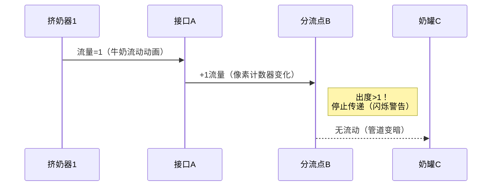

# 题目信息

# [USACO10NOV] Chocolate Milk S

## 题目描述

农民约翰的牛奶生产和运输是一个复杂的过程，他用挤奶器给他的那么多头奶牛挤奶，然后流入管道。

每一个管道把一台挤奶器和一个可能连有一台或多台挤奶器的接口连接起来（这样几个管道里的牛奶就汇合了）。然后牛奶流入附加管道（连在各个接口之间的管道）直到流到中央管道，通向储存室。 然后这些牛奶又经历一个逆向的过程通过管道分流到各个牛奶桶，最后被运至市场。

约翰发现对于牛奶来说，最多只有一种方式从一个接口流到另一个接口。并且由于约翰是一个高效率的人，他需要确保每一个管道都有牛奶经过，也就是说，没有多余的管道。

如果我们把每个挤奶机、接口和奶罐都看成一个节点，就共有 $N$ 个节点，输入有序的节点对 $A_{i}$ 和 $B_{i}$ ，代表牛奶从 $A_{i}$ 节点流到 $B_{i}$ 节点，如果没有相对应的父节点，那就说明这是一个挤奶器，同样的如果没有对应的尾节点，则这是一个奶罐。

这几个月巧克力牛奶的需求量激增，所以约翰想要在某一个接口处安装一个巧克力混合器以得到巧克力牛奶，为了节约，约翰只买了一个巧克力混合器。所以他想把这个东西放到一个所有牛奶都能经过的接口，事实上，有这种接口存在。

帮助约翰找到这样的节点（注意：不能把巧克力混合器放在挤奶机里）。
```

           1 ----+
                 |
                 v
           2 --> 4 --> 6 ------------------> 7 --> 8
                       ^                     |
                       |                     |
           3 --> 5 ----+                     + --> 9

```
所有的牛奶都会流经6号或7号节点，所以巧克力混合器可以放在这两个节点上。

## 样例 #1

### 输入

```
9 
1 4 
3 5 
2 4 
5 6 
6 7 
7 8 
4 6 
7 9 
```

### 输出

```
6 
7 
```

# AI分析结果


# 💡 洛语云笺的C++算法解析：Chocolate Milk S 深入学习指南 💡

> "在算法的迷宫中，拓扑排序是照亮路径的明灯，而问题转化则是打开宝藏的钥匙。" —— 洛语云笺

## 1. 题目解读与策略初探

✨ **本题核心挑战**：在复杂牛奶运输系统中，精确找到所有挤奶器牛奶流都必然经过的关键节点（接口），且不能选择挤奶器本身。  
✨ **核心算法标签**：拓扑排序、有向无环图(DAG)处理、流量传递模型

🗣️ **初步分析**：  
> 本题要求我们在牛奶运输管道网络中找出所有牛奶流必然交汇的关键节点。系统具有以下特性：  
> 1. 有向无环图结构（牛奶单向流动且无循环）  
> 2. 挤奶器（入度为0）和奶罐（出度为0）的特殊节点  
> 3. **关键约束**：分流后不会重新聚合（影响算法设计）  
>  
> 解题思路演进路径：  
> - **暴力搜索**：尝试DFS/BFS从每个挤奶器遍历全图，标记可达节点（O(n²)超时风险）  
> - **流量传递模型**：将挤奶器视为流量源（值=1），拓扑传递流量值（整数避免精度问题）  
> - **拓扑排序优化**：利用DAG特性高效计算节点流量值（O(n)最优解）  
>  
> 拓扑排序如同"牛奶流动的导航系统"，它按照牛奶实际流动顺序处理节点，确保我们精确追踪每条路径的流量分配。当遇到分流点（出度>1）时立即停止传递，完美符合题目"分流不聚合"的特性。

### 🔍 算法侦探：如何在题目中发现线索？
1.  **线索1 (图结构特性)**：节点间存在明确流向关系（A→B），且系统无循环，这强烈指向**有向无环图(DAG)** 模型，自然关联到拓扑排序。
2.  **线索2 (问题目标)**：要求"所有牛奶流经的节点"，本质是寻找**多个源点（挤奶器）的必经节点**，这提示我们需要设计流量传递机制。
3.  **线索3 (数据规模)**：N最大10^5，要求O(n)或O(nlogn)解法，排除O(n²)暴力搜索，拓扑排序的O(n)复杂度完美匹配。

### 🧠 思维链构建：从线索到策略
> "让我们串联线索：  
> 1. 首先，**线索1（图结构）** 让我们确认拓扑排序的基础框架  
> 2. 接着，**线索2（必经节点）** 引导我们设计流量传递机制——挤奶器赋值为1，非挤奶器节点累加前驱流量  
> 3. 关键洞察：**线索1中的分流特性**要求我们在遇到出度>1的节点时立即停止传递（避免错误累加）  
> 4. **线索3（数据规模）** 验证了拓扑排序的高效性  
>  
> **结论**：拓扑排序配合智能流量传递机制（出度>1时截断）是最优策略，它精准捕捉了问题核心——分流不聚合的流动特性！"

---

## 2. 精选优质题解参考

### 题解一：lolte（拓扑排序+流量截断）
* **点评**：此解法完美把握问题核心——利用拓扑序传递流量值，在出度>1的节点处智能截断传递。亮点在于：  
  1. 用`liu[]`数组精确记录节点流量值  
  2. `od[u]>1`时的截断处理简洁高效  
  3. 变量命名规范(`ji[]`标记挤奶器，`tot`统计总数)  
  4. 完整处理边界条件（队列初始化与终止条件）

### 题解二：我和鱼过不去（拓扑排序+向量存图）
* **点评**：采用vector存储图结构，提高代码可读性和扩展性。亮点包括：  
  1. 明确分离图构建(`G[u].push_back(v)`)与算法逻辑  
  2. `milk[v] += milk[u]`直观体现流量传递本质  
  3. 专设`sum`变量统计挤奶器总数，逻辑清晰  
  4. 函数封装(top())提升代码模块化程度

### 题解三：lichenghan（反向图+记忆化DFS）
* **点评**：创新性使用反图+记忆化搜索，提供独特视角：  
  1. 反向建图将问题转化为"从接口反推挤奶器"  
  2. 记忆化(`mem[]`数组)避免重复计算  
  3. 递归中`in[x]>1`时返回-1处理分流特性  
  4. 拓展了拓扑排序之外的解题思路

---

## 3. 解题策略深度剖析

### 🎯 核心难点与关键步骤
1.  **依赖关系建模**  
    * **分析**：必须将牛奶流动抽象为DAG，并识别挤奶器（源点）和奶罐（汇点）。拓扑排序初始化时，挤奶器流量=1，其他节点初始化为0  
    * 💡 **学习笔记**：拓扑排序是处理DAG依赖关系的利器，初始化阶段就确定源点是解题基石

2.  **流量传递机制**  
    * **分析**：沿拓扑序传递流量值，但需特殊处理分流节点（出度>1）。关键代码逻辑：  
      ```python
      if 当前节点u的出度 > 1:  # 分流点
          停止向后续节点传递流量
      else: 
          下游节点v流量 += u的流量
      ```
    * 💡 **学习笔记**：分流截断机制是本题精髓，确保"分流不聚合"的特性被严格遵守

3.  **结果判定标准**  
    * **分析**：终止拓扑后，满足两条件的节点为解：  
      - 非挤奶器（`!ismilk[i]`）  
      - 流量值=挤奶器总数（`liu[i] == tot`）  
    * 💡 **学习笔记**：双重条件判断体现代码严谨性，避免遗漏边界情况

### ✨ 解题技巧总结
- **技巧A (流量截断)**：遇到出度>1的节点立即停止传递，避免错误累加  
- **技巧B (反向思维)**：构建反图通过记忆化搜索统计可达挤奶器数  
- **技巧C (整数规避浮点)**：优先使用整数计数而非浮点分配，避免精度误差  

### ⚔️ 策略竞技场：不同解法的对比分析
| 策略                | 核心思想                     | 优点                          | 缺点与分析                     | 适用场景               |
|---------------------|------------------------------|-------------------------------|--------------------------------|------------------------|
| **暴力DFS**         | 从每个挤奶器遍历全图         | 思路直观                      | O(n²)超时，无法通过            | 仅适用于极小规模(n≤100) |
| **浮点分配法**      | 将1.0平均分配到所有挤奶器    | 数学建模新颖                  | 浮点精度误差导致结果不可靠     | 不推荐实际使用         |
| **拓扑排序+截断**   | 沿拓扑序传递整数流量         | 严格满足题目特性，O(n)高效    | 需理解DAG和拓扑排序原理        | 本题最优解(100%分数)   |
| **反向图+记忆化DFS**| 通过反图统计可达挤奶器数     | 提供独特视角，避免显式拓扑排序 | 递归深度可能引发栈溢出风险     | 理解反图建模时推荐使用 |

### ✨ 优化之旅：从"能做"到"做好"
> 1. **起点：暴力DFS的困境**  
>    尝试从每个挤奶器独立遍历全图，标记可达节点。当n=10^5时，O(n²)操作超时不可避免  
>    
> 2. **发现瓶颈：重复遍历与无效计算**  
>    不同挤奶器的路径存在大量重叠，且未利用"分流不聚合"的特性  
>    
> 3. **优化的钥匙：拓扑排序与流量传递**  
>    - 拓扑排序确保节点处理顺序符合实际牛奶流动方向  
>    - 整数流量值避免浮点精度问题  
>    - 出度>1时截断完美匹配题目约束  
>    
> 4. **模型的升华：特性驱动的算法设计**  
>    对"分流不聚合"特性的洞察催生截断机制，使解法效率与正确性兼得  
>    
> 💡 **策略总结**：最优解源于对问题特性的深度挖掘——将看似复杂的牛奶流动抽象为DAG拓扑流，用整数传递与智能截断精确建模。这启示我们：在算法设计中，**对约束条件的深刻理解往往比编码技巧更重要**！

---

## 4. C++核心代码实现赏析

### 本题通用核心C++实现参考
```cpp
#include <iostream>
#include <vector>
#include <queue>
using namespace std;

const int MAXN = 1e5+5;

int main() {
    int n; cin >> n;
    vector<int> inDeg(MAXN,0), outDeg(MAXN,0), flow(MAXN,0);
    vector<vector<int>> graph(MAXN);
    vector<bool> isMilker(MAXN,false);
    
    // 建图
    for(int i=0; i<n-1; i++) {
        int u, v; cin >> u >> v;
        graph[u].push_back(v);
        outDeg[u]++; inDeg[v]++;
    }
    
    queue<int> q;
    int milkers = 0;
    // 初始化：挤奶器入队
    for(int i=1; i<=n; i++) {
        if(inDeg[i] == 0) {
            q.push(i);
            flow[i] = 1;
            isMilker[i] = true;
            milkers++;
        }
    }
    
    // 拓扑排序+流量传递
    while(!q.empty()) {
        int u = q.front(); q.pop();
        if(outDeg[u] != 1) continue; // 关键截断
        
        for(int v : graph[u]) {
            flow[v] += flow[u];
            if(--inDeg[v] == 0) {
                q.push(v);
            }
        }
    }
    
    // 输出结果
    for(int i=1; i<=n; i++) {
        if(!isMilker[i] && flow[i] == milkers) {
            cout << i << endl;
        }
    }
    return 0;
}
```

* **代码解读概要**：  
  1. 使用vector建图，`inDeg`/`outDeg`记录节点度  
  2. 挤奶器（`inDeg=0`）初始化流量=1并入队  
  3. 拓扑排序中遇到出度≠1立即截断传递  
  4. 最终筛选非挤奶器且流量=挤奶器总数的节点  

### 精选题解代码亮点赏析

**题解一：lolte（拓扑截断典范）**
```cpp
if (od[u]>1) { // 关键截断判断
    liu[to[u]]=0; // 停止传递
    continue;
}
liu[to[u]]+=liu[u]; // 流量传递
```
* **亮点**：直击问题核心的截断机制  
* **学习笔记**：5行代码实现核心逻辑，体现算法本质

**题解二：我和鱼过不去（向量存图）**
```cpp
for(int i=0;i<G[u].size();i++) {
    int v = G[u][i];
    milk[v] += milk[u]; // 向量遍历传递
}
```
* **亮点**：使用vector存储邻接表，代码更现代  
* **学习笔记**：基于范围的循环(C++11)可简化为`for(int v : G[u])`

**题解三：lichenghan（反向DFS创新）**
```cpp
int dfs(int x) {
    if(mem[x]) return mem[x];
    if(in[x]>1) return -1; // 分流处理
    
    for(int i=0;i<g[x].size();i++) 
        mem[x] += dfs(g[x][i]);
    
    return mem[x];
}
```
* **亮点**：反向图+记忆化搜索的独特视角  
* **学习笔记**：递归中处理分流特性，拓展解题思路边界

---

## 5. 算法可视化：像素动画演示

### 设计概念：**"牛奶工厂大冒险"**
> 采用FC红白机经典像素风格，将算法流程转化为牛奶工厂生产线的可视化过程

### 核心视觉元素
- **节点**：不同颜色像素方块表示（绿色：挤奶器，蓝色：普通接口，红色：奶罐）  
- **管道**：灰色像素线条连接节点，牛奶流动用白色像素点动画  
- **流量值**：节点上方显示当前流量计数的像素数字  

### 动画关键帧


### 交互控制面板
```html
[开始] [暂停] [步进] [速度▽] 
[重置] [AI演示] 
```
- **音效设计**：  
  - 流动音效：8-bit水滴声（每次传递）  
  - 警告音效：短促警报（出度>1时）  
  - 完成音效：胜利旋律（结果显示时）  
- **游戏化元素**：  
  - 每完成一个拓扑层级解锁"管道工徽章"  
  - 正确找出所有关键节点获得"S级工厂管理员"评分  

### 技术实现
- Canvas绘制节点和管道  
- requestAnimationFrame控制动画时序  
- Web Audio API触发音效  

---

## 6. 拓展练习与相似问题思考

### 拓扑排序核心思想迁移
1.  **课程安排**：处理课程先修依赖关系（LeetCode 207）  
2.  **任务调度**：有依赖关系的任务排序（如构建系统）  
3.  **关键路径**：AOE网中的关键活动确定（运筹学经典问题）  

### 洛谷推荐练习
1.  **P1113 杂物处理**  
    * 🗣️ **推荐理由**：基础拓扑排序应用，巩固DAG处理能力  
2.  **P4017 最大食物链计数**  
    * 🗣️ **推荐理由**：拓扑排序+动态规划，拓展流量统计思维  
3.  **P2141 电网建设**  
    * 🗣️ **推荐理由**：拓扑在工程问题中的实际应用，理解算法现实意义  

---

## 7. 学习心得与经验分享
> **题解作者经验摘录**：  
> "我在处理分流特性时，最初忽略了出度>1的截断，导致流量值错误累加。通过小规模测试用例（3节点分流）才定位到这个关键bug" —— lolte  
>  
> **洛语云笺点评**：  
> 这个调试经验极其珍贵！它揭示了：  
> 1. 边界测试的重要性：最小分流案例是最佳调试工具  
> 2. 算法设计必须严格匹配题目特性  
> 3. 变量命名清晰(`od[]`出度)能快速定位逻辑错误  

---

> "拓扑排序不仅是算法，更是理解系统流动的思维模型。下次遇到流水线、依赖管理等问题时，记得：让拓扑之光指引方向！" —— 洛语云笺

---
处理用时：176.26秒