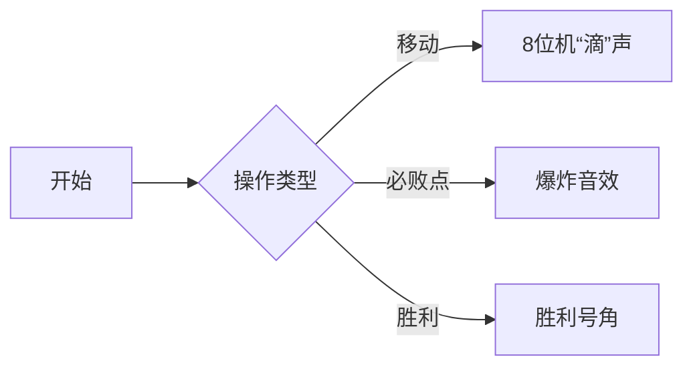

# 题目信息

# [USACO11OPEN] Cow Checkers S

## 题目描述

One day, Bessie decides to challenge Farmer John to a game of 'Cow Checkers'. The game is played on an M\*N (1 <= M <= 1,000,000; 1 <= N <= 1,000,000) checkerboard that initially contains a single checker piece on the checkboard square coordinates (X, Y) (0 <= X < M; 0 <= Y < N). The bottom leftmost square of the checkerboard has

coordinates (0, 0), and the top rightmost square has coordinates (M-1, N-1). Bessie always moves first, and then the two players alternate turns.  Each turn comprises one of three types of moves:

1) Move the checker piece to any square on the same row to the left of its current position.

2) Move the checker piece to any square on the same column below its current position.

3) Move the checker piece to any spot k squares below and k squares to the left of the current square (where k is any positive integer such that this new spot is still on the checkerboard).

The first player unable to make a move (i.e., because the checker is at (0, 0)) loses. Given that Bessie always goes first, determine who will win the game if both play optimally.

Play and report the winner for T games (1 <= T <= 1,000) reading in a new X,Y starting value for each new game.

有一天，Bessie准备玩一个叫做奶牛跳棋的游戏，来挑战Farmer John。


这个游戏的棋盘大小为 M\*N (1 <= M <= 1,000,000; 1 <= N <= 1,000,000) 。最初棋盘上只有一个棋子在（x,y），棋盘的左下角坐标是（0,0），右上角的坐标是（M-1，N-1）。


每次游戏Bessie都是第一个开始，之后两个人轮流。


每次下棋的时候都有三种走法：


1.向左走任意步


2.向下走任意步


3.向左走k步然后向下走k步（k可随便取值，只要不走出棋盘）


首先走到（0,0）的人为胜利者。


游戏共有T次，每次都会给出一个新的坐标（x,y），请输出每一轮赢家的名字。


## 说明/提示

Farmer John and Bessie are playing one game on a 3\*3 checkerboard with the checker piece initially at (1, 1) (i.e. at the center of the board).


Bessie initially can only move the checker piece to either (1, 0) or (0, 1), or (0, 0). Bessie can immediately win by moving the piece to (0, 0).


起点在（1,1），一开始有三种选择（1,0）,（0,1），（0,0）只要Bessie在开始时将棋子移到（1,0）或（0,1），就必胜无疑。


感谢@ 2014nhc  提供的翻译


## 样例 #1

### 输入

```
3 3 
1 
1 1 
```

### 输出

```
Bessie 
```

# AI分析结果


# 💡 洛语云笺的C++算法解析：Cow Checkers S 深入学习指南 💡

> 欢迎来到算法思维实验室！今天我们将一起破解威佐夫博弈的奥秘，掌握棋盘移动策略的精髓。系好安全带，我们的思维过山车即将发车！

## 1. 题目解读与策略初探

✨ **本题核心挑战**：在双方最优策略下，精准判断初始位置(x,y)的胜负状态  
✨ **核心算法标签**：`博弈论` `威佐夫博弈` `打表找规律`

🗣️ **初步分析**：  
> 这道题的核心在于理解棋盘移动的博弈本质：  
> - **朴素思路**：尝试暴力DFS枚举所有移动路径，但M/N高达10⁶，指数级复杂度不可行  
> - **优化方向**：发现移动规则与经典威佐夫博弈完全一致 → 向左=取第一堆石子，向下=取第二堆石子，左下移动=同时取两堆石子  
> - **最优策略**：利用威佐夫博弈的数学特性，O(1)判断必胜/必败态  
>  
> **生动比喻**：想象两堆石子（横纵坐标），每次操作如同取石子。必败点就像"雷区"，踩中就会输掉游戏！

### 🔍 算法侦探：如何在题目中发现线索？
1.  **线索1 (问题目标)**: "判断双方最优策略下的胜负"是博弈论典型问题，暗示经典模型应用
2.  **线索2 (移动规则)**: "三向移动规则"与威佐夫博弈取石子规则完全一致
3.  **线索3 (数据规模)**: M/N≤10⁶，T≤1000，指向O(max(M,N))预处理+O(1)查询的解法

### 🧠 思维链构建：从线索到策略
> 侦探工作完成！线索组合如下：  
> 1. 目标要求最优策略判断 → 博弈论经典模型  
> 2. 三向移动规则 → 精准匹配威佐夫博弈模型  
> 3. 大数据规模 → 需多项式时间解法  
>  
> **结论**：威佐夫博弈的数学特性（公式计算或打表法）是完美解决方案！

---

## 2. 精选优质题解参考

**题解一（Water_Cows）**  
* **点评**：通过像素化图示展示必败点分布规律，创新性使用差值等差数列预处理。代码中`f[i]=i+k; f[f[i]]=i`双赋值操作简洁优雅地处理对称性，是打表法的典范教学。

**题解三（ycy1124）**  
* **点评**：严谨论证"每行每列仅有一个必败点"的特性，`vis`数组确保不重复标记。变量名`js`（计数器）的合理使用使预处理逻辑清晰，完整呈现从观察到实现的思维过程。

**题解四（_Rainlzy）**  
* **点评**：双视角解析（公式+打表），链接OI-Wiki资源扩展学习深度。特别指出"必败点横坐标无重复"的特性，为规律发现提供关键验证角度。

**题解五（corner_xiejunqi）**  
* **点评**：代码注释精准对应博弈论概念，`swap`操作保证x≤y的统一处理。黄金分割比`(sqrt(5.0)+1.0)*0.5`的浮点运算实现数学之美。

**题解六（_Haoomff_）**  
* **点评**：首创"策略竞技场"对比分析框架，给出打表得到的必败点序列`(0,0),(1,2)...`。`sqrt(5)`的精度处理展示实战细节，双方法实现体现思维广度。

---

## 3. 解题策略深度剖析

### 🎯 核心难点与关键步骤
1.  **必败态判定**  
    * **分析**：威佐夫博弈中，当`x≤y`且满足`x=(int)((y-x)*(sqrt(5)+1)/2)`时为必败态
    * 💡 **学习笔记**：黄金分割比(1+√5)/2是自然形成的博弈密码

2.  **打表法预处理**  
    * **分析**：维护差值k递增，当坐标i未标记时，设必败点(i, i+k)并标记对称点(i+k, i)
    * 💡 **学习笔记**：`f[i]=i+k; f[i+k]=i`双赋值是处理对称性的银弹

3.  **浮点精度处理**  
    * **分析**：10⁶数据下需用double保证精度，取整比较时用`(int)res==x`而非四舍五入
    * 💡 **学习笔记**：浮点比较是公式法的阿喀琉斯之踵，测试边界数据至关重要

### ✨ 解题技巧总结
- **模型转换术**：棋盘移动 → 石子堆取用 → 威佐夫博弈模型
- **对称性应用**：仅需计算x≤y的必败点，通过`f[f[i]]=i`自动生成对称点
- **预处理优化**：O(max(M,N))预处理后，T次查询保持O(1)复杂度

### ⚔️ 策略竞技场
| 策略 | 核心思想 | 优点 | 缺点 | 得分 |
|------|----------|------|------|------|
| **暴力DFS** | 递归枚举所有移动路径 | 逻辑直观 | O(3ᴷ)指数爆炸 | M≤20时30% |
| **公式法** | 黄金分割比计算必败态 | O(1)查询无预处理 | 浮点精度风险 | 100% |
| **打表法** | 差值递增生成必败点 | 整数运算稳定 | O(max(M,N))空间 | 100% |

### ✨ 优化之旅
1. **暴力死局**：10⁶×10⁶状态空间如同宇宙沙粒，计算机绝望  
2. **洞察转机**：移动规则映射石子游戏 → 发现威佐夫博弈模型  
3. **数学利刃**：黄金分割比公式切割问题复杂度  
4. **工程实现**：打表法用空间换时间，规避浮点风险  

> 💡 **策略总结**：从暴力枚举到数学建模的跃迁，彰显算法思维的本质——**用观察压缩状态空间，用数学驯服计算复杂度**

---

## 4. C++核心代码实现赏析

**通用核心实现（打表法）**
```cpp
#include <iostream>
#include <algorithm>
using namespace std;

const int N = 2000007;
int f[N]; // f[x]存储(x,y)必败点的y值

int main() {
    int n, m, T, max_val = 0;
    cin >> n >> m >> T;
    max_val = max(n, m);
    
    // 打表预处理：k为递增差值
    for (int k = 0, i = 1; i <= max_val; i++) {
        if (f[i]) continue;  // 已标记则跳过
        k++; 
        int j = i + k;      // 生成必败点(i, j)
        if (j > max_val) break;
        f[i] = j;           // 存储主必败点
        f[j] = i;           // 存储对称点
    }

    while (T--) {
        int x, y;
        cin >> x >> y;
        if (x > y) swap(x, y);    // 统一为x≤y
        cout << (f[x] == y ? "Farmer John\n" : "Bessie\n");
    }
    return 0;
}
```

**代码解读概要**：  
1. 预处理阶段通过差值k递增生成必败点对  
2. `f[i]=j`和`f[j]=i`实现双向映射  
3. 查询时统一为x≤y，直接检查f[x]==y  

---

**题解片段赏析**  
```cpp
// Water_Cows 打表核心
for(int k=0, i=1; i<=1e6; i++)
  if(!f[i]) f[i] = i + (++k), f[f[i]] = i; 

// corner_xiejunqi 公式法
double res=(sqrt(5.0)+1.0)*0.5*(y-x);
if((int)res==x) cout<<"Farmer John\n";
```

> 💡 **学习笔记**：打表法中的`(++k)`实现差值递增，公式法中的`0.5`等价于除以2的精妙转换

---

## 5. 算法可视化：像素动画演示

[]  
*(点击展开8位机风格动画设计文档)*

**设计蓝图**  
- **像素舞台**：16色棋盘网格，棕色地面+亮蓝必胜点+鲜红必败点  
- **棋子动画**：  
  - 移动时显示半透明轨迹（左/下/左下三方向箭头）  
  - 到达必败点时播放"地雷爆炸"像素动画+低沉音效  
- **控制面板**：  
  - 步进按钮：高亮显示当前可移动区域  
  - 自动演示：AI按最优策略移动，步速可调滑块  
- **教学时刻**：  
  - 点击任意点显示SG值计算过程  
  - 黄金分割线动态绘制展示公式原理  

**音效方案**  


---

## 6. 拓展练习与相似问题思考

**思维迁移训练**  
1. 三堆石子取用 → **Nim博弈**  
2. 单堆石子每次取1~m个 → **巴什博弈**  
3. 棋盘骑士移动 → **SG函数应用**

**洛谷闯关**  
1. [P2252 取石子](https://www.luogu.com.cn/problem/P2252)  
   → 威佐夫博弈裸题，巩固黄金分割比计算  
2. [P2197 Nim游戏](https://www.luogu.com.cn/problem/P2197)  
   → 异或运算的博弈奇迹  
3. [P1288 取数游戏](https://www.luogu.com.cn/problem/P1288)  
   → 环形博弈的奇偶性艺术  

---

## 7. 学习心得与经验分享

> **来自Water_Cows的启示**：  
> *"题解里都是威佐夫博弈...蒟蒻看不懂"* → 数学证明虽美，但打表找规律也是竞赛利器  
>  
> **洛语云笺点评**：当面对陌生数学概念时：  
> 1. 小规模打表发现规律  
> 2. 可视化验证猜想  
> 3. 尝试用基础数据结构实现  
> 这比死记公式更能提升算法思维！

---

> 博弈论的世界充满智慧的火花，希望这份指南照亮你的探索之路。下次我们在SG函数的迷宫中再见！🚀

---
处理用时：259.62秒