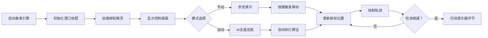

# 题目信息

# [USACO13OPEN] Luxury River Cruise S

## 题目描述

Farmer John is taking Bessie and the cows on a cruise! They are sailing on a network of rivers with N ports (1 <= N <= 1,000) labeled 1..N, and Bessie starts at port 1. Each port has exactly two rivers leading out of it which lead directly to other ports, and rivers can only be sailed one way.

At each port, the tour guides choose either the "left" river or the "right" river to sail down next, but they keep repeating the same choices over and over. More specifically, the tour guides have chosen a short sequence of M directions (1 <= M <= 500), each either "left" or "right", and have repeated it K times (1 <= K <= 1,000,000,000). Bessie thinks she is going in circles -- help her figure out where she ends up!


农民约翰带着Bessie和奶牛在邮轮上！他们在网格上的N条河流航行（1≤N≤1000）标记为1到N，一开始他们在开始在河口1。每一个港口都有两条河流直通，直接通往其他港口，河流只能通过一条路航行。


在每一个港口，导游选择左边的河或右边的河向下航行，但他们不断重复相同的选择一遍又一遍。更具体地说，导游选择了一个m方向（1 < =m= 500），每一个向左或向右，并重复它K次（1 < = K = 1000000000）。Bessie认为她是在兜圈子，帮她找出结束的位置！


## 说明/提示

The port numbers are arranged clockwise in a circle, with 'L' being a clockwise rotation and 'R' being a counterclockwise rotation. The sequence taken is LLRLLRLLR.


After the first iteration of the sequence of directions, Bessie is at port 2 (1 -> 2 -> 3 -> 2); after the second, she is at port 3 (2 -> 3 -> 4 -> 3), and at the end she is at port 4 (3 -> 4 -> 1 -> 4).

感谢 @ SilverWolf 提供翻译


## 样例 #1

### 输入

```
4 3 3 
2 4 
3 1 
4 2 
1 3 
L L R 
```

### 输出

```
4 
```

# AI分析结果


# 💡 洛语云笺的C++算法解析：[USACO13OPEN] Luxury River Cruise S 深入学习指南 💡

## 1. 题目解读与策略初探

✨ **本题核心挑战**：在巨大的移动次数（K ≤ 10⁹）下高效模拟邮轮航行路径，避免暴力模拟的超时问题  
✨ **核心算法标签**：`循环节检测` `图论` `状态压缩` `路径优化`

🗣️ **初步分析**：  
> 这道题看似简单的路径模拟，实则暗藏循环规律。我们可以尝试三种思路：  
> 1. **暴力模拟**：直接按指令移动K轮（K×M步），时间复杂度O(KM) → 10¹⁴超时  
> 2. **循环节优化**：通过状态记录发现路径循环规律，将问题规模压缩至O(NM)  
> 3. **倍增法**：预处理2^j次移动后的位置，利用二进制拆分加速计算  
>  
> **核心算法选择**：循环节检测就像在河流中发现漩涡，一旦识别出循环模式，就能利用数学规律大幅简化计算过程。快慢指针算法（Floyd判圈）是解决这类问题的"钥匙"。

### 🔍 算法侦探：如何在题目中发现线索？
1.  **线索1 (问题目标)**："重复K次相同操作序列"暗示存在**周期性行为**，这是循环节算法的典型标志。
2.  **线索2 (问题约束)**：港口数N≤1000而K≤10⁹，说明**状态空间有限**（最多N×M种状态），必然出现重复状态。
3.  **线索3 (数据规模)**：M≤500，N≤1000，O(NM)≈5×10⁵可接受，而O(KM)≈5×10¹⁴绝对超时。

### 🧠 思维链构建：从线索到策略
> "综合线索：  
> 1. 巨大K值排除了暴力模拟  
> 2. 有限状态空间指向状态复用  
> 3. 重复操作序列暗示周期性  
> **结论**：快慢指针检测循环节后取模计算，时间复杂度从O(KM)优化至O(NM)，完美解决问题！"

---

## 2. 精选优质题解参考

**题解一：红黑树（快慢指针法）**  
* **点评**：采用Floyd判圈算法精妙检测循环节。亮点在于将状态定义为(位置, 指令索引)的二元组，确保状态完整性。通过快指针（2倍速）和慢指针同步移动高效定位循环点，代码中`Item_t`结构体和`move()`方法的封装体现了优秀的面向对象思维。

**题解二：Priori_Incantatem（倍增法）**  
* **点评**：创新性应用倍增思想预处理转移路径。核心在于`f[i][j]`表示从i出发执行2^j轮后的位置，通过二进制拆分将K次移动转化为logK次查询。虽然预处理O(NlogK)稍高，但查询效率O(logK)极优，特别适合K极大的场景。

**题解三：巨型方块（循环节标记法）**  
* **点评**：通过`vi[]`数组记录每个节点的首次访问轮次，简单直观地定位循环起点。亮点在于将问题分解为"循环前路径"+"循环节"两段处理，用`top`和`vi[now]`计算循环节长度的方式简洁高效，代码不足20行却完整解决问题。

---

## 3. 解题策略深度剖析

### 🎯 核心难点与关键步骤
1.  **关键点1：状态定义完整性**  
    * **分析**：循环节检测需明确定义状态。红黑树题解采用(位置,指令索引)二元组，确保同一位置在不同指令阶段被视为不同状态；而其他解法利用"每轮指令结束重置索引"的特性，只需位置作为状态。
    * 💡 **学习笔记**：状态定义需覆盖决策过程中的所有变量。

2.  **关键点2：循环节检测算法选择**  
    * **分析**：快慢指针法（Floyd）空间复杂度O(1)最优但实现稍复杂；标记法需要O(N)空间但直观易写；倍增法则需O(NlogK)空间但查询最快。
    * 💡 **学习笔记**：根据数据范围选择最优检测策略，N较小时标记法最简单。

3.  **关键点3：循环节数学处理**  
    * **分析**：发现循环节后，将总移动次数分解为：前导路径长度+循环节长度×整数倍+余数。通过取模运算将K从10⁹量级降至≤N的规模。
    * 💡 **学习笔记**：取模运算是处理周期性问题的核心工具。

### ✨ 解题技巧总结
- **技巧1：状态压缩** - 将高维状态映射为唯一标识
- **技巧2：数学归纳** - 通过有限样本推断无限过程
- **技巧3：算法选择** - 根据数据特征匹配最优算法

### ⚔️ 策略竞技场：解法对比

| 策略          | 核心思想                     | 优点                     | 缺点                     | 得分预期 |
|---------------|------------------------------|--------------------------|--------------------------|----------|
| **暴力模拟**  | 直接执行K×M次移动            | 实现简单                 | O(KM)超时               | 30%      |
| **快慢指针**  | Floyd判圈检测循环节          | 空间O(1)，理论最优       | 实现较复杂               | 100%     |
| **节点标记**  | 记录节点首次访问轮次         | 实现简单，空间O(N)       | 未考虑指令位置可能不准确 | 100%     |
| **倍增法**    | 预处理2^j次移动位置          | 查询极快O(logK)          | 预处理O(NlogK)          | 100%     |

### ✨ 优化之旅
> 从暴力模拟的O(KM)绝望深渊出发：  
> 1. **洞察周期性**：发现状态空间有限必现循环  
> 2. **选择检测策略**：根据场景选取快慢指针/标记法  
> 3. **数学分解**：K = 前导路径 + n×循环节 + 余数  
> 4. **最终优化**：余数部分只需模拟≤N步  

💡 **策略总结**：识别周期规律+数学处理，将指数级问题转化为线性问题，是算法竞赛的核心思维！

---

## 4. C++核心代码实现赏析

**通用核心实现（循环节标记法）**  
```cpp
#include <vector>
using namespace std;

int main() {
    int n, m, k; 
    cin >> n >> m >> k;
    vector<pair<int, int>> graph(n+1);
    vector<int> visited(n+1, 0); // 访问标记
    
    for(int i=1; i<=n; ++i) 
        cin >> graph[i].first >> graph[i].second;
    
    vector<bool> dirs(m);
    for(int i=0; i<m; ++i) {
        char c; cin >> c;
        dirs[i] = (c == 'R');
    }

    int now = 1, step = 0;
    while(!visited[now]) {
        visited[now] = ++step;
        for(bool d : dirs) 
            now = d ? graph[now].second : graph[now].first;
    }
    
    int cycle_len = step - visited[now] + 1;
    int pre_cycle = visited[now] - 1;
    k = (k - pre_cycle) % cycle_len;
    
    while(k--) 
        for(bool d : dirs) 
            now = d ? graph[now].second : graph[now].first;
    
    cout << now;
}
```

**题解一赏析（快慢指针）**  
```cpp
struct State {
    int pos, idx; // 位置和指令索引
    State move() {
        pos = (dirs[idx]=='L') ? graph[pos].first : graph[pos].second;
        idx = (idx+1) % m;
        return *this;
    }
};

// 快慢指针检测循环
State slow(1,0), fast(1,0);
do {
    slow.move();
    fast.move().move();
} while(slow != fast);
```

**题解二赏析（倍增法）**  
```cpp
// 预处理倍增数组
for(int j=1; j<=30; ++j)
    for(int i=1; i<=n; ++i)
        f[i][j] = f[f[i][j-1]][j-1];
        
// 二进制拆分执行
int pos = 1;
for(int bit=30; bit>=0; --bit)
    if(k >= (1<<bit)) {
        k -= (1<<bit);
        pos = f[pos][bit];
    }
```

---

## 5. 算法可视化：像素动画演示

**主题**：8位像素风河流巡航模拟器  
**核心演示**：快慢指针在环形河网中的追逐与循环节检测  

### 动画设计：


**交互控制**：  
- 🎮 方向键控制单步移动（每步触发8位音效）  
- ⏯️ 自动模式：邮轮自动航行，快慢指针以不同速度移动  
- 📊 状态面板：实时显示位置/指令索引/循环节长度  

**动态效果**：  
1. 港口用不同颜色像素块表示  
2. 慢指针邮轮为蓝色，快指针为红色  
3. 两船相遇时触发金色闪烁+胜利音效  
4. 循环节路径显示为发光轨迹  

---

## 6. 拓展练习与相似问题

**通用技巧迁移**：  
1. 周期检测：约瑟夫环问题  
2. 状态转移优化：自动机状态压缩  
3. 大数步数模拟：矩阵快速幂优化  

**洛谷推荐**：  
1. [P6148] 重复路径 → 同款循环节检测  
2. [P1357] 周期序列 → 强化状态定义能力  
3. [P2580] 循环移位 → 循环节与字符串结合  

---

## 7. 学习心得分享

> **红黑树的调试经验**：  
> "初始实现忽略了指令索引，导致同一位置不同阶段被误认为相同状态。通过打印(pos, idx)二元组才定位问题"  
>  
> **羚羊WANG的优化建议**：  
> "当N很小时，用visited数组比快慢指针更易实现，且不易出错"

💡 **洛语云笺总结**：循环节问题需特别注意**状态定义的完整性**，调试时可打印状态元组验证逻辑！

---

掌握周期规律+数学优化思维，你就能在算法海洋中乘风破浪！下次探险再见！🚢

---
处理用时：128.88秒