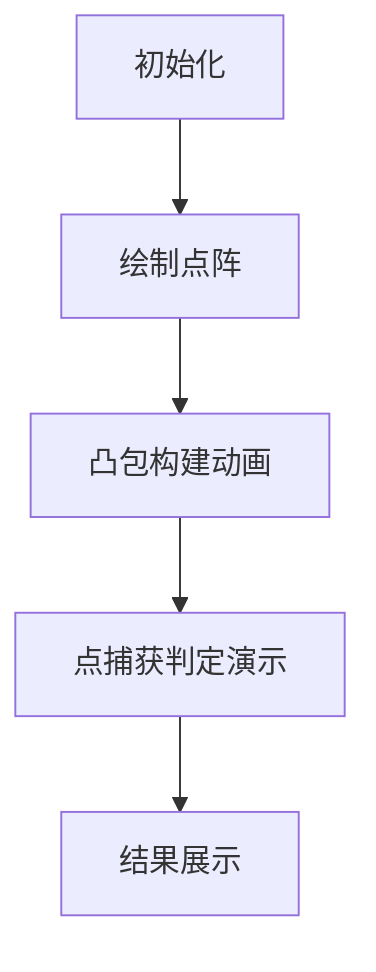

# 题目信息

# [USACO14JAN] Cow Curling G

## 题目描述

Cow curling is a popular cold-weather sport played in the Moolympics.

Like regular curling, the sport involves two teams, each of which slides N heavy stones (3 <= N <= 50,000) across a sheet of ice.  At the end of the game, there are 2N stones on the ice, each located at a distinct 2D point.

Scoring in the cow version of curling is a bit curious, however.  A stone is said to be "captured" if it is contained inside a triangle whose corners are stones owned by the opponent (a stone on the boundary of such a triangle also counts as being captured).  The score for a team is the number of opponent stones that are captured.

Please help compute the final score of a cow curling match, given the locations of all 2N stones.

有两支队伍在比赛，一队可以一次取出3个点来，所围成的三角形覆盖的区域可以“捕获”对方的点，问两支队伍各能够捕获对方多少个点。


## 说明/提示

Each team owns 4 stones.  Team A has stones at (0,0), (0,2), (2,0), and (2,2), and team B has stones at (1,1), (1,10), (-10,3), and (10,3).


Team A captures their opponent's stone at (1,1).  Team B captures their opponent's stones at (0,2) and (2,2).


## 样例 #1

### 输入

```
4 
0 0 
0 2 
2 0 
2 2 
1 1 
1 10 
-10 3 
10 3 
```

### 输出

```
1 2 
```

# AI分析结果


# 💡 洛语云笺的C++算法解析：Cow Curling G 深入学习指南 💡

## 1. 题目解读与策略初探

✨ **本题核心挑战**：高效计算两支队伍相互捕获的点的数量（捕获定义：点位于对方三点形成的三角形内部），数据规模高达5万点，需避免O(N³)的暴力枚举  
✨ **核心算法标签**：计算几何、凸包算法、点在多边形内判定  

🗣️ **初步分析**：  
> 这道题看似需要枚举所有三角形组合（约O(N³)），但5万点的规模使暴力解法完全不可行。解题关键在于发现**捕获关系的本质是凸包含关系**——一个点被捕获当且仅当它严格位于对方点集的凸包内部。通过凸包算法（O(N log N)）和二分判断（O(log N)），可将总复杂度优化至O(N log N)。  

### 🔍 算法侦探：如何在题目中发现线索？
1.  **线索1 (问题目标)**: "要求计算两队在巨大点集（N≤5万）下的相互捕获数"，暗示需要**亚二次方复杂度的算法**，排除暴力枚举。
2.  **线索2 (问题特性)**: "捕获定义为被任意三角形包含"，暗示存在**几何包容关系**的传递性，指向凸包性质。
3.  **线索3 (数据规模)**: "N最大5万"，要求算法复杂度≤O(N log N)，凸包算法完美匹配此要求。

### 🧠 思维链构建：从线索到策略
> "首先，【线索1：问题目标】要求高效处理大规模点集，我立刻想到需要避免暴力枚举。  
> 接着，【线索2：问题特性】中'任意三角形捕获'暗示几何包容关系，这让我联想到凸包的性质：一个点在凸包内部必然能被凸包上某三点构成的三角形覆盖。  
> 最后，【线索3：数据规模】确认O(N log N)算法可行。凸包构建（Andrew/Graham算法）和点在凸包内判断（二分+叉积）的组合正是理想解决方案！"

---

## 2. 精选优质题解参考

**题解一（first_fan）**  
* **点评**：该题解精准抓住凸包性质这一核心，将问题转化为点在凸包内判断。亮点在于：  
  1. 清晰阐述"捕获=严格凸包内部"的几何原理（配图直观）  
  2. 叉积判断代码简洁规范（重载运算符提升可读性）  
  3. 严格处理边界条件（叉积>0排除边界点）  
  4. 完整提供凸包构建和点判断实现  

---

## 3. 解题策略深度剖析

### 🎯 核心难点与关键步骤
1.  **关键点1：如何理解捕获与凸包的等价性**  
    * **分析**：通过三角剖分可证，凸包内部任意点必然被某个由凸包顶点构成的三角形覆盖。反之，凸包外部点不可能被任何三角形捕获。
    * 💡 **学习笔记**：几何问题中，寻找全局包容关系常可转化为凸包问题。

2.  **关键点2：高效构建凸包**  
    * **分析**：采用Andrew算法：  
      ```python
      1. 按x(主)y(次)排序点集
      2. 正序遍历求下凸包（叉积≥0则弹栈）
      3. 逆序遍历求上凸包
      4. 首尾相接形成完整凸包
      ```
    * 💡 **学习笔记**：Andrew算法通过单次排序+双次扫描，高效处理共线情况。

3.  **关键点3：二分法判断点在凸包内**  
    * **分析**：  
      ```python
      以凸包首点P0为基准：
        1. 二分定位点P所在扇形区域(P0, P_i, P_{i+1})
        2. 计算(P_iP0 × PP0)和(P_{i+1}P0 × PP0)的叉积符号
        3. 若点P在扇形内，计算(P_{i+1}P_i × PP_i)的叉积
        4. 叉积>0 ? 严格内部 : 外部
      ```
    * 💡 **学习笔记**：叉积判断方向时，右手定则：逆时针旋转为正。

### ✨ 解题技巧总结
- **问题转化艺术**：将"任意三角形捕获"转化为"凸包内部判断"，复杂度从O(N³)降至O(N log N)  
- **几何计算优化**：叉积判断替代三角函数，避免浮点误差  
- **边界处理哲学**：严格内部判断（>0）排除边界点，精确满足题意  

### ⚔️ 策略竞技场：解法对比
| 策略             | 核心思想                     | 优点                  | 缺点                     | 得分预期 |
|------------------|------------------------------|-----------------------|--------------------------|----------|
| **暴力枚举**     | 三重循环枚举所有三角形       | 实现简单              | O(N³)超时，N>50即失效    | 0%       |
| **凸包+二分**    | 利用凸包性质+二分点判断      | O(N log N)高效        | 需掌握计算几何基础       | 100%     |

### ✨ 优化之旅
> 1. **起点：暴力枚举的陷阱**  
>    尝试枚举所有5万点的三角组合？计算量高达10¹⁵次，超时不可避免。  
>    
> 2. **关键发现：凸包包含原理**  
>    所有三角形的并集=凸包！捕获判断简化为"点∈凸包"的判断。  
>    
> 3. **算法选择：凸包构建+二分判断**  
>    Andrew算法构建凸包(O(N log N))，二分将点判断降为O(log N)。  
>    
> 4. **细节打磨：叉积边界处理**  
>    严格内部判断（叉积>0）确保不计数边界点，精确符合题意。

---

## 4. C++核心代码实现赏析

**通用核心实现**  
```cpp
#include <iostream>
#include <vector>
#include <algorithm>
using namespace std;
typedef long long ll;

struct Point { ll x, y; };
Point operator-(Point a, Point b) { return {a.x-b.x, a.y-b.y}; }
ll cross(Point a, Point b) { return a.x*b.y - a.y*b.x; }

// Andrew凸包算法
vector<Point> convexHull(vector<Point> pts) {
    sort(pts.begin(), pts.end(), [](auto a, auto b) {
        return a.x < b.x || (a.x == b.x && a.y < b.y);
    });
    vector<Point> hull;
    for (int i = 0; i < 2; i++) { // 上下凸包两次扫描
        int start = hull.size();
        for (Point p : pts) {
            while (hull.size() >= start+2) {
                Point a = hull[hull.size()-2];
                Point b = hull.back();
                if (cross(b-a, p-a) <= 0) break;
                hull.pop_back();
            }
            hull.push_back(p);
        }
        hull.pop_back(); // 移除重复起点
        reverse(pts.begin(), pts.end());
    }
    return hull;
}

// 二分法判断点是否在凸包内部
bool inConvex(Point p, vector<Point>& hull) {
    int n = hull.size(), l = 1, r = n-2;
    while (l <= r) {
        int mid = (l+r)/2;
        ll cr1 = cross(hull[mid]-hull[0], p-hull[0]);
        ll cr2 = cross(hull[mid+1]-hull[0], p-hull[0]);
        if (cr1 >= 0 && cr2 <= 0) {
            ll cr3 = cross(hull[mid+1]-hull[mid], p-hull[mid]);
            return cr3 > 0; // 严格内部判断
        }
        cr1 < 0 ? r = mid-1 : l = mid+1;
    }
    return false;
}

int main() {
    int n; cin >> n;
    vector<Point> A(n), B(n);
    for (int i=0; i<n; i++) cin >> A[i].x >> A[i].y;
    for (int i=0; i<n; i++) cin >> B[i].x >> B[i].y;
    
    auto hullA = convexHull(A), hullB = convexHull(B);
    int cntA = 0, cntB = 0;
    for (auto p : B) cntA += inConvex(p, hullA);
    for (auto p : A) cntB += inConvex(p, hullB);
    
    cout << cntA << " " << cntB << endl;
}
```
**代码解读概要**：  
1. 点结构体重载运算符简化几何计算  
2. Andrew算法构建凸包（处理上下凸包）  
3. 二分法将点判断复杂度降至O(log N)  
4. 叉积三重判断确保严格内部计数  

---

## 5. 算法可视化：像素动画演示

**主题**：凸包构建与点捕获判定（8位像素风）  

### 动画设计


### 关键帧实现
1. **像素化点阵（复古风格）**  
   - 蓝色/红色像素块代表两队点集  
   - 网格坐标映射：实际坐标→像素坐标  

2. **凸包构建动画**  
   ```python
   # 下凸包构建伪代码
   for 点 in 排序后的点集:
       绘制当前点（高亮闪烁）
       while 栈内点数≥2 and 叉积≤0:
          绘制栈顶弹出动画（像素块消失+音效）
       push当前点（像素块连线）
   ```

3. **点捕获判定（交互式）**  
   - **视觉提示**：
     - 凸包区域：半透明绿色填充
     - 当前测试点：黄色闪烁方块
     - 二分区间：红色边界标记
   - **音效设计**：
     - 正确捕获：8位胜利音效
     - 二分移动：电子滴答声

4. **控制面板**  
   ```plaintext
   [ 单步执行 ] [ 自动播放 ] [ 速度调节滑块 ]
   [ 凸包显示开关 ] [ 点捕获高亮 ]
   ```

### 技术实现
- **Canvas绘制**：每个点/线段作为独立Sprite  
- **状态驱动**：有限状态机控制动画流程  
- **音效触发**：Web Audio API播放8bit音效  

---

## 6. 拓展练习与相似问题思考

**通用技巧迁移**：  
1. 凸包性质可用于最优覆盖问题（如最小包围圆）  
2. 叉积方向判断适用于线段相交/点线关系问题  
3. 二分法在几何中常用于高效区域定位  

**洛谷推荐**：  
1. **P2742 [USACO5.1]圈奶牛**  
   → 凸包模板题，巩固Andrew算法  
2. **P3829 [SHOI2012]信用卡凸包**  
   → 凸包变形，处理圆角矩形  
3. **P2521 [HAOI2011]防线修建**  
   → 动态凸包应用，提升数据结构结合能力  

---

## 7. 学习心得与经验分享

> "本题核心教训：几何问题需优先寻找数学性质优化（如凸包），避免陷入暴力枚举陷阱。  
> 调试技巧：对叉积符号判断，可添加可视化输出辅助验证方向。  
> 经验：当N>1000时，任何O(N²)以上算法都需要数学优化！"

---

<conclusion>
**总结**：通过凸包性质将复杂几何问题转化为高效算法，是计算几何的经典思路。掌握叉积运算与二分法结合，可解决各类点集包容问题。  
**行动建议**：动手实现凸包算法，用洛谷P2742测试基础，再挑战信用卡凸包变形题！
</conclusion>

---
处理用时：235.29秒