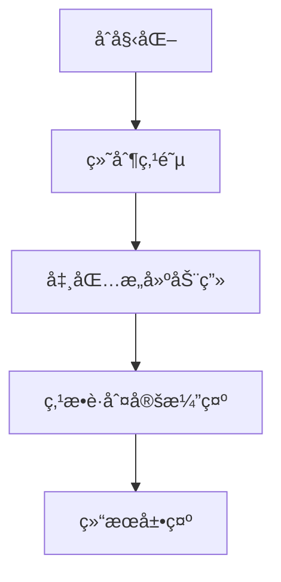

# 题目信æ¯

# [USACO14JAN] Cow Curling G

## 题目æè¿°

Cow curling is a popular cold-weather sport played in the Moolympics.

Like regular curling, the sport involves two teams, each of which slides N heavy stones (3 <= N <= 50,000) across a sheet of ice.  At the end of the game, there are 2N stones on the ice, each located at a distinct 2D point.

Scoring in the cow version of curling is a bit curious, however.  A stone is said to be "captured" if it is contained inside a triangle whose corners are stones owned by the opponent (a stone on the boundary of such a triangle also counts as being captured).  The score for a team is the number of opponent stones that are captured.

Please help compute the final score of a cow curling match, given the locations of all 2N stones.

有两支队ä¼åœ¨æ¯”赛，一队å¯ä»¥ä¸€æ¬¡å–出3个点æ¥ï¼Œæ‰€å›´æˆçš„三角形覆盖的区域å¯ä»¥â€œæ•è·â€å¯¹æ–¹çš„点，问两支队ä¼å„能够æ•è·å¯¹æ–¹å¤šå°‘个点。


## 说æ˜/æ示

Each team owns 4 stones.  Team A has stones at (0,0), (0,2), (2,0), and (2,2), and team B has stones at (1,1), (1,10), (-10,3), and (10,3).


Team A captures their opponent's stone at (1,1).  Team B captures their opponent's stones at (0,2) and (2,2).


## 样例 #1

### 输入

```
4 
0 0 
0 2 
2 0 
2 2 
1 1 
1 10 
-10 3 
10 3 
```

### 输出

```
1 2 
```

# AI分æ结æœ


# 💡 洛语云笺的C++算法解æ：Cow Curling G æ·±å…¥å­¦ä¹ æŒ‡å— ğŸ’¡

## 1. 题目解读ä¸ç­–ç•¥åˆæ¢

✨ **本题核心挑战**：高效计算两支队ä¼ç›¸äº’æ•è·çš„点的数é‡ï¼ˆæ•è·å®šä¹‰ï¼šç‚¹ä½äºå¯¹æ–¹ä¸‰ç‚¹å½¢æˆçš„三角形内部），数æ®è§„模高达5万点，需é¿å…O(N³)的暴力æšä¸¾  
✨ **核心算法标签**：计算几何ã€å‡¸åŒ…算法ã€ç‚¹åœ¨å¤šè¾¹å½¢å†…判定  

ğŸ—£ï¸ **åˆæ­¥åˆ†æ**：  
> è¿™é“题看似需è¦æšä¸¾æ‰€æœ‰ä¸‰è§’形组åˆï¼ˆçº¦O(N³)），但5万点的规模使暴力解法完全ä¸å¯è¡Œã€‚解题关键在äºå‘ç°**æ•è·å…³ç³»çš„本质是凸包å«å…³ç³»**——一个点被æ•è·å½“且仅当它严格ä½äºå¯¹æ–¹ç‚¹é›†çš„凸包内部。通过凸包算法（O(N log N)）和二分判断（O(log N)），å¯å°†æ€»å¤æ‚度优化至O(N log N)。  

### 🔠算法侦æ¢ï¼šå¦‚何在题目中å‘ç°çº¿ç´¢ï¼Ÿ
1.  **线索1 (问题目标)**: "è¦æ±‚计算两队在巨大点集（N≤5万）下的相互æ•è·æ•°"，暗示需è¦**亚二次方å¤æ‚度的算法**，æ’除暴力æšä¸¾ã€‚
2.  **线索2 (问题特性)**: "æ•è·å®šä¹‰ä¸ºè¢«ä»»æ„三角形包å«"，暗示存在**几何包容关系**的传递性，指å‘凸包性质。
3.  **线索3 (æ•°æ®è§„模)**: "N最大5万"，è¦æ±‚算法å¤æ‚度≤O(N log N)，凸包算法完ç¾åŒ¹é…æ­¤è¦æ±‚。

### 🧠 æ€ç»´é“¾æ„建：ä»çº¿ç´¢åˆ°ç­–ç•¥
> "首先，ã€çº¿ç´¢1：问题目标】è¦æ±‚高效处ç†å¤§è§„模点集，我立刻想到需è¦é¿å…暴力æšä¸¾ã€‚  
> æ¥ç€ï¼Œã€çº¿ç´¢2：问题特性】中'ä»»æ„三角形æ•è·'暗示几何包容关系，这让我è”想到凸包的性质：一个点在凸包内部必然能被凸包上æŸä¸‰ç‚¹æ„æˆçš„三角形覆盖。  
> 最å，ã€çº¿ç´¢3：数æ®è§„模】确认O(N log N)算法å¯è¡Œã€‚凸包æ„建（Andrew/Graham算法）和点在凸包内判断（二分+å‰ç§¯ï¼‰çš„组åˆæ­£æ˜¯ç†æƒ³è§£å†³æ–¹æ¡ˆï¼"

---

## 2. 精选优质题解å‚考

**题解一（first_fan）**  
* **点评**：该题解精准抓ä½å‡¸åŒ…性质这一核心，将问题转化为点在凸包内判断。亮点在äºï¼š  
  1. 清晰é˜è¿°"æ•è·=严格凸包内部"的几何åŸç†ï¼ˆé…图直观）  
  2. å‰ç§¯åˆ¤æ–­ä»£ç ç®€æ´è§„范（é‡è½½è¿ç®—符æå‡å¯è¯»æ€§ï¼‰  
  3. 严格处ç†è¾¹ç•Œæ¡ä»¶ï¼ˆå‰ç§¯>0æ’除边界点）  
  4. 完整æ供凸包æ„建和点判断å®ç°  

---

## 3. 解题策略深度剖æ

### 🯠核心难点ä¸å…³é”®æ­¥éª¤
1.  **关键点1：如何ç†è§£æ•è·ä¸å‡¸åŒ…的等价性**  
    * **分æ**：通过三角剖分å¯è¯ï¼Œå‡¸åŒ…内部任æ„点必然被æŸä¸ªç”±å‡¸åŒ…顶点æ„æˆçš„三角形覆盖。å之，凸包外部点ä¸å¯èƒ½è¢«ä»»ä½•ä¸‰è§’å½¢æ•è·ã€‚
    * 💡 **学习笔记**：几何问题中，寻找全局包容关系常å¯è½¬åŒ–为凸包问题。

2.  **关键点2：高效æ„建凸包**  
    * **分æ**：采用Andrew算法：  
      ```python
      1. 按x(主)y(次)æ’åºç‚¹é›†
      2. æ­£åºéå†æ±‚下凸包（å‰ç§¯â‰¥0则弹栈）
      3. 逆åºéå†æ±‚上凸包
      4. 首尾相æ¥å½¢æˆå®Œæ•´å‡¸åŒ…
      ```
    * 💡 **学习笔记**：Andrew算法通过å•æ¬¡æ’åº+åŒæ¬¡æ‰«æ，高效处ç†å…±çº¿æƒ…况。

3.  **关键点3：二分法判断点在凸包内**  
    * **分æ**：  
      ```python
      以凸包首点P0为基准：
        1. 二分定ä½ç‚¹P所在扇形区域(P0, P_i, P_{i+1})
        2. 计算(P_iP0 × PP0)å’Œ(P_{i+1}P0 × PP0)çš„å‰ç§¯ç¬¦å·
        3. 若点P在扇形内，计算(P_{i+1}P_i × PP_i)çš„å‰ç§¯
        4. å‰ç§¯>0 ? 严格内部 : 外部
      ```
    * 💡 **学习笔记**：å‰ç§¯åˆ¤æ–­æ–¹å‘时，å³æ‰‹å®šåˆ™ï¼šé€†æ—¶é’ˆæ—‹è½¬ä¸ºæ­£ã€‚

### ✨ 解题技巧总结
- **问题转化艺术**：将"ä»»æ„三角形æ•è·"转化为"凸包内部判断"，å¤æ‚度ä»O(N³)é™è‡³O(N log N)  
- **几何计算优化**：å‰ç§¯åˆ¤æ–­æ›¿ä»£ä¸‰è§’函数，é¿å…浮点误差  
- **边界处ç†å“²å­¦**：严格内部判断（>0）æ’é™¤è¾¹ç•Œç‚¹ï¼Œç²¾ç¡®æ»¡è¶³é¢˜æ„  

### âš”ï¸ ç­–ç•¥ç«æŠ€åœºï¼šè§£æ³•å¯¹æ¯”
| ç­–ç•¥             | 核心æ€æƒ³                     | 优点                  | 缺点                     | 得分预期 |
|------------------|------------------------------|-----------------------|--------------------------|----------|
| **暴力æšä¸¾**     | 三é‡å¾ªç¯æšä¸¾æ‰€æœ‰ä¸‰è§’å½¢       | å®ç°ç®€å•              | O(N³)超时，N>50å³å¤±æ•ˆ    | 0%       |
| **凸包+二分**    | 利用凸包性质+二分点判断      | O(N log N)高效        | 需æŒæ¡è®¡ç®—几何基础       | 100%     |

### ✨ 优化之旅
> 1. **起点：暴力æšä¸¾çš„陷阱**  
>    å°è¯•æšä¸¾æ‰€æœ‰5万点的三角组åˆï¼Ÿè®¡ç®—é‡é«˜è¾¾10¹âµæ¬¡ï¼Œè¶…æ—¶ä¸å¯é¿å…。  
>    
> 2. **关键å‘ç°ï¼šå‡¸åŒ…包å«åŸç†**  
>    所有三角形的并集=凸包ï¼æ•è·åˆ¤æ–­ç®€åŒ–为"点∈凸包"的判断。  
>    
> 3. **算法选择：凸包æ„建+二分判断**  
>    Andrew算法æ„建凸包(O(N log N))，二分将点判断é™ä¸ºO(log N)。  
>    
> 4. **细节打磨：å‰ç§¯è¾¹ç•Œå¤„ç†**  
>    严格内部判断（å‰ç§¯>0）确ä¿ä¸è®¡æ•°è¾¹ç•Œç‚¹ï¼Œç²¾ç¡®ç¬¦åˆé¢˜æ„。

---

## 4. C++核心代ç å®ç°èµæ

**通用核心å®ç°**  
```cpp
#include <iostream>
#include <vector>
#include <algorithm>
using namespace std;
typedef long long ll;

struct Point { ll x, y; };
Point operator-(Point a, Point b) { return {a.x-b.x, a.y-b.y}; }
ll cross(Point a, Point b) { return a.x*b.y - a.y*b.x; }

// Andrew凸包算法
vector<Point> convexHull(vector<Point> pts) {
    sort(pts.begin(), pts.end(), [](auto a, auto b) {
        return a.x < b.x || (a.x == b.x && a.y < b.y);
    });
    vector<Point> hull;
    for (int i = 0; i < 2; i++) { // 上下凸包两次扫æ
        int start = hull.size();
        for (Point p : pts) {
            while (hull.size() >= start+2) {
                Point a = hull[hull.size()-2];
                Point b = hull.back();
                if (cross(b-a, p-a) <= 0) break;
                hull.pop_back();
            }
            hull.push_back(p);
        }
        hull.pop_back(); // 移除é‡å¤èµ·ç‚¹
        reverse(pts.begin(), pts.end());
    }
    return hull;
}

// 二分法判断点是å¦åœ¨å‡¸åŒ…内部
bool inConvex(Point p, vector<Point>& hull) {
    int n = hull.size(), l = 1, r = n-2;
    while (l <= r) {
        int mid = (l+r)/2;
        ll cr1 = cross(hull[mid]-hull[0], p-hull[0]);
        ll cr2 = cross(hull[mid+1]-hull[0], p-hull[0]);
        if (cr1 >= 0 && cr2 <= 0) {
            ll cr3 = cross(hull[mid+1]-hull[mid], p-hull[mid]);
            return cr3 > 0; // 严格内部判断
        }
        cr1 < 0 ? r = mid-1 : l = mid+1;
    }
    return false;
}

int main() {
    int n; cin >> n;
    vector<Point> A(n), B(n);
    for (int i=0; i<n; i++) cin >> A[i].x >> A[i].y;
    for (int i=0; i<n; i++) cin >> B[i].x >> B[i].y;
    
    auto hullA = convexHull(A), hullB = convexHull(B);
    int cntA = 0, cntB = 0;
    for (auto p : B) cntA += inConvex(p, hullA);
    for (auto p : A) cntB += inConvex(p, hullB);
    
    cout << cntA << " " << cntB << endl;
}
```
**代ç è§£è¯»æ¦‚è¦**：  
1. 点结æ„体é‡è½½è¿ç®—符简化几何计算  
2. Andrew算法æ„建凸包（处ç†ä¸Šä¸‹å‡¸åŒ…）  
3. 二分法将点判断å¤æ‚度é™è‡³O(log N)  
4. å‰ç§¯ä¸‰é‡åˆ¤æ–­ç¡®ä¿ä¸¥æ ¼å†…部计数  

---

## 5. 算法å¯è§†åŒ–：åƒç´ åŠ¨ç”»æ¼”示

**主题**：凸包æ„建ä¸ç‚¹æ•è·åˆ¤å®šï¼ˆ8ä½åƒç´ é£ï¼‰  

### 动画设计


### 关键帧å®ç°
1. **åƒç´ åŒ–点阵（å¤å¤é£æ ¼ï¼‰**  
   - è“色/红色åƒç´ å—代表两队点集  
   - 网格å标映射：å®é™…å标→åƒç´ åæ ‡  

2. **凸包æ„建动画**  
   ```python
   # 下凸包æ„建伪代ç 
   for 点 in æ’åºå的点集:
       绘制当å‰ç‚¹ï¼ˆé«˜äº®é—ªçƒï¼‰
       while 栈内点数≥2 and å‰ç§¯â‰¤0:
          绘制栈顶弹出动画（åƒç´ å—消失+音效）
       push当å‰ç‚¹ï¼ˆåƒç´ å—è¿çº¿ï¼‰
   ```

3. **点æ•è·åˆ¤å®šï¼ˆäº¤äº’å¼ï¼‰**  
   - **视觉æ示**：
     - 凸包区域：åŠé€æ˜ç»¿è‰²å¡«å……
     - 当å‰æµ‹è¯•ç‚¹ï¼šé»„色闪çƒæ–¹å—
     - 二分区间：红色边界标记
   - **音效设计**：
     - 正确æ•è·ï¼š8ä½èƒœåˆ©éŸ³æ•ˆ
     - 二分移动：电å­æ»´ç­”声

4. **æ§åˆ¶é¢æ¿**  
   ```plaintext
   [ å•æ­¥æ‰§è¡Œ ] [ 自动播放 ] [ é€Ÿåº¦è°ƒèŠ‚æ»‘å— ]
   [ 凸包显示开关 ] [ 点æ•è·é«˜äº® ]
   ```

### 技术å®ç°
- **Canvas绘制**：æ¯ä¸ªç‚¹/线段作为独立Sprite  
- **状æ€é©±åŠ¨**：有é™çŠ¶æ€æœºæ§åˆ¶åŠ¨ç”»æµç¨‹  
- **音效触å‘**：Web Audio API播放8bit音效  

---

## 6. 拓展练习ä¸ç›¸ä¼¼é—®é¢˜æ€è€ƒ

**通用技巧è¿ç§»**：  
1. 凸包性质å¯ç”¨äºæœ€ä¼˜è¦†ç›–问题（如最å°åŒ…围圆）  
2. å‰ç§¯æ–¹å‘判断适用äºçº¿æ®µç›¸äº¤/点线关系问题  
3. 二分法在几何中常用äºé«˜æ•ˆåŒºåŸŸå®šä½  

**洛谷æ¨è**：  
1. **P2742 [USACO5.1]圈奶牛**  
   → 凸包模æ¿é¢˜ï¼Œå·©å›ºAndrew算法  
2. **P3829 [SHOI2012]信用å¡å‡¸åŒ…**  
   → 凸包å˜å½¢ï¼Œå¤„ç†åœ†è§’矩形  
3. **P2521 [HAOI2011]防线修建**  
   → 动æ€å‡¸åŒ…应用，æå‡æ•°æ®ç»“æ„结åˆèƒ½åŠ›  

---

## 7. 学习心得ä¸ç»éªŒåˆ†äº«

> "本题核心教训：几何问题需优先寻找数学性质优化（如凸包），é¿å…陷入暴力æšä¸¾é™·é˜±ã€‚  
> 调试技巧：对å‰ç§¯ç¬¦å·åˆ¤æ–­ï¼Œå¯æ·»åŠ å¯è§†åŒ–输出辅助验è¯æ–¹å‘。  
> ç»éªŒï¼šå½“N>1000时，任何O(N²)以上算法都需è¦æ•°å­¦ä¼˜åŒ–ï¼"

---

<conclusion>
**总结**：通过凸包性质将å¤æ‚几何问题转化为高效算法，是计算几何的ç»å…¸æ€è·¯ã€‚æŒæ¡å‰ç§¯è¿ç®—ä¸äºŒåˆ†æ³•ç»“åˆï¼Œå¯è§£å†³å„类点集包容问题。  
**行动建议**：动手å®ç°å‡¸åŒ…算法，用洛谷P2742测试基础，å†æŒ‘战信用å¡å‡¸åŒ…å˜å½¢é¢˜ï¼
</conclusion>

---
处ç†ç”¨æ—¶ï¼š235.29秒