# 题目信息

# [USACO15DEC] High Card Low Card P

## 题目描述

奶牛 Bessie 是卡牌游戏的狂热爱好者，这相当令人惊讶，因为她没有灵活的手指。不幸的是，牛群中的其他奶牛都不是好的对手。事实上，她们的表现非常糟糕，总是以完全可预测的方式出牌！尽管如此，对 Bessie 来说，如何获胜仍然是一个挑战。

Bessie 和她的朋友 Elsie 正在玩一个简单的卡牌游戏。她们拿一副 $2N$ 张牌，方便地编号为 $1 \ldots 2N$，并将其分成 $N$ 张牌给 Bessie 和 $N$ 张牌给 Elsie。然后，两人进行 $N$ 轮游戏，每轮 Bessie 和 Elsie 各打出一张牌。最初，打出更高牌的玩家得一分。然而，在游戏中的某个时刻，Bessie 可以决定改变规则，使得在接下来的游戏中，打出更低牌的玩家得一分。Bessie 可以选择不使用这个选项，让整个游戏保持在“高牌获胜”模式，或者她也可以立即启用这个选项，让整个游戏遵循“低牌获胜”的规则。

已知 Bessie 可以预测 Elsie 出牌的顺序，请确定 Bessie 可以获得的最大分数。

## 说明/提示

在这里，Bessie 手中的牌必须是 2、5、6 和 7，她最多可以利用这些牌赢得 3 分。例如，她可以先击败 1 这张牌，然后将规则切换为“低牌获胜”，之后她可以再赢得两轮。

## 样例 #1

### 输入

```
4
1
8
4
3```

### 输出

```
3```

# AI分析结果


### 💡 洛语云笺的C++算法解析：High Card Low Card P 深入学习指南 💡

#### 1. 题目解读与策略初探
✨ **本题核心挑战**：贝西需在已知对手出牌顺序的情况下，决策何时切换规则（"大牌赢"→"小牌赢"），最大化获胜轮数。  
✨ **核心算法标签**：贪心、前后缀分解、二分查找  

🗣️ **初步分析**：
> 这道题的核心在于巧妙处理规则切换的决策点。解题思路演进如下：
> 1. **暴力枚举**：尝试所有可能的切换点，对每个点分别模拟前后半局，时间复杂度O(n²)超时
> 2. **贪心优化**：预处理前后缀数组——
>    - `f[i]`：前i轮用"大牌规则"的最大胜场
>    - `g[i]`：i到n轮用"小牌规则"的最大胜场
> 3. **双集合维护**：用两个`set`分别维护可用卡牌，实现O(n log n)高效贪心
> 
> **核心算法比喻**：贝西像足球教练，上半场（切换前）用强力前锋（大牌），下半场（切换后）派敏捷后卫（小牌），关键在于找准换人时机！

#### 🔍 算法侦探：如何在题目中发现线索？
1. **线索1 (问题目标)**：  
   "最大化获胜轮数"+"规则切换" → 动态决策问题，暗示需要**前后缀分解**将问题拆解为独立子问题

2. **线索2 (问题特性)**：  
   "已知对手出牌顺序"+"严格卡牌匹配" → 适用**贪心策略**（大牌规则选最小可行大牌，小牌规则选最大可行小牌）

3. **线索3 (数据规模)**：  
   N≤50000 → 需O(n log n)解法，**`set`的二分操作**完美匹配复杂度要求

#### 🧠 思维链构建：从线索到策略
> 1. **线索1**要求我们最大化得分，这让我想到需要**枚举切换点**，但暴力枚举会超时
> 2. **线索2**中"已知出牌顺序"提示可以**预处理答案**：用`f[i]`记录前i轮最优解，`g[i]`记录后i轮最优解
> 3. **线索3**的数据规模要求高效实现，**`set`的lower_bound**操作正好满足O(log n)查询
> 4. **最终策略**：用两个`set`维护卡牌，正序`set`处理大牌规则，倒序`set`（存负值）处理小牌规则，计算`max(f[i]+g[i+1])`

---

#### 2. 精选优质题解参考
**题解一（yukuai26）**  
* **点评**：  
  思路清晰体现前后缀分解思想，使用负数`set`巧妙处理小牌规则。代码中：
  - 双`set`初始化简洁（行19-26）
  - 严格遵循贪心策略（行32-44）
  - 边界处理规范（f[0]=0, g[n+1]=0）

**题解二（大菜鸡fks）**  
* **点评**：  
  提供贪心策略的严格证明（重复牌替换理论），变量命名规范：
  - `q1`/`q2`明确区分两种规则
  - 迭代器使用规范（行36-49）
  - 模块化思想（init/solve分离）

**题解三（Epworth）**  
* **点评**：  
  图文并茂解释贪心策略，创新性提出：
  - "牺牲最小牌"的保底策略（暴力不可行时）
  - 详细注释关键代码（行53-58）
  - 独立函数模块提高可读性

**题解四（_Imaginary_）**  
* **点评**：  
  最简洁的实现：
  - 单`set`双向操作（行40-54）
  - 函数化判断逻辑（judf/judg）
  - 空间优化（仅用1个标记数组）

---

#### 3. 解题策略深度剖析
### 🎯 核心难点与关键步骤
1. **难点1：贪心策略的正确性证明**  
   * **分析**：若某牌在前后缀被重复使用，存在未用牌y：  
     - y>重复牌 → 可在大牌规则中替代  
     - y<重复牌 → 可在小牌规则中替代  
   * 💡 **学习笔记**：贪心最优性证明常通过"替换法"实现

2. **难点2：双`set`的高效维护**  
   * **分析**：
     - 大牌规则：`s1.lower_bound(a[i])`找最小可行大牌
     - 小牌规则：`s2.lower_bound(-a[i])`找最大可行小牌（负值技巧）
   * 💡 **学习笔记**：负值转换是处理"小于X的最大值"的常用技巧

3. **难点3：边界条件处理**  
   * **分析**：
     - `f[0]=0, g[n+1]=0`（空区间初始化）
     - 迭代器结束判断（`it!=s.end()`）
   * 💡 **学习笔记**：前后缀分解中，空区间需显式定义零值

### ✨ 解题技巧总结
- **技巧1：负值转换**  
  将`set`存储负值，使`lower_bound(-a[i])`直接返回小于a[i]的最大牌
- **技巧2：滚动删除**  
  用`set.erase(it)`动态维护可用卡牌集合
- **技巧3：分离计算**  
  独立计算`f[]`/`g[]`避免状态干扰

### ⚔️ 策略竞技场：不同解法对比
| 策略                | 核心思想                     | 优点                     | 缺点                     | 得分预期 |
|---------------------|------------------------------|--------------------------|--------------------------|----------|
| **暴力枚举**        | 尝试所有切换点+模拟          | 思路直观                 | O(n²)超时               | 30%      |
| **线段树**          | 括号匹配模型维护             | 扩展性强                 | 代码复杂+过度设计        | 100%     |
| **双set贪心(最优)** | 前后缀分解+二分查找          | O(n log n)高效+代码简洁  | 需理解负值技巧           | 100%     |

### ✨ 优化之旅：从"能做"到"做好"
> 1. **起点：暴力枚举的困境**  
>    枚举M个切换点需O(M) × 每轮模拟O(M) → O(M²)超时
> 
> 2. **发现瓶颈：重复计算**  
>    前后半局计算独立 → 可预处理存储结果
> 
> 3. **优化钥匙：前后缀分解**  
>    用`f[i]`记录前i轮最优值，`g[i]`记录后i轮最优值 → 降为O(n)
> 
> 4. **效率飞跃：set二分优化**  
>    利用`set`的O(log n)查询，将每轮操作降为O(log n)
> 
> 💡 **策略总结**：从暴力到最优解，关键在于识别问题独立性并用数据结构加速查询！

---

#### 4. C++核心代码实现赏析
**本题通用核心实现**  
```cpp
#include <set>
#include <cstdio>
#include <algorithm>
using namespace std;
const int N = 50005;
set<int> s1, s2; 
int n, a[N], f[N], g[N];
bool used[2*N];

int main() {
    scanf("%d", &n);
    for (int i = 1; i <= n; i++) {
        scanf("%d", &a[i]);
        used[a[i]] = true;
    }
    for (int i = 1; i <= 2*n; i++) {
        if (!used[i]) {
            s1.insert(i);      // 正序set（大牌规则）
            s2.insert(-i);     // 负值set（小牌规则）
        }
    }
    // 计算f[i]：前i轮大牌规则
    for (int i = 1; i <= n; i++) {
        auto it = s1.lower_bound(a[i]);
        if (it != s1.end()) {
            s1.erase(it);
            f[i] = f[i-1] + 1;
        } else f[i] = f[i-1];
    }
    // 计算g[i]：i到n轮小牌规则
    for (int i = n; i >= 1; i--) {
        auto it = s2.lower_bound(-a[i]); 
        if (it != s2.end()) {
            s2.erase(it);
            g[i] = g[i+1] + 1;
        } else g[i] = g[i+1];
    }
    // 合并答案
    int ans = 0;
    for (int i = 0; i <= n; i++) 
        ans = max(ans, f[i] + g[i+1]);
    printf("%d\n", ans);
    return 0;
}
```

**代码解读概要**：
1. **初始化**（行13-20）：标记对手卡牌，构建贝西可用牌集合
2. **大牌规则处理**（行23-28）：用`lower_bound`找最小可行大牌
3. **小牌规则处理**（行31-36）：负值技巧找最大可行小牌
4. **答案合并**（行39-40）：枚举切换点取最大值

---

#### 5. 算法可视化：像素动画演示
**主题**：8-bit卡牌对决  
**核心演示**：规则切换对出牌策略的影响  

**动画设计**：

```mermaid
graph TD
    A[初始化] --> B[大牌规则阶段]
    B --> C{切换规则？}
    C -->|是| D[小牌规则阶段]
    C -->|否| B
    D --> E[统计胜场]
```


**关键交互**：
1. **像素风格**：
   - 卡牌：8×8像素方块，数字用点阵显示
   - 规则标识：▶️（大牌） / ◀️（小牌）闪烁提示

2. **动态演示**：
   ```python
   # 伪代码示例
   for round in range(n):
       绘制对手出牌(a[i])
       if 当前规则 == "大牌":
           highlight 贝西集合中 >a[i] 的最小牌
           移动该牌到对决区
           播放"叮"音效
       else: 
           highlight 贝西集合中 <a[i] 的最大牌
           移动该牌到对决区
           播放"咔"音效
       
       if round == 切换点:
           显示⚡️规则切换动画
           播放"轰"音效
   ```

3. **游戏化元素**：
   - 每赢一局：+100分，像素烟花爆炸
   - 历史最佳：显示排行榜
   - 音效方案：
     * 出牌：8-bit电子音
     * 规则切换：芯片爆破音
     * 胜利：经典FC过关音

---

#### 6. 拓展练习与相似问题
**通用技巧迁移**：  
前后缀分解+贪心策略适用于：  
1. 分段决策问题（如本题规则切换）  
2. 带限制的最优化问题（如背包+贪心混合）  
3. 独立子问题合并（如区间覆盖+端点衔接）  

**洛谷练习推荐**：  
1. **P1090 合并果子**  
   → 练习贪心策略的经典入门  
2. **P1080 国王游戏**  
   → 贪心+高精度+邻项交换技巧  
3. **P1233 木棍加工**  
   → 二维贪心+ Dilworth定理应用  

---

#### 7. 学习心得与经验分享
> **题解作者调试经验**：  
> "我在边界条件`f[0]`和`g[n+1]`的处理上卡了很久，通过打印`f[]/g[]`中间值才发现漏初始化"  
> 
> **洛语云笺点评**：  
> 这提醒我们：  
> 1. 前后缀数组必须显式初始化边界值  
> 2. 调试时输出中间数组是定位错误的高效手段  
> 3. 用`-Wall`编译选项捕获未初始化警告  

---

通过本次分析，我们看到：从暴力枚举到双`set`贪心，关键在于识别问题独立性并用数据结构优化查询。记住：好的算法=深刻的问题理解+合适的策略选择+高效的数据结构！ 💪

---
处理用时：258.59秒