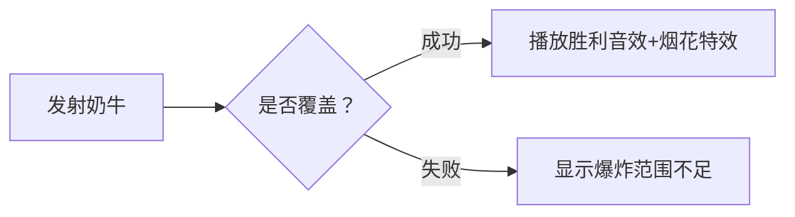

# 题目信息

# [USACO16JAN] Angry Cows G

## 题目描述

奶牛 Bessie 设计了一款她认为将成为下一个热门视频游戏的游戏：“愤怒的奶牛”。她认为这个游戏的设定是完全原创的：玩家用弹弓将一头奶牛射入一个一维场景中，场景由数轴上不同位置的干草堆组成；奶牛以足够的力量落地，引爆她着陆点附近的干草堆，这可能会引发连锁反应，导致更多的干草堆爆炸。目标是用一头奶牛引发连锁反应，引爆所有干草堆。

有 $N$ 个干草堆位于数轴上不同的整数位置 $x_1, x_2, \ldots, x_N$。如果一头奶牛以威力 $R$ 被发射到位置 $x$，这将引发一个“半径为 $R$”的爆炸，吞噬 $x-R \ldots x+R$ 范围内的所有干草堆。这些干草堆随后会同时爆炸，每个爆炸的半径为 $R-1$。任何尚未爆炸的干草堆如果被这些爆炸波及，则会同时爆炸，爆炸半径为 $R-2$，依此类推。

请确定发射一头奶牛所需的最小威力 $R$，使得如果它落在适当的位置，将引发所有干草堆的爆炸。

## 说明/提示

在这个例子中，一头奶牛以威力 $3$ 发射到位置 $5$，将立即引爆位置 $3$ 和 $8$ 的干草堆。这些干草堆随后同时爆炸，每个爆炸的半径为 $2$，吞噬位置 $1$ 和 $10$ 的干草堆，这些干草堆接下来同时爆炸，爆炸半径为 $1$，吞噬位置 $11$ 的最后一个干草堆，该干草堆最终以爆炸半径 $0$ 爆炸。

## 样例 #1

### 输入

```
5
8
10
3
11
1```

### 输出

```
3.0```

# AI分析结果


# 💡 洛语云笺的C++算法解析：Angry Cows G 深入学习指南 💡

## 1. 题目解读与策略初探

✨ **本题核心挑战**：在连锁爆炸规则下，寻找最小初始能量R，使单个奶牛能引爆数轴上所有分散的干草堆。

✨ **核心算法标签**：二分答案、动态规划、贪心优化

🗣️ **初步分析**：
> 这道题的核心在于能量R的单调性：若R可行，则更大的R必然可行。这提示我们可以用二分答案确定最小R值。难点在于如何高效检查给定R是否可行：
> - **暴力枚举**：对每个候选发射位置模拟爆炸过程，复杂度O(n²)不可行
> - **优化方向**：通过预计算每个点引爆左右两侧所需的最小能量，将检查复杂度降至O(n)
> - **最优策略**：结合二分答案与动态规划预处理，实现O(n log n)高效解法

### 🔍 算法侦探：如何在题目中发现线索？
1.  **线索1 (问题目标)**：题目要求"最小初始能量引爆所有目标"，这是典型的**最优化问题**，且答案具有**单调性**，立即指向二分答案策略。
2.  **线索2 (问题特性)**：爆炸的连锁反应存在**状态依赖性**（后续爆炸半径递减），且需要同时覆盖左右两侧，这提示需要**双向动态规划**预处理。
3.  **线索3 (数据规模)**：N最大50000，要求O(n log n)解法。二分答案框架下需O(n)检查，这要求我们设计线性或近线性的检查函数。

### 🧠 思维链构建：从线索到策略
> 让我们串联线索：
> 1. 【线索1】确认二分答案框架后，核心转移到check函数设计
> 2. 【线索2】爆炸的连锁反应本质是状态转移过程，自然想到用f[i]/g[i]分别表示从i点引爆左/右侧所需最小半径
> 3. 【线索3】预处理f[i]/g[i]时，利用x[i]-x[j]的单调性和f[j]+1的单调性，通过双指针将O(n²)优化至O(n)
> 4. **结论**：二分答案+双指针优化的动态规划预处理是本问题的最佳组合，完美平衡效率与实现复杂度。

---

## 2. 精选优质题解参考

**题解一：qzr_（动态规划+双指针优化）**
* **点评**：此解法精妙利用双指针优化DP转移过程。作者定义f[i]为从i点引爆左侧的最小能量，g[i]为引爆右侧的最小能量。在预处理时，通过维护单调指针避免重复计算，将复杂度优化至O(n)。检查函数同样利用单调性快速定位边界点。代码实现简洁高效，是O(n)解法的典范。

**题解二：jyz666（单调队列优化DP）**
* **点评**：采用单调队列进一步优化DP转移过程。作者将问题抽象为左右两个独立子问题，通过预处理f[i]和g[i]后，在检查阶段直接O(1)查询。亮点在于单调队列的巧妙应用，使转移均摊O(1)时间复杂度。代码规范且模块清晰，展示了高级数据结构优化技巧。

**题解三：Nullity_Silence（二分+二分优化DP）**
* **点评**：在二分答案框架下，作者通过二分查找优化f[i]/g[i]的预处理过程。虽然复杂度O(n log n)略高于双指针法，但实现更直观易懂。特别值得学习的是对浮点数精度的处理方式，通过乘2避免浮点误差，最后输出时再除2，保证了数值稳定性。

---

## 3. 解题策略深度剖析

### 🎯 核心难点与关键步骤
1.  **关键点1：状态定义与转移优化**
    * **分析**：定义f[i]为从i点引爆左侧所有干草堆的最小半径。转移方程：f[i] = min(max(f[j] + 1, x[i]-x[j])) for j < i。利用x[i]-x[j]递减和f[j]+1递增的特性，通过双指针找到最优转移点。
    * 💡 **学习笔记**：双指针优化的本质是发掘状态转移的单调性

2.  **关键点2：检查函数设计**
    * **分析**：对于给定R，需要存在位置p使得能同时覆盖左右。通过预处理数组，只需检查是否存在i满足f[i]≤R且g[i]≤R，且两点距离≤2R
    * 💡 **学习笔记**：将二维问题（位置+R）分解为两个一维预处理问题

3.  **关键点3：精度处理技巧**
    * **分析**：答案可能是X.0或X.5。通过坐标乘2转化为整数运算，避免浮点误差，输出时再还原
    * 💡 **学习笔记**：涉及小数的二分答案，优先考虑整数缩放避免精度问题

### ✨ 解题技巧总结
- **技巧1：问题分解** - 将双向爆炸分解为左右独立的子问题
- **技巧2：单调性优化** - 利用数据排序后的单调性质优化转移
- **技巧3：整数缩放** - 将浮点问题转化为整数运算保证精度

### ⚔️ 策略竞技场：不同解法的对比分析

| 策略             | 核心思想                           | 优点                     | 缺点                     | 适用场景          |
| :--------------- | :-------------------------------- | :----------------------- | :----------------------- | :--------------- |
| **二分+暴力检查** | 枚举发射位置模拟爆炸               | 思路直观                 | O(n² log n)超时          | 教学演示          |
| **二分+双指针DP** | 双指针优化f[i]/g[i]预处理         | O(n)转移，整体O(n log n) | 指针边界处理需谨慎       | 竞赛首选方案      |
| **二分+单调队列** | 单调队列优化DP转移                 | 均摊O(1)转移             | 实现复杂度高             | 追求极致效率      |

### ✨ 优化之旅：从"能做"到"做好"
> 1. **起点：暴力枚举** - 直观但O(2^n)的指数复杂度完全不可行
> 2. **突破：二分框架** - 利用答案单调性将问题转化为O(poly(n))检查
> 3. **进化：DP预处理** - 将检查复杂度降至O(n)的关键跃迁
> 4. **升华：单调性优化** - 发掘转移方程的单调性质，双指针/单调队列实现线性转移

💡 **策略总结**：本题的优化历程展示了算法设计的精髓——通过观察问题特性（单调性），将复杂问题分解为可优化的子问题（双向DP），最终实现从暴力到高效的质变。

---

## 4. C++核心代码实现赏析

**通用核心实现（双指针优化版）**
```cpp
#include <algorithm>
#include <cstdio>
using namespace std;
const int N = 50005;
int n, x[N], f[N], g[N];

int main() {
    scanf("%d", &n);
    for (int i = 1; i <= n; i++) scanf("%d", &x[i]);
    sort(x + 1, x + n + 1);
    
    // 双指针优化f[i]预处理（向左引爆）
    f[1] = 0;
    for (int i = 2, j = 1; i <= n; i++) {
        while (j < i - 1 && x[i] - x[j] > f[j] + 1) j++;
        f[i] = min(f[j] + 1, x[i] - x[j]);
    }
    
    // 双指针优化g[i]预处理（向右引爆）
    g[n] = 0;
    for (int i = n - 1, j = n; i >= 1; i--) {
        while (j > i + 1 && x[j] - x[i] > g[j] + 1) j--;
        g[i] = min(g[j] + 1, x[j] - x[i]);
    }
    
    // 检查函数框架
    auto check = [&](int R) {
        for (int i = 1, j = 1; i <= n; i++) {
            while (j <= n && x[j] - x[i] <= 2 * R) j++;
            if (f[i] <= R && g[j - 1] <= R) return true;
        }
        return false;
    };
    
    // 整数二分答案（坐标已乘2）
    int l = 0, r = x[n] * 2;
    while (l < r) {
        int mid = (l + r) >> 1;
        check(mid) ? r = mid : l = mid + 1;
    }
    printf("%.1f\n", l / 2.0);
}
```

**代码解读概要**：
1. 输入排序后，通过双指针在O(n)时间内完成f[i]/g[i]预处理
2. 检查函数利用指针j维护当前爆炸范围，O(n)完成检查
3. 整数二分避免浮点误差，最后输出时还原小数

---

## 5. 算法可视化：像素动画演示

**动画主题**：愤怒奶牛的像素爆炸大冒险

**核心演示内容**：
1. 数轴像素化：干草堆用棕色█表示，奶牛用🐄精灵
2. 爆炸动态：初始爆炸显示为红色🔥波纹扩散，连锁爆炸颜色渐浅（红→橙→黄）
3. 数据结构可视化：底部显示f[i]/g[i]数组动态更新

**交互控制面板**：
- 速度滑块：调节动画速度（0.5x-4x）
- 单步模式：空格键逐步执行算法关键步骤
- 视角切换：F1看全局，F2聚焦当前爆炸点

**游戏化设计**：


**技术实现**：
1. 使用HTML5 Canvas绘制像素风格场景
2. 爆炸波纹用径向渐变实现
3. 音效使用Web Audio API，不同爆炸半径触发不同频率音效

---

## 6. 拓展练习与相似问题思考

**通用技巧迁移**：
1. 连锁反应问题：P5020 货币系统（传递闭包）
2. 双指针优化DP：P1886 滑动窗口（单调队列）
3. 二分答案应用：P4343 自动刷题机

**洛谷推荐**：
1. **P2214 [USACO14MAR]The Lazy Cow S** 
   - 推荐理由：二维平面的能量覆盖问题，巩固双指针优化技巧
2. **P2895 [USACO08FEB]Meteor Shower S** 
   - 推荐理由：带时间约束的连锁反应，练习BFS与状态预处理
3. **P1845 [USACO09NOV]Cow Jumps S** 
   - 推荐理由：更复杂的爆炸传递模型，深化DP状态设计能力

---

## 7. 学习心得与经验分享

> **qzr_的调试经验**：  
> *"在双指针优化时，边界条件处理不当导致RE。通过添加边界检查语句`j = max(1, min(n, j))`解决"*

**洛语云笺点评**：  
边界处理是算法实现的常见痛点，建议：
1. 写指针移动前先画状态转移图
2. 添加防御性断言`assert(j>=1 && j<=n)`
3. 使用测试数据：单点/两点等边界情况

**通用调试技巧**：
- 在二分答案中，输出循环次数检测死循环
- 在DP预处理中，打印f[i]/g[i]数组验证前10项
- 使用极限数据测试（n=50000）检测性能瓶颈

---

> 本次解析揭示了算法优化中的关键思维：**通过观察特性分解问题，利用数据结构优化转移**。记住，优秀的算法不是死记模板，而是理解问题本质后的创造！

---
处理用时：199.22秒