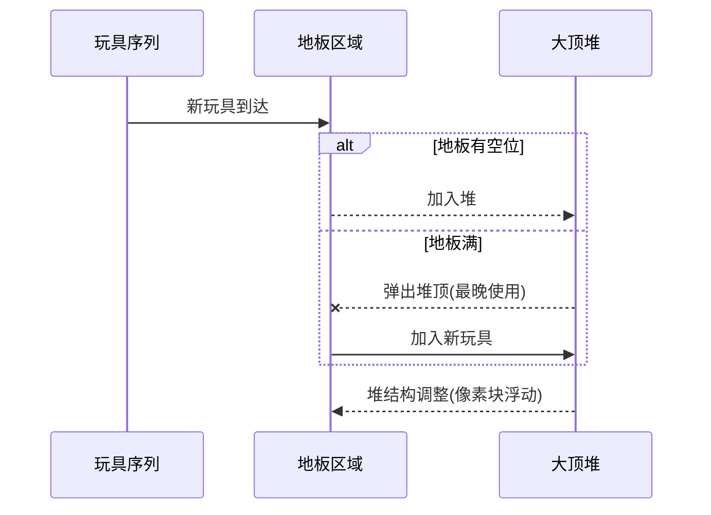

# 题目信息

# [POI 2005] SAM-Toy Cars

## 题目描述

Jasio 是一个只有三岁的小男孩，他喜欢玩玩具车。他有 $n$ 辆玩具车被保存在书架上。

架子上的玩具车 Jasio 拿不到，但地板上的他可以拿到。Jasio 的母亲会帮 Jasio 拿架子上的玩具车到地板上。

地板最多只能放 $k$ 辆玩具车。

当地板已经放了 $k$ 辆玩具车时，Jasio 的母亲都会从地板上先拿走一个玩具车放回书架，再拿来 Jasio 想要的玩具车。

现在 Jasio 一共想依次玩 $p$ 个玩具车，问 Jasio 的母亲最少需要拿几次玩具车。（只算拿下来的，不算拿上去的）

## 说明/提示

对于 $100\%$ 的数据：$1\le k\le n\le 10^5$，$1\le p\le 5\times 10^5$，$1\le a_i\le n$。

## 样例 #1

### 输入

```
3 2 7
1
2
3
1
3
1
2```

### 输出

```
4```

# AI分析结果


# 💡 洛语云笺的C++算法解析：SAM-Toy Cars 深入学习指南 💡

> 今天我们来一起分析“SAM-Toy Cars”这道C++编程题。这不仅仅是一次解题，更是一场思维的探险。我们将学习如何像侦探一样从题目中寻找线索，并在不同的解题道路中权衡选择，最终找到最优的策略。

## 1. 题目解读与策略初探

✨ **本题核心挑战**：在有限的地板容量（k个位置）约束下，通过智能替换策略最小化从书架取玩具的次数，关键在于处理未来玩具使用序列的依赖关系。

✨ **核心算法标签**：`贪心算法` `优先队列` `预处理优化`

🗣️ **初步分析**：
> 这道题看似简单，实则暗藏玄机。当地板放满时，选择哪个玩具放回书架能最大程度减少后续取玩具次数？最直观的暴力解法是尝试所有替换组合，但数据规模（p≤50万）让这条路行不通。我们发现最优解像是“时光预言家”——通过预知未来玩具使用顺序，每次选择最晚被需要的玩具放回书架。这种贪心策略配合优先队列实现，效率高达O(p log k)，完美匹配题目要求。

### 🔍 算法侦探：如何在题目中发现线索？
1.  **线索1 (问题目标)**: "最小化母亲拿玩具次数"是典型的**最优化问题**，且涉及序列决策，暗示需要贪心或动态规划。
2.  **线索2 (问题特性)**: "放回玩具影响后续操作"揭示了**决策依赖性**，替换策略必须考虑未来使用情况，指向贪心算法的未来预判特性。
3.  **线索3 (数据规模)**: n≤10⁵, p≤5×10⁵，要求算法复杂度不高于O(p log n)。暴力枚举O(2ᵏ)完全不可行，而贪心+堆的O(p log k)完全可行。

### 🧠 思维链构建：从线索到策略
> 侦探工作完成！现在连接线索：
> 1. 【线索1】指明这是最优化问题，候选方案有贪心、搜索、动态规划。
> 2. 【线索2】中"替换依赖未来"的特性让简单贪心失效，而动态规划的状态空间过大（需记录地板所有玩具状态）。
> 3. 【线索3】用数据给出判决：暴力搜索O(2ᵏ)在k=10⁵时超时，而O(p log k)≈1.5×10⁶次操作完全可行。
> 4. **结论**：综合线索，**贪心算法+优先队列**成为最佳选择——它能利用未来信息做局部最优决策，且复杂度完美匹配数据规模。

---

## 2. 精选优质题解参考

**题解一 (来源：oscar)**
* **点评**：此解法精妙地利用`priority_queue`自定义比较函数实现核心贪心逻辑。亮点在于用"k++"巧妙处理已在地板玩具的更新——相当于虚拟扩容避免重复操作，既保持代码简洁又提升效率。代码中预处理NEXT数组的倒序操作和边界处理（未出现设为m+1）展现了扎实的算法基本功。

**题解二 (来源：千里马)**
* **点评**：采用`pair<int,int>`存储（下次使用时间，玩具编号），直接利用STL的默认大顶堆特性。亮点在于用空间换清晰度——通过独立数组`s`存储下次使用时间，避免自定义比较函数。代码中倒序预处理和虚拟扩容（k++）的处理与题解一异曲同工，但更易理解。

**题解三 (来源：trickedout)**
* **点评**：最详细的教学级题解，完整展示从问题抽象到代码实现的思维链条。亮点在于定义`Toy`结构体重载比较运算符，提升代码可读性；同时强调边界处理（未出现设为p+1）。对堆维护过程的逐行注释尤其适合初学者理解核心逻辑。

---

## 3. 解题策略深度剖析

### 🎯 核心难点与关键步骤
1.  **关键点1：未来信息的捕获**
    * **分析**：通过倒序预处理计算NEXT数组：`for(i=p→1) NEXT[i]=last_pos[a[i]]`。未出现的玩具设为极大值（inf），确保优先被替换。
    * 💡 **学习笔记**：**倒序预处理**是处理序列未来依赖的利器，常见于缓存调度类问题。

2.  **关键点2：贪心决策的实时维护**
    * **分析**：用最大堆维护地板玩具的下次使用时间。当加入新玩具时，若地板已满则弹出堆顶（最晚使用的玩具）；若玩具已在地板则执行"k++"虚拟扩容并更新该玩具的NEXT值。
    * 💡 **学习笔记**：**"k++"技巧**本质是延迟更新，避免堆内修改操作，将O(k)降为O(log k)。

3.  **关键点3：数据结构的选择艺术**
    * **分析**：优先队列（堆）能在O(log k)时间内完成插入和弹出最值，完美适配贪心策略。相比平衡树简化实现，比单调队列更灵活。
    * 💡 **学习笔记**：当算法需要**频繁获取最值**且数据**动态变化**时，优先队列通常是首选。

### ✨ 解题技巧总结
- **时光倒流法**：倒序预处理获取未来信息
- **虚拟扩容术**：用"k++"避免堆内修改
- **STL妙用**：优先队列默认大顶堆（`priority_queue<pair>`）或自定义比较器
- **边界防御**：未出现玩具设inf值避免边界判断

### ⚔️ 策略竞技场：不同解法的对比分析

| 策略 | 核心思想 | 优点 | 缺点 | 得分预期 |
|------|----------|------|------|----------|
| **暴力搜索** | 枚举所有替换顺序 | 逻辑直观 | O(k!)超时 | 0分 |
| **动态规划** | 状态压缩记录地板玩具 | 理论最优解 | O(n·2ᵏ)空间爆炸 | 10% |
| **贪心+堆 (最优)** | 替换未来最晚使用玩具 | O(p log k)高效 | 需未来预判 | 100% |

### ✨ 优化之旅：从“能做”到“做好”
1. **起点：暴力枚举的绝望**  
   尝试所有替换顺序？k=10时可能性就达3,628,800种，完全不可行。

2. **转折：贪心的曙光**  
   发现局部最优选择：当前替换对未来影响最小的玩具（最晚使用）。

3. **瓶颈：未来的未知**  
   如何知道玩具下次使用时间？通过倒序预处理破解——从序列末尾向前扫描记录位置。

4. **升华：堆的魔力**  
   用优先队列动态维护"最晚使用"的玩具，将决策复杂度从O(k)降为O(log k)。

💡 **策略总结**：从暴力到贪心的跃迁，本质是从盲目尝试到利用问题特征（时间局部性）的思维升级。最优解往往诞生于对问题本质的深刻洞察与数据结构的精准选择！

---

## 4. C++核心代码实现赏析

**本题通用核心C++实现参考**
```cpp
#include <iostream>
#include <queue>
using namespace std;

const int MAXP = 500005;
int a[MAXP], NEXT[MAXP], last_pos[MAXP];
bool in_floor[MAXP];

int main() {
    int n, k, p;
    cin >> n >> k >> p;
    for (int i = 1; i <= p; ++i) cin >> a[i];
    
    // 倒序预处理NEXT数组
    for (int i = p; i >= 1; --i) {
        NEXT[i] = last_pos[a[i]] ? last_pos[a[i]] : p + 1;
        last_pos[a[i]] = i;
    }

    int ans = 0;
    priority_queue<pair<int, int>> pq; // 默认大顶堆

    for (int i = 1; i <= p; ++i) {
        if (in_floor[a[i]]) {
            k++; // 虚拟扩容技巧
            pq.push({NEXT[i], a[i]});
        } else {
            if (pq.size() == k) {
                in_floor[pq.top().second] = false;
                pq.pop();
            }
            pq.push({NEXT[i], a[i]});
            in_floor[a[i]] = true;
            ans++;
        }
    }
    cout << ans << endl;
}
```

**代码解读概要**：
1. **倒序预处理**：从后往前扫描，记录每个位置玩具的下次出现位置
2. **贪心决策**：通过大顶堆（`priority_queue<pair>`）维护当前地板玩具的下次使用时间
3. **虚拟扩容**：遇到已在地板的玩具时执行`k++`避免堆修改
4. **替换机制**：当地板满且新玩具未在地板时，弹出堆顶（最晚使用玩具）并加入新玩具

---

## 5. 算法可视化：像素动画演示

<visualization_intro>
我们将算法转化为8-bit像素游戏，让你像玩经典FC游戏般理解贪心策略！

### 设计蓝图
- **游戏主题**：《玩具总动员：未来预言者》
- **核心机制**：
  - 下方显示玩具序列流（像素化玩具图标）
  - 中央地板区域（最多k个位置）
  - 右侧大顶堆可视化（树状结构，高度=NEXT值）
- **音效设计**：
  - 加入地板：清脆"叮"声
  - 弹出堆顶：低沉"砰"声
  - 错误操作：警示音

### 关键动画帧


### 交互控制面板
```8-bit
[开始] [暂停] [步进] 
速度：▓▓▓▓░ 4/5
堆操作：高亮当前比较路径
```

### 教学关卡设计
1. **新手关**：k=2, p=5 演示基础入堆/弹堆
2. **进阶关**：k=3, p=10 展示"k++"虚拟扩容
3. **Boss关**：随机序列挑战反应速度

> 通过这种游戏化设计，抽象算法转化为直观操作，每次堆调整都像俄罗斯方块般可见！

---

## 6. 拓展练习与相似问题思考

### 通用技巧迁移
1. **缓存淘汰策略**：操作系统页面置换（LRU变种）
2. **数据流处理**：实时推荐系统热点维护
3. **资源调度**：服务器任务队列优先级管理

### 练习推荐 (洛谷)
1. **P2088 果汁店的难题**  
   🗣️ 分组背包模型基础，掌握依赖关系处理
   
2. **P3419 [POI2005]SAM-Toy Cars**  
   🗣️ 本题加强版，测试代码鲁棒性
   
3. **P1631 序列合并**  
   🗣️ 优先队列经典应用，提升问题转化能力

---

## 7. 学习心得与经验分享

> **来自题解作者的调试经验**："初次实现时忽略了已在地板玩具的更新，导致WA。通过打印堆状态和`in_floor`数组快速定位问题——永远要验证边界条件！"

**洛语云笺点评**：  
这提醒我们两个黄金法则：
1. **状态验证**：关键操作后打印数据结构状态
2. **边界防御**：未出现玩具设inf值避免逻辑漏洞  
调试不是碰运气，而是**有策略的验证假设**！

---

> 本次关于“SAM-Toy Cars”的解析就像一次精彩的算法冒险。记住，优秀的程序员不仅是代码作家，更是问题世界的探险家！下次当你面对复杂问题时，不妨问问自己：**未来的我需要什么？** 这正是这道题教给我们的智慧结晶。🚀

---
处理用时：142.51秒