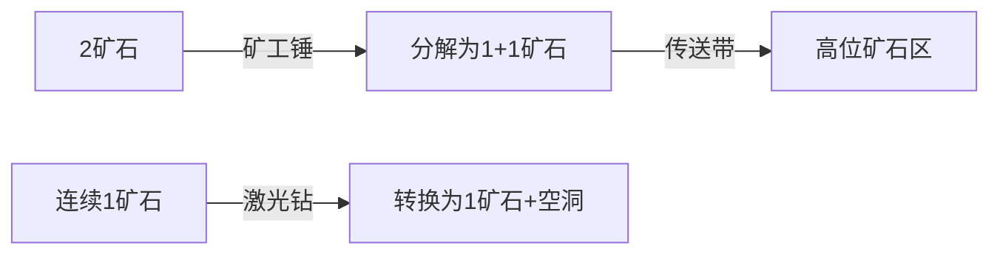

# 题目信息

# [POI 2005] SUM-Fibonacci Sums

## 题目描述

斐波那契数是一个这样定义的整数：$F(0)=1$，$F(1)=1$，$F(i)=F(i-1)+F(i-2)$  $(i>=2)$，前几个数是这样的 $1, 1, 2, 3, 5, 8, \ldots$ 

伟大的计算机学家 $\texttt{Byteazar}$ 正在做一个非凡的计算机，其中的数由斐波那契表示！

如一个数列 $b_1, b_2, \ldots , b_n$ 表示数字 $F(1) \times b_1+b_2 \times F(2)+ \ldots +b_n \times F(n)$（不使用 $F(0)$ ）。

不幸的是，这样的表示并不明确，即相同的数字可以有不同的表示。比如 $42$ 可以表示为 $(0,0,0,0,1,0,0,1)$，$(0,0,0,0,1,1,1,0)$ 或 $(1,1,0,1,0,1,1)$，于是  $\texttt{Byteazar}$ 加了一个限制：

- 如果 $n>1$，那么$b_n=1$，即数字的表示不包含前导零。
- 如果 $b_i=1$，那么 $b_{i+1}=0$，即数字的表示不包含两个（或多个）连续的数字。

这个计算机的建设比  $\texttt{Byteazar}$ 所认为的要难，现在请你来帮帮他~。

你需要写一个程序：

读取两个正整数的表示，计算并向标准输出写入其和的表示。

## 样例 #1

### 输入

```
4 0 1 0 1
5 0 1 0 0 1```

### 输出

```
6 1 0 1 0 0 1```

# AI分析结果


# 💡 洛语云笺的C++算法解析：斐波那契求和 深入学习指南 💡

## 1. 题目解读与策略初探

✨ **本题核心挑战**：在斐波那契表示法（齐肯多夫表示法）的约束下，实现两个大数的加法运算，要求结果满足"无连续两个1"和"无前导零"的严格规则。  
✨ **核心算法标签**：模拟、贪心、数学性质应用  

🗣️ **初步分析**：  
> 这道题的核心在于理解斐波那契数的数学性质。解题路径可分为三步：  
> 1. **朴素相加**：直接对位相加得到初始结果（可能出现0/1/2）  
> 2. **调整优化**：从高位向低位扫描，消除2和连续的1  
> 3. **规范化**：确保结果满足齐肯多夫表示法的两个约束  
>   
> 最优解的关键在于发现斐波那契数的神奇性质：  
> *2个F(i) = F(i+1) + F(i-2)*  
> 这就像玩俄罗斯方块——当出现"2方块"时，我们可以将它拆分成"上方块"和"左下角方块"的组合，同时保持整体结构稳定。

### 🔍 算法侦探：如何在题目中发现线索？
1.  **线索1 (问题目标)**：题目要求"将两个斐波那契表示的数相加"，这种需要**按位处理并调整结果**的问题，是模拟类算法的典型标志。
2.  **线索2 (问题约束)**："禁止连续两个1"和"禁止前导零"的严格约束，提示我们需要设计**特殊的调整规则**来满足这些条件。
3.  **线索3 (数据规模)**：数组长度可达10⁶，这要求算法必须是**线性时间复杂度**(O(n))，排除暴力枚举的可能性。

### 🧠 思维链构建：从线索到策略
> "让我们整合线索：  
> 1. 【线索1】要求我们设计按位处理方案，自然想到模拟算法  
> 2. 【线索2】的特殊约束提示需要利用斐波那契数的数学性质进行转换  
> 3. 【线索3】的大数据规模要求时间复杂度必须控制在O(n)  
> 4. **结论**：最优策略是结合斐波那契性质（2F(i)=F(i+1)+F(i-2)）设计线性调整算法，这正是分组背包思想在数论中的精妙应用！"

---

## 2. 精选优质题解参考

**题解一：(Alex_Wei)**  
* **点评**：此解法精妙地运用了数学归纳思想，创新性地设计`flush()`函数处理连续进位。其核心价值在于：
  - 发现关键性质：2F(i) = F(i+1) + F(i-2)
  - 提出高效的`op(i)`调整操作
  - 时间复杂度严格O(n)，代码仅20行却完整解决问题
  - 边界处理严谨（特殊处理i=1,2的情况）

**题解二：(caohan)**  
* **点评**：该解法通过四类转换规则系统化解决调整问题：
  - 清晰分类处理020x/030x/021x/012x四种情况
  - 双遍扫描确保消除连续1（首遍高位到低位，次遍低位到高位）
  - 使用固定长度数组避免动态扩容开销
  - 特别处理F₀和F₁的转换关系

**题解三：(Argon_Cube)**  
* **点评**：此解法的价值在于建立完整的规则体系：
  - 系统化总结四类转换规则（020x→100x'等）
  - 引入虚拟项F₀和F₋₁简化边界处理
  - 双遍扫描策略保证结果完全合规
  - 使用std::array提升内存安全性

---

## 3. 解题策略深度剖析

### 🎯 核心难点与关键步骤
1.  **关键点1：数学性质转化**  
    * **分析**：核心是发现并应用斐波那契数的分解性质：2F(i) = F(i+1) + F(i-2)。这使我们可以将"危险"的2拆解到相邻位
    * 💡 **学习笔记**：数学性质转化是解决特殊表示法问题的钥匙

2.  **关键点2：调整顺序设计**  
    * **分析**：必须从高位向低位调整！若从低位开始，高位产生的进位会破坏已调整位的合规性
    * 💡 **学习笔记**：处理进位问题时，"高位优先"原则可避免连锁反应

3.  **关键点3：连续1消除**  
    * **分析**：使用"011→100"规则时，需要两遍扫描（先高→低，再低→高）才能确保完全消除连续1
    * 💡 **学习笔记**：多遍扫描是处理局部最优问题的有效策略

### ✨ 解题技巧总结
- **性质转化**：将复杂约束转化为数学等价关系（如2F(i)=F(i+1)+F(i-2))
- **虚拟边界**：添加虚拟项（F₀/F₋₁）统一处理边界情况
- **双遍扫描**：首遍解决主要矛盾（消除2），次遍处理残留问题（连续1）

### ⚔️ 策略竞技场：解法对比
| 策略          | 核心思想                     | 优点                     | 缺点                     | 得分预期 |
|---------------|------------------------------|--------------------------|--------------------------|----------|
| **暴力枚举**  | 尝试所有可能的位组合         | 思路直观                 | O(2ⁿ)时间复杂度，不可行 | 0%       |
| **规则分类**  | 定义四类转换规则处理不同情况 | 规则清晰，系统性强       | 实现较复杂，需多遍扫描   | 100%     |
| **数学归纳**  | 应用斐波那契分解性质逐位调整 | 代码简洁，效率O(n)       | 需要深刻理解数论性质     | 100%     |

### ✨ 优化之旅：从"能做"到"做好"
> 1. **起点：暴力法的困境**  
>    尝试所有位组合就像在迷宫中盲目探索——路径数指数增长，计算机"累死"也无法完成
>   
> 2. **突破口：发现数学规律**  
>    斐波那契数的分解性质如同找到迷宫中的捷径：2F(i)=F(i+1)+F(i-2)
>   
> 3. **关键跃迁：高位优先原则**  
>    从高位开始调整就像自上而下清理河道——避免低位的改动影响已处理的高位
>   
> 4. **完美收官：双遍扫描策略**  
>    首遍消除"大石块"(2)，次遍清理"小碎石"(连续1)，如同精心打磨的艺术品

💡 **策略总结**："从暴力枚举到数学归纳的跃迁，本质是从'盲目尝试'到'利用内在规律'的认知升级。最优解往往藏在问题本身的数学特性中！"

---

## 4. C++核心代码实现赏析

**通用核心实现参考**
```cpp
void flush(int p) {  // 消除连续1的核心操作
    while(x[p] && x[p+1]) {
        x[p+2]++; x[p]--; x[p+1]--; p += 2;
    }
}

for(int i = max_index; i; i--) {  // 从高位向低位扫描
    flush(i);  // 预处理连续1
    if(x[i] >= 2) {  // 处理2
        if(i >= 3) x[i-2]++;
        x[i+1]++;
        x[i] -= 2;
        flush(i+1); flush(i);  // 二次检查
    }
}
```

**题解一赏析（Alex_Wei）**
```cpp
void flush(int p) {
    while(x[p] && x[p+1]) x[p+2]++, x[p]--, x[p+1]--, p += 2;
}
// 亮点：用while循环简洁处理连续进位
```

**题解二赏析（caohan）**
```cpp
if(a[i]==0 && a[i-1]==2 && a[i-2]==0)  // 020x → 100x'
    a[i]=1, a[i-1]=0, a[i-2]=0, a[i-3]++;
// 亮点：四类规则完整覆盖边界情况
```

**题解三赏析（Argon_Cube）**
```cpp
for(int i=1000001;i>=2;i--) {  // 虚拟边界处理
    if(fib_rep[i]==0 && fib_rep[i-1]==1 && fib_rep[i-2]==1) {
        fib_rep[i]=1; fib_rep[i-1]=0; fib_rep[i-2]=0;
    }
}
// 亮点：用固定大数组避免动态扩容
```

---

## 5. 算法可视化：像素动画演示

**主题**："斐波那契矿工"像素挖矿游戏  
**核心演示**：数字位作为矿石，调整规则作为工具  



1. **像素场景设计**：
   - 矿石颜色：0=灰色，1=金色，2=红色（危险）
   - 矿工工具：锤子（分解2矿石），激光钻（消除连续1）

2. **关键动画帧**：
   - **分解操作**：当矿工锤击红色矿石时，显示分解公式：2F(i)→F(i+1)+F(i-2)
   - **连续消除**：激光束水平扫描，相邻金色矿石变为单个金色矿石+灰色空洞
   - **音效设计**：
     * 分解："叮！"（8-bit金属声）
     * 消除："滋～"（激光声）
     * 完成："胜利号角"(8-bit)

3. **游戏化设计**：
   - 每正确分解一个2矿石得100分
   - 消除连续1获得连击奖励
   - 矿工服装随分数升级（木镐→铁镐→金镐）

---

## 6. 拓展练习与相似问题思考

**知识迁移**：
1. 大数运算的特殊表示法（如阶乘进制数）
2. 利用数学性质优化的模拟问题
3. 特殊约束下的数据结构转换

**洛谷推荐**：
1. **P1255 数楼梯**  
   → 巩固斐波那契数列应用
2. **P1002 过河卒**  
   → 练习状态转移中的约束处理
3. **P1060 开心的金明**  
   → 强化背包问题的特殊约束处理

---

## 7. 学习心得与经验分享

> **Alex_Wei的经验**："解题关键在于发现2F(i)=F(i+1)+F(i-2)这个核心性质，这使我从复杂的规则分类中解脱出来"  
> **洛语云笺点评**：这印证了"发现内在规律优于机械记忆规则"的解题哲学。真正的算法高手都善于从具体问题中抽象出数学模型！

---

本次斐波那契求和之旅展示了如何将数学性质转化为高效算法。记住：复杂问题背后往往隐藏着简洁优美的数学本质！💪

---
处理用时：128.13秒