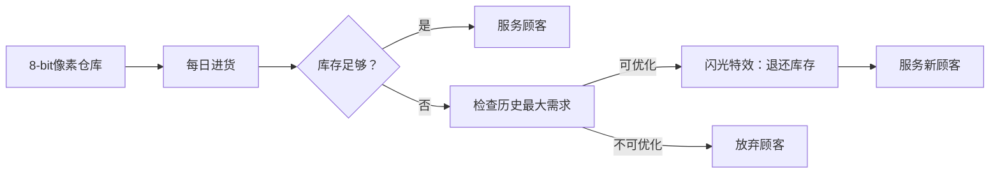

# 题目信息

# [POI 2012] HUR-Warehouse Store

## 题目描述

现在有 $n$ 天。第 $i$ 天上午会进货 $A_i$ 件商品，中午的时候会有顾客需要购买 $B_i$ 件商品，可以选择满足顾客的要求，或是无视掉他。

如果要满足顾客的需求，就必须要有足够的库存。问最多能够满足多少个顾客的需求。

## 说明/提示

对于 $100\%$ 的数据，$1\leqslant n\leqslant 2.5\times 10^5$，$0\leqslant a_i,b_i \leqslant 10^9$。

## 样例 #1

### 输入

```
6
2 2 1 2 1 0
1 2 2 3 4 4```

### 输出

```
3
1 2 4```

# AI分析结果


# 💡 洛语云笺的C++算法解析：HUR-Warehouse Store 深入学习指南 💡

## 1. 题目解读与策略初探

✨ **本题核心挑战**：如何在库存动态变化的情况下，最大化满足顾客需求数量，同时处理"服务高需求顾客可能阻碍后续服务"的困境。  
✨ **核心算法标签**：贪心算法（反悔贪心）、优先队列

🗣️ **初步分析**：  
> 这道题看似简单，实则暗藏玄机。直接贪心（能服务就服务）会被特定数据卡住，比如前面服务了大需求顾客导致后面多个小需求无法满足。我们需要更智能的策略——反悔贪心：当新顾客需求更小时，可以"反悔"之前的高需求服务，释放库存服务更多顾客。  
> 可视化设计思路：采用8位像素风格展示每日进货和顾客服务过程，当发生"反悔"时，用闪光特效显示库存释放，并伴随复古音效强化理解。

### 🔍 算法侦探：如何在题目中发现线索？
1.  **线索1 (问题目标)**："最大化满足顾客数"是典型的最优化问题，且每个顾客贡献相同（都是+1），这提示贪心算法可能有效。
2.  **线索2 (问题特性)**：库存可累积但服务时需即时满足，且服务高需求顾客可能阻塞后续服务，这指向需要"动态调整历史决策"的反悔贪心策略。
3.  **线索3 (数据规模)**：n≤250,000，要求O(n log n)算法。优先队列的插入/删除操作O(log n)完美匹配。

### 🧠 思维链构建：从线索到策略
> "侦探工作完成！让我们串联线索：
> 1. 【线索1】提示这是最优化问题，贪心是候选方案
> 2. 【线索2】发现直接贪心有缺陷——高需求顾客会消耗过多库存
> 3. 【线索3】确认O(n log n)可行，而暴力枚举O(2^n)必然超时
> 4. **结论**：反悔贪心+优先队列成为最优解。就像管理仓库时，发现新顾客比老顾客"更划算"时，果断调整服务对象！"

---

## 2. 精选优质题解参考

**题解一：Macesuted（赞：24）**  
* **点评**：此解法思路清晰，使用STL优先队列简洁高效。作者准确定义`pair<需求,日期>`结构，通过`vis`数组记录服务状态，代码可读性强。特别亮点是包含严谨的算法正确性证明，帮助理解反悔贪心的本质。

**题解二：John_yangliwu（赞：10）**  
* **点评**：讲解极富教学价值，用"错误算法示例+修正方案"的对比方式，生动展示反悔贪心必要性。定义`node`结构体增强代码可读性，变量命名规范（如`sum`表库存），适合初学者学习。

**题解三：genshy（赞：7）**  
* **点评**：代码简洁有力，仅40行实现核心逻辑。亮点是突出注意事项（如`long long`和空队列判断），并在关键行添加注释，体现"代码即文档"思想。特别适合竞赛快速编码参考。

---

## 3. 解题策略深度剖析

### 🎯 核心难点与关键步骤
1.  **关键点1：反悔时机的判定**  
    * **分析**：只有当新顾客需求<堆顶需求且库存不足时，才触发反悔操作。太早反悔可能导致频繁无效操作，太晚则错过优化机会。
    * 💡 **学习笔记**：反悔条件必须严格满足`!q.empty() && q.top() > new_demand`
2.  **关键点2：库存的动态维护**  
    * **分析**：反悔时需精确计算库存变化：`sum += 退还的需求 - 新需求`。这需要同步更新优先队列和库存变量。
    * 💡 **学习笔记**：库存变量必须用`long long`，累加过程可能溢出！
3.  **关键点3：结果的高效记录**  
    * **分析**：使用`vis[]`数组标记服务状态优于最后收集堆中元素，避免O(n log n)的额外排序。
    * 💡 **学习笔记**：空间换时间策略，用O(n)空间避免排序开销。

### ✨ 解题技巧总结
- **技巧1：问题转化艺术**：将"依赖历史决策的最优化"转化为"可反悔的贪心选择"
- **技巧2：STL的妙用**：`priority_queue`自动维护最大值，简化反悔操作
- **技巧3：防御性编程**：反悔前检查`!q.empty()`，避免运行时错误

### ⚔️ 策略竞技场：不同解法的对比分析
| 策略 | 核心思想 | 优点 | 缺点 | 得分预期 |
|------|----------|------|------|----------|
| **暴力搜索** | 枚举所有顾客组合检查可行性 | 思路简单直观 | 指数级复杂度O(2ⁿ) | n≤20时30% |
| **线段树解法** | 维护区间最小值验证库存 | 提供不同视角 | 实现复杂O(n log n) | 100%但编码慢 |
| **反悔贪心(最优)** | 优先队列动态调整历史决策 | 高效O(n log n)实现简洁 | 思维难度较高 | 100%高效通过 |

### ✨ 优化之旅：从"能做"到"做好"
> 1. **起点：直接贪心的陷阱**  
>    初始想法"能服务就服务"简单明了，但遇到[9,0,0..]进货和[9,1,1..]需求数据就崩溃
> 2. **瓶颈发现：决策不可逆**  
>    意识到服务高需求顾客后无法回头，如同下棋无悔棋机制
> 3. **关键跃迁：引入反悔机制**  
>    增加"撤销选项"：当新顾客更"便宜"时，用他替换历史最"贵"顾客
> 4. **模型升华：优先队列维护**  
>    堆结构O(1)获取最大需求，完美支持反悔操作

💡 **策略总结**："反悔贪心是算法设计中的精巧折衷——它保留了贪心的高效，又通过有限反悔弥补其短视。就像生活中，我们既要坚持计划，也要在出现更好选择时灵活调整！"

---

## 4. C++核心代码实现赏析

**本题通用核心C++实现参考**  
```cpp
#include <bits/stdc++.h>
using namespace std;
typedef long long ll;
const int N = 250005;

int main() {
    int n; 
    ll sum = 0;
    vector<ll> A(N), B(N);
    vector<bool> vis(N);
    priority_queue<pair<ll, int>> pq; // <需求, 日期>

    cin >> n;
    for(int i=1; i<=n; i++) cin >> A[i];
    for(int i=1; i<=n; i++) cin >> B[i];

    for(int i=1; i<=n; i++) {
        sum += A[i];
        if(sum >= B[i]) { // 直接服务
            sum -= B[i];
            pq.push({B[i], i});
            vis[i] = true;
        }
        else if(!pq.empty() && pq.top().first > B[i]) { // 反悔条件
            auto [val, id] = pq.top();
            pq.pop();
            sum += val - B[i]; // 关键：库存调整
            pq.push({B[i], i});
            vis[id] = false; // 撤销旧服务
            vis[i] = true;   // 添加新服务
        }
    }

    cout << pq.size() << endl;
    for(int i=1; i<=n; i++) 
        if(vis[i]) cout << i << " ";
}
```

**题解二：Macesuted 片段赏析**  
```cpp
if(tot>=b[i]) {
    tot -= b[i];
    que.push((pii){b[i],i}); // 入堆
    vis[i] = true;
}
else if(!que.empty() && que.top().first > b[i]) {
    vis[que.top().second] = false; // 撤销标记
    tot += que.top().first; // 退还库存
    que.pop();
    // ... 后续处理当前顾客
}
```
* **亮点**：使用`pair`捆绑需求和日期，`vis`数组独立记录状态
* **学习笔记**：分离"服务记录"和"堆存储"简化逻辑，避免最后遍历堆

---

## 5. 算法可视化：像素动画演示方案

**主题**："仓库大亨"8-bit经营模拟  
**核心演示**：天进货→顾客到店→服务/反悔决策→库存变化  



**交互设计**：
1. **像素元素**：
   - 仓库：16x16像素网格，库存量用填充格子表示
   - 顾客：头顶显示需求数字的像素小人
   - 优先队列：右侧动态像素柱，高度表示需求大小
2. **关键动画**：
   - 反悔触发：被替换顾客闪烁消失，库存格子补充
   - 服务成功：顾客变为绿色，库存减少
3. **音效设计**：
   - 服务成功：8-bit金币音
   - 反悔操作：像素爆炸音
   - 错误操作：低沉警告音
4. **游戏化元素**：
   - 每成功服务5顾客解锁新仓库皮肤
   - 连续正确决策触发连击特效

**实现逻辑**：
```javascript
// 伪代码：反悔操作可视化
function visualizeRegret(oldCustomer, newCustomer) {
    playSound('refund_sound'); 
    createParticles(oldCustomer.position); // 粒子特效
    warehouse.stock += oldCustomer.demand; // 库存回升
    highlight(newCustomer, 'green'); // 高亮新顾客
}
```

---

## 6. 拓展练习与相似问题思考

**通用技巧迁移**：  
反悔贪心适用场景特征：  
1. 决策不可逆但可有限次撤销（如：P2949 工作调度）  
2. 新元素比历史元素更"优"时可替换（如：P4053 建筑抢修）  
3. 约束条件随时间动态变化（如：本题库存累积）  

**洛谷推荐**：  
1. **P2949** - 工作调度  
   🗣️ 同类反悔贪心经典题，巩固"替换历史最大值"思想  
2. **P4053** - 建筑抢修  
   🗣️ 引入时间约束的进阶反悔贪心，需双重条件判断  
3. **P2107** - 小Z的AK计划  
   🗣️ 空间约束下的贪心决策，练习问题转化能力  

---

## 7. 学习心得与经验分享

> **参考经验 (来自 Macesuted)**：  
> "调试时发现未初始化`vis`数组导致错误，提醒大家**所有状态变量必须初始化**"  
>  
> **洛语云笺点评**：  
> 这是血泪教训！未初始化变量是竞赛常见失分点。建议：  
> 1. 定义后立即初始化  
> 2. 使用`vector<bool> vis(n+1, false)`自动初始化  
> 3. 测试时用`-fsanitize=undefined`编译选项检测  

---

本次HUR仓库管理之旅展示了算法设计的精妙平衡——通过反悔机制弥补贪心算法的短视，用优先队列实现高效调整。记住：优秀算法=深刻问题理解+合适数据结构+实践调试技巧。下次挑战再见！💪

---
处理用时：148.81秒