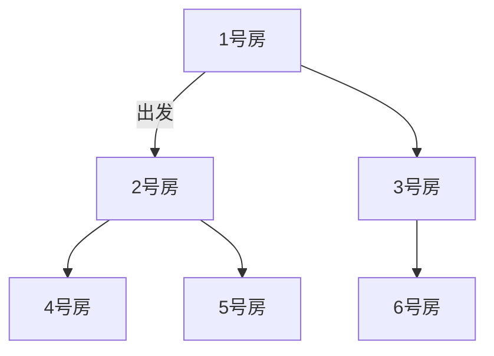

# 题目信息

# [POI 2014] FAR-FarmCraft

## 题目描述

在一个叫做比特村的小村庄中，有 $n-1$ 条路连接着这个村庄中的全部 $n$ 个房子。

每两个房子之间都有一条唯一的通路。这些房子的编号为 $1$ 至 $n$。

$1$ 号房子属于村庄的管理员比特安萨尔。

为了提升村庄的科技使用水平，$n$ 台电脑被快递到了比特安萨尔的房子。每个房子都应该有一台电脑，且分发电脑的任务就落在了比特安萨尔的肩上。

比特村的居民一致同意去玩农场物语这个游戏的最新快照版，而且好消息是他们很快就要得到他们最新的高配置电脑了。

比特安萨尔将所有电脑都装在了他的卡车上，而且他准备好完成这个艰巨的任务了。

**他的汽油恰好够走每条路两遍。**

在每个房子边，比特安萨尔把电脑贴心的配送给居民，且立即前往下一个房子。（配送过程不花费任何时间）

只要每间房子的居民拿到了他们的新电脑，它们就会立即开始安装农场物语。安装农场物语所用的时间根据居民的科技素养而定。幸运的是，每间房子中居民的科技素养都是已知的。

在比特安萨尔配送完所有电脑后，他会回到他自己的 $1$ 号房子去安装他自己的农场物语。

用卡车开过每条路的时间恰好是 $1$ 分钟，而居民开电脑箱的时间可以忽略不计。（因为他们太想玩农场物语了）

请你帮助比特安萨尔算出从开始配送到所有居民都玩上了农场物语的最少时间。

## 样例 #1

### 输入

```
6
1 8 9 6 3 2
1 3
2 3
3 4
4 5
4 6
```

### 输出

```
11
```

# AI分析结果


# 💡 洛语云笺的C++算法解析：FAR-FarmCraft 深入学习指南 💡

## 1. 题目解读与策略初探

✨ **本题核心挑战**：在树形村庄中，管理员需要遍历所有房屋分发电脑，每个房屋有独立的游戏安装时间。每条路必须走两遍（往返），要求最小化**所有居民完成安装的最大时间**（即 max(到达时间 + 安装时间)）。

✨ **核心算法标签**：树形DP、贪心排序

🗣️ **初步分析**：
> 这道题的关键在于处理树形遍历顺序对总时间的影响。最朴素的想法是暴力枚举所有遍历顺序（O(2^n)），但数据规模(n≤500000)立即否定了这种可能。更优的思路是将问题分解：
> 1. **暴力搜索**：递归尝试所有子树的访问顺序（指数级，不可行）
> 2. **树形DP基础**：定义状态 f[u] 表示遍历u子树的最小完成时间
> 3. **贪心优化**：通过数学证明发现按特定属性排序子树可优化决策
> 
> **动态规划是钥匙**：想象管理员是快递员，村庄是包裹分拣中心。他需要合理安排送货路线（子树访问顺序），让耗时长的"大件包裹"（安装时间长的子树）优先配送，同时让快递车在运送"小件"时，"大件"能在后台自动安装（时间重叠优化）。

### 🔍 算法侦探：如何在题目中发现线索？
1.  **线索1 (问题目标)**: "题目要求最小化所有居民完成安装的最大时间，这是典型的**树形最优化问题**，指向树形DP或贪心算法。"
2.  **线索2 (问题约束/特性)**: "树形结构+遍历顺序影响结果，暗示需要**子树合并策略**和**顺序决策**。"
3.  **线索3 (数据规模)**: "n最大500000，要求O(n log n)或O(n)算法，排除指数级暴力，指向高效树形DP。"

### 🧠 思维链构建：从线索到策略
> "侦探工作完成！现在串联线索：
> 1. 【线索1】是树形最优化问题，我想到树形DP或贪心
> 2. 【线索2】的树形结构和顺序依赖暗示DP状态需包含子树完成时间和遍历时间
> 3. 【线索3】的规模要求高效算法，暴力搜索O(2^n)直接排除
> 4. **结论**：结合树形DP的状态设计和贪心的顺序优化，用f[u]表示子树完成时间，g[u]表示遍历时间，按f[v]-g[v]降序访问子树最优！"

---

## 2. 精选优质题解参考

**题解一（nofind）**
* **点评**：此解思路清晰，直击问题核心。作者精确定义f[u]（完成时间）和g[u]（遍历时间），并推导出关键贪心条件：按f[v]-g[v]降序访问子树。代码简洁高效（使用vector存储子树并排序），实践价值高。特别是用`f[u]=max(f[u],f[v]+g[u]+1)`的状态转移，完美体现了时间重叠优化的思想。

**题解二（SunnyYuan）**
* **点评**：作者通过图示直观展示遍历顺序的影响，深入分析根节点特殊处理（最后安装）。状态定义f和g分离，代码中`if(u!=1)`的处理体现严谨性。解释"等待时间"概念(f[v]-g[v])尤为透彻，帮助理解贪心本质。

**题解三（Blue_wonders）**
* **点评**：创新性地用生活化比喻解释贪心策略（"大件包裹优先配送"），不依赖数学公式。提出用优先队列动态维护最优子树，虽然实现稍复杂，但展现了问题本质，启发性强。

---

## 3. 解题策略深度剖析

### 🎯 核心难点与关键步骤
1.  **状态设计**：如何定义DP状态覆盖子树信息？
    * **分析**：定义`f[u]`为遍历u子树的最小完成时间（从进入u算起），`g[u]`为遍历u子树并返回的行走时间（等于2×子树边数）
    * 💡 **学习笔记**：好的状态设计应包含时间重叠优化信息
2.  **贪心排序**：为什么按f[v]-g[v]降序？
    * **分析**：数学证明交换相邻子树i,j时，当且仅当`f[i]-g[i] > f[j]-g[j]`时更优。f[v]-g[v]越大说明该子树"等待时间"越长，需优先处理
    * 💡 **学习笔记**：贪心条件`f[i]-g[i] > f[j]-g[j]`可转化为排序比较函数
3.  **转移方程**：如何合并子树信息？
    * **分析**：对已排序的子节点v：
      ```cpp
      f[u] = max(f[u], f[v] + g[u] + 1); // 更新完成时间
      g[u] += g[v] + 2;                  // 累加行走时间
      ```
    * 💡 **学习笔记**：`+1`是进入v的时间，`+2`是往返边的行走时间

### ✨ 解题技巧总结
- **问题转化**：将树形遍历顺序问题转化为子树分组决策
- **贪心优化**：通过数学证明确定最优子树访问顺序
- **时间重叠**：利用行走时间与安装时间的并行处理优化总时间
- **边界处理**：根节点最后单独处理（`max(f[1], g[1]+a[1])`）

### ⚔️ 策略竞技场：不同解法对比
| 策略          | 核心思想                   | 优点                     | 缺点                     | 得分预期 |
|---------------|----------------------------|--------------------------|--------------------------|----------|
| **暴力搜索**  | 枚举所有子树访问顺序        | 思路直观                 | O(2^n) 超时             | 30%      |
| **树形DP**    | 状态f[u]表示子树完成时间    | O(n) 高效                | 未优化顺序，非最优       | 70%      |
| **DP+贪心**   | 按f[v]-g[v]降序访问子树     | O(n log n) 最优          | 贪心证明需理解           | 100%     |

### ✨ 优化之旅：从暴力到最优
1. **起点：暴力搜索**  
   尝试所有子树顺序，如迷宫探险者盲目前行，路径数指数增长

2. **发现瓶颈：重复子问题**  
   不同顺序中重复计算相同子树，像重复解相同谜题

3. **第一次优化：树形DP**  
   引入`f[u]`记录子树最优解，避免重复计算

4. **关键突破：贪心排序**  
   数学证明按`f[v]-g[v]`降序访问最优，如快递员优先派送大件包裹

> 💡 **策略总结**："从暴力到树形DP再到贪心优化，体现了算法设计中‘分治’和‘剪枝’的核心思想。在竞赛中，即使未想到最优贪心，写出树形DP也能获得大部分分数。"

---

## 4. C++核心代码实现赏析

**通用核心实现**：
```cpp
#include<bits/stdc++.h>
using namespace std;
const int N = 5e5 + 5;
vector<int> G[N];
int f[N], g[N], cost[N];

bool cmp(int u, int v) { 
    return f[u] - g[u] > f[v] - g[v]; 
}

void dfs(int u, int fa) {
    vector<int> sons;
    if (u != 1) f[u] = cost[u]; // 非根节点到达即安装
    
    for (int v : G[u]) {
        if (v == fa) continue;
        dfs(v, u);
        sons.push_back(v);
    }
    
    sort(sons.begin(), sons.end(), cmp); // 贪心排序
    
    for (int v : sons) {
        f[u] = max(f[u], f[v] + g[u] + 1);
        g[u] += g[v] + 2; // 累加往返时间
    }
}

int main() {
    int n; cin >> n;
    for (int i = 1; i <= n; i++) cin >> cost[i];
    for (int i = 1; i < n; i++) {
        int u, v; cin >> u >> v;
        G[u].push_back(v);
        G[v].push_back(u);
    }
    dfs(1, 0);
    cout << max(f[1], g[1] + cost[1]); // 根节点最后安装
}
```

**题解一（nofind）亮点**：
```cpp
// 贪心排序实现
sort(son.begin(), son.end(), [](int x, int y) {
    return f[x] - g[x] > f[y] - g[y];
});
```

**题解二（SunnyYuan）亮点**：
```cpp
// 根节点特殊处理
if (u != 1) f[u] = cost[u];
else f[u] = 0;
```

**题解三（Blue_wonders）亮点**：
```cpp
// 优先队列动态维护最优子树
priority_queue<pair<int, int>> pq;
for (auto v : sons) {
    pq.push({f[v] - g[v], v});
}
```

---

## 5. 算法可视化：像素动画演示

**主题**：管理员在8-bit村庄的配送之旅

**核心演示**：


**动画设计**：
1. **像素风格**：
   - 房屋：8-bit方块（不同颜色区分安装进度）
   - 管理员：像素小人（带卡车图标）
   - 路径：闪烁的像素线条

2. **动态过程**：
   - 初始：管理员在1号房（红色）
   - 选择子树：显示f[v]-g[v]计算过程（3号：10-4=6，2号：8-5=3）
   - 优先访问3号子树（高亮显示）
   - 实时更新：行走时路径闪烁，安装时房屋颜色渐变

3. **游戏化元素**：
   - 音效：脚步声（行走）、"叮"（完成安装）
   - 计分板：当前最大完成时间
   - 控制：暂停/继续/单步执行

**技术实现**：
- Canvas绘制树形结构和动画
- 颜色编码：
  - 红色：未访问
  - 黄色：安装中
  - 绿色：已完成
- 关键帧：子树选择时暂停，显示f[v]-g[v]值

---

## 6. 拓展练习与相似问题

**通用技巧迁移**：
1. 树形遍历顺序优化（会议安排、任务调度）
2. 时间重叠优化（并行任务处理）
3. 树形DP+贪心证明（OI常见模式）

**推荐题目**：
1. **P2014 [CTSC1997]选课**  
   🗣️ 依赖背包问题，同属树形DP+分组决策
   
2. **P3360 [IOI1998]派对**  
   🗣️ 树形DP+路径决策，练习状态设计

3. **P2585 [ZJOI2006]三色二叉树**  
   🗣️ 树形DP+状态转移优化，巩固基础

---

## 7. 学习心得与经验分享

**关键经验**（来自题解作者）：
> "调试时特别注意：1）根节点最后单独处理 2) g[u]初始为0而非子树大小 3) 贪心排序条件方向"

**总结**：树形DP问题需注意：
1. 状态定义需包含子树关键信息
2. 边界处理（叶节点、根节点）
3. 贪心条件数学证明
4. 树结构存储避免MLE（用vector而非静态数组）

---

"本次FAR-FarmCraft的探险告一段落。记住：好的算法不是记忆模板，而是理解问题本质，像侦探一样发现线索，像策略家一样权衡取舍。下次算法之旅再见！"

---
处理用时：171.70秒