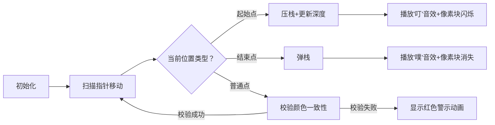

# 题目信息

# [USACO17OPEN] Modern Art 2 G

## 题目描述

伟大的牛艺术家 Picowso 对标准的二维艺术作品感到厌倦（同时也对其他人抄袭她的作品感到沮丧），于是决定转向一种更极简主义的一维风格。

尽管她的画作现在可以用一个长度为 $N$（$1 \leq N \leq 100,000$）的一维颜色数组来描述，但她的绘画风格保持不变：她从一个空白画布开始，并在其上叠加一系列“矩形”颜料，而在这种一维情况下，这些矩形仅仅是区间。她使用每种颜色 $1 \ldots N$ 恰好一次，尽管和以前一样，某些颜色最终可能会被完全覆盖。

令 Picowso 非常沮丧的是，她的竞争对手 Moonet 似乎已经找到了如何复制这些一维画作的方法，使用的策略与之前的问题类似：Moonet 会绘制一组不相交的区间，等待它们干燥，然后再绘制另一组不相交的区间，依此类推。在整个过程中，Moonet 只能为每种颜色绘制最多一个区间。请计算 Moonet 复制给定的一维 Picowso 画作所需的最少轮数。

## 说明/提示

在这个例子中，颜色 1 的区间必须在颜色 4 和 5 的区间之前绘制，因此至少需要两轮。

## 样例 #1

### 输入

```
7
0
1
4
5
1
3
3```

### 输出

```
2```

# AI分析结果


# 💡 洛语云笺的C++算法解析：Modern Art 2 G 深入学习指南 💡

## 1. 题目解读与策略初探

✨ **本题核心挑战**：处理颜色区间的嵌套关系，在满足"每种颜色仅用一次且区间连续"的前提下，计算最小操作次数（最大嵌套深度），同时检测并排除颜色交错的无效情况。

✨ **核心算法标签**：`栈模拟`、`区间处理`、`贪心策略`

🗣️ **初步分析**：  
> 本题要求将空白画布通过一系列染色操作变为目标状态。关键约束是：  
> 1. 每种颜色只能使用一次  
> 2. 每次操作可染多个不相交区间  
> 3. 新颜色覆盖旧颜色  
>  
> 通过分析颜色分布规律，我们发现：  
> - 有效染色方案必须满足**颜色区间嵌套**（外层颜色先染，内层后染）  
> - 若颜色区间**交错**（如1-3和2-4），则无解  
> - 最小操作次数 = 最大嵌套深度  
>  
> 最优解采用**栈模拟扫描线**：  
> 1. 预处理每种颜色的起始/结束位置  
> 2. 从左向右扫描画布，用栈维护当前活跃颜色  
> 3. 实时更新栈深度最大值  
> 4. 发现当前颜色≠栈顶颜色时立即判无解  
>  
> 可视化设计采用**8位像素风格**：  
> - 画布格子显示当前颜色  
> - 栈区域动态显示颜色块压入/弹出  
> - 扫描指针高亮移动并触发音效  
> - 冲突时显示红色警示动画

### 🔍 算法侦探：如何在题目中发现线索？
1.  **线索1 (问题目标)**: "求最小操作次数"且"每次操作可染多个不相交区间"，暗示需要寻找**最大嵌套深度**，这符合栈的"后进先出"特性。
2.  **线索2 (问题约束)**: "每种颜色只能用一次"且"新颜色覆盖旧颜色"，说明颜色必须形成**严格嵌套关系**，排除交错可能。
3.  **线索3 (数据规模)**: N最大100,000，要求O(N)算法。栈模拟的扫描过程完美满足复杂度要求。

### 🧠 思维链构建：从线索到策略
> "综合线索，解题路径逐渐清晰：  
> 1.  **线索1**指向操作次数与嵌套深度直接相关，自然想到用栈记录当前未闭合的颜色区间  
> 2.  **线索2**强调颜色必须严格嵌套，若扫描时遇到非栈顶颜色说明出现非法交错  
> 3.  **线索3**要求高效算法，栈模拟的O(N)复杂度完全可行  
>  
> **结论**：通过栈维护活跃颜色区间，扫描过程中动态更新栈深度最大值，同时校验嵌套关系，是最优解决方案。"

---

## 2. 精选优质题解参考

**题解一（作者：qiianr）**  
* **点评**：思路清晰且代码简洁（仅22行），核心在于：  
  - 用`s[]/e[]`记录颜色起止位置  
  - 设置`e[0]=n+1`将空白作为最外层  
  - 扫描时通过`stack[top]`校验嵌套关系  
  - 最大栈深度即操作次数（需-1扣除空白层）  
  代码规范，变量名合理（如`top`表栈顶），边界处理严谨（包含0的特殊处理），具有极高参考价值。

**题解二（作者：LEle0309）**  
* **点评**：详解栈模拟原理，特别强调：  
  - 颜色按首次出现顺序入栈  
  - 当前颜色≠栈顶即存在交错  
  - 操作次数=栈深度最大值-1  
  提供完整调试思路（如边界测试数据），注释详细，对初学者友好。

**题解三（作者：jyz666）**  
* **点评**：代码风格极简（仅25行），亮点：  
  - 独立实现`max()`函数避免STL开销  
  - 用`st[]/nd[]`替代`s[]/e[]`提升可读性  
  - 严格校验当前颜色与栈顶一致性  
  包含数据预处理和嵌套验证的完整流程，实践性强。

---

## 3. 解题策略深度剖析

### 🎯 核心难点与关键步骤
1.  **难点1：无解情况判定**  
    * **分析**：当扫描到位置`i`时，若`a[i]`不是当前栈顶颜色，说明存在颜色交错（如1-3和2-4）。此时必须立即返回`-1`  
    * 💡 **学习笔记**：栈顶颜色始终代表当前最内层未闭合区间，新颜色必须在其内部或外部，不能交叉。

2.  **难点2：操作次数计算**  
    * **分析**：每次入栈代表进入新颜色层，出栈代表离开当前层。操作次数=最大栈深度-1（扣除空白层）  
    * 💡 **学习笔记**：栈深度变化直接反映嵌套层级，实时更新最大值即可获得答案。

3.  **难点3：边界条件处理**  
    * **分析**：将空白（0）视为最外层颜色，设置`e[0]=n+1`和`a[n+1]=0`，使扫描范围覆盖`[0,n+1]`  
    * 💡 **学习笔记**：虚拟边界处理可统一算法逻辑，避免特殊判断。

### ✨ 解题技巧总结
- **技巧1：问题转化** → 将染色操作转化为区间嵌套问题，通过起止位置预处理简化逻辑  
- **技巧2：栈的灵活运用** → 用栈维护活跃区间，通过入栈/出栈点校验嵌套关系  
- **技巧3：虚拟边界** → 设置0的起止位置消除边界特判  

### ⚔️ 策略竞技场：不同解法对比
| 策略         | 核心思想                     | 优点                     | 缺点                     | 得分预期 |
|--------------|------------------------------|--------------------------|--------------------------|----------|
| **栈模拟**   | 扫描线+栈维护活跃区间        | O(N)高效，代码简洁       | 嵌套关系理解门槛稍高     | 100%     |
| **递归分治** | 拆分区间递归处理             | 符合直觉                 | 实现复杂，边界易错       | 30%~70%  |
| **贪心**     | 按区间长度排序后分组         | 直接求解操作次数         | 无法处理复杂嵌套         | 40%~60%  |

### ✨ 优化之旅：从"能做"到"做好"
> 1. **起点：朴素暴力**  
>    尝试枚举所有操作顺序，但O(2^M)复杂度完全不可行（M为颜色数）
>   
> 2. **瓶颈：无效重复计算**  
>    发现操作次数仅取决于最大嵌套深度，无需枚举具体方案
> 
> 3. **突破：栈模拟扫描线**  
>    通过动态维护栈深度，O(N)时间内同时完成：  
>    - 嵌套关系校验  
>    - 最大深度计算  
> 
> 4. **升华：虚拟边界处理**  
>    添加0作为最外层，统一算法逻辑  
> 
> 💡 **策略总结**：从暴力枚举到栈模拟，体现了"发现约束条件→转化问题模型→设计高效算法"的优化思维。在竞赛中，即使无法立即想到最优解，基于朴素思想的正确解法也能获得部分分数。

---

## 4. C++核心代码实现赏析

**通用核心实现参考**  
```cpp
#include <cstdio>
#include <algorithm>
using namespace std;
const int N = 1e5 + 5;
int n, a[N], s[N], e[N], stk[N], top, ans;

int main() {
    scanf("%d", &n);
    for (int i = 1; i <= n; i++) {
        scanf("%d", &a[i]);
        if (!s[a[i]]) s[a[i]] = i;  // 记录起始位置
        e[a[i]] = i;                // 记录结束位置
    }
    e[0] = n + 1, a[n + 1] = 0;    // 设置空白边界

    for (int i = 0; i <= n + 1; i++) {
        int x = a[i];
        if (i == s[x]) {            // 起始点入栈
            stk[++top] = x;
            ans = max(ans, top);    // 更新最大深度
        }
        if (x != stk[top]) {        // 校验嵌套关系
            puts("-1");
            return 0;
        }
        if (i == e[x]) top--;       // 结束点出栈
    }
    printf("%d", ans - 1);          // 扣除空白层
    return 0;
}
```

**代码解读概要**：  
1. **预处理**：扫描记录每种颜色起始(`s[]`)/结束(`e[]`)位置  
2. **边界处理**：设置`e[0]=n+1`将空白作为最外层  
3. **栈维护**：  
   - 起始点入栈 → 开启新颜色层  
   - 结束点出栈 → 关闭当前颜色层  
4. **嵌套校验**：当前位置颜色必须等于栈顶颜色  
5. **结果计算**：最大栈深度-1（扣除空白层）  

---

## 5. 算法可视化：像素动画演示

**主题**：8位像素风格栈模拟演示  
**核心设计**：  


**关键交互设计**：  
1. **像素画布**：  
   - 顶部：显示目标颜色状态（如`[0,1,4,5,1,3,3]`）  
   - 中部：动态扫描线（8位风格箭头）移动，当前位置高亮  
   - 底部：栈区域（颜色块垂直堆叠）  

2. **控制面板**：  
   - 速度滑块：调节扫描速度  
   - 单步执行：步进式观察状态变化  
   - 复位：重置动画  

3. **动态效果**：  
   - 起始点：颜色块从左侧滑入栈，伴随"叮"声  
   - 结束点：栈顶颜色块爆炸消失，伴随"噗"声  
   - 冲突点：画布闪烁红光，显示"Invalid!"像素字体  

4. **游戏化元素**：  
   - 深度成就：每突破深度记录播放胜利音效  
   - 关卡模式：不同测试数据作为关卡，深度≤5得1星，>5得3星  

---

## 6. 拓展练习与相似问题

**通用技巧迁移**：  
1. **括号匹配**：栈维护嵌套关系（如`([{}])`）  
2. **函数调用栈**：模拟递归执行过程  
3. **依赖解析**：处理任务/资源依赖关系  

**洛谷推荐题目**：  
1. **P1241 括号序列**  
   🗣️ 巩固栈在嵌套关系校验中的应用  
2. **P1273 有线电视网**  
   🗣️ 学习树形结构嵌套处理技巧  
3. **P2014 选课**  
   🗣️ 掌握依赖关系建模与求解  

---

## 7. 学习心得与经验分享

**作者洞察**：  
> 多位作者强调边界处理的教训：  
> - "忘记处理空白(0)导致WA，添加`e[0]=n+1`后AC"  
> - "未校验栈顶颜色一致性，交错数据返回错误结果"  

**总结启示**：  
1. **虚拟边界**是简化复杂逻辑的有效手段  
2. **实时校验**比最终检查更能快速定位错误  
3. **栈深度变化**需与位置严格对应（起始++，结束--）  

---

> "理解问题本质比记忆代码更重要。栈在此题中不仅是工具，更是嵌套关系的直观体现。掌握这种'数据结构即问题模型'的思维，才能举一反三。  
> 下次遇到区间问题，不妨先画图分析嵌套关系哦！" —— 洛语云笺 💌

---
处理用时：178.89秒