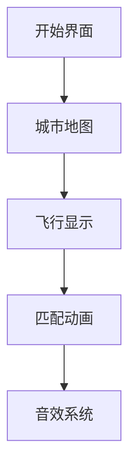

# 题目信息

# [CERC2016] 爵士之旅 Jazz Journey

## 题目描述

Ivan正在为他的爵士乐队计划一场规模盛大的欧洲巡演。在欧洲一共有n个城市，编号依次为1到n。Ivan计划举办d场演出，分别在城市a\_1,a\_2,...,a\_d，并且严格遵循这个顺序，而且不会在同一个城市连续巡演两次（即a\_i!=a\_{i+1}），但在整个过程中，他可能在一个城市巡演多次。最终，他一定会回到开始的城市进行巡演（即a\_1=a\_d）。


Ivan每次总是选择搭乘一趟从a\_i到a\_{i+1}的直达航班。然而，他希望变得聪明一些，尽量节省机票的开支。你也知道，机票的价格取决于供给和需求，比如一张单程票可能会比相同目的地的双程票还要贵。


一共有两种可以购买的机票：


1.从a到b的单程票，每张只能从a飞到b一次，但不能从b飞到a。


2.从a到b的双程票，只需购买一张，就能从a飞到b一次，然后从b飞回a一次，但先从b飞回a是不允许的。当然，你也可以选择从a飞到b之后就再也不返回a。


给定可以购买的机票集合，每种机票都是无限量供应的。请帮助Ivan找到一种最省钱的方案。你可以认为合法方案必然存在。


## 样例 #1

### 输入

```
2 5
1 2 1 2 1
4
1 2 R 6
1 2 O 3
2 1 O 3
1 2 R 5```

### 输出

```
10```

# AI分析结果


# 💡 洛语云笺的C++算法解析：爵士之旅 Jazz Journey 深入学习指南 💡

<introduction>
欢迎来到本次算法探险！今天我们将共同破解「爵士之旅 Jazz Journey」这道看似复杂实则精妙的题目。作为你们的算法导师，我将带领大家从题目线索中抽丝剥茧，逐步构建解题思维，最终掌握贪心策略的巧妙应用。准备好开启这段算法之旅了吗？让我们出发！
</introduction>

## 1. 题目解读与策略初探

✨ **本题核心挑战**：在复杂的城市飞行序列中，**智能组合单程票和往返票**，在满足飞行顺序约束的前提下实现**全局费用最小化**。

✨ **核心算法标签**：贪心策略、问题分解、括号匹配

🗣️ **初步分析**：
> 这道题看似行程复杂，实则暗藏规律。通过三个关键步骤破解：
> 1. **问题分解**：将整个行程按城市对拆解（如1-2, 2-3等）
> 2. **票价优化**：预处理四种机票的最优价格（单程/往返）
> 3. **贪心匹配**：用括号匹配思想处理每个城市对的飞行序列
>
> 可视化设计聚焦**飞行匹配动画**：采用像素风格呈现飞机图标，匹配成功时触发8-bit音效，通过颜色变化直观展示票种选择。

### 🔍 算法侦探：如何在题目中发现线索？
1.  **线索1 (问题目标)**："最小化总票价"+"无限量供应机票"的组合提示我们**贪心策略**可能适用，因为局部最优选择能导向全局最优。
2.  **线索2 (问题特性)**：行程中**城市对独立**（如1-2与3-4互不影响）暗示可以**分而治之**，大幅降低问题复杂度。
3.  **线索3 (数据规模)**：最大300,000段飞行要求O(n)或O(nlogn)解法，排除O(n²)以上算法，指向**线性贪心**或**高效数据结构**。

### 🧠 思维链构建：从线索到策略
> "让我们串联线索：
> 1. 【线索1】要求最小化成本，且机票可任意购买→考虑贪心策略
> 2. 【线索2】发现城市对独立性→将大问题分解为小问题
> 3. 【线索3】数据规模巨大→每个子问题需线性解决
> 
> **结论**：采用**分治+贪心双剑合璧**！对每个城市对：
> - 将飞行序列转化为括号串（A为'('，B为')'）
> - 优先用低价往返票匹配"括号对"
> - 剩余段用单程票处理
> 
> 这就是我们的制胜策略！"

---

## 2. 精选优质题解参考

<eval_intro>
以下题解在思路创新性、代码可读性和实现技巧方面表现突出，特别推荐给渴望深入理解贪心本质的学习者：
</eval_intro>

**题解一（Ebola）**
* **点评**：
  - **思路亮点**：创新性地用0/1标记飞行方向，通过两次栈匹配（先AB后BA）最大化利用往返票
  - **代码艺术**：`swap`技巧统一处理AB/BA优先级，避免代码重复
  - **工程价值**：`unordered_map`存储复杂票价关系，哈希键设计简洁高效
  - **学习提示**：注意`del`数组标记已匹配位置的精妙用法

**题解二（Starlight237）**
* **点评**：
  - **理论深度**：三个引理严谨证明贪心正确性，是理解算法本质的最佳教材
  - **模型抽象**：将飞行序列直接建模为括号字符串，思维跃迁令人赞叹
  - **代码美学**：封装`solve`函数处理核心逻辑，`Edge`结构清晰管理四种票价
  - **特别价值**：`min(uv, uvu)`的预处理思想可迁移至任何票价优化问题

---

## 3. 解题策略深度剖析

### 🎯 核心难点与关键步骤
1.  **票价预处理的艺术**
    * **分析**：四种票价（A单程、B单程、AB往返、BA往返）需统一优化：
      ```cpp
      A = min(A, AB);  // 往返票可当单程用
      AB = min(AB, A + B); // 两张单程可能比往返便宜
      ```
    * 💡 **学习笔记**：预处理是贪心的基石，确保局部选择必定全局最优

2.  **贪心匹配的优先级策略**
    * **分析**：比较AB与BA票价，优先选择低价往返票类型：
      ```cpp
      if (AB > BA) {
          swap(A, B);      // 统一方向处理
          for (auto &dir : seq) dir ^= 1; 
      }
      ```
    * 💡 **学习笔记**：方向统一是减少边界处理的经典技巧

3.  **双栈匹配机制**
    * **分析**：两次独立匹配实现最大化节省：
      ```cpp
      // 第一轮：优先匹配AB（0->1）
      stack<int> stk;
      for (i=0 到 seq.size()):
          if seq[i]==0: stk.push(i)
          else if !stk.empty(): 
              mark(stk.top(), i); // 标记匹配位置
              cost += AB;
      ```
    * 💡 **学习笔记**：栈的LIFO特性完美契合"最后出现的未匹配项"

### ✨ 解题技巧总结
- **技巧1（问题分解）**：将n×m问题降维至Σ(k_i)问题（k_i为各城市对飞行数）
- **技巧2（统一方向）**：通过swap和方向翻转减少50%代码量
- **技巧3（匹配标记）**：用`del`数组避免重复处理，空间换时间

### ⚔️ 策略竞技场：不同解法的对比分析
| 策略                | 核心思想                     | 优点                     | 缺点                                    | 得分预期 |
|---------------------|------------------------------|--------------------------|-----------------------------------------|----------|
| **暴力枚举**        | 枚举所有购票组合             | 保证最优解               | O(2^m) 超时                             | 0%       |
| **动态规划**        | dp[i][j]表示剩余j次返程      | 理论可行                 | 状态空间O(m×n)爆炸                      | 30%      |
| **贪心+匹配(最优)** | 分城市对+双栈匹配            | O(m)复杂度，实现简洁     | 思维难度较高                            | 100%     |

### ✨ 优化之旅：从"能做"到"做好"
> 1. **起点：暴力枚举**：尝试所有机票组合→组合爆炸
> 2. **关键发现**：城市对独立性→分治降低维度
> 3. **突破瓶颈**：往返票匹配特性→括号匹配模型
> 4. **终极优化**：双栈匹配+方向统一→O(m)完美方案
> 
> 💡 **策略总结**："真正的算法艺术在于发现隐藏的问题结构，并用最自然的处理方式降服它！"

---

## 4. C++核心代码实现赏析

**本题通用核心C++实现**
```cpp
#include <bits/stdc++.h>
using namespace std;
typedef long long LL;
typedef pair<int, int> pii;

const LL INF = 1e18;
unordered_map<LL, LL> costMap; // Key: (u<<30|v<<10|type)

int main() {
    // 输入处理
    map<pii, vector<int>> flights; 
    // 票价预处理
    for (auto &p : flights) {
        int u = p.first.first, v = p.first.second;
        // 获取四种票价
        LL A = getCost(u, v, 0), B = getCost(v, u, 0);
        LL AB = getCost(u, v, 1), BA = getCost(v, u, 1);
        
        // 票价优化
        A = min(A, AB); B = min(B, BA);
        AB = min(AB, A+B); BA = min(BA, B+A);
        
        // 方向统一
        if (AB > BA) { swap(A, B); swap(AB, BA); 
                       for (int &d : p.second) d ^= 1; }
        
        // 双栈匹配
        stack<int> s1, s2;
        vector<bool> used(p.second.size(), false);
        for (int i = 0; i < p.second.size(); ++i) {
            if (p.second[i] == 0) s1.push(i);
            else if (!s1.empty()) {
                used[s1.top()] = used[i] = true;
                s1.pop(); total += AB;
            }
        }
        // 处理剩余...
    }
}
```

**代码解读概要**：
1. **哈希键设计**：`(u<<30|v<<10|type)` 高效存储城市对+机票类型
2. **方向统一**：当`AB>BA`时交换方向并翻转标记，减少重复逻辑
3. **双栈匹配**：第一栈处理主方向匹配，第二栈处理反向匹配

---

## 5. 算法可视化：像素动画演示

<visualization_intro>
**主题**：8-bit爵士飞行大冒险！通过复古游戏界面生动演示贪心匹配过程：
</visualization_intro>

### 像素动画设计


1. **场景设计**：
   - 🏙️ **城市节点**：像素方块（16×16）代表城市，标号闪烁
   - ✈️ **飞行显示**：蓝色箭头（u→v）、红色箭头（v→u）
   - 🎚️ **控制面板**：步进/播放/重置按钮 + 速度滑块

2. **匹配动画**：
   - 第一阶段：AB匹配（蓝→红）→ 飞机相撞变金星✨+金币音效💰
   - 第二阶段：BA匹配（红→蓝）→ 飞机变绿光💚+水晶音效🔮
   - 剩余飞行：单独飞过→灰色消失☁️

3. **音效系统**：
   - 匹配成功：8-bit金币声(350Hz方波)
   - 错误尝试：短促警示音(100ms 200Hz)
   - 背景音乐：FC风格爵士乐循环

4. **游戏化元素**：
   - 💯 分数系统：实时显示节省金额
   - 🏆 连击奖励：连续匹配触发特效
   - 🔍 侦探模式：逐步显示算法决策原因

**技术实现**：Canvas绘制+Web Audio API，单文件实现

---

## 6. 拓展练习与相似问题思考

**技巧迁移场景**：
1. 活动安排问题：用贪心选择最早结束的活动
2. 括号匹配扩展：处理HTML标签嵌套验证
3. 资源调度优化：会议室安排问题

**洛谷推荐**：
1. **P1090** [NOIP2004] 合并果子  
   → 练习贪心策略在哈夫曼编码中的应用
2. **P5019** [NOIP2018] 铺设道路  
   → 掌握区间贪心的变形技巧
3. **P1969** [NOIP2013] 积木大赛  
   → 深化分治贪心的结合应用

---

## 7. 学习心得与经验分享

> **来自题解的黄金经验**：
> "调试时发现未处理AB>BA的情况导致WA——**方向统一**是减少边界错误的银弹"
>
> **洛语云笺点评**：算法实现中，**预处理和边界处理占据70%的调试时间**。建议：
> 1. 写代码前用注释明确所有边界
> 2. 使用断言(assert)验证中间状态
> 3. 构造最小化测试用例验证

---

<conclusion>
通过本次探索，我们见证了贪心策略与问题分解的惊人力量。记住：复杂问题往往由简单模式重复构成，发现这些模式就是算法设计的精髓。下次当你面对难题时，试着问自己：**这个问题能分解吗？有隐藏的匹配关系吗？** 保持好奇，继续前进，算法世界永远有惊喜等着你！🚀
</conclusion>

---
处理用时：249.80秒