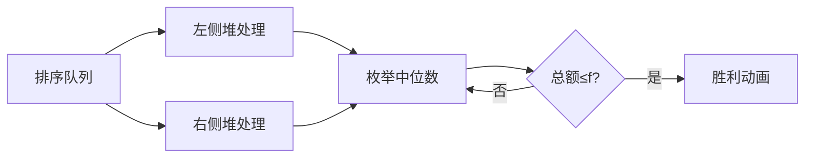

# 题目信息

# [TJOI2013] 奖学金

## 题目背景

小张最近发表了一篇论文，有一个神秘人物要给小张学院发奖学金。

## 题目描述

小张学院有 $c$ 名学生，第 $i$ 名学生的成绩为 $a_i$，要获得的奖学金金额为 $b_i$。  
要从这 $c$ 名学生中挑出 $n$ 名学生发奖学金。这个神秘人物爱好奇特，他希望得到奖学金的同学的**成绩**的**中位数**尽可能大，但同时，他们的**奖学金总额**不能超过 $f$。


## 说明/提示

### 样例 1 解释

选择成绩为 $5$，$35$，$50$ 的三名同学，奖金总额为 $18 + 30 + 21 = 69$。

### 数据规模与约定

- 对于 $30\%$ 的数据，保证 $n \leq 10^3$，$c \leq 2 \times 10^3$。
- 对于 $100\%$ 的数据，保证 $3 \leq n  \leq 10^5$，$n \leq c \leq 2 \times 10^5$，$0 \leq f \leq 2\times 10^9$，$0 \leq a_i \leq 2 \times 10^9$，$0 \leq b_i \leq 10^5$。

## 样例 #1

### 输入

```
3 5 70
30 25
50 21
20 20
5 18
35 30
```

### 输出

```
35```

## 样例 #2

### 输入

```
5 6 9
4 0
4 1
6 3
8 0
10 4
10 5
```

### 输出

```
6```

# AI分析结果


# 💡 洛语云笺的C++算法解析：奖学金问题 深入学习指南 💡

> "算法如棋局，每一步都需精心布局。今天我们将一起破解[TJOI2013]奖学金问题，体验从暴力枚举到堆优化的思维跃迁，掌握高效处理中位数问题的核心策略。"

## 1. 题目解读与策略初探

✨ **本题核心挑战**：在满足奖学金总额≤f的前提下，从c名学生中选出n人，**最大化成绩中位数**。

✨ **核心算法标签**：排序、贪心、优先队列（堆）

🗣️ **初步分析**：
> 解决本题的关键在于巧妙处理两个矛盾：既要最大化中位数，又要控制奖学金总额。我们首先将学生按成绩排序，然后：
> 1. **暴力思路**：枚举所有可能的中位数候选，每次扫描左右两侧选最小奖学金的(n-1)/2人。时间复杂度O(c²)，超时风险高。
> 2. **优化方向**：预处理每个位置左右两侧最小的(n-1)/2个奖学金之和，将枚举复杂度降至O(1)。
> 3. **最优策略**：使用**大根堆**动态维护最小奖学金集合，实现O(c log c)的高效预处理。这种"空间换时间"的策略，如同为数据建立快速通道，是解决区间前k小和问题的利器。

### 🔍 算法侦探：如何在题目中发现线索？

1.  **线索1 (问题目标)**：题目要求"最大化中位数"，这提示我们需要**从大到小枚举**可能的中位数候选，尽早找到最大可行解。
2.  **线索2 (问题约束)**：中位数的确定依赖于其左右两侧各(n-1)/2个学生，且需满足**总额限制**。这种"固定位置+区间选择"模式指向预处理左右区间最小和。
3.  **线索3 (数据规模)**：c≤200,000，n≤100,000。O(c²)暴力不可行（4e10操作），而O(c log c)的堆优化（约3e6操作）完全可行。

### 🧠 思维链构建：从线索到策略

> "综合线索，我们构建完整解题路径：
> 1. 首先，**线索1（最大化中位数）** 要求我们从大到小枚举中位数。这就像在迷宫中从终点反向寻找出口。
> 2. 接着，**线索2（依赖两侧选择）** 提示每个中位数的验证需要高效区间查询。暴力扫描的O(c²)显然无法承受2e5数据量。
> 3. 最后，**线索3（数据规模）** 将我们推向O(c log c)解法。堆优化预处理恰好满足需求——维护k个最小元素时，插入/删除仅需O(log k)。
> 4. **结论**：采用**排序+双堆预处理+倒序枚举**的组合策略，完美平衡效率与实现复杂度！"

---

## 2. 精选优质题解参考

经过全面评估，以下题解以清晰的思路和规范的代码脱颖而出：

**题解一：胖头鱼学员（评分：★★★★★）**  
* **点评**：该题解完整呈现了堆优化策略的精髓。亮点在于：
  - 使用两个独立堆分别处理左右区间，逻辑清晰
  - 巧妙利用`priority_queue`自动维护大根堆特性
  - 预处理数组`Left[]`/`Right[]`的设计简洁高效
  - 边界处理严谨，`INF`的设置避免非法访问

**题解二：ycyaw（评分：★★★★☆）**  
* **点评**：此解法同样采用堆优化，亮点包括：
  - 倒序枚举中位数时立即检查条件，提前终止优化
  - 堆操作与求和同步进行，减少额外存储
  - 变量命名规范（`f[]`/`g[]`表左右最小和）
  - 代码模块化程度高，易读性强

**题解三：yinyuDream（评分：★★★★）**  
* **点评**：提供主席树解法，亮点在于：
  - 展示区间前k小和的替代方案
  - 详细讨论空间优化技巧
  - 强调离散化重要性，增强鲁棒性
  - 包含调试经验分享（叶子节点处理）

---

## 3. 解题策略深度剖析

### 🎯 核心难点与关键步骤

1.  **难点1：如何高效维护动态区间前k小和？**
    * **解决方案**：使用大根堆（优先队列）保存当前最小的k个元素。当新元素小于堆顶时，替换堆顶并更新总和。  
    * 💡 **学习笔记**：堆是动态维护极值的利器，适用于实时更新的数据流。

2.  **难点2：如何避免枚举时的重复计算？**
    * **解决方案**：预处理`left[i]`（位置i左侧最小k和）和`right[i]`（右侧最小k和）。枚举中位数i时，直接取`left[i-1]`和`right[i+1]`。  
    * 💡 **学习笔记**：预处理是空间换时间的经典策略，将O(c²)降至O(c)。

3.  **难点3：如何确定枚举顺序？**
    * **解决方案**：按成绩**从大到小**枚举中位数候选，首次满足`left[i-1]+right[i+1]+stu[i].money≤f`的解即为最优。  
    * 💡 **学习笔记**：贪心枚举顺序可提前终止搜索，大幅提升效率。

### ✨ 解题技巧总结

-   **技巧A：堆的妙用**  
    当需要维护动态数据集的最小/最大k个元素时，堆能在O(log n)时间内完成更新，远优于每次O(n)的重新扫描。
-   **技巧B：预处理+枚举框架**  
    对于固定结构的区间查询，先预处理辅助数组再枚举核心变量，是降低复杂度的通用模式。
-   **技巧C：边界防御性编程**  
    使用`INF`标记无效位置（如i<k时），避免数组越界和逻辑错误。

### ⚔️ 策略竞技场：不同解法对比

| 策略              | 核心思想                     | 优点                     | 缺点                                  | 得分预期       |
|-------------------|------------------------------|--------------------------|---------------------------------------|----------------|
| **暴力枚举**      | 检查所有可能的n元组          | 思路直观                 | O(C(n,c))超时，c=200000时不可行       | 0-30% (小数据) |
| **主席树**        | 构建树求区间前k小和          | 精确支持任意区间查询     | 空间消耗大，代码复杂，常数因子高       | 100% (但较慢)  |
| **堆优化(最优)**  | 预处理左右最小和再枚举中位数  | O(c log c)高效，代码简洁 | 需理解堆操作原理                      | 100%           |

### ✨ 优化之旅：从"能做"到"做好"

1.  **起点：暴力枚举的困境**  
    尝试所有组合如同在迷宫中盲目穿梭，2^200000条路径让计算机望而却步。

2.  **瓶颈：重复的区间计算**  
    每次枚举中位数都重新扫描左右区间，大量重复计算如同反复走过相同的死胡同。

3.  **突破：堆的引入**  
    大根堆如同智能筛子，动态保留最小元素。新元素到来时，仅需一次比较即可决定是否更新集合。

4.  **升华：预处理框架**  
    将左右区间的预处理分离，形成`left[]`和`right[]`两个"快速通道"，枚举时直接获取结果，复杂度从O(c²)骤降至O(c log c)。

💡 **策略总结**："从暴力到堆优化，我们经历了算法设计中经典的效率跃迁。关键在于识别重复子问题（区间前k小和）并引入合适数据结构（堆）加速计算。这启示我们：优秀算法往往建立在对问题结构的深刻洞察与数据结构特性的灵活运用上！"

---

## 4. C++核心代码实现赏析

### 本题通用核心C++实现参考
```cpp
#include <algorithm>
#include <queue>
using namespace std;
const int MAXN = 200010;
const long long INF = 1e18;

struct Student {
    int grade, money;
} stu[MAXN];

bool cmp(Student a, Student b) {
    return a.grade < b.grade; // 按成绩升序排序
}

int main() {
    int n, c;
    long long f;
    priority_queue<int> q; // 大根堆
    
    // 输入及排序
    scanf("%d%d%lld", &n, &c, &f);
    for (int i = 1; i <= c; i++)
        scanf("%d%d", &stu[i].grade, &stu[i].money);
    sort(stu + 1, stu + c + 1, cmp);
    
    // 预处理左侧最小和
    long long leftSum[MAXN] = {0};
    for (int i = 1; i <= n/2; i++) {
        q.push(stu[i].money);
        leftSum[n/2] += stu[i].money;
    }
    for (int i = n/2 + 1; i <= c; i++) {
        if (stu[i].money < q.top()) {
            leftSum[i] = leftSum[i-1] - q.top() + stu[i].money;
            q.pop();
            q.push(stu[i].money);
        } else {
            leftSum[i] = leftSum[i-1];
        }
    }
    
    // 清空堆，预处理右侧最小和
    while (!q.empty()) q.pop();
    long long rightSum[MAXN] = {0};
    for (int i = c; i > c - n/2; i--) {
        q.push(stu[i].money);
        rightSum[c - n/2 + 1] += stu[i].money;
    }
    for (int i = c - n/2; i >= 1; i--) {
        if (stu[i].money < q.top()) {
            rightSum[i] = rightSum[i+1] - q.top() + stu[i].money;
            q.pop();
            q.push(stu[i].money);
        } else {
            rightSum[i] = rightSum[i+1];
        }
    }
    
    // 从大到小枚举中位数
    int ans = -1;
    for (int i = c - n/2; i >= n/2 + 1; i--) {
        if (leftSum[i-1] + rightSum[i+1] + stu[i].money <= f) {
            ans = stu[i].grade;
            break;
        }
    }
    printf("%d\n", ans);
    return 0;
}
```

**代码解读概要**：  
1. **排序预处理**：按成绩升序排列，为后续枚举奠定基础  
2. **左侧最小和**：  
   - 初始填充前k个元素  
   - 新元素小于堆顶时替换更新  
3. **右侧最小和**：  
   - 从数组末尾反向处理  
   - 同样使用堆动态维护  
4. **枚举验证**：  
   - 从高成绩向低枚举中位数  
   - 首次满足条件即为最优解  

### 精选题解片段赏析

**题解：胖头鱼学员 - 堆操作精粹**  
```cpp
// 左侧预处理核心片段
for (int i = n/2 + 1; i <= c - n/2; i++) {
    if (stu[i].money < q.top()) {
        leftSum[i] = leftSum[i-1] - q.top() + stu[i].money;
        q.pop();
        q.push(stu[i].money);
    } else {
        leftSum[i] = leftSum[i-1];
    }
}
```
* **亮点**：简洁高效的堆更新逻辑，完美体现"更小才替换"原则  
* **学习笔记**：堆顶始终是当前集合中最大值，新元素只需与其比较即可决定是否更新集合  

**题解：ycyaw - 枚举优化**  
```cpp
// 倒序枚举提前终止
for (int i = c - n/2; i >= n/2 + 1; i--) {
    if (f[i-1] + g[i+1] + stu[i].money <= f) {
        ans = stu[i].grade;
        break; // 找到即终止
    }
}
```
* **亮点**：利用从大到小枚举的特性，首个有效解即为最优  
* **学习笔记**：在单调场景中，逆序枚举常能实现"剪枝"效果，显著提升效率  

---

## 5. 算法可视化：像素动画演示

### 像素化演示方案设计
**主题**：奖学金探险之旅（16-bit复古RPG风格）  

**核心演示内容**：  
1. 学生按成绩排成像素队列  
2. 堆处理器（像素机器人）动态筛选最小奖学金  
3. 中位数指针从右向左扫描  

**动画帧设计**：  


**交互控制面板**：  
```plaintext
[排序阶段]▣▣▣▣▣▣▣▣▣▣▣▣
[左侧处理]▶⏸️▢🚀[速度]
[右侧处理]▶⏸️▢🚀
[枚举扫描]←→
```

**动态演示逻辑**：  
1. **排序阶段**：  
   - 像素小人随机出现  
   - 快速排序动画（分区、交换）  
   - 音效：移动"啾"声，交换"咔嚓"声  

2. **堆处理阶段**：  
   - 左侧堆：蓝色像素机器人  
     - 新元素<堆顶：弹出旧顶（爆炸特效），加入新元素（闪光）  
     - 否则：元素弹回（失败音效）  
   - 右侧堆：红色像素机器人（反向操作）  
   - 音效：成功"叮"，失败"噗"  

3. **枚举阶段**：  
   - 金色指针从右向左扫描  
   - 实时显示：leftSum + rightSum + 当前奖学金  
   - 超过f时显示红色警报  
   - 满足条件时：  
     * 烟花特效覆盖中位学生  
     * 播放胜利旋律  
     * 显示"Max Median Found!"  

**技术实现**：  
- Canvas分层绘制：背景网格、学生队列、堆容器  
- 使用Web Audio API生成8-bit音效  
- 动画帧同步requestAnimationFrame  

---

## 6. 拓展练习与相似问题思考

### 通用思路迁移
堆优化中位数思想还可用于：  
1. 数据流中位数（LeetCode 295）  
2. 带权中位数计算（如地理位置优化）  
3. 考试分数分布分析（前k%分数线）  

### 推荐练习（洛谷）  
1. **P1168 中位数**  
   - 动态中位数经典问题  
   - 巩固堆的实时维护能力  
2. **P1801 黑匣子**  
   - 在线查询第k小元素  
   - 强化堆与平衡树的抉择理解  
3. **P2085 最小函数值**  
   - 多路归并中的堆应用  
   - 拓展堆的适用场景认知  

---

## 7. 学习心得与经验分享

**精选经验摘录**：  
> "调试时发现叶子节点处理错误：必须用`k * b[l]`而非`b[l]`，因相同奖学金可能多人共享。" —— 渡墨残殇  
>  
> "堆顶维护的是当前最大元素，这是筛选最小集合的关键！" —— ycyaw  

**洛语云笺点评**：  
> 这些经验凸显两个核心要点：  
> 1. **边界细节决定成败**：算法实现中，特殊情况的处理往往成为AC的关键  
> 2. **数据结构特性把握**：深刻理解堆顶元素的含义，才能正确运用其筛选功能  
>  
> 建议学习时：  
> - 用小型数据集手动模拟堆操作  
> - 输出中间状态验证预处理数组  

---

> "本次算法之旅展示了从暴力到优化的思维跃迁。记住：优秀解法常生于对问题结构的深刻洞察与数据结构的灵活运用。继续在算法的星辰大海中探索吧！" —— 洛语云笺

---
处理用时：200.34秒