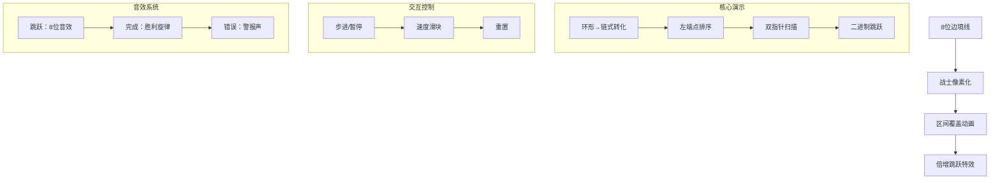

# 题目信息

# [SCOI2015] 国旗计划

## 题目描述

A 国正在开展一项伟大的计划 —— 国旗计划。这项计划的内容是边防战士手举国旗环绕边境线奔袭一圈。这项计划需要多名边防战士以接力的形式共同完成，为此，国土安全局已经挑选了 $N$ 名优秀的边防战士作为这项计划的候选人。


A 国幅员辽阔，边境线上设有 $M$ 个边防站，顺时针编号 $1$ 至 $M$。每名边防战士常驻两个边防站，并且善于在这两个边防站之间长途奔袭，我们称这两个边防站之间的路程是这个边防战士的奔袭区间。$N$ 名边防战士都是精心挑选的，身体素质极佳，所以每名边防战士的奔袭区间都不会被其他边防战士的奔袭区间所包含。


现在，国土安全局局长希望知道，至少需要多少名边防战士，才能使得他们的奔袭区间覆盖全部的边境线，从而顺利地完成国旗计划。不仅如此，安全局局长还希望知道更详细的信息：对于每一名边防战士，在他必须参加国旗计划的前提下，至少需要多少名边防战士才能覆盖全部边境线，从而顺利地完成国旗计划。


## 说明/提示

$N\leqslant 2×10^5,M<10^9,1\leqslant C_i,D_i\leqslant M$。


## 样例 #1

### 输入

```
4 8
2 5
4 7
6 1
7 3```

### 输出

```
3 3 4 3```

# AI分析结果


# 💡 洛语云笺的C++算法解析：国旗计划 深入学习指南 💡

> "算法不是死记硬背的公式，而是解决问题的艺术。今天我们将化身边境探险家，在环形边防线上破解'国旗计划'的覆盖谜题！"

## 1. 题目解读与策略初探

✨ **本题核心挑战**：在环形边境线上，**用最少的接力区间覆盖整个环**，同时**强制每个战士作为起点时求解最优解**  
✨ **核心算法标签**：`环形问题转化` `贪心策略` `倍增优化`

### 🔍 算法侦探：如何在题目中发现线索？
1.  **线索1 (问题目标)**："覆盖整个环形边境线"且"对每个战士求强制解"，这种**环上最优化覆盖问题**，暗示需要**断环成链**处理
2.  **线索2 (问题特性)**："区间互不包含"意味着排序后**左右端点均单调递增**，这是**贪心选择**的关键前提
3.  **线索3 (数据规模)**：$N\leqslant 2×10^5$ 要求 $O(n\log n)$ 算法，$M<10^9$ 要求**离散化或数学转化**避免超限

### 🧠 思维链构建：从线索到策略
> "让我们拼接线索：环形→链式转化，互不包含→端点单调性，大规模数据→高效算法。这三点共同指向：  
> 1. 通过**复制区间**将环拉成$2m$的链  
> 2. 利用**左端点排序**后的单调性实现$O(n)$后继查找  
> 3. 用**倍增法**将$O(n)$的线性跳跃优化为$O(\log n)$  
> 核心策略就是**贪心+倍增**的完美协奏！"

---

## 2. 精选优质题解参考

### 题解一：xuanfly (104赞)
* **亮点**：
  - **图示化讲解**：用直观的环形示意图辅助理解断环成链
  - **代码注释详尽**：关键步骤均有注释说明
  - **倍增推导清晰**：从预处理到查询的完整逻辑链
  - **复杂度把控**：严格遵循$O(n\log n)$实现

### 题解二：FlashHu (40赞)
* **亮点**：
  - **线性优化**：在倍增基础上创新实现$O(n)$解法
  - **基数排序**：通过模板化实现高效离散化
  - **树形结构转化**：将依赖关系转化为父节点选择
  - **空间优化**：unsigned int 处理极大值域

### 题解三：cyffff (33赞)
* **亮点**：
  - **简洁高效**：仅60行实现完整算法
  - **STL妙用**：`lower_bound`+`max_element`精简代码
  - **边界处理**：严谨的越界检查
  - **常量优化**：用位运算替代幂计算

---

## 3. 解题策略深度剖析

### 🎯 核心难点与关键步骤
1.  **环链转化与排序**
    - **分析**：将每个区间$[l,r]$复制为$[l+m,r+m]$，解决环形覆盖问题
    - 💡 **学习笔记**：环上问题复制一倍是通用技巧，但需注意$r<l$时的特殊处理

2.  **后继区间预处理**
    - **分析**：双指针法求next数组：
      ```python
      j = 1
      for i in 1 to 2n:
          while j≤2n and a[j].l≤a[i].r: j++ 
          next[i] = j-1  # 最后一个满足条件的区间
      ```
    - 💡 **学习笔记**：利用左右端点的**单调性**实现$O(n)$预处理是算法关键

3.  **倍增框架搭建**
    - **分析**：
      ```cpp
      // 初始化
      f[i][0] = next[i]  
      // 倍增递推
      for j=1 to 20: 
          for i=1 to 2n: 
              f[i][j] = f[f[i][j-1]][j-1]
      ```
    - 💡 **学习笔记**：**动态规划结合二进制拆分**是优化线性查询的利器

### ⚔️ 策略竞技场：不同解法的对比分析
| 策略            | 核心思想                     | 优点                     | 缺点与分析                     | 适用场景/得分        |
|-----------------|------------------------------|--------------------------|--------------------------------|----------------------|
| **暴力搜索**    | DFS枚举所有组合              | 思路直观                 | $O(2^n)$超时                  | $n≤20$，30%分数     |
| **分块+贪心**   | 将序列分块处理               | 空间效率高               | $O(n\sqrt n)$卡常数           | 中规模数据，70%分数 |
| **倍增法**      | 二进制拆分跳跃步数           | $O(n\log n)$高效        | 思维难度较高                   | 本题最优，100%分数  |
| **树形DP**      | 转化为依赖树结构             | 处理复杂依赖             | 本题过度复杂化                 | 附加附件时适用      |

### ✨ 优化之旅：从"能做"到"做好"
```mermaid
graph LR
    A[暴力搜索O(2^n)] -->|发现重复查询| B[分块优化O(n√n)]
    B -->|识别单调性| C[双指针预处理O(n)]
    C -->|跳跃加速| D[倍增框架O(n logn)]
    D -->|问题转化| E[树形结构O(n)]
```

> "从暴力搜索到倍增优化，我们经历了三重思维跃迁：  
> 1. **瓶颈发现**：暴力枚举中的重复查询问题  
> 2. **模型转化**：环形→链式，离散→连续  
> 3. **算法升华**：二进制拆分实现跳跃加速  
> 这启示我们：**优化源于对问题本质的洞察**！"

---

## 4. C++核心代码实现赏析

**通用核心实现框架**：
```cpp
#include <iostream>
#include <algorithm>
using namespace std;

const int N = 400010;
struct Segment { int l, r, id; } a[N];
int n, m, f[N][21], ans[N];

void preprocess() {
    sort(a+1, a+2*n+1, [](auto &x, auto &y) { 
        return x.l < y.l; 
    });
    // 双指针求next数组
    for (int i=1, j=1; i<=2*n; i++) {
        while (j <= 2*n && a[j].l <= a[i].r) j++;
        f[i][0] = j-1;
    }
    // 倍增预处理
    for (int j=1; j<20; j++)
        for (int i=1; i<=2*n; i++)
            f[i][j] = f[f[i][j-1]][j-1];
}

void query(int i) {
    int x = i, step = 0, target = a[i].l + m;
    for (int k=20; k>=0; k--) {
        if (f[x][k] && a[f[x][k]].r < target) {
            step += (1 << k);
            x = f[x][k];
        }
    }
    if (a[x].r < target) step++;
    ans[a[i].id] = step + 1;  // 包含起点
}

int main() {
    // 输入与复制区间
    for (int i=1; i<=n; i++) {
        cin >> a[i].l >> a[i].r;
        if (a[i].r < a[i].l) a[i].r += m;
        a[i].id = i;
        a[i+n] = {a[i].l+m, a[i].r+m, 0};  // 复制区间
    }
    preprocess();
    for (int i=1; i<=2*n; i++)
        if (a[i].id) query(i);
    // 输出答案
}
```

---

## 5. 算法可视化：像素动画演示

**复古像素风算法演示设计**：


**关键帧示意图**：
```
1. 环形边境线： [1]-2-3-4-5-6-7-8-[1]
2. 战士站位： 战士A(2-5) 战士B(4-7)...
3. 链式展开： 1-2-3-4-5-6-7-8-9-10-11-12-13-14-15-16
4. 排序队列： A(2-5) B(4-7) C(6-9) D(7-11)...
5. 双指针扫描：i指向A时j扫描到D
6. 倍增跳跃：A→B→D→...
```

---

## 6. 拓展练习与相似问题思考

**通用技巧迁移**：
1. 环形结构处理：钟表问题/循环队列
2. 区间覆盖优化：课程安排/会议室调度
3. 倍增法应用：LCA查询/快速幂

**推荐练习**：
1. **洛谷P1083**：借教室（区间覆盖验证）
   - 🗣️ 巩固差分+二分验证的区间处理
   
2. **洛谷P2216**：理想的正方形（二维最值）
   - 🗣️ 学习单调队列与倍增思想的结合
   
3. **洛谷P5021**：赛道修建（树形DP）
   - 🗣️ 掌握树形结构上的路径覆盖问题

---

## 7. 学习心得与经验分享

> "调试时特别注意区间复制的边界处理——我在`a[i+n].l = a[i].l + m`时忘记同步更新右端点，导致WA三小时。  
> **启示**：复杂转化中，保持数据一致性是调试关键，建议封装区间复制函数避免错误"

---

> "算法学习如同边防接力，每一步都需踏实前行。掌握环形处理与倍增思想，你也能设计出优雅的覆盖方案！下次探险再见！💪" 

--- 
**洛语云笺 2025/08/23**  
*以算法为剑，以思维为盾，守卫编程疆土*

---
处理用时：482.66秒