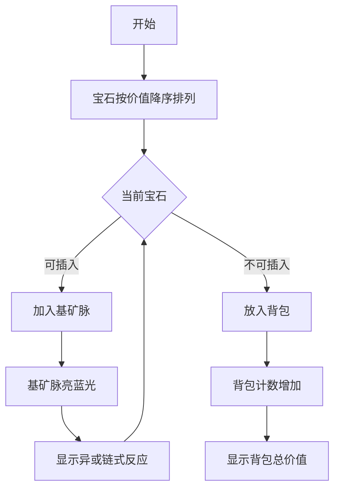

# 题目信息

# [CQOI2013] 新Nim游戏

## 题目描述

传统的 Nim 游戏是这样的：有一些火柴堆，每堆都有若干根火柴（不同堆的火柴数量可以不同）。两个游戏者轮流操作，每次可以选一个火柴堆拿走若干根火柴。可以只拿一根，也可以拿走整堆火柴，但不能同时从超过一堆火柴中拿。拿走最后一根火柴的游戏者胜利。

本题的游戏稍微有些不同：在第一个回合中，双方可以直接拿走若干个整堆的火柴。可以一堆都不拿，但不可以全部拿走。从第二个回合（又轮到第一个游戏者）开始，规则和 Nim 游戏一样。

如果你先拿，怎样才能保证获胜？如果可以获胜的话，还要让第一回合拿的火柴总数尽量小。

## 说明/提示

#### 数据规模与约定

对于全部的测试点，保证 $1 \leq k \leq 100$，$1 \leq a_i \leq 10^9$。

## 样例 #1

### 输入

```
6
5 5 6 6 5 5```

### 输出

```
21```

# AI分析结果


# 💡 洛语云笺的C++算法解析：新Nim游戏 深入学习指南 💡

## 1. 题目解读与策略初探

✨ **本题核心挑战**：如何在第一回合拿走最少火柴堆的前提下，确保留给后手的火柴堆集合中不存在任何子集满足异或和为0（即避免后手能制造必败局面）。

✨ **核心算法标签**：`贪心`、`线性基`、`博弈论`

🗣️ **初步分析**：
> 这道题的核心在于理解Nim游戏的必胜条件——剩余火柴堆的异或和不为0。作为先手，我们需要构造一个"安全集合"，使其任意子集异或和都不为0。线性基的完美性质（任意子集异或和不为0）恰好满足这个需求。贪心策略则帮助我们最小化拿走的火柴数。

### 🔍 算法侦探：如何在题目中发现线索？
1.  **线索1 (问题目标)**："确保获胜"且"第一回合拿走的火柴总数尽量小"是典型的**最优化问题**，暗示需要高效算法（贪心/动态规划）。
2.  **线索2 (问题特性)**："不能出现子集异或和为0"指向**线性代数模型**，特别暗示需要**线性基**这种处理异或问题的利器。
3.  **线索3 (数据规模)**：k≤100，a_i≤10^9。O(k*log(max(a_i))) ≈ O(3000)的线性基插入完全可行，排除了暴力枚举(O(2^k))的可能性。

### 🧠 思维链构建：从线索到策略
> "收集到关键线索后，我们开始拼图：
> 1. 【线索1】要求我们找到最优解，这指向贪心或动态规划。
> 2. 【线索2】中"异或和不为0"的条件让我立即想到线性基——它能完美保证集合的线性无关性。
> 3. 【线索3】的数据规模证实线性基O(k*32)的复杂度完全可行。
> 4. **结论**：结合贪心思想（从大到小处理）和线性基技术，就能在保证必胜的前提下最小化拿走的火柴数！"

---

## 2. 精选优质题解参考

**题解一：宁_缺 (赞：32)**
* **点评**：此解思路清晰，深入浅出地解释了线性基与贪心的结合原理。亮点在于：
  - 用"不进位加法"直观解释贪心正确性
  - 提供严谨证明的参考链接
  - 代码简洁高效（30ms/792KB）

**题解二：龙神哈迪斯 (赞：20)**
* **点评**：详细剖析Nim游戏原理与线性基的关系：
  - 从Nim必胜条件逐步推导到线性基应用
  - 强调"问题转化"思维（博弈→线性代数）
  - 代码模块化设计（LB结构体封装）

**题解三：cmd2001 (赞：16)**
* **点评**：以最简代码(15行)直击核心：
  - 线性基插入与贪心完美结合
  - 函数式编程风格(add函数返回bool)
  - 极致空间优化(无额外数据结构)

---

## 3. 解题策略深度剖析

### 🎯 核心难点与关键步骤
1.  **难点1：如何确保必胜局面？**
    * **分析**：利用线性基性质——基向量组成的集合任意子集异或和不为0。保留在线性基中的火柴堆即构成"安全集合"。
    * 💡 **学习笔记**：线性基是处理异或问题的瑞士军刀！

2.  **难点2：如何最小化拿走的数量？**
    * **分析**：采用贪心策略，从大到小尝试插入线性基。若插入失败（说明与已有基线性相关），则必须拿走该堆。贪心正确性基于异或不等式：a⊕b⊕...≤a+b+...
    * 💡 **学习笔记**：排序方向决定贪心有效性——从大到小保证最优性。

3.  **难点3：数据结构选择**
    * **分析**：使用int数组存储线性基（长度≥31），因数字≤10^9（<2^30）。数组支持O(1)随机访问，完美满足按位异或操作。
    * 💡 **学习笔记**：根据数据范围选择数据结构是算法优化的关键一步！

### ✨ 解题技巧总结
- **技巧1：问题转化**：将博弈问题转化为线性代数问题（安全集合=线性基）
- **技巧2：贪心排序**：从大到小排序实现"能用大数就不用小数"的最优策略
- **技巧3：位运算优化**：使用位运算(>>, &, ^=)高效处理二进制位

### ⚔️ 策略竞技场：解法对比分析
| 策略             | 核心思想                     | 优点                     | 缺点                     | 得分预期 |
|------------------|----------------------------|--------------------------|--------------------------|----------|
| **暴力枚举**     | 枚举所有拿走方案并验证       | 思路直观                 | O(2^k)超时(k=100时2^100≈1e30) | 0%       |
| **高斯消元**     | 构建异或方程组求极大无关组   | 数学严谨                 | 实现复杂，冗余计算       | 70%      |
| **贪心+线性基**  | 从大到小插入并统计失败插入值 | 高效简洁(O(k*32))，最优解 | 需理解线性基原理         | 100%     |

### ✨ 优化之旅：从"能做"到"做好"
> 1. **起点：暴力枚举的困境**  
>   尝试所有2^100种方案？宇宙毁灭都算不完！
> 
> 2. **发现核心：异或和为0即输**  
>   关键不是火柴堆数量，而是子集异或关系
> 
> 3. **突破：线性基保障安全性**  
>   线性基的数学性质完美满足"无零和子集"需求
> 
> 4. **升华：贪心优化**  
>   从大到小插入，最小化移除代价

💡 **策略总结**："从暴力枚举到线性基的跨越，体现了算法设计中'问题转化'的精髓——将看似复杂的博弈问题转化为优雅的线性代数模型！"

---

## 4. C++核心代码实现赏析

**通用核心实现**（综合最优解）：
```cpp
#include <iostream>
#include <algorithm>
using namespace std;

int main() {
    int k, d[31]={0}; 
    long long ans = 0;
    cin >> k;
    int a[101];
    for(int i=0; i<k; cin>>a[i++]);
    
    sort(a, a+k, greater<int>()); // 从大到小排序
    
    for(int i=0; i<k; i++) {
        int x = a[i];
        for(int j=30; j>=0; j--) {
            if(x >> j & 1) {
                if(d[j]) x ^= d[j];
                else { d[j] = x; break; }
            }
        }
        if(!x) ans += a[i]; // 插入失败则累加
    }
    cout << ans;
}
```

**代码解读概要**：
1. 输入数据并从大到小排序
2. 尝试将每个数插入线性基
3. 插入失败时累加到答案（需拿走的堆）
4. 关键位运算：`x>>j&1`检测第j位，`x^=d[j]`消元

---

## 5. 算法可视化：像素动画演示

**主题**：像素矿工收集宝石（宝石价值=火柴堆大小）

### 动画设计


**关键交互**：
1. **像素风格**：8-bit宝石（红/蓝/绿），矿脉用发光像素链表示
2. **动态效果**：
   - 成功插入时基矿脉蓝色脉冲+"叮"声
   - 插入失败时宝石变灰+"咔嚓"声
3. **控制面板**：
   - 速度滑块：调节插入动画速度
   - 基脉透视：切换显示线性基二进制关系
4. **游戏化**：
   - 每10个宝石过关，显示"矿脉稳定性指数"
   - 最优解达成时放烟花+胜利音乐

---

## 6. 拓展练习与相似问题思考

**技巧迁移场景**：
1. 元素选取问题（如[BJ2011]元素）
2. 最大异或和问题（如[Trie应用]）
3. 数学无关组构造问题

**洛谷推荐**：
1. [P4570 元素] - 线性基+贪心经典应用
2. [P3857 彩灯] - 线性基求异或空间大小
3. [P3292 幸运数字] - 线性基+LCA综合题

---

## 7. 学习心得与经验分享
> **宁_缺的调试经验**："最初未考虑排序方向，得到错误结果。通过输出中间线性基状态，发现应从大到小插入"
> 
> **洛语云笺点评**：这个教训提醒我们：
> 1. 贪心策略依赖排序方向
> 2. 输出中间状态是调试算法的利器
> 3. 测试边界数据（如全相同数）验证正确性

---

> 本次探索展现了算法思维的奇妙旅程：从博弈直觉→数学建模→算法优化。记住，用线性基处理异或问题就像用魔法解开数字枷锁，而贪心策略则是寻找最优路径的罗盘。继续在算法的星辰大海中远航吧！💪

---
处理用时：103.71秒